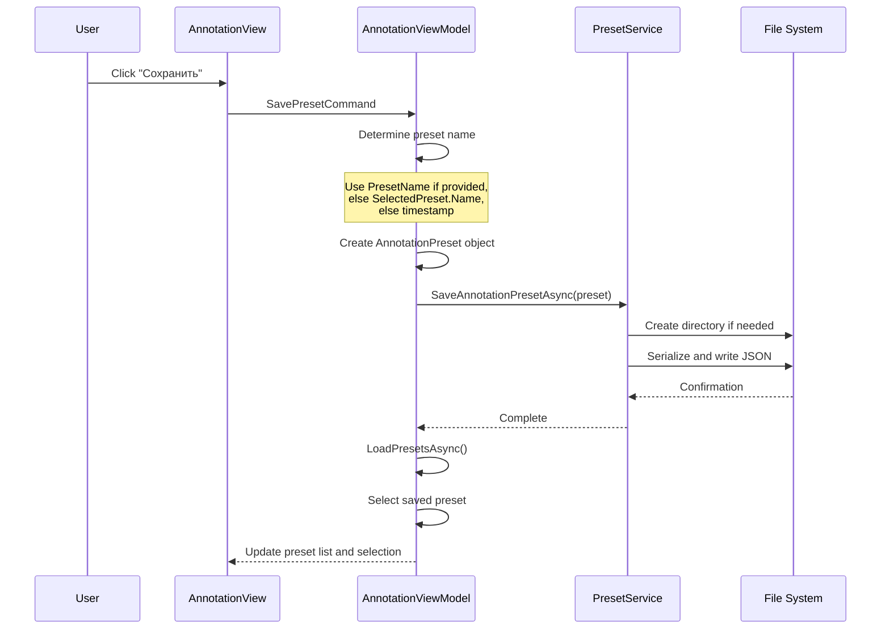
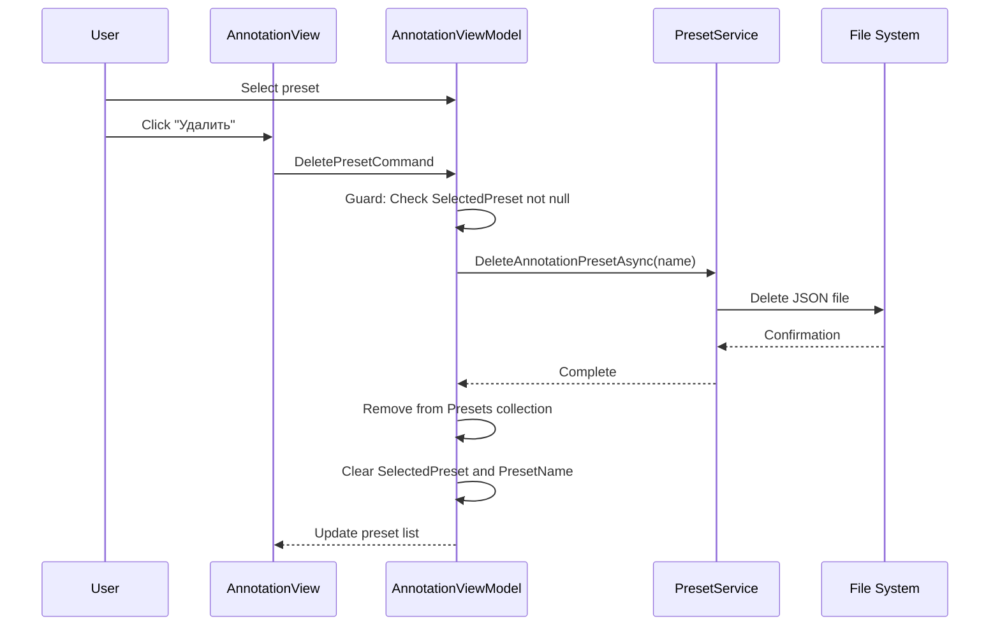
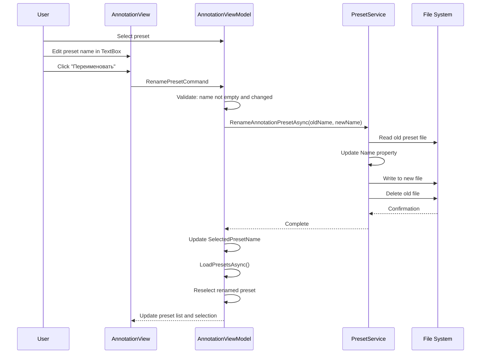
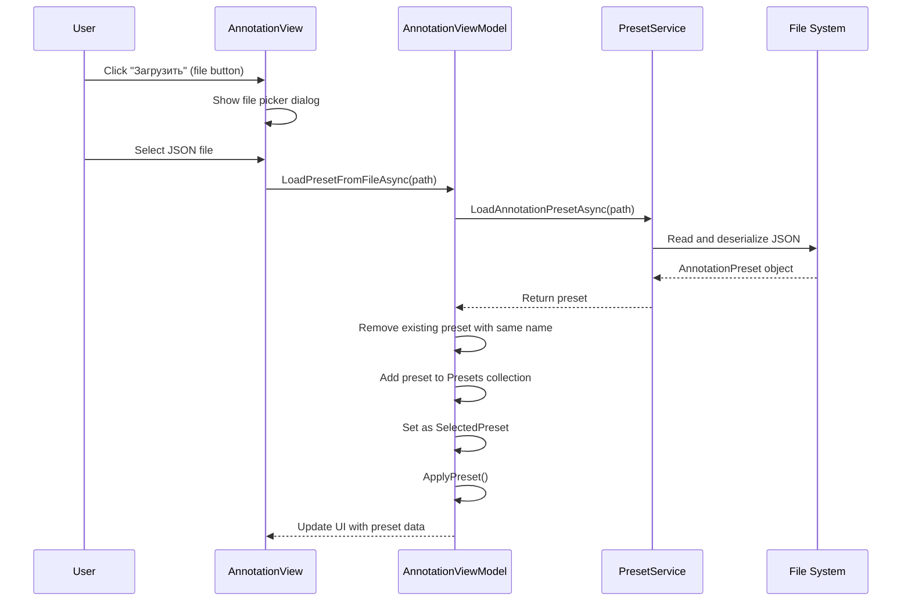

# Preset Management in Annotation Window - Design Document

## Overview

This feature aligns preset management functionality in the Annotation window with the Extraction window, ensuring consistent user experience and feature parity across both modes. The design covers both UI layout modifications and functional enhancements.

## Current State Analysis

### Extraction Window Capabilities

The Extraction window currently provides comprehensive preset management:

**UI Components:**
- Preset selector ComboBox with preset list
- Refresh button for reloading presets
- Preset name TextBox for naming operations
- Four action buttons: Save, Load, Rename, Delete

**Functional Capabilities:**
- Save current settings as preset with custom name or auto-generated timestamp
- Load and apply selected preset automatically with preview
- Rename existing presets while preserving their content
- Delete selected presets
- Reload preset list from file system
- Load presets from external JSON files via file picker dialog
- Automatic preset application on selection with visual feedback
- Auto-generated preset names when name field is empty

### Annotation Window Current State

The Annotation window has limited preset management:

**UI Components:**
- Preset selector ComboBox
- Refresh button
- Two buttons: Save Preset, Save Annotated PDF (unrelated to preset management)

**Functional Gaps:**
- No preset name input field
- Missing Delete preset functionality
- Missing Rename preset functionality
- Missing Load preset from file functionality
- Save operation uses auto-generated names only

## Design Goals

1. Achieve feature parity between Annotation and Extraction preset management
2. Maintain consistent UI layout and interaction patterns
3. Preserve existing preset file structure and storage mechanism
4. Ensure seamless integration with existing AnnotationViewModel logic

## Functional Requirements

### Preset Name Management

**Requirement:** Add preset naming capability to Annotation window

**Behavior:**
- Add PresetName property to AnnotationViewModel as editable text field
- When saving: use PresetName if provided, otherwise use SelectedPreset name, fallback to auto-generated timestamp name
- When selecting preset: populate PresetName field with selected preset name
- When deleting preset: clear PresetName field

### Delete Preset Functionality

**Requirement:** Enable users to delete annotation presets

**Service Layer:**
- Add DeleteAnnotationPresetAsync method to IPresetService interface
- Implement deletion logic in PresetService following same pattern as DeleteExtractionPresetAsync
- Target directory: presets/annotation
- Delete behavior: remove JSON file matching preset name

**ViewModel Layer:**
- Add DeletePresetCommand to AnnotationViewModel
- Command implementation:
  - Guard: return if SelectedPreset is null
  - Call PresetService DeleteAnnotationPresetAsync with preset name
  - Remove preset from Presets collection
  - Clear SelectedPreset and PresetName
- Follow ExtractionViewModel deletion pattern

### Rename Preset Functionality

**Requirement:** Enable users to rename annotation presets

**Service Layer:**
- Add RenameAnnotationPresetAsync method to IPresetService interface
- Implement rename logic in PresetService following same pattern as RenameExtractionPresetAsync
- Behavior:
  - Read existing preset file
  - Update Name property in preset object
  - Save to new file name
  - Delete old file if name differs
  - Handle case-insensitive name comparison

**ViewModel Layer:**
- Add RenamePresetCommand to AnnotationViewModel
- Command implementation:
  - Guard: return if SelectedPreset is null
  - Guard: return if PresetName is empty or unchanged
  - Call PresetService RenameAnnotationPresetAsync
  - Update SelectedPresetName
  - Reload presets
  - Reselect renamed preset
- Follow ExtractionViewModel rename pattern

### Load Preset Command

**Requirement:** Add explicit Load Preset command for manual preset application

**Rationale:**
- Although preset application happens automatically on selection, explicit Load command provides user clarity
- Maintains UI consistency with Extraction window
- Provides fallback mechanism if automatic application fails

**Implementation:**
- Add LoadPresetCommand to AnnotationViewModel
- Command delegates to ApplyPreset method
- ApplyPreset method already exists and applies all preset properties

### Load Preset from File

**Requirement:** Enable loading annotation presets from external JSON files

**Service Layer:**
- Add LoadAnnotationPresetAsync method to IPresetService interface
- Implementation:
  - Accept file path parameter
  - Validate file exists
  - Deserialize JSON to AnnotationPreset object
  - Return null on error or missing file
- Follow ExtractionPreset loading pattern

**ViewModel Layer:**
- Add LoadPresetFromFileAsync method to AnnotationViewModel
- Method signature: Task LoadPresetFromFileAsync(string path)
- Behavior:
  - Load preset via PresetService
  - Log warning if load fails
  - Remove existing preset with same name from collection
  - Add new preset to collection
  - Set as SelectedPreset

**View Layer:**
- Add file picker interaction in AnnotationView code-behind
- Event handler: OnLoadPresetClick
- File filter: JSON files only
- Call ViewModel LoadPresetFromFileAsync with selected path

## User Interface Design

### Layout Structure

The Preset management section in AnnotationView should mirror ExtractionView layout:

**Section Organization:**

```
Пресеты section (Border with padding and background):
├── Header: "Пресеты" label
├── First Row: Horizontal wrap panel
│   ├── ComboBox (preset selector, MinWidth 180)
│   └── Refresh button ("Обновить")
├── Second Row: Full-width TextBox
│   └── Preset name input (Watermark: "Имя пресета")
└── Third Row: Horizontal wrap panel with buttons
    ├── Save button ("Сохранить")
    ├── Load button ("Загрузить")
    ├── Rename button ("Переименовать")
    └── Delete button ("Удалить")
```

### Component Specifications

| Component | Property | Value | Purpose |
|-----------|----------|-------|---------|
| ComboBox | MinWidth | 180 | Ensure readable preset names |
| ComboBox | ItemsSource | Binding: Presets | Display available presets |
| ComboBox | SelectedItem | Binding: SelectedPreset | Two-way selection binding |
| ComboBox | ItemTemplate | TextBlock with Name binding | Show preset name in dropdown |
| TextBox | Watermark | "Имя пресета" | Guide user input |
| TextBox | Text | Binding: PresetName | Two-way name editing |
| TextBox | UpdateSourceTrigger | PropertyChanged | Immediate binding updates |
| TextBox | HorizontalAlignment | Stretch | Full width utilization |
| Button (Обновить) | Command | ReloadPresetsCommand | Refresh preset list |
| Button (Сохранить) | Command | SavePresetCommand | Save current settings |
| Button (Загрузить) | Command | LoadPresetCommand | Apply selected preset |
| Button (Переименовать) | Command | RenamePresetCommand | Rename selected preset |
| Button (Удалить) | Command | DeletePresetCommand | Delete selected preset |

### Visual Consistency

- Match border styling: Padding="8", Background="#08000000", CornerRadius="4"
- Match spacing: StackPanel Spacing="8", WrapPanel ItemSpacing="8"
- Match font styling: Section header with FontWeight="SemiBold"
- Maintain left panel width: 380 pixels

## Data Flow Specifications

### Save Preset Flow



### Delete Preset Flow



### Rename Preset Flow



### Load from File Flow



## Implementation Strategy

### Phase 1: Service Layer Extensions

Add missing methods to IPresetService and PresetService:
- DeleteAnnotationPresetAsync
- RenameAnnotationPresetAsync
- LoadAnnotationPresetAsync

These methods should mirror their extraction counterparts but target the annotation preset directory.

### Phase 2: ViewModel Enhancements

Extend AnnotationViewModel with:
- PresetName property
- DeletePresetCommand
- RenamePresetCommand
- LoadPresetCommand
- LoadPresetFromFileAsync method
- Enhanced SavePresetAsync to use PresetName

Update SelectedPreset setter to populate PresetName field.

### Phase 3: UI Layout Updates

Modify AnnotationView.axaml:
- Add TextBox for preset name input
- Restructure button layout to match extraction window
- Add Load, Rename, and Delete buttons
- Bind new commands to respective buttons

### Phase 4: View Code-Behind

Add OnLoadPresetClick event handler in AnnotationView.axaml.cs:
- Implement file picker dialog
- Filter for JSON files
- Invoke ViewModel LoadPresetFromFileAsync

## Validation and Edge Cases

### Guard Conditions

| Operation | Guard Condition | Behavior |
|-----------|----------------|----------|
| Delete | SelectedPreset is null | Return early, no action |
| Rename | SelectedPreset is null | Return early, no action |
| Rename | PresetName is empty or whitespace | Return early, no action |
| Rename | PresetName equals current name | Return early, no action |
| Load from file | File path is empty | Return early, log warning |
| Load from file | File does not exist | Return null, log warning |
| Save | No name provided | Auto-generate timestamp name |

### Error Handling

- File operations wrapped in try-catch blocks
- Deserialization failures return null gracefully
- Logging for all warning and error conditions
- UI remains responsive during all operations

### Naming Conflicts

When loading preset from file:
- If preset with same name exists in collection, remove old instance
- Add newly loaded preset
- Set as selected preset
- This ensures no duplicates and latest version is used

## Testing Considerations

### Functional Test Scenarios

1. Save preset with custom name - verify file created with correct name and content
2. Save preset without name - verify timestamp-based name generation
3. Save preset with existing selected preset - verify uses selected preset name
4. Delete preset - verify file removed and UI updated
5. Rename preset to new name - verify old file deleted, new file created, content preserved
6. Rename preset to same name (case different) - verify handled correctly
7. Load preset from external file - verify added to list and applied
8. Load preset with duplicate name - verify old version replaced
9. Refresh presets - verify reloads from file system
10. Select preset from dropdown - verify auto-applies and populates name field

### UI Validation

1. Verify button layout matches extraction window
2. Verify preset name TextBox is full width
3. Verify ComboBox minimum width is 180
4. Verify spacing and padding matches extraction window
5. Verify section styling consistency

### Integration Testing

1. Save preset in annotation mode, switch to extraction mode and back - verify persistence
2. Create preset, rename, delete - verify state consistency
3. Load preset from file with missing properties - verify graceful degradation
4. Multiple rapid preset operations - verify no race conditions

## Non-Functional Considerations

### Performance

- All file operations are asynchronous to prevent UI blocking
- Preset loading happens at startup once
- Refresh operation is user-triggered only
- No performance degradation expected from additional commands

### Maintainability

- Code follows existing patterns from ExtractionViewModel
- Service methods mirror extraction equivalents for consistency
- Clear separation of concerns: Service handles persistence, ViewModel handles logic, View handles interaction

### Usability

- Consistent terminology across both windows
- Predictable button behavior matching extraction mode
- Clear visual feedback through preset selection
- Watermark text guides user input

## Success Criteria

The implementation is considered successful when:

1. All preset management buttons present in Annotation window matching Extraction window layout
2. Save preset accepts custom name from TextBox or auto-generates timestamp name
3. Delete preset removes file and updates UI correctly
4. Rename preset changes file name and internal preset name
5. Load from file allows selecting external JSON files and imports them
6. Preset name field populates automatically on preset selection
7. All commands handle edge cases gracefully without crashes
8. UI layout visually matches Extraction window preset section
9. Existing preset save functionality remains unaffected
10. All operations work consistently across page changes and mode switches
