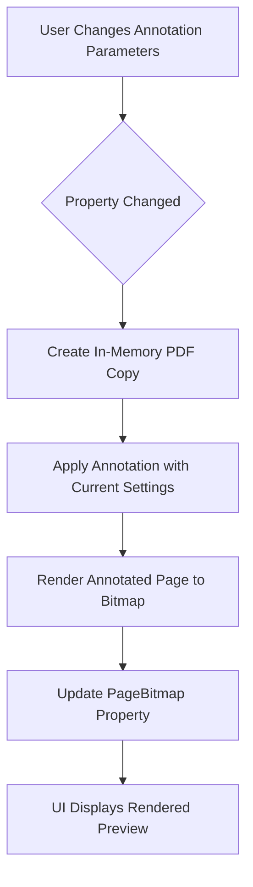

# Annotation Preview Rendering Optimization

## Overview

Transform the annotation preview to render annotated pages directly from an in-memory PDF instead of overlaying UI elements on the original page bitmap. This ensures the preview accurately reflects how the final annotated PDF will appear.

## Current Implementation Analysis

### Preview Mechanism
The current annotation preview uses a two-layer approach:
- **Base Layer**: Original PDF page rendered as a bitmap and displayed in an Image control
- **Overlay Layer**: A Canvas with a TextBlock positioned to simulate the annotation appearance

### Limitations
- The overlay approach does not guarantee visual accuracy compared to the final PDF output
- Font rendering, positioning, and rotation may differ between the UI overlay and PDF annotation engine
- Users cannot see the exact result before saving the annotated PDF

## Design Solution

### Preview Rendering Strategy

Replace the current overlay-based preview with direct rendering of an in-memory annotated PDF page:

1. **In-Memory PDF Modification**: When preview needs to update, create a temporary copy of the current page in memory with the annotation applied
2. **Render Annotated Result**: Render the annotated page to a bitmap using the same rendering pipeline as the original page
3. **Display Preview**: Replace the PageBitmap with the newly rendered annotated bitmap

### Trigger Conditions

The preview should re-render when any of the following change:
- Text position (TextX, TextY, PreviewX, PreviewY)
- Font properties (FontSize, FontName, Angle)
- Visual properties (ColorHex)
- Current page navigation (CurrentPage)
- Data content (SelectedCodePreview from table row)

### Data Flow

## Implementation Strategy

### ViewModel Layer Changes

#### AnnotationViewModel Modifications

**RefreshPreview Method Enhancement**:
- Transform from simple property update to async rendering operation
- Invoke PdfService to render the annotated page in memory
- Update PageBitmap with the rendered result

**Reactive Subscription Updates**:
- Existing reactive subscriptions already monitor the correct properties
- Modify subscriptions to await the async RefreshPreview operation
- Maintain throttling behavior to prevent excessive re-renders

**Property Dependencies**:
Current reactive subscriptions monitor:
- Position changes: TextX, TextY, PreviewX, PreviewY
- Visual changes: ColorHex, FontName
- Additional properties to consider: FontSize, Angle, SelectedCodePreview

### Service Layer Integration

**PdfService Method Utilization**:
The existing `RenderAnnotatedPageAsync` method provides the required functionality:
- Accepts PDF path, page number, TableRow data, and AnnotationPreset
- Creates temporary in-memory PDF with annotation applied
- Renders the annotated page to bitmap
- Returns the rendered bitmap for display

**Parameter Mapping**:
- PDF Path: Current loaded document path
- Page Number: CurrentPage
- TableRow: Construct from current page and SelectedCodePreview
- AnnotationPreset: Build from current ViewModel properties (TextX, TextY, FontSize, Angle, ColorHex, FontName)

### UI Layer Simplification

**AXAML Markup Changes**:
- Remove the Canvas overlay layer entirely
- Keep only the Image control bound to PageBitmap
- Remove TextBlock annotation overlay and associated bindings

**Visual Accuracy**:
- Preview will exactly match the final PDF output
- No discrepancies between overlay rendering and PDF annotation engine

## Performance Considerations

### Rendering Optimization

**Throttling Mechanism**:
- Maintain existing 100ms throttle on property change subscriptions
- Prevents excessive re-renders during rapid user input

**Caching Strategy**:
- Leverage existing PDF render cache in PdfService
- Cache key includes page number and DPI
- In-memory annotation rendering uses temporary files that are cleaned up automatically

**Async Operation Management**:
- Preview rendering executes asynchronously to prevent UI blocking
- User can continue interacting with controls while rendering completes

### Resource Management

**Memory Footprint**:
- Temporary PDF files created during annotation rendering are deleted immediately after rendering
- Only the resulting bitmap is retained in memory
- Bitmap size controlled by consistent DPI setting (100 DPI as per PageRenderService)

**Concurrency Handling**:
- Throttling ensures only one preview render operation occurs at a time
- Previous pending renders are cancelled when new changes occur

## User Experience Impact

### Visual Feedback
- Preview updates reflect exact PDF output
- Font rendering matches final document precisely
- Text positioning accuracy eliminates surprises when saving

### Responsiveness
- Throttled rendering maintains smooth interaction
- 100ms delay balances responsiveness with performance

### Workflow Improvement
- Users can confidently adjust annotation parameters knowing the preview is accurate
- Reduces trial-and-error cycles when positioning and styling annotations

## Technical Dependencies

### Required Components
- IPdfService.RenderAnnotatedPageAsync: Existing method for rendering annotated pages
- PageSnapshot: Data structure for page rendering results
- ReactiveUI: Observable property change subscriptions
- PropertyChanged.Fody: Automatic INotifyPropertyChanged implementation

### No Breaking Changes
- Existing PdfService methods remain unchanged
- ViewModel public API stays compatible
- Only internal preview refresh logic modified

## Edge Cases and Error Handling

### Missing or Invalid Data
- **No Code Text**: When SelectedCodePreview is empty, render original page without annotation
- **Invalid PDF Path**: Prevent rendering if PdfPath is null or file does not exist
- **Page Out of Range**: Clamp CurrentPage to valid range before rendering

### Rendering Failures
- **Temporary File Issues**: PdfService handles cleanup errors silently
- **Rendering Exceptions**: Log errors and fall back to displaying original page bitmap
- **Resource Constraints**: Throttling prevents excessive memory allocation

### Concurrent Operations
- **Property Changes During Render**: Throttling cancels previous operations automatically
- **PDF Loading During Preview Update**: Validate PDF availability before each render

## Testing Considerations

### Visual Verification
- Compare preview output with saved PDF annotation results
- Verify font rendering matches across preview and final output
- Confirm positioning accuracy at various page sizes

### Performance Testing
- Measure rendering time for typical annotation changes
- Verify throttling prevents UI freezing during rapid property updates
- Monitor memory usage with repeated preview refreshes

### Regression Testing
- Ensure preset loading updates preview correctly
- Verify page navigation triggers proper re-rendering
- Confirm table row data changes reflect in preview
