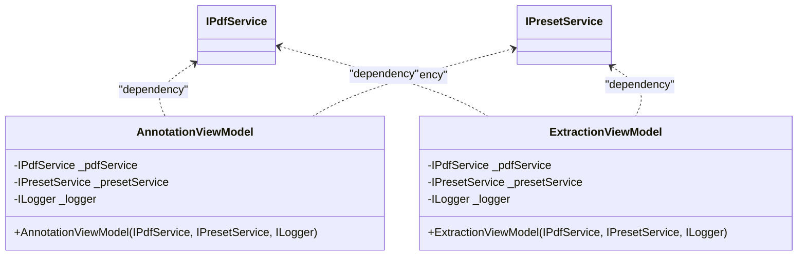
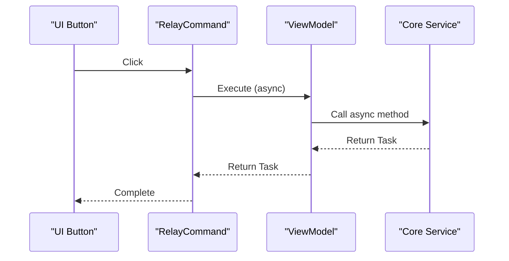
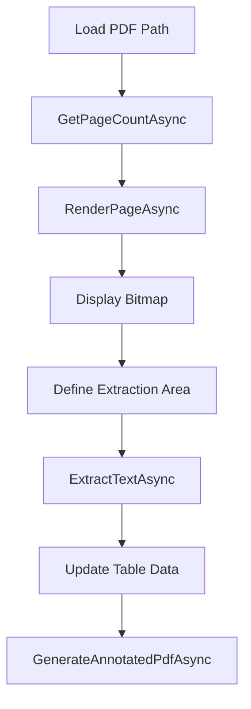
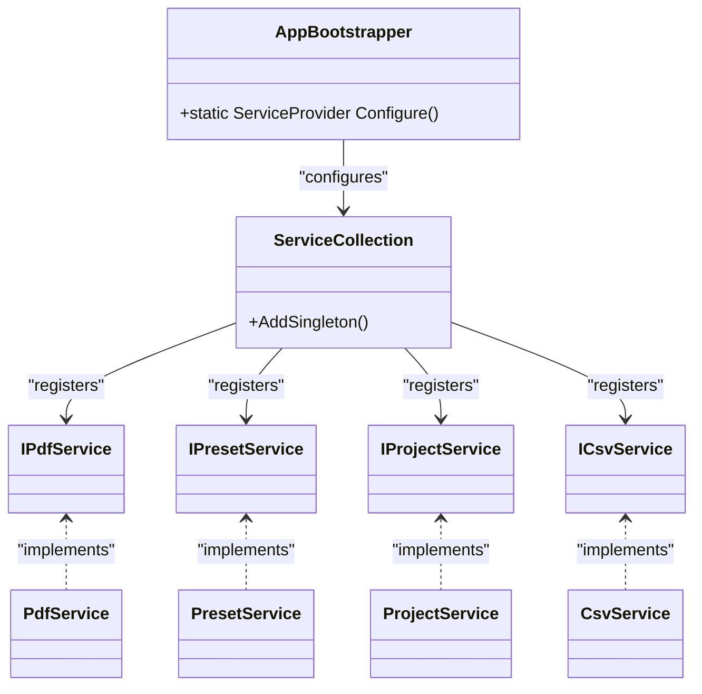

# Core Service APIs

<cite>
**Referenced Files in This Document**   
- [IPdfService.cs](file://src/PdfAnnotator.Core/Services/IPdfService.cs)
- [IPresetService.cs](file://src/PdfAnnotator.Core/Services/IPresetService.cs)
- [IProjectService.cs](file://src/PdfAnnotator.Core/Services/IProjectService.cs)
- [ICsvService.cs](file://src/PdfAnnotator.Core/Services/ICsvService.cs)
- [PresetService.cs](file://src/PdfAnnotator.Core/Services/PresetService.cs)
- [ProjectService.cs](file://src/PdfAnnotator.Core/Services/ProjectService.cs)
- [CsvService.cs](file://src/PdfAnnotator.Core/Services/CsvService.cs)
- [AnnotationViewModel.cs](file://src/PdfAnnotator.ViewModels/AnnotationViewModel.cs)
- [ExtractionViewModel.cs](file://src/PdfAnnotator.ViewModels/ExtractionViewModel.cs)
- [AppBootstrapper.cs](file://src/PdfAnnotator.App/Services/AppBootstrapper.cs)
</cite>

## Table of Contents
1. [Introduction](#introduction)
2. [IPdfService Interface](#ipdfservice-interface)
3. [IPresetService Interface](#ipresetservice-interface)
4. [IProjectService Interface](#iprojectservice-interface)
5. [ICsvService Interface](#icsvservice-interface)
6. [Usage Examples from ViewModels](#usage-examples-from-viewmodels)
7. [Design Principles and Extensibility](#design-principles-and-extensibility)
8. [Thread Safety and DI Lifecycle](#thread-safety-and-di-lifecycle)

## Introduction
This document provides comprehensive API documentation for the core service interfaces in the PDFAnnotator application. These interfaces form the foundation of the application's functionality, enabling PDF processing, data persistence, and user interaction. The services are designed with dependency injection (DI) in mind, promoting testability, loose coupling, and extensibility. All service methods follow async Task return patterns to ensure non-blocking operations, critical for maintaining responsive UI in desktop applications.

**Section sources**
- [AppBootstrapper.cs](file://src/PdfAnnotator.App/Services/AppBootstrapper.cs#L1-L36)

## IPdfService Interface
The `IPdfService` interface defines core PDF processing operations. All methods are asynchronous to prevent UI blocking during potentially long-running operations.

### GetPageCountAsync
- **Signature**: `Task<int> GetPageCountAsync(string path)`
- **Purpose**: Returns the total number of pages in the specified PDF file
- **Error Conditions**: Throws exception if file path is invalid or file cannot be read
- **Usage**: Used to initialize page navigation controls in UI

### RenderPageAsync
- **Signature**: `Task<Bitmap> RenderPageAsync(string path, int page, int dpi)`
- **Purpose**: Renders a specific PDF page as a bitmap image at the specified DPI
- **Parameters**: 
  - `path`: PDF file path
  - `page`: 1-based page number
  - `dpi`: Resolution for rendering
- **Return**: Avalonia Bitmap object for display in UI

### ExtractTextAsync
- **Signature**: `Task<List<TableRow>> ExtractTextAsync(string pdfPath, ExtractionPreset preset)`
- **Purpose**: Extracts text from a specified region of a PDF page based on extraction preset
- **Parameters**: 
  - `pdfPath`: Source PDF file
  - `preset`: Defines coordinates (X0, Y0, X1, Y1) for text extraction area
- **Return**: List of TableRow objects containing extracted text and metadata

### GenerateAnnotatedPdfAsync
- **Signature**: `Task GenerateAnnotatedPdfAsync(string pdfPath, string outputPdfPath, List<TableRow> rows, AnnotationPreset preset)`
- **Purpose**: Creates a new PDF with text annotations based on provided data
- **Parameters**:
  - `pdfPath`: Source PDF
  - `outputPdfPath`: Destination for annotated PDF
  - `rows`: Data to be annotated
  - `preset`: Styling and positioning information for annotations
- **Threading**: Async operation suitable for background execution

**Section sources**
- [IPdfService.cs](file://src/PdfAnnotator.Core/Services/IPdfService.cs#L8-L14)

## IPresetService Interface
The `IPresetService` interface manages persistence of user-defined presets for extraction and annotation operations, using JSON serialization in a structured directory system.

### SaveExtractionPresetAsync
- **Signature**: `Task SaveExtractionPresetAsync(ExtractionPreset preset)`
- **Persistence**: Saves to `presets/extraction/{preset.Name}.json`
- **Directory**: Automatically creates `presets/extraction` directory if missing
- **Format**: Indented JSON using System.Text.Json

### SaveAnnotationPresetAsync
- **Signature**: `Task SaveAnnotationPresetAsync(AnnotationPreset preset)`
- **Persistence**: Saves to `presets/annotation/{preset.Name}.json`
- **Directory**: Automatically creates `presets/annotation` directory if missing

### LoadAllExtractionPresetsAsync
- **Signature**: `Task<List<ExtractionPreset>> LoadAllExtractionPresetsAsync()`
- **Behavior**: Returns empty list if directory doesn't exist or no files found
- **Error Handling**: Silently skips malformed JSON files

### LoadAllAnnotationPresetsAsync
- **Signature**: `Task<List<AnnotationPreset>> LoadAllAnnotationPresetsAsync()`
- **Behavior**: Similar to extraction presets but for annotation configuration

### LoadExtractionPresetAsync
- **Signature**: `Task<ExtractionPreset?> LoadExtractionPresetAsync(string path)`
- **Return**: Nullable - returns null if file doesn't exist or parsing fails
- **Use Case**: Direct loading of specific preset files

**Section sources**
- [IPresetService.cs](file://src/PdfAnnotator.Core/Services/IPresetService.cs#L7-L14)
- [PresetService.cs](file://src/PdfAnnotator.Core/Services/PresetService.cs#L6-L81)

## IProjectService Interface
The `IProjectService` interface handles complete project persistence, including all user data and configuration.

### SaveProjectAsync
- **Signature**: `Task SaveProjectAsync(PdfProject project, string path)`
- **Directory**: Automatically creates parent directory if needed
- **Serialization**: Indented JSON using System.Text.Json
- **Data Structure**: Includes PDF path, preset names, and all table rows

### LoadProjectAsync
- **Signature**: `Task<PdfProject> LoadProjectAsync(string path)`
- **Error Conditions**:
  - Throws `FileNotFoundException` if file doesn't exist
  - Throws `InvalidDataException` if JSON parsing fails
- **Null Safety**: Initializes Rows collection if null in deserialized object
- **Persistence Location**: Projects saved in `projects/` directory by convention

**Section sources**
- [IProjectService.cs](file://src/PdfAnnotator.Core/Services/IProjectService.cs#L6-L10)
- [ProjectService.cs](file://src/PdfAnnotator.Core/Services/ProjectService.cs#L6-L42)

## ICsvService Interface
The `ICsvService` interface manages CSV import/export operations with a specific format for table data.

### SaveCsvAsync
- **Signature**: `Task SaveCsvAsync(string path, List<TableRow> rows)`
- **Format**: Semicolon-separated values with header `page;field_text;code`
- **Quoting**: Fields containing semicolons are quoted with double quotes
- **Encoding**: UTF-8 with BOM
- **Header**: First line contains field headers

### LoadCsvAsync
- **Signature**: `Task<List<TableRow>> LoadCsvAsync(string path)`
- **Validation**: 
  - File must exist (throws `FileNotFoundException` if missing)
  - First line must match expected header
- **Parsing**: Uses regex to properly handle quoted fields containing separators
- **Data Validation**: 
  - Page number must be valid integer
  - Exactly three fields required per row
  - Throws `InvalidDataException` on format violations

**Section sources**
- [ICsvService.cs](file://src/PdfAnnotator.Core/Services/ICsvService.cs#L7-L11)
- [CsvService.cs](file://src/PdfAnnotator.Core/Services/CsvService.cs#L8-L96)

## Usage Examples from ViewModels
The ViewModels demonstrate real-world usage patterns of the service interfaces through dependency injection and async invocation.

### Dependency Injection Pattern

**Diagram sources**
- [AnnotationViewModel.cs](file://src/PdfAnnotator.ViewModels/AnnotationViewModel.cs#L17-L19)
- [ExtractionViewModel.cs](file://src/PdfAnnotator.ViewModels/ExtractionViewModel.cs#L19-L21)

### Async Invocation in Commands
The RelayCommand pattern shows how async methods are invoked from UI commands:

**Diagram sources**
- [AnnotationViewModel.cs](file://src/PdfAnnotator.ViewModels/AnnotationViewModel.cs#L73-L76)
- [ExtractionViewModel.cs](file://src/PdfAnnotator.ViewModels/ExtractionViewModel.cs#L77-L80)

### PDF Processing Workflow

**Diagram sources**
- [ExtractionViewModel.cs](file://src/PdfAnnotator.ViewModels/ExtractionViewModel.cs#L119-L132)
- [AnnotationViewModel.cs](file://src/PdfAnnotator.ViewModels/AnnotationViewModel.cs#L170-L186)

**Section sources**
- [AnnotationViewModel.cs](file://src/PdfAnnotator.ViewModels/AnnotationViewModel.cs#L67-L194)
- [ExtractionViewModel.cs](file://src/PdfAnnotator.ViewModels/ExtractionViewModel.cs#L71-L195)

## Design Principles and Extensibility
The service architecture follows several key design principles that enhance testability and extensibility.

### Interface-Based Design
The use of interfaces enables:
- **Testability**: Services can be mocked in unit tests
- **Loose Coupling**: Components depend on abstractions, not implementations
- **Extensibility**: Custom implementations can be substituted

### Dependency Injection Configuration

**Diagram sources**
- [AppBootstrapper.cs](file://src/PdfAnnotator.App/Services/AppBootstrapper.cs#L23-L26)

### Potential Extension Points
1. **Custom IPdfService implementations** for different PDF libraries
2. **Alternative persistence** for presets (database instead of JSON files)
3. **Additional export formats** by extending from ICsvService pattern
4. **Cloud storage integration** for project files

**Section sources**
- [AppBootstrapper.cs](file://src/PdfAnnotator.App/Services/AppBootstrapper.cs#L14-L35)

## Thread Safety and DI Lifecycle
The service architecture considers threading and lifecycle management for robust application behavior.

### Thread Safety Assumptions
- **Stateless Services**: All core services are stateless (no instance fields that change)
- **Immutable Configuration**: Service configuration is set at construction
- **Thread-Safe Operations**: File operations are atomic and properly synchronized by the runtime
- **Async Safety**: All async methods are awaitable and can be called from any thread

### DI Container Lifecycle
- **Singleton Scope**: All services registered as singletons
- **Thread Safety**: Singleton instances are safe for concurrent access
- **Lifetime**: Services live for the entire application duration
- **Resource Management**: No explicit disposal needed (no unmanaged resources)

### Concurrency Considerations
- **File Access**: Multiple async operations may access files concurrently
- **UI Integration**: Async methods prevent blocking the UI thread
- **Error Isolation**: Exceptions in one service don't affect others due to DI isolation

**Section sources**
- [AppBootstrapper.cs](file://src/PdfAnnotator.App/Services/AppBootstrapper.cs#L23-L26)
- [PresetService.cs](file://src/PdfAnnotator.Core/Services/PresetService.cs#L8-L14)
- [ProjectService.cs](file://src/PdfAnnotator.Core/Services/ProjectService.cs#L8-L11)