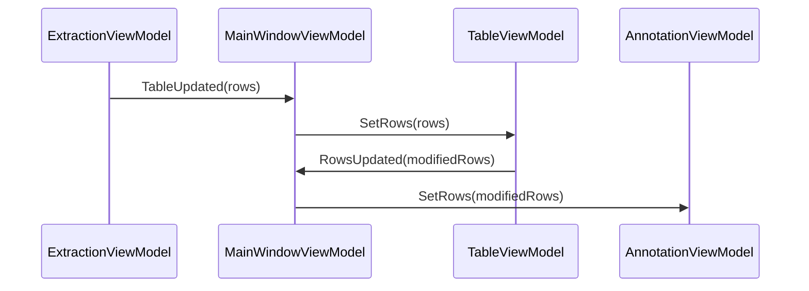
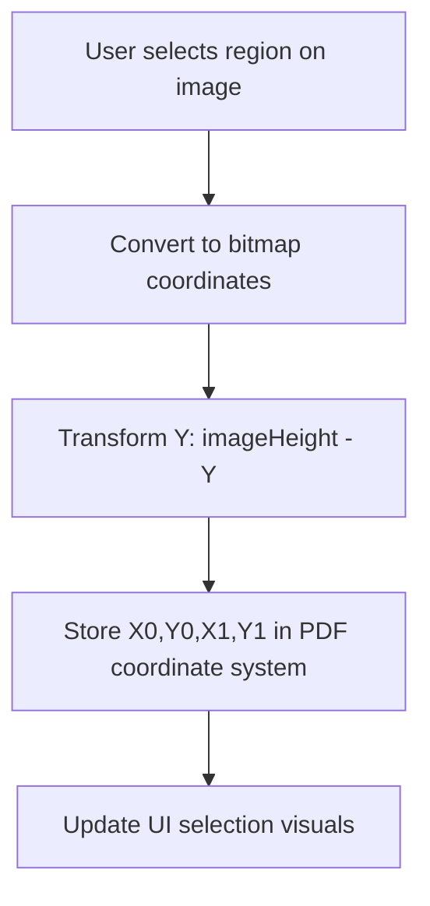
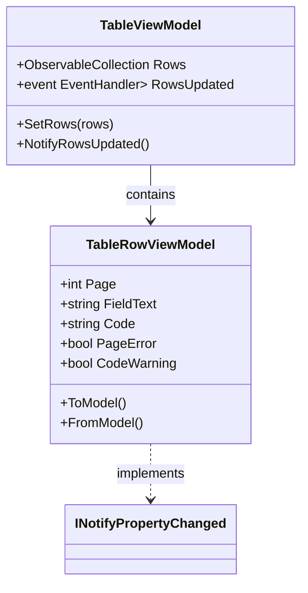
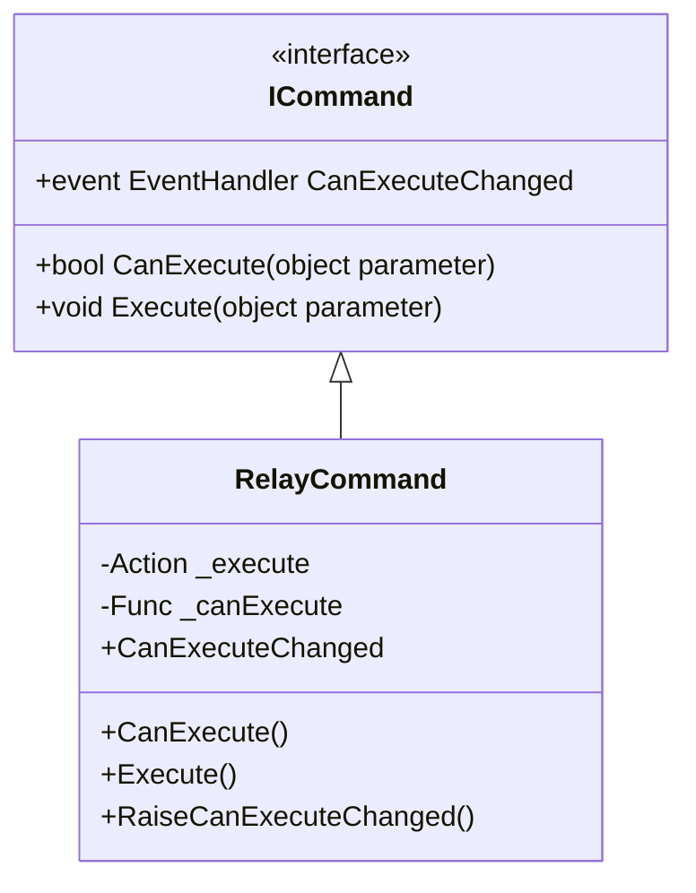

# ViewModel APIs

<cite>
**Referenced Files in This Document**   
- [MainWindowViewModel.cs](file://src/PdfAnnotator.ViewModels/MainWindowViewModel.cs)
- [ExtractionViewModel.cs](file://src/PdfAnnotator.ViewModels/ExtractionViewModel.cs)
- [TableViewModel.cs](file://src/PdfAnnotator.ViewModels/TableViewModel.cs)
- [AnnotationViewModel.cs](file://src/PdfAnnotator.ViewModels/AnnotationViewModel.cs)
- [TableRowViewModel.cs](file://src/PdfAnnotator.ViewModels/TableRowViewModel.cs)
- [RelayCommand.cs](file://src/PdfAnnotator.ViewModels/RelayCommand.cs)
- [ExtractionView.axaml.cs](file://src/PdfAnnotator.App/Views/ExtractionView.axaml.cs)
- [AnnotationView.axaml.cs](file://src/PdfAnnotator.App/Views/AnnotationView.axaml.cs)
- [TableView.axaml.cs](file://src/PdfAnnotator.App/Views/TableView.axaml.cs)
</cite>

## Table of Contents
1. [MainWindowViewModel](#mainwindowviewmodel)
2. [ExtractionViewModel](#extractionviewmodel)
3. [TableViewModel](#tableviewmodel)
4. [AnnotationViewModel](#annotationviewmodel)
5. [Data Binding and Command Patterns](#data-binding-and-command-patterns)
6. [Event Communication and Data Flow](#event-communication-and-data-flow)

## MainWindowViewModel

The `MainWindowViewModel` serves as the root view model that orchestrates navigation between different application modes and manages project state persistence. It exposes child view models for each functional area and provides commands for mode switching and project management.

### Mode Management and Navigation

The `MainWindowViewModel` implements a mode-based navigation system using the `AppMode` enum, which defines three states: `Extraction`, `Table`, and `Annotation`. The current mode is exposed through the `Mode` property, which triggers UI updates when changed.

Navigation between modes is handled through dedicated commands:
- `GoToTableCommand`: Switches to table editing mode
- `GoToAnnotationCommand`: Switches to annotation mode, with automatic data synchronization from table
- `GoToExtractionCommand`: Returns to extraction mode

When switching to annotation mode, the `GoToAnnotationCommand` executes `SyncTableToAnnotation()` to ensure the latest table data is available for annotation.

**Section sources**
- [MainWindowViewModel.cs](file://src/PdfAnnotator.ViewModels/MainWindowViewModel.cs#L14-L19)
- [MainWindowViewModel.cs](file://src/PdfAnnotator.ViewModels/MainWindowViewModel.cs#L33-L37)

### Project State Management

The `MainWindowViewModel` provides two primary commands for project persistence:
- `SaveProjectCommand`: Serializes current application state to a JSON file
- `LoadProjectCommand`: Restores application state from a JSON file

The `SaveProjectCommand` synchronizes data by:
1. Converting `Table.Rows` to model objects via `ToModel()`
2. Storing selected preset names from both extraction and annotation modules
3. Saving to a path derived from project name in the "projects" directory

The `LoadProjectCommand` performs validation before loading and updates child view models with restored data, automatically navigating to the table view upon successful load.

**Section sources**
- [MainWindowViewModel.cs](file://src/PdfAnnotator.ViewModels/MainWindowViewModel.cs#L38-L40)
- [MainWindowViewModel.cs](file://src/PdfAnnotator.ViewModels/MainWindowViewModel.cs#L93-L118)

### Event Handling and Data Flow

The `MainWindowViewModel` establishes event subscriptions to maintain data flow between components:
- Subscribes to `Extraction.TableUpdated` to receive extracted table data
- Subscribes to `Table.RowsUpdated` to receive modified table data

When `TableUpdated` is received from the extraction module, it automatically populates the table view and switches to table mode. When `RowsUpdated` is received from the table module, it propagates the data to the annotation module for use in PDF annotation.



**Diagram sources**
- [MainWindowViewModel.cs](file://src/PdfAnnotator.ViewModels/MainWindowViewModel.cs#L60-L61)
- [MainWindowViewModel.cs](file://src/PdfAnnotator.ViewModels/MainWindowViewModel.cs#L77-L87)

## ExtractionViewModel

The `ExtractionViewModel` manages PDF text extraction functionality, including region selection, preset management, and coordinate transformation.

### Observable Properties

The view model exposes several observable properties for data binding:
- `PdfPath`: Path to the currently loaded PDF file
- `PageCount`: Total number of pages in the PDF
- `CurrentPage`: Currently displayed page (triggers page reload when changed)
- `PageBitmap`: Rendered bitmap of the current page
- `Dpi`: Rendering resolution for PDF pages

Selection coordinates are exposed as both raw PDF coordinates (`X0`, `Y0`, `X1`, `Y1`) and UI presentation values (`SelectLeft`, `SelectTop`, `SelectWidth`, `SelectHeight`).

**Section sources**
- [ExtractionViewModel.cs](file://src/PdfAnnotator.ViewModels/ExtractionViewModel.cs#L25-L53)

### Preset Management

The `ExtractionViewModel` supports preset functionality through:
- `Presets`: ObservableCollection of available extraction presets
- `SelectedPreset`: Currently active preset
- `SelectedPresetName`: Name of selected preset for persistence

Preset operations include:
- `LoadPresetsAsync()`: Loads all presets from the "presets/extraction" directory
- `SavePresetCommand`: Saves current selection as a named preset
- `ReloadPresetsCommand`: Refreshes the presets collection

When a preset is selected, `ApplyPreset()` automatically updates the selection coordinates.

**Section sources**
- [ExtractionViewModel.cs](file://src/PdfAnnotator.ViewModels/ExtractionViewModel.cs#L55-L63)
- [ExtractionViewModel.cs](file://src/PdfAnnotator.ViewModels/ExtractionViewModel.cs#L79-L80)

### Commands

Key commands provided by `ExtractionViewModel`:
- `LoadPdfCommand`: Opens file picker and loads selected PDF
- `ExtractTextCommand`: Extracts text from the selected region (disabled when no PDF is loaded)
- `SavePresetCommand`: Saves current selection as a reusable preset

The `ExtractTextCommand` includes a `CanExecute` predicate that ensures the command is only enabled when a PDF is loaded.

**Section sources**
- [ExtractionViewModel.cs](file://src/PdfAnnotator.ViewModels/ExtractionViewModel.cs#L66-L69)
- [ExtractionViewModel.cs](file://src/PdfAnnotator.ViewModels/ExtractionViewModel.cs#L77-L80)

### Coordinate Transformation

The `UpdateSelection` method handles coordinate transformation from image space to PDF space:
- Converts pixel coordinates from UI interaction to bitmap coordinates
- Transforms from top-left origin (image) to bottom-left origin (PDF) by inverting Y coordinates
- Stores both normalized coordinates for PDF operations and UI presentation values

This transformation is critical for accurate text extraction from the specified region.



**Diagram sources**
- [ExtractionViewModel.cs](file://src/PdfAnnotator.ViewModels/ExtractionViewModel.cs#L106-L117)
- [ExtractionView.axaml.cs](file://src/PdfAnnotator.App/Views/ExtractionView.axaml.cs#L66-L72)

## TableViewModel

The `TableViewModel` manages tabular data extracted from PDFs and provides CSV import/export functionality.

### Data Collection

The primary data collection is exposed through:
- `Rows`: ObservableCollection of `TableRowViewModel` objects
- Automatic `INotifyPropertyChanged` chaining for row edits

When rows are modified, the view model listens for property changes on each `TableRowViewModel` and propagates updates via the `RowsUpdated` event.

**Section sources**
- [TableViewModel.cs](file://src/PdfAnnotator.ViewModels/TableViewModel.cs#L23-L24)

### Commands

The view model provides two main commands:
- `SaveCsvCommand`: Exports current table data to CSV format
- `LoadCsvCommand`: Imports table data from CSV file

Both commands use the `ICsvService` for file operations and target the "tables/latest.csv" path by default.

**Section sources**
- [TableViewModel.cs](file://src/PdfAnnotator.ViewModels/TableViewModel.cs#L25-L26)
- [TableViewModel.cs](file://src/PdfAnnotator.ViewModels/TableViewModel.cs#L32-L33)

### Event Propagation

The `TableViewModel` implements a sophisticated event propagation system:
- `SetRows()`: Clears existing rows and populates with new data
- For each row, subscribes to `PropertyChanged` events to detect edits
- `NotifyRowsUpdated()`: Called when any row property changes, re-emitting the `RowsUpdated` event
- `RowsUpdated` event carries model objects created via `ToModel()` conversion

This ensures that any modification to table data is immediately propagated to dependent components.



**Diagram sources**
- [TableViewModel.cs](file://src/PdfAnnotator.ViewModels/TableViewModel.cs#L21-L22)
- [TableViewModel.cs](file://src/PdfAnnotator.ViewModels/TableViewModel.cs#L36-L49)
- [TableRowViewModel.cs](file://src/PdfAnnotator.ViewModels/TableRowViewModel.cs#L6-L28)

## AnnotationViewModel

The `AnnotationViewModel` manages the creation of annotated PDFs with customizable text overlays.

### Observable Properties

The view model exposes properties for:
- PDF document management (`PdfPath`, `PageCount`, `CurrentPage`, `PageBitmap`)
- Text positioning (`TextX`, `TextY`, `PreviewX`, `PreviewY`)
- Styling options (`FontSize`, `Angle`, `ColorHex`, `FontName`)
- Data source (`Rows`: table data to be annotated)
- Preset management (`Presets`, `SelectedPreset`, `SelectedPresetName`)

The `Fonts` collection provides a predefined list of available font families.

**Section sources**
- [AnnotationViewModel.cs](file://src/PdfAnnotator.ViewModels/AnnotationViewModel.cs#L21-L58)

### Positioning and Preview

The `UpdatePosition` method handles cursor interaction:
- Converts view coordinates to bitmap space
- Updates both preview position (`PreviewX`, `PreviewY`) and PDF coordinates (`TextX`, `TextY`)
- Inverts Y coordinate for PDF space transformation
- Triggers `RefreshPreview()` to update the display

The `RefreshPreview` method updates the `SelectedCodePreview` with the code from the first row matching the current page.

**Section sources**
- [AnnotationViewModel.cs](file://src/PdfAnnotator.ViewModels/AnnotationViewModel.cs#L89-L96)
- [AnnotationViewModel.cs](file://src/PdfAnnotator.ViewModels/AnnotationViewModel.cs#L189-L193)

### Commands

Key commands include:
- `LoadPdfCommand`: Loads a PDF document for annotation
- `SavePresetCommand`: Saves current styling and positioning as a preset
- `ReloadPresetsCommand`: Refreshes available presets
- `SaveAnnotatedPdfCommand`: Generates a new PDF with text annotations

The `SaveAnnotatedPdfCommand` uses the current table data and styling settings to create an annotated output saved to "output/annotated.pdf".

**Section sources**
- [AnnotationViewModel.cs](file://src/PdfAnnotator.ViewModels/AnnotationViewModel.cs#L62-L65)
- [AnnotationViewModel.cs](file://src/PdfAnnotator.ViewModels/AnnotationViewModel.cs#L73-L76)

## Data Binding and Command Patterns

The application follows standard MVVM patterns with Avalonia UI framework conventions.

### XAML Binding Examples

Typical binding patterns in XAML views include:
- Text properties bound to view model strings
- Visibility bound to boolean properties
- Command bindings for button actions
- Collection controls bound to ObservableCollection properties

For example, in `ExtractionView.axaml`, the PDF image source is bound to `PageBitmap`, and button commands are bound to view model commands like `LoadPdfCommand`.

**Section sources**
- [ExtractionView.axaml.cs](file://src/PdfAnnotator.App/Views/ExtractionView.axaml.cs#L30-L31)
- [AnnotationView.axaml.cs](file://src/PdfAnnotator.App/Views/AnnotationView.axaml.cs#L25-L26)

### RelayCommand Implementation

The `RelayCommand` class provides a standard ICommand implementation with:
- Action delegate for execution logic
- Optional Func for CanExecute evaluation
- Manual CanExecuteChanged notification via `RaiseCanExecuteChanged()`

Commands use async delegates with proper exception handling. The `CanExecute` predicate enables conditional command availability, such as disabling `ExtractTextCommand` when no PDF is loaded.



**Diagram sources**
- [RelayCommand.cs](file://src/PdfAnnotator.ViewModels/RelayCommand.cs#L6-L25)
- [ExtractionViewModel.cs](file://src/PdfAnnotator.ViewModels/ExtractionViewModel.cs#L78-L80)

## Event Communication and Data Flow

The application implements a unidirectional data flow pattern with event-driven communication between view models.

### Data Flow Architecture

The core data flow follows this sequence:
1. Extraction: PDF region selection → text extraction → table data
2. Table: Data editing → CSV persistence → updated table data
3. Annotation: Table data → positioned text overlay → annotated PDF

Each stage subscribes to updates from the previous stage, creating a reactive pipeline.

```mermaid
graph LR
A[PDF File] --> B[Extraction]
B --> |TableUpdated| C[Table Editing]
C --> |RowsUpdated| D[Annotation]
D --> E[Annotated PDF]
F[Presets] --> B
F --> D
G[Project] < --> B
G < --> C
G < --> D
```

**Diagram sources**
- [MainWindowViewModel.cs](file://src/PdfAnnotator.ViewModels/MainWindowViewModel.cs#L60-L61)
- [MainWindowViewModel.cs](file://src/PdfAnnotator.ViewModels/MainWindowViewModel.cs#L77-L87)

### UI Thread Considerations

All view model properties use Fody's `INotifyPropertyChanged` weaver to ensure property change notifications are raised correctly. Async operations are properly awaited, and UI updates occur on the dispatcher thread through Avalonia's data binding system. The `RaiseCanExecuteChanged()` method should be called on the UI thread when command availability changes due to async operations.

**Section sources**
- [MainWindowViewModel.cs](file://src/PdfAnnotator.ViewModels/MainWindowViewModel.cs#L21-L22)
- [ExtractionViewModel.cs](file://src/PdfAnnotator.ViewModels/ExtractionViewModel.cs#L16-L17)
- [TableViewModel.cs](file://src/PdfAnnotator.ViewModels/TableViewModel.cs#L16-L17)
- [AnnotationViewModel.cs](file://src/PdfAnnotator.ViewModels/AnnotationViewModel.cs#L14-L15)