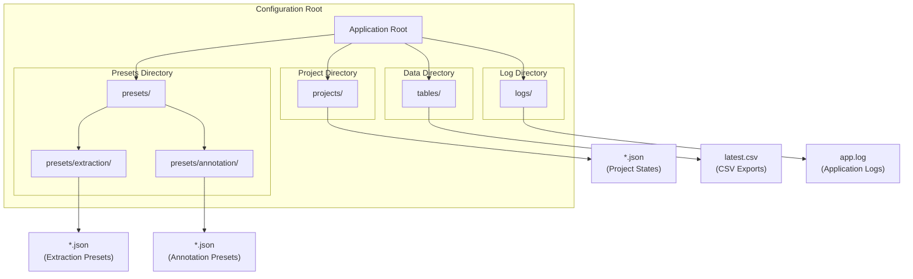
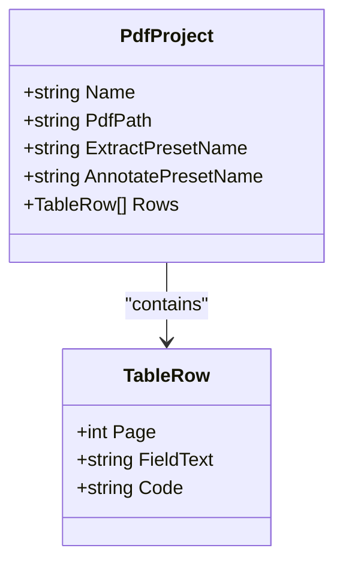
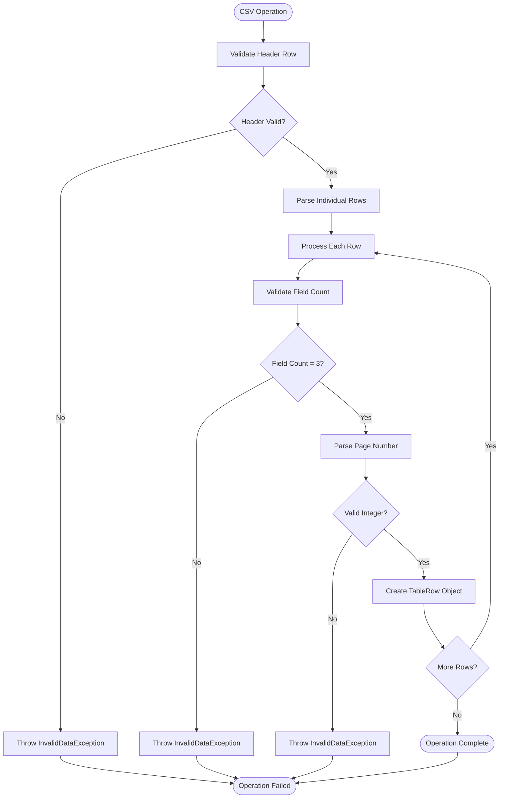
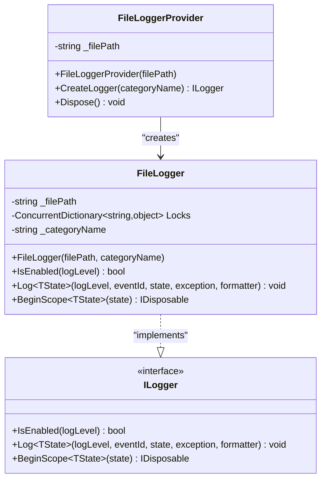
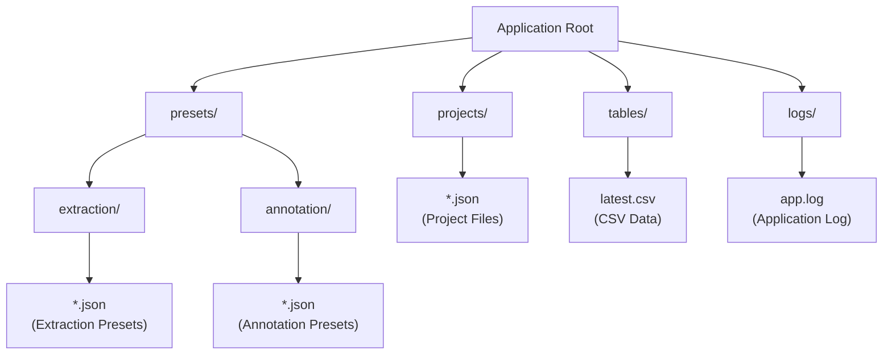

# Configuration and File Structure

<cite>
**Referenced Files in This Document**
- [Example.json (extraction)](file://presets/extraction/Example.json)
- [Example.json (annotation)](file://presets/annotation/Example.json)
- [SampleProject.json](file://projects/SampleProject.json)
- [FileLogger.cs](file://src/PdfAnnotator.App/Logging/FileLogger.cs)
- [FileLoggerProvider.cs](file://src/PdfAnnotator.App/Logging/FileLoggerProvider.cs)
- [AnnotationPreset.cs](file://src/PdfAnnotator.Core/Models/AnnotationPreset.cs)
- [ExtractionPreset.cs](file://src/PdfAnnotator.Core/Models/ExtractionPreset.cs)
- [PdfProject.cs](file://src/PdfAnnotator.Core/Models/PdfProject.cs)
- [TableRow.cs](file://src/PdfAnnotator.Core/Models/TableRow.cs)
- [CsvService.cs](file://src/PdfAnnotator.Core\Services/CsvService.cs)
- [PresetService.cs](file://src/PdfAnnotator.Core\Services/PresetService.cs)
- [ProjectService.cs](file://src/PdfAnnotator.Core\Services/ProjectService.cs)
- [AppBootstrapper.cs](file://src/PdfAnnotator.App/Services/AppBootstrapper.cs)
- [README.md](file://README.md)
</cite>

## Table of Contents
1. [Introduction](#introduction)
2. [Directory Structure Overview](#directory-structure-overview)
3. [Preset Configuration Files](#preset-configuration-files)
4. [Project State Management](#project-state-management)
5. [CSV Export and Import](#csv-export-and-import)
6. [Application Logging System](#application-logging-system)
7. [File Path Management](#file-path-management)
8. [Troubleshooting File Access Issues](#troubleshooting-file-access-issues)
9. [Customization Guidelines](#customization-guidelines)
10. [Best Practices](#best-practices)

## Introduction

The PDF Annotator application utilizes a structured file-based configuration system that organizes user data, project states, and application logs in dedicated directories. This configuration system enables persistent storage of extraction and annotation presets, maintains project state across sessions, facilitates CSV data export/import operations, and provides comprehensive logging capabilities for debugging and monitoring.

The application follows a modular architecture where configuration files serve as the primary persistence mechanism, complemented by a robust logging infrastructure that integrates seamlessly with Microsoft's logging abstractions.

## Directory Structure Overview

The application maintains four primary directory categories, each serving specific functional purposes:



**Diagram sources**
- [Example.json (extraction)](file://presets/extraction/Example.json)
- [Example.json (annotation)](file://src/PdfAnnotator.Core/Models/AnnotationPreset.cs)
- [SampleProject.json](file://projects/SampleProject.json)
- [CsvService.cs](file://src/PdfAnnotator.Core\Services/CsvService.cs)
- [FileLogger.cs](file://src/PdfAnnotator.App/Logging/FileLogger.cs)

**Section sources**
- [README.md](file://README.md#L32-L36)

## Preset Configuration Files

### Extraction Presets

Extraction presets define rectangular regions within PDF documents for text extraction operations. These presets are stored as JSON files in the `presets/extraction/` directory.

#### JSON Structure Analysis

The extraction preset JSON structure contains five essential coordinate fields:

| Field | Type | Description | Purpose |
|-------|------|-------------|---------|
| `name` | string | Unique preset identifier | Used for preset selection and file naming |
| `x0` | double | Left boundary coordinate | Starting X position for extraction rectangle |
| `y0` | double | Top boundary coordinate | Starting Y position for extraction rectangle |
| `x1` | double | Right boundary coordinate | Ending X position for extraction rectangle |
| `y1` | double | Bottom boundary coordinate | Ending Y position for extraction rectangle |

#### Example Configuration

The `Example.json` file demonstrates a typical extraction preset configuration:

```json
{
  "name": "ExampleExtract",
  "x0": 100,
  "y0": 100,
  "x1": 300,
  "y1": 200
}
```

**Key Implementation Details:**
- Coordinates represent pixel positions in the PDF rendering context
- Preset names must be unique within the extraction directory
- The JSON serialization process preserves field order and indentation for readability
- Validation occurs during deserialization to ensure coordinate bounds are logical

**Section sources**
- [Example.json (extraction)](file://presets/extraction/Example.json#L1-L8)
- [ExtractionPreset.cs](file://src/PdfAnnotator.Core/Models/ExtractionPreset.cs#L1-L11)
- [PresetService.cs](file://src/PdfAnnotator.Core\Services/PresetService.cs#L16-L21)

### Annotation Presets

Annotation presets configure text placement and formatting parameters for PDF annotation operations. These presets are stored as JSON files in the `presets/annotation/` directory.

#### JSON Structure Analysis

The annotation preset JSON structure defines comprehensive text formatting and positioning parameters:

| Field | Type | Default Value | Description |
|-------|------|---------------|-------------|
| `name` | string | - | Unique preset identifier |
| `textX` | double | - | Horizontal position for text placement |
| `textY` | double | - | Vertical position for text placement |
| `fontSize` | double | - | Text font size in points |
| `angle` | double | 0 | Rotation angle in degrees |
| `color` | string | "#000000" | Hexadecimal color code |
| `fontName` | string | "Helvetica" | Font family name |

#### Example Configuration

The `Example.json` file demonstrates a typical annotation preset configuration:

```json
{
  "name": "ExampleAnnot",
  "textX": 120,
  "textY": 150,
  "fontSize": 12,
  "angle": 0,
  "color": "#000000",
  "fontName": "Helvetica"
}
```

**Key Implementation Details:**
- Text coordinates specify baseline position for text rendering
- Color values follow standard hexadecimal RGB format
- Font names correspond to available system fonts
- Angle values support arbitrary rotation for text orientation
- Default values ensure backward compatibility with older presets

**Section sources**
- [Example.json (annotation)](file://src/PdfAnnotator.Core/Models/AnnotationPreset.cs#L1-L13)
- [PresetService.cs](file://src/PdfAnnotator.Core\Services/PresetService.cs#L23-L28)

## Project State Management

### Project File Format

Project files encapsulate complete application state including PDF document references, preset associations, and extracted table data. These files are stored in the `projects/` directory with `.json` extensions.

#### JSON Structure Analysis

The project JSON structure combines document metadata, preset references, and tabular data:



**Diagram sources**
- [PdfProject.cs](file://src/PdfAnnotator.Core/Models/PdfProject.cs#L1-L13)
- [TableRow.cs](file://src/PdfAnnotator.Core/Models/TableRow.cs#L1-L9)

#### Complete Project Schema

| Property | Type | Description | Validation Rules |
|----------|------|-------------|------------------|
| `name` | string | Human-readable project identifier | Required, non-empty |
| `pdfPath` | string | Relative path to PDF document | Must exist, relative to application root |
| `extractPresetName` | string | Associated extraction preset | Optional, must reference existing preset |
| `annotatePresetName` | string | Associated annotation preset | Optional, must reference existing preset |
| `table` | Array | Tabular data collection | Optional, empty array permitted |

#### Example Project Configuration

The `SampleProject.json` demonstrates a complete project state:

```json
{
  "name": "Sample Project",
  "pdfPath": "samples/sample.pdf",
  "extractPresetName": "ExampleExtract",
  "annotatePresetName": "ExampleAnnot",
  "table": [
    { "page": 1, "field_text": "Sample text page 1", "code": "" },
    { "page": 2, "field_text": "Sample text page 2", "code": "ABC123" }
  ]
}
```

**Key Implementation Details:**
- Project names serve as unique identifiers for file naming
- PDF paths are relative to the application root directory
- Table rows maintain page ordering and preserve extraction context
- Empty code fields indicate unprocessed table entries
- Serialization includes indentation for human readability

**Section sources**
- [SampleProject.json](file://projects/SampleProject.json#L1-L11)
- [PdfProject.cs](file://src/PdfAnnotator.Core/Models/PdfProject.cs#L1-L13)
- [ProjectService.cs](file://src/PdfAnnotator.Core\Services/ProjectService.cs#L13-L42)

## CSV Export and Import

### CSV File Structure

The application generates CSV files for tabular data export and import operations. These files are stored in the `tables/` directory with the filename `latest.csv`.

#### Header Definition and Format

The CSV format employs semicolon-separated values with UTF-8 encoding:

| Column Index | Header | Data Type | Description |
|--------------|--------|-----------|-------------|
| 0 | `page` | integer | PDF page number (1-based) |
| 1 | `field_text` | string | Extracted text content |
| 2 | `code` | string | User-defined code or identifier |

#### CSV Processing Implementation

The `CsvService` handles bidirectional CSV operations with sophisticated parsing and validation:



**Diagram sources**
- [CsvService.cs](file://src/PdfAnnotator.Core\Services/CsvService.cs#L32-L74)

#### Advanced CSV Features

The CSV service implements several sophisticated features:

- **Quoting Support**: Handles embedded semicolons and quotation marks within field text
- **Encoding Support**: Uses UTF-8 encoding for international character support
- **Error Recovery**: Continues processing after encountering malformed rows
- **Validation Pipeline**: Comprehensive validation at multiple processing stages

**Section sources**
- [CsvService.cs](file://src/PdfAnnotator.Core\Services/CsvService.cs#L1-L97)

## Application Logging System

### Logging Architecture

The application implements a custom logging provider that writes to file using Microsoft.Extensions.Logging abstractions. This system provides structured logging with thread-safe file operations.

#### Logger Implementation



**Diagram sources**
- [FileLoggerProvider.cs](file://srcAnnotator.App/Logging/FileLoggerProvider.cs#L1-L23)
- [FileLogger.cs](file://src/PdfAnnotator.App/Logging/FileLogger.cs#L1-L45)

#### Logging Configuration

The logging system is configured through the `AppBootstrapper` class:

| Configuration Aspect | Value | Purpose |
|---------------------|-------|---------|
| Log Level | `LogLevel.Information` | Minimum level for log output |
| Provider | `FileLoggerProvider` | Custom file-based logger |
| Log File | `logs/app.log` | Target log destination |
| Thread Safety | `ConcurrentDictionary` | Ensures safe concurrent access |
| Category Support | Yes | Enables namespace-based filtering |

#### Log Message Format

Log messages follow a standardized format:
```
[timestamp] [LogLevel] CategoryName: Message
[Exception Details (if present)]
```

**Timestamp Format**: ISO 8601 UTC format (`yyyy-MM-ddTHH:mm:ssZ`)
**Log Levels**: Information, Warning, Error, Critical (None excluded)

#### Thread-Safe Operations

The logging system ensures thread safety through several mechanisms:

- **Lock Dictionary**: Separate locks per file path prevent contention
- **Directory Creation**: Automatic directory creation prevents race conditions
- **Atomic Writes**: Single-file-append operations maintain log integrity

**Section sources**
- [FileLogger.cs](file://src/PdfAnnotator.App/Logging/FileLogger.cs#L1-L45)
- [FileLoggerProvider.cs](file://src/PdfAnnotator.App/Logging/FileLoggerProvider.cs#L1-L23)
- [AppBootstrapper.cs](file://src/PdfAnnotator.App/Services/AppBootstrapper.cs#L16-L21)

## File Path Management

### Default Directory Structure

The application establishes a hierarchical directory structure with automatic creation and management:



**Diagram sources**
- [PresetService.cs](file://src/PdfAnnotator.Core\Services/PresetService.cs#L8-L9)
- [CsvService.cs](file://src/PdfAnnotator.Core\Services/CsvService.cs#L1-L10)
- [AppBootstrapper.cs](file://src/PdfAnnotator.App/Services/AppBootstrapper.cs#L16-L21)

### Path Resolution Strategy

The application employs relative path resolution with automatic directory creation:

| Operation Type | Path Strategy | Directory Creation | Error Handling |
|---------------|---------------|-------------------|----------------|
| Preset Saving | Relative to application root | Automatic | Silent creation |
| Project Loading | Absolute path validation | Manual | FileNotFoundException |
| CSV Operations | Relative to application root | Automatic | InvalidDataException |
| Log Writing | Fixed relative path | Conditional | Graceful degradation |

### Custom Path Configuration

While the application uses default paths, customization is possible through:

- **Environment Variables**: Application startup could support configurable base directories
- **Configuration Files**: Future enhancements could allow user-specified paths
- **Command Line Arguments**: Runtime path overrides for testing scenarios

**Section sources**
- [PresetService.cs](file://src/PdfAnnotator.Core\Services/PresetService.cs#L18-L20)
- [ProjectService.cs](file://src/PdfAnnotator.Core\Services/ProjectService.cs#L15-L19)
- [CsvService.cs](file://src/PdfAnnotator.Core\Services/CsvService.cs#L13-L29)

## Troubleshooting File Access Issues

### Common File Access Problems

#### Permission Issues

**Symptoms**: Access denied errors during file operations
**Causes**: Insufficient file system permissions or locked files
**Solutions**:
- Verify application has write permissions to target directories
- Close other applications that might be locking files
- Run application with appropriate user privileges

#### Path Resolution Errors

**Symptoms**: File not found exceptions despite existing files
**Causes**: Incorrect relative path resolution or missing parent directories
**Solutions**:
- Verify current working directory matches expectations
- Check for typos in file or directory names
- Ensure parent directories exist before file operations

#### Encoding Problems

**Symptoms**: Garbled text in CSV files or JSON parsing failures
**Causes**: Incorrect character encoding detection
**Solutions**:
- Verify UTF-8 encoding for all text files
- Check for BOM markers in CSV files
- Validate JSON syntax using external validators

### Diagnostic Procedures

#### Log Analysis

Enable debug logging to diagnose file access issues:

```csharp
// Enable verbose logging for troubleshooting
builder.SetMinimumLevel(LogLevel.Debug);
```

#### File System Verification

Verify directory structure and permissions:

```bash
# Check directory existence
ls -la presets/
ls -la projects/
ls -la tables/
ls -la logs/

# Verify write permissions
touch logs/test.log && rm logs/test.log
```

#### Configuration Validation

Validate JSON file syntax and structure:

```bash
# Validate JSON syntax
python -m json.tool presets/extraction/Example.json
python -m json.tool projects/SampleProject.json
```

**Section sources**
- [FileLogger.cs](file://src/PdfAnnotator.App/Logging/FileLogger.cs#L40-L42)
- [CsvService.cs](file://src/PdfAnnotator.Core\Services/CsvService.cs#L34-L37)
- [ProjectService.cs](file://src/PdfAnnotator.Core\Services/ProjectService.cs#L27-L29)

## Customization Guidelines

### Preset Customization

#### Creating New Extraction Presets

1. **Define Coordinate Boundaries**: Use the extraction interface to select rectangular regions
2. **Save with Descriptive Names**: Choose meaningful preset names for easy identification
3. **Test Across Documents**: Verify presets work consistently across similar document types
4. **Organize by Purpose**: Group related presets for efficient management

#### Configuring Annotation Presets

1. **Position Calculation**: Determine optimal text placement relative to document layout
2. **Font Selection**: Choose fonts compatible with PDF rendering capabilities
3. **Color Contrast**: Select colors that provide good visibility against document backgrounds
4. **Angle Adjustments**: Use rotation for text alignment with document elements

### Project Customization

#### Project Naming Conventions

- Use descriptive names that reflect document content or project purpose
- Include version information for iterative development
- Maintain consistent naming patterns across related projects

#### Data Organization

- Regularly backup project files to prevent data loss
- Archive completed projects to separate storage locations
- Document project-specific requirements and constraints

### Logging Customization

#### Log Level Configuration

Adjust logging verbosity based on operational needs:

```csharp
// Development: Verbose logging
builder.SetMinimumLevel(LogLevel.Debug);

// Production: Informational logging
builder.SetMinimumLevel(LogLevel.Information);

// Monitoring: Error-only logging
builder.SetMinimumLevel(LogLevel.Error);
```

#### Log File Management

- Implement log rotation for long-running applications
- Monitor log file sizes to prevent disk space issues
- Archive old logs periodically for historical analysis

**Section sources**
- [AppBootstrapper.cs](file://src/PdfAnnotator.App/Services/AppBootstrapper.cs#L20-L21)
- [FileLogger.cs](file://src/PdfAnnotator.App/Logging/FileLogger.cs#L21-L23)

## Best Practices

### File Organization Principles

1. **Consistent Naming**: Use descriptive, consistent naming conventions across all file types
2. **Hierarchical Structure**: Maintain clear directory separation for different file types
3. **Backup Strategy**: Implement regular backups of configuration and project files
4. **Documentation**: Document custom configurations and their purposes

### Security Considerations

1. **Access Control**: Restrict file system access to authorized users only
2. **Data Validation**: Validate all input data before processing
3. **Error Handling**: Implement graceful error handling for file system operations
4. **Resource Cleanup**: Ensure proper resource disposal for file handles

### Performance Optimization

1. **Lazy Loading**: Load configuration files only when needed
2. **Caching Strategies**: Cache frequently accessed configuration data
3. **Asynchronous Operations**: Use async file operations for better responsiveness
4. **Memory Management**: Minimize memory footprint during file processing

### Maintenance Procedures

1. **Regular Audits**: Periodically review file system usage and organization
2. **Cleanup Tasks**: Remove obsolete files and orphaned configurations
3. **Version Control**: Track changes to configuration files for rollback capability
4. **Testing Protocols**: Validate file operations across different environments

**Section sources**
- [PresetService.cs](file://src/PdfAnnotator.Core\Services/PresetService.cs#L61-L80)
- [CsvService.cs](file://src/PdfAnnotator.Core\Services/CsvService.cs#L32-L74)
- [ProjectService.cs](file://src/PdfAnnotator.Core\Services/ProjectService.cs#L25-L42)