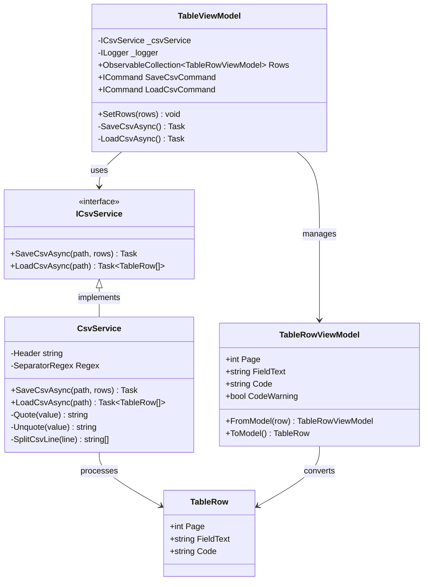
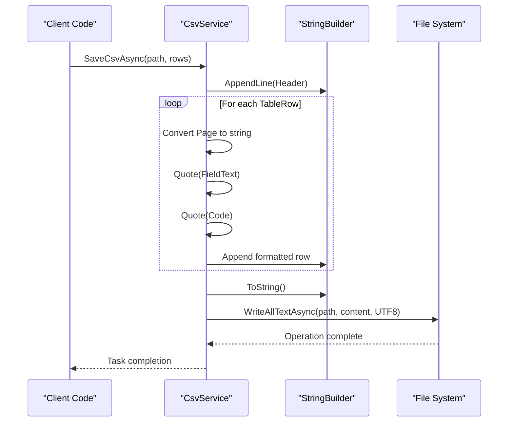
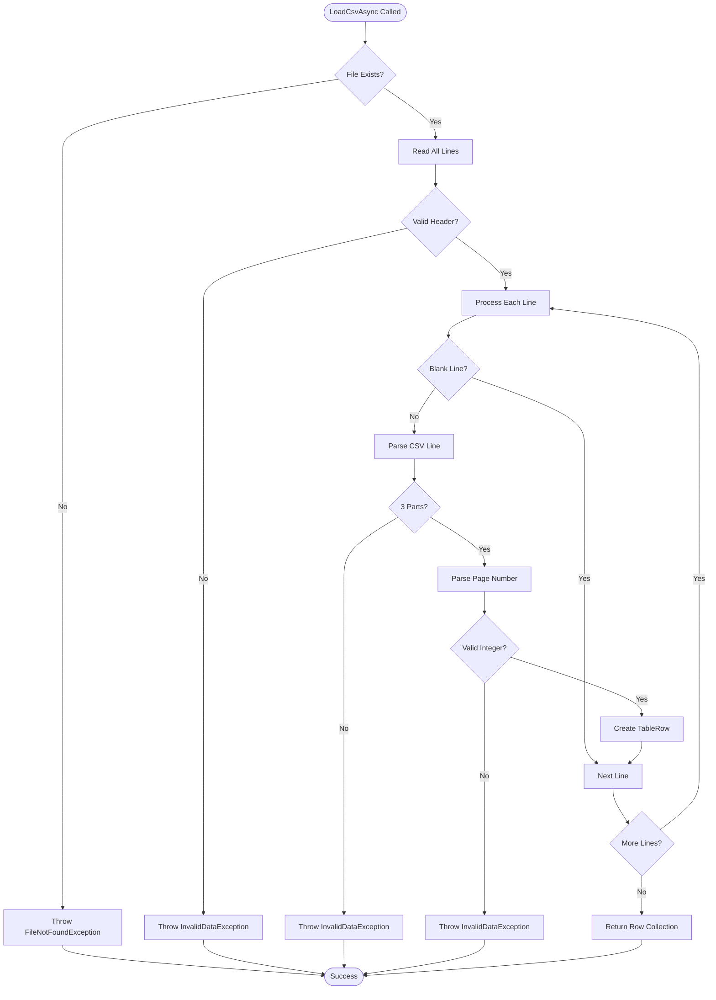
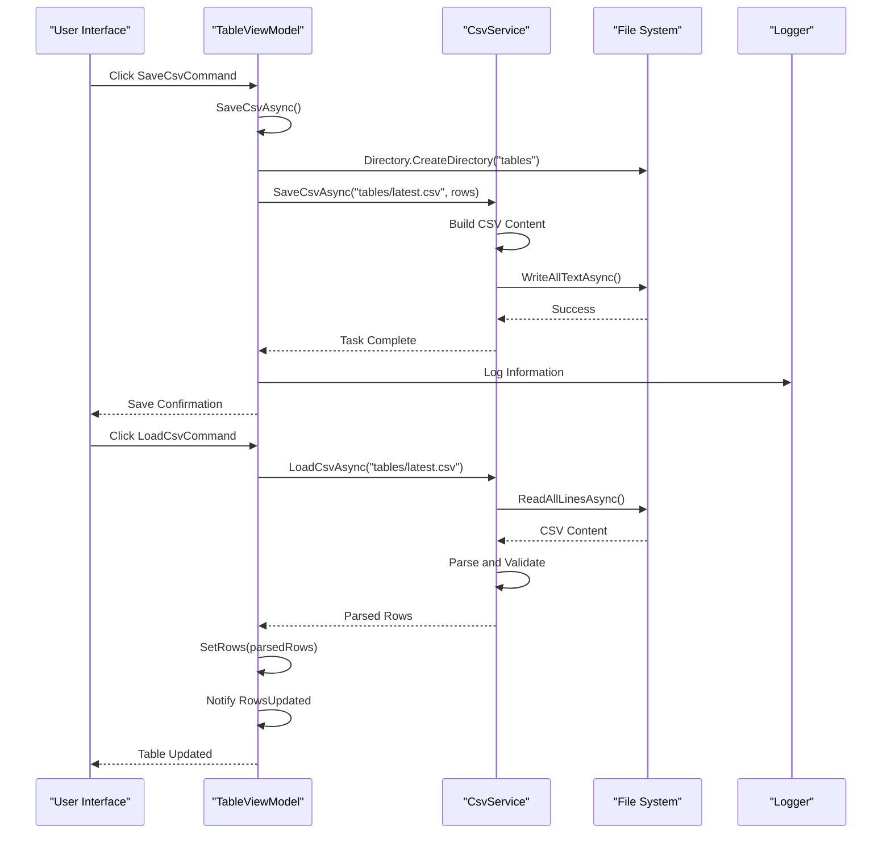

# CSV Service

<cite>
**Referenced Files in This Document**
- [ICsvService.cs](file://src/PdfAnnotator.Core/Services/ICsvService.cs)
- [CsvService.cs](file://src\PdfAnnotator.Core\Services\CsvService.cs)
- [TableRow.cs](file://src\PdfAnnotator.Core\Models\TableRow.cs)
- [TableViewModel.cs](file://src\PdfAnnotator.ViewModels\TableViewModel.cs)
- [TableRowViewModel.cs](file://src\PdfAnnotator.ViewModels\TableRowViewModel.cs)
- [CsvServiceTests.cs](file://tests\PdfAnnotator.Tests\CsvServiceTests.cs)
- [MainWindowViewModel.cs](file://src\PdfAnnotator.App\ViewModels\MainWindowViewModel.cs)
</cite>

## Table of Contents
1. [Introduction](#introduction)
2. [Service Architecture](#service-architecture)
3. [Core Components](#core-components)
4. [CSV Format Specification](#csv-format-specification)
5. [Export Implementation](#export-implementation)
6. [Import Implementation](#import-implementation)
7. [Integration with ViewModels](#integration-with-viewmodels)
8. [Error Handling](#error-handling)
9. [Performance Considerations](#performance-considerations)
10. [Testing and Validation](#testing-and-validation)
11. [Extension Guidelines](#extension-guidelines)
12. [Troubleshooting Guide](#troubleshooting-guide)

## Introduction

The CSV Service is a specialized data persistence component within the PDF Annotator application that handles the import and export of extracted table data to CSV format. This service serves as a bridge between the application's data models and external CSV files, enabling users to save and load table data for further processing or archival purposes.

The service operates with a standardized CSV format using semicolon-separated values with specific column headers: 'page', 'field_text', and 'code'. It provides robust error handling, data validation, and maintains compatibility with the application's MVVM architecture while supporting both synchronous and asynchronous operations.

## Service Architecture

The CSV Service follows a clean architecture pattern with clear separation of concerns between interface definition and implementation. The service integrates seamlessly with the application's dependency injection container and provides thread-safe operations for concurrent access scenarios.

**Diagram sources**
- [ICsvService.cs](file://src\PdfAnnotator.Core\Services\ICsvService.cs#L7-L11)
- [CsvService.cs](file://src\PdfAnnotator.Core\Services\CsvService.cs#L8-L96)
- [TableRow.cs](file://src\PdfAnnotator.Core\Models\TableRow.cs#L3-L8)
- [TableViewModel.cs](file://src\PdfAnnotator.ViewModels\TableViewModel.cs#L17-L70)
- [TableRowViewModel.cs](file://src\PdfAnnotator.ViewModels\TableRowViewModel.cs#L7-L46)

**Section sources**
- [ICsvService.cs](file://src\PdfAnnotator.Core\Services\ICsvService.cs#L1-L12)
- [CsvService.cs](file://src\PdfAnnotator.Core\Services\CsvService.cs#L1-L97)

## Core Components

### ICsvService Interface

The ICsvService interface defines the contract for CSV operations within the application. It provides two primary methods for data persistence:

- **SaveCsvAsync**: Asynchronously saves a collection of TableRow objects to a specified file path
- **LoadCsvAsync**: Asynchronously loads TableRow objects from a specified CSV file

Both methods operate asynchronously to prevent blocking the UI thread during file operations, supporting large datasets and network storage scenarios.

### CsvService Implementation

The CsvService class provides the concrete implementation of the ICsvService interface. Key implementation details include:

- **Header Definition**: Uses a constant header string "page;field_text;code" for CSV format specification
- **Advanced Parsing**: Implements a sophisticated regex-based parser that handles quoted values containing separators
- **Data Validation**: Performs comprehensive validation of CSV structure and data types
- **Encoding Support**: Utilizes UTF-8 encoding for cross-platform compatibility
- **Memory Efficiency**: Employs StringBuilder for efficient string concatenation during export operations

**Section sources**
- [ICsvService.cs](file://src\PdfAnnotator.Core\Services\ICsvService.cs#L7-L11)
- [CsvService.cs](file://src\PdfAnnotator.Core\Services\CsvService.cs#L8-L96)

## CSV Format Specification

The CSV Service operates with a standardized format that ensures consistency and reliability across different usage scenarios. The format specification includes:

### Header Structure
The CSV files begin with a mandatory header row containing exactly three semicolon-separated columns:
- **page**: Integer value representing the PDF page number
- **field_text**: Text content extracted from the PDF, potentially containing special characters
- **code**: Identifier code associated with the field, may be empty

### Value Formatting
- **Delimiter**: Uses semicolon (;) as the field separator to avoid conflicts with commas commonly used in text content
- **Quoting**: Text values containing semicolons or quotes are automatically quoted and escaped
- **Empty Values**: Empty strings are preserved as-is without special encoding

### Data Type Constraints
- **Page Field**: Must be parseable as an integer using invariant culture formatting
- **Text Field**: Can contain any Unicode character except for the delimiter itself
- **Code Field**: Supports empty values and any Unicode character sequence

**Section sources**
- [CsvService.cs](file://src\PdfAnnotator.Core\Services\CsvService.cs#L10-L11)
- [TableRow.cs](file://src\PdfAnnotator.Core\Models\TableRow.cs#L5-L8)

## Export Implementation

The export functionality is implemented through the SaveCsvAsync method, which transforms in-memory TableRow objects into a structured CSV format. The implementation follows a multi-stage process:

### Data Preparation
The method begins by creating a StringBuilder instance and appending the predefined header row. Each TableRow object is processed individually, converting its properties to string representations while maintaining data integrity.

### String Building Process
For each TableRow, the service performs the following operations:
1. **Page Conversion**: Converts the Page integer to string using invariant culture formatting
2. **Text Quoting**: Wraps FieldText in double quotes and escapes any embedded quotes
3. **Code Quoting**: Applies the same quoting mechanism to the Code field
4. **Line Termination**: Adds appropriate line endings for the target platform

### File Writing
The StringBuilder content is converted to a complete string and written to the specified file path using UTF-8 encoding. The operation is performed asynchronously to prevent UI blocking and support large datasets.

### Directory Creation
The implementation automatically creates the parent directory structure if it doesn't exist, ensuring reliable file placement regardless of the specified path structure.

**Diagram sources**
- [CsvService.cs](file://src\PdfAnnotator.Core\Services\CsvService.cs#L13-L29)

**Section sources**
- [CsvService.cs](file://src\PdfAnnotator.Core\Services\CsvService.cs#L13-L29)

## Import Implementation

The import functionality handles CSV file loading with comprehensive validation and error detection. The LoadCsvAsync method implements a robust parsing pipeline:

### File Validation
The method first verifies file existence and then reads all lines using UTF-8 encoding. It performs immediate validation of the header row against the expected format.

### Line Processing Pipeline
Each subsequent line undergoes a multi-stage validation process:
1. **Blank Line Detection**: Skips empty or whitespace-only lines
2. **Format Validation**: Uses the sophisticated separator regex to split the line into exactly three parts
3. **Type Conversion**: Attempts to parse the page number as an integer
4. **Value Extraction**: Removes quotes and escapes from text fields

### Error Handling Strategy
The implementation provides detailed error messages indicating the specific nature of validation failures, including line numbers and problematic content for debugging purposes.

### Data Reconstruction
Successfully validated lines are converted into TableRow objects with proper property assignment, maintaining the original data integrity throughout the process.

**Diagram sources**
- [CsvService.cs](file://src\PdfAnnotator.Core\Services\CsvService.cs#L32-L73)

**Section sources**
- [CsvService.cs](file://src\PdfAnnotator.Core\Services\CsvService.cs#L32-L73)

## Integration with ViewModels

The CSV Service integrates seamlessly with the application's MVVM architecture through the TableViewModel, which serves as the primary interface for user interactions. This integration demonstrates several key architectural patterns:

### Command Pattern Implementation
The TableViewModel exposes two primary commands for CSV operations:
- **SaveCsvCommand**: Triggers CSV export with automatic directory creation
- **LoadCsvCommand**: Initiates CSV import and updates the table display

### Data Binding Integration
The service works with TableRowViewModel instances, which provide the bridge between the domain TableRow objects and the UI layer. This separation enables:
- Property change notifications for real-time UI updates
- Data validation and formatting at the presentation level
- Clean separation between business logic and user interface concerns

### Event-Driven Architecture
The TableViewModel implements an event-driven pattern for data synchronization:
- **RowsUpdated Event**: Fired when table data changes, enabling downstream synchronization
- **Property Change Notifications**: Triggered by TableRowViewModel modifications
- **Automatic Synchronization**: Maintains consistency across different application modes

### Default Path Management
The service uses a standardized path "tables/latest.csv" for convenience, with automatic directory creation to ensure reliable file placement regardless of the application's working directory.

**Diagram sources**
- [TableViewModel.cs](file://src\PdfAnnotator.ViewModels\TableViewModel.cs#L51-L64)
- [MainWindowViewModel.cs](file://src\PdfAnnotator.App\ViewModels\MainWindowViewModel.cs#L77-L85)

**Section sources**
- [TableViewModel.cs](file://src\PdfAnnotator.ViewModels\TableViewModel.cs#L25-L34)
- [TableViewModel.cs](file://src\PdfAnnotator.ViewModels\TableViewModel.cs#L51-L64)

## Error Handling

The CSV Service implements comprehensive error handling strategies to ensure robust operation under various failure conditions. The error handling approach varies depending on the operation type and potential failure points:

### File System Errors
- **FileNotFoundException**: Thrown when attempting to load non-existent files
- **DirectoryNotFoundException**: Handled implicitly through automatic directory creation
- **UnauthorizedAccessException**: Propagated to allow proper UI feedback for permission issues

### Data Validation Errors
- **InvalidDataException**: Used for malformed CSV structure, incorrect headers, or invalid field counts
- **FormatException**: Thrown when numeric fields cannot be parsed as integers
- **ArgumentNullException**: Ensured through parameter validation in public methods

### Runtime Exception Types
The service consistently uses standard .NET exception types to maintain compatibility with the broader ecosystem and enable predictable error handling patterns.

### Error Recovery Strategies
While the service generally fails fast on errors, it provides detailed error messages that help users understand and resolve issues. For example, header validation clearly specifies the expected format, and line parsing errors include the problematic line content.

### Logging Integration
The service integrates with the application's logging infrastructure, providing contextual information about operation failures and successful completions.

**Section sources**
- [CsvService.cs](file://src\PdfAnnotator.Core\Services\CsvService.cs#L34-L42)
- [CsvService.cs](file://src\PdfAnnotator.Core\Services\CsvService.cs#L54-L57)

## Performance Considerations

The CSV Service is designed to handle datasets of varying sizes efficiently while maintaining responsive user experience. Several performance optimization strategies are employed:

### Memory Management
- **StringBuilder Usage**: Minimizes memory allocations during CSV construction
- **Streaming Operations**: Both import and export use streaming approaches to handle large files
- **String Interning**: Leverages .NET's string interning for repeated header values

### I/O Optimization
- **UTF-8 Encoding**: Uses efficient UTF-8 encoding for cross-platform compatibility
- **Asynchronous Operations**: All file operations are asynchronous to prevent UI blocking
- **Buffered Reading**: File system operations use buffered I/O for optimal performance

### Parsing Efficiency
- **Compiled Regex**: The separator regex is compiled once and reused for all parsing operations
- **Single-Pass Validation**: Each CSV line is processed in a single pass with early termination
- **Culture-Invariant Parsing**: Uses invariant culture for consistent performance across locales

### Large Dataset Handling
For applications dealing with large datasets, the service provides several considerations:
- **Streaming Architecture**: Processes files line-by-line rather than loading entire contents
- **Memory Pressure**: Minimal memory footprint suitable for systems with limited resources
- **Progress Reporting**: Asynchronous operations enable progress indication for long-running tasks

### Concurrent Access
The service is designed for safe concurrent access, though individual operations are not thread-safe. Applications should coordinate access to shared CSV files when multiple threads or processes may modify the same file.

## Testing and Validation

The CSV Service includes comprehensive unit tests that validate both functional correctness and edge case handling. The test suite demonstrates several testing patterns:

### Round-Trip Testing
The primary test validates the complete round-trip process: export followed by import produces identical data. This ensures format compatibility and data integrity preservation.

### Test Data Management
Tests use temporary files to avoid polluting the development environment while maintaining isolation between test runs.

### Edge Case Coverage
The test suite covers various edge cases including:
- Empty collections
- Missing or empty code fields
- Special characters in text content
- Malformed CSV structures

### Validation Patterns
Tests verify both positive outcomes (successful operations) and negative outcomes (expected exceptions), ensuring comprehensive coverage of the service's behavior.

**Section sources**
- [CsvServiceTests.cs](file://tests\PdfAnnotator.Tests\CsvServiceTests.cs#L8-L26)

## Extension Guidelines

The CSV Service architecture supports extension for custom CSV formats and additional field types. Several extension points are available:

### Custom CSV Formats
To extend the service for additional fields or different delimiters:

1. **Header Modification**: Update the Header constant with new column names
2. **Parser Enhancement**: Extend the SplitCsvLine method to handle new delimiter patterns
3. **Model Expansion**: Add new properties to the TableRow class
4. **Validation Rules**: Implement custom validation logic for new field types

### Alternative Delimiters
The service's regex-based parsing allows easy modification of delimiter characters by updating the SeparatorRegex pattern.

### Custom Serialization
For specialized serialization requirements, consider:
- Implementing custom converters for complex data types
- Adding preprocessing/postprocessing steps for data transformation
- Supporting multiple output formats through factory patterns

### Performance Extensions
Performance enhancements can be achieved through:
- Caching frequently accessed CSV files
- Implementing lazy loading for large datasets
- Adding compression support for archived CSV files

### Integration Extensions
The service can be extended for:
- Cloud storage integration
- Real-time synchronization capabilities
- Version control system integration
- Audit trail functionality

## Troubleshooting Guide

Common issues and their solutions when working with the CSV Service:

### File Access Issues
**Problem**: FileNotFoundException or UnauthorizedAccessException
**Solution**: Verify file permissions and ensure the application has write access to the target directory. Check that the directory structure exists or can be created automatically.

### Data Corruption
**Problem**: InvalidDataException during import
**Solution**: Verify the CSV file format matches the expected structure. Check for corrupted characters or missing fields. Use a text editor to inspect the file content.

### Encoding Problems
**Problem**: Garbled text in exported CSV files
**Solution**: Ensure the application uses UTF-8 encoding consistently. Verify that the target application can interpret UTF-8 encoded CSV files correctly.

### Performance Issues
**Problem**: Slow CSV operations with large datasets
**Solution**: Consider breaking large datasets into smaller chunks. Verify that the system has adequate memory and disk I/O capacity. Monitor for memory leaks in long-running applications.

### Integration Problems
**Problem**: Data not synchronizing between modes
**Solution**: Verify that the RowsUpdated events are properly wired and that the event handlers are functioning correctly. Check that the data conversion between TableRow and TableRowViewModel is working as expected.

### Debugging Tips
- Enable detailed logging to track CSV operations
- Use the built-in error messages to identify specific validation failures
- Test with small datasets before scaling to larger files
- Verify file paths and directory structures before deployment

**Section sources**
- [CsvService.cs](file://src\PdfAnnotator.Core\Services\CsvService.cs#L34-L42)
- [CsvService.cs](file://src\PdfAnnotator.Core\Services\CsvService.cs#L54-L57)