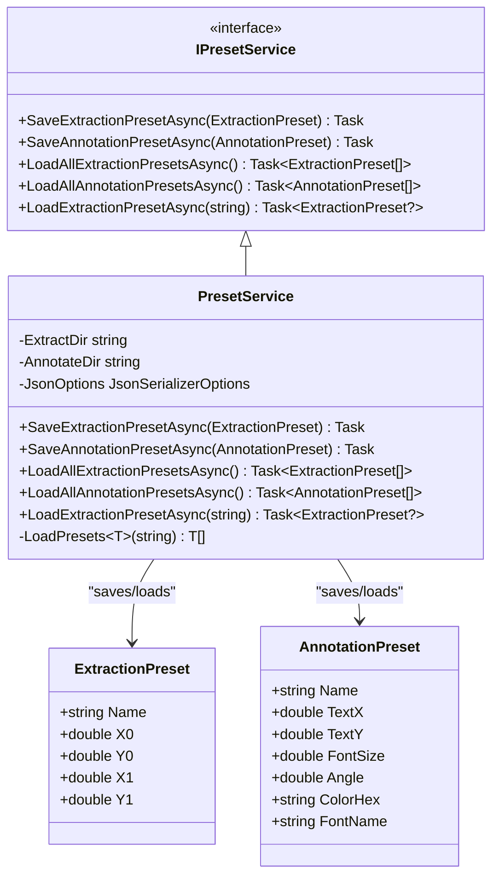
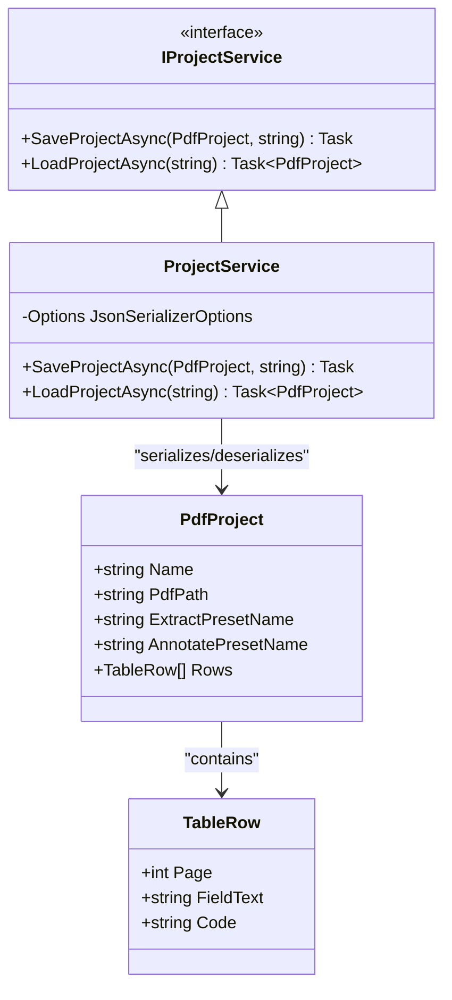
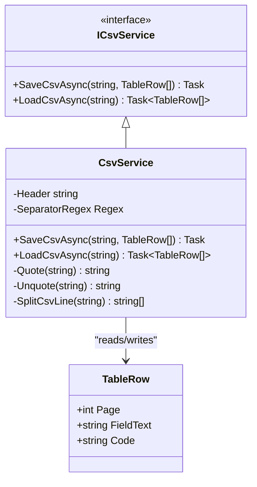

# Core Services

<cite>
**Referenced Files in This Document**  
- [IPdfService.cs](file://src/PdfAnnotator.Core/Services/IPdfService.cs)
- [PdfService.cs](file://src/PdfAnnotator.App/Services/PdfService.cs)
- [IPresetService.cs](file://src/PdfAnnotator.Core/Services/IPresetService.cs)
- [PresetService.cs](file://src/PdfAnnotator.Core/Services/PresetService.cs)
- [IProjectService.cs](file://src/PdfAnnotator.Core/Services/IProjectService.cs)
- [ProjectService.cs](file://src/PdfAnnotator.Core/Services/ProjectService.cs)
- [ICsvService.cs](file://src/PdfAnnotator.Core/Services/ICsvService.cs)
- [CsvService.cs](file://src/PdfAnnotator.Core/Services/CsvService.cs)
- [PdfProject.cs](file://src/PdfAnnotator.Core/Models/PdfProject.cs)
- [ExtractionPreset.cs](file://src/PdfAnnotator.Core/Models/ExtractionPreset.cs)
- [AnnotationPreset.cs](file://src/PdfAnnotator.Core/Models/AnnotationPreset.cs)
- [TableRow.cs](file://src/PdfAnnotator.Core/Models/TableRow.cs)
- [PresetServiceTests.cs](file://tests/PdfAnnotator.Tests/PresetServiceTests.cs)
- [ProjectServiceTests.cs](file://tests/PdfAnnotator.Tests/ProjectServiceTests.cs)
- [CsvServiceTests.cs](file://tests/PdfAnnotator.Tests/CsvServiceTests.cs)
</cite>

## Table of Contents
1. [IPdfService and PdfService](#ipdfservice-and-pdfservice)
2. [IPresetService and PresetService](#ipresetservice-and-presetservice)
3. [IProjectService and ProjectService](#iprojectservice-and-projectservice)
4. [ICsvService and CsvService](#icsvservice-and-csvservice)
5. [Configuration and Usage Patterns](#configuration-and-usage-patterns)
6. [Common Issues and Error Handling](#common-issues-and-error-handling)

## IPdfService and PdfService

The `IPdfService` interface defines core PDF operations including rendering, text extraction, and annotation generation. The implementation `PdfService` uses three key libraries: **Docnet** for rendering, **PdfPig** for text extraction, and **PdfSharpCore** for annotation.

Key methods include:
- `GetPageCountAsync`: Uses PdfPig to retrieve the total number of pages in a PDF
- `RenderPageAsync`: Renders a specific page using Docnet with DPI scaling and includes caching to improve performance
- `ExtractTextAsync`: Extracts text from a defined region using an `ExtractionPreset` to specify coordinates
- `GenerateAnnotatedPdfAsync`: Adds text annotations to a PDF using PdfSharpCore based on `AnnotationPreset` settings

The service includes error handling for missing files, invalid page ranges, and rendering failures, with detailed logging via `ILogger`.

**Section sources**
- [IPdfService.cs](file://src/PdfAnnotator.Core/Services/IPdfService.cs#L8-L14)
- [PdfService.cs](file://src/PdfAnnotator.App/Services/PdfService.cs#L18-L179)

## IPresetService and PresetService

The `IPresetService` interface manages saving and loading of extraction and annotation presets. The `PresetService` implementation stores presets as JSON files in dedicated directories: `presets/extraction/` and `presets/annotation/`.

Key methods:
- `SaveExtractionPresetAsync`: Saves an `ExtractionPreset` to a JSON file named after the preset's `Name` property
- `SaveAnnotationPresetAsync`: Saves an `AnnotationPreset` similarly
- `LoadAllExtractionPresetsAsync` / `LoadAllAnnotationPresetsAsync`: Loads all presets from their respective directories
- `LoadExtractionPresetAsync`: Loads a specific preset by file path with null return for missing files

The service ensures directory creation on save and handles deserialization errors gracefully by returning null instead of throwing exceptions.

**Diagram sources**
- [IPresetService.cs](file://src/PdfAnnotator.Core/Services/IPresetService.cs#L7-L14)
- [PresetService.cs](file://src/PdfAnnotator.Core/Services/PresetService.cs#L6-L82)
- [ExtractionPreset.cs](file://src/PdfAnnotator.Core/Models/ExtractionPreset.cs#L3-L10)
- [AnnotationPreset.cs](file://src/PdfAnnotator.Core/Models/AnnotationPreset.cs#L3-L12)

**Section sources**
- [IPresetService.cs](file://src/PdfAnnotator.Core/Services/IPresetService.cs#L7-L14)
- [PresetService.cs](file://src/PdfAnnotator.Core/Services/PresetService.cs#L6-L82)

## IProjectService and ProjectService

The `IProjectService` interface handles persistence of application state through the `PdfProject` model. The `ProjectService` implementation saves and loads project data to/from JSON files in the `projects/` directory.

The `PdfProject` model contains:
- `Name`: Project name
- `PdfPath`: Path to the source PDF
- `ExtractPresetName` and `AnnotatePresetName`: References to active presets
- `Rows`: List of extracted and annotated data entries

Key methods:
- `SaveProjectAsync`: Serializes the project to JSON with directory creation if needed
- `LoadProjectAsync`: Deserializes a project, throwing `FileNotFoundException` if the file is missing and `InvalidDataException` for parsing errors

The service ensures the `Rows` collection is initialized even if null in the JSON.

**Diagram sources**
- [IProjectService.cs](file://src/PdfAnnotator.Core/Services/IProjectService.cs#L6-L10)
- [ProjectService.cs](file://src/PdfAnnotator.Core/Services/ProjectService.cs#L6-L43)
- [PdfProject.cs](file://src/PdfAnnotator.Core/Models/PdfProject.cs#L5-L12)
- [TableRow.cs](file://src/PdfAnnotator.Core/Models/TableRow.cs#L3-L8)

**Section sources**
- [IProjectService.cs](file://src/PdfAnnotator.Core/Services/IProjectService.cs#L6-L10)
- [ProjectService.cs](file://src/PdfAnnotator.Core/Services/ProjectService.cs#L6-L43)

## ICsvService and CsvService

The `ICsvService` interface defines CSV import/export functionality. The `CsvService` implementation handles data in a semicolon-delimited format with UTF-8 encoding and proper quoting.

CSV format:
- Header: `page;field_text;code`
- Fields are quoted if they contain semicolons or quotes
- Double quotes within fields are escaped as `""`

Key methods:
- `SaveCsvAsync`: Writes rows to CSV with proper quoting and UTF-8 encoding
- `LoadCsvAsync`: Reads CSV with strict header validation and parsing error handling

The service uses a compiled regex to correctly split CSV lines respecting quoted fields and throws `FileNotFoundException` for missing files and `InvalidDataException` for format errors.

**Diagram sources**
- [ICsvService.cs](file://src/PdfAnnotator.Core/Services/ICsvService.cs#L7-L11)
- [CsvService.cs](file://src/PdfAnnotator.Core/Services/CsvService.cs#L8-L97)
- [TableRow.cs](file://src/PdfAnnotator.Core/Models/TableRow.cs#L3-L8)

**Section sources**
- [ICsvService.cs](file://src/PdfAnnotator.Core/Services/ICsvService.cs#L7-L11)
- [CsvService.cs](file://src/PdfAnnotator.Core/Services/CsvService.cs#L8-L97)

## Configuration and Usage Patterns

The core services follow a consistent pattern of interface-based design with JSON persistence. Key configuration points include:
- Presets are stored in `presets/extraction/` and `presets/annotation/` directories
- Projects are saved to `projects/*.json`
- CSV exports use `tables/latest.csv` as the default path
- All JSON operations use indented formatting for readability

Services are designed for dependency injection, with `PdfService` requiring `ILogger` and others being stateless. The architecture enables state synchronization across components by sharing the same `PdfProject` instance.

## Common Issues and Error Handling

The services implement robust error handling for common scenarios:
- **File not found**: `ProjectService.LoadProjectAsync` and `CsvService.LoadCsvAsync` throw `FileNotFoundException`
- **Deserialization errors**: `ProjectService` throws `InvalidDataException` for invalid JSON; `PresetService` returns null for invalid preset files
- **Invalid format**: `CsvService` validates headers and field counts, throwing `InvalidDataException` for malformed CSV
- **PDF errors**: `PdfService` checks file existence and page ranges, throwing `ArgumentOutOfRangeException` or `InvalidOperationException` with detailed context

All file operations include proper directory creation, and text extraction/annotation methods include bounds checking to prevent out-of-range access.

**Section sources**
- [ProjectService.cs](file://src/PdfAnnotator.Core/Services/ProjectService.cs#L27-L37)
- [CsvService.cs](file://src/PdfAnnotator.Core/Services/CsvService.cs#L34-L43)
- [PdfService.cs](file://src/PdfAnnotator.App/Services/PdfService.cs#L51-L54)
- [PresetService.cs](file://src/PdfAnnotator.Core/Services/PresetService.cs#L38-L41)