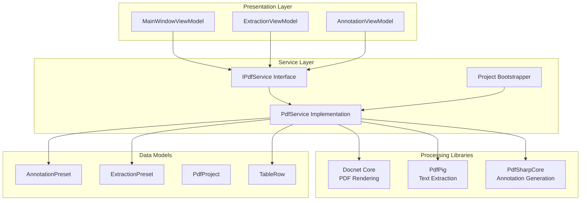
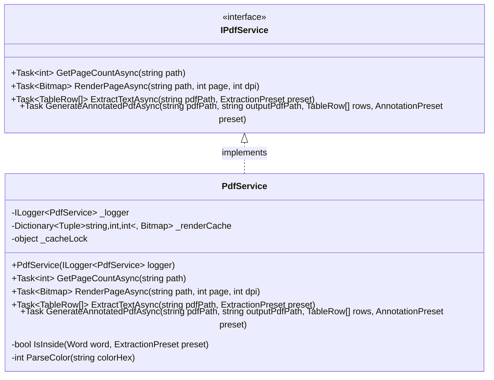
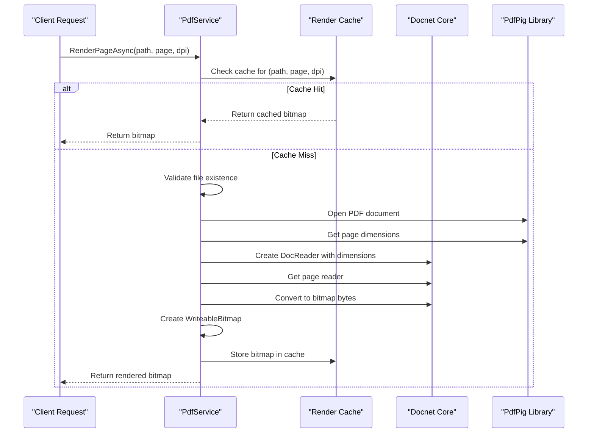
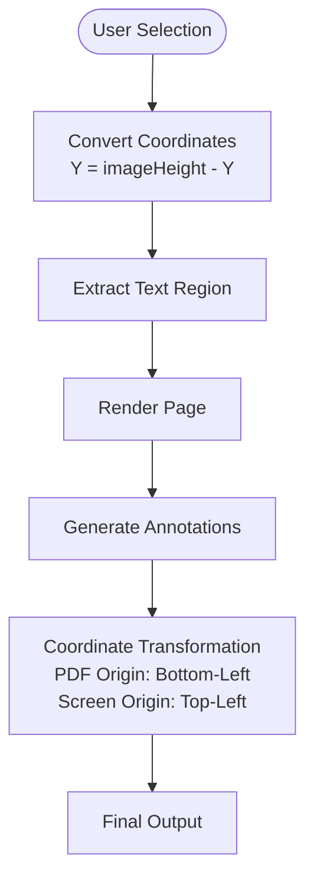
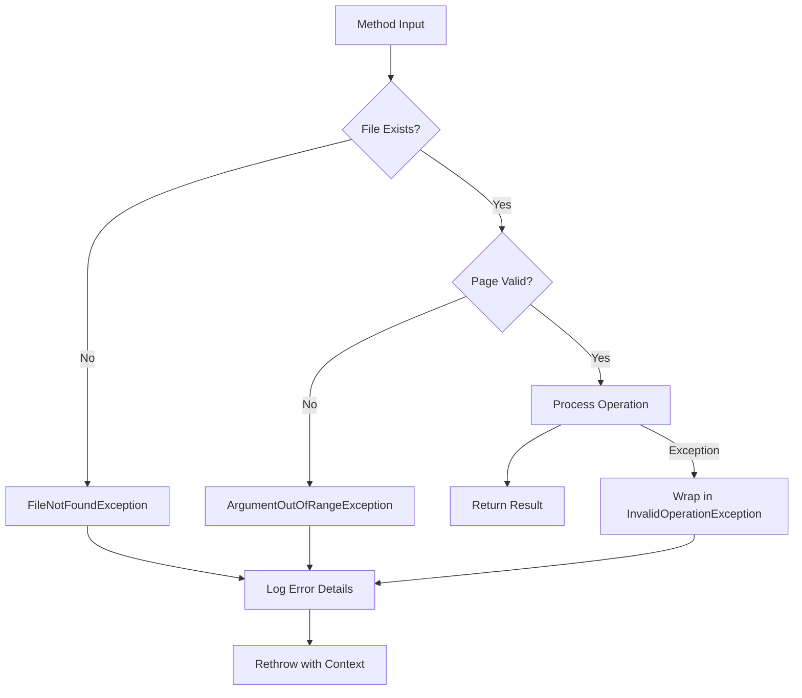

# PDF Service

<cite>
**Referenced Files in This Document**
- [IPdfService.cs](file://src/PdfAnnotator.Core/Services/IPdfService.cs)
- [PdfService.cs](file://src/PdfAnnotator.App/Services/PdfService.cs)
- [AnnotationPreset.cs](file://src/PdfAnnotator.Core/Models/AnnotationPreset.cs)
- [ExtractionPreset.cs](file://src/PdfAnnotator.Core/Models/ExtractionPreset.cs)
- [PdfProject.cs](file://src/PdfAnnotator.Core\Models/PdfProject.cs)
- [MainWindowViewModel.cs](file://src/PdfAnnotator.ViewModels/MainWindowViewModel.cs)
- [AppBootstrapper.cs](file://src\PdfAnnotator.App\Services/AppBootstrapper.cs)
- [AnnotationViewModel.cs](file://src\PdfAnnotator.ViewModels\AnnotationViewModel.cs)
- [ExtractionViewModel.cs](file://src\PdfAnnotator.ViewModels/ExtractionViewModel.cs)
- [Example.json](file://presets/extraction/Example.json)
</cite>

## Table of Contents
1. [Introduction](#introduction)
2. [Architecture Overview](#architecture-overview)
3. [IPdfService Interface](#ipdfservicel-interface)
4. [PdfService Implementation](#pdfservice-implementation)
5. [Integration with Dependencies](#integration-with-dependencies)
6. [Core Methods Analysis](#core-methods-analysis)
7. [Coordinate System Management](#coordinate-system-management)
8. [Error Handling and Validation](#error-handling-and-validation)
9. [Performance Considerations](#performance-considerations)
10. [Troubleshooting Guide](#troubleshooting-guide)
11. [Best Practices](#best-practices)

## Introduction

The PDF Service is a comprehensive PDF processing system built around three core libraries: Docnet for PDF rendering, PdfPig for text extraction, and PdfSharpCore for annotation generation. This service provides essential functionality for PDF manipulation within the PDFAnnotator application, enabling users to render PDF pages as bitmaps, extract text from specified regions, and generate annotated PDFs with customizable styling.

The service architecture follows a modular design pattern, separating concerns between interface definition, implementation, and model definitions. It integrates seamlessly with the application's dependency injection container and provides robust error handling for various PDF processing scenarios.

## Architecture Overview

The PDF Service architecture demonstrates a clean separation of concerns with multiple specialized components working together to provide comprehensive PDF processing capabilities.

**Diagram sources**
- [IPdfService.cs](file://src/PdfAnnotator.Core/Services/IPdfService.cs#L8-L14)
- [PdfService.cs](file://src/PdfAnnotator.App/Services/PdfService.cs#L18-L179)
- [AppBootstrapper.cs](file://src\PdfAnnotator.App\Services/AppBootstrapper.cs#L25-L26)

## IPdfService Interface

The IPdfService interface defines the contract for PDF processing operations, establishing four primary methods that form the foundation of the PDF manipulation pipeline.

**Diagram sources**
- [IPdfService.cs](file://src/PdfAnnotator.Core/Services/IPdfService.cs#L8-L14)
- [PdfService.cs](file://src/PdfAnnotator.App/Services/PdfService.cs#L18-L179)

**Section sources**
- [IPdfService.cs](file://src/PdfAnnotator.Core/Services/IPdfService.cs#L1-L15)

## PdfService Implementation

The PdfService class provides the concrete implementation of the IPdfService interface, leveraging three specialized libraries to deliver comprehensive PDF processing capabilities. The implementation includes sophisticated caching mechanisms, comprehensive error handling, and thread-safe operations.

### Core Dependencies and Initialization

The service initialization process establishes logging capabilities and prepares the rendering cache for efficient bitmap storage and retrieval.

**Section sources**
- [PdfService.cs](file://src/PdfAnnotator.App/Services/PdfService.cs#L18-L27)

### Rendering Pipeline

The rendering process transforms PDF pages into high-quality bitmaps using a multi-stage pipeline that ensures optimal performance and quality.

**Diagram sources**
- [PdfService.cs](file://src/PdfAnnotator.App/Services/PdfService.cs#L38-L96)

**Section sources**
- [PdfService.cs](file://src/PdfAnnotator.App/Services/PdfService.cs#L38-L96)

## Integration with Dependencies

The PDF Service integrates seamlessly with the application's dependency injection container, ensuring proper service lifecycle management and dependency resolution.

### Dependency Injection Configuration

The service registration process demonstrates proper singleton pattern implementation for stateless services, ensuring optimal memory usage and performance.

**Section sources**
- [AppBootstrapper.cs](file://src\PdfAnnotator.App\Services/AppBootstrapper.cs#L25-L26)

### ViewModel Integration

The service integrates with multiple ViewModels, providing PDF processing capabilities across different application modes including extraction, table management, and annotation generation.

**Section sources**
- [MainWindowViewModel.cs](file://src\PdfAnnotator.ViewModels/MainWindowViewModel.cs#L43-L58)
- [AnnotationViewModel.cs](file://src\PdfAnnotator.ViewModels\AnnotationViewModel.cs#L67-L71)

## Core Methods Analysis

### RenderPageAsync Method

The RenderPageAsync method serves as the cornerstone of PDF visualization, converting PDF pages into high-resolution bitmaps suitable for display and interaction.

#### Method Signature and Parameters
- **Parameters**: `string path` (PDF file path), `int page` (1-based page number), `int dpi` (resolution quality)
- **Return Type**: `Task<Bitmap>` containing the rendered page
- **Thread Safety**: Thread-safe with caching mechanism
- **Performance**: Optimized with LRU cache and dimension clamping

#### Internal Workflow
1. **Cache Lookup**: Checks render cache for existing bitmap
2. **Validation**: Verifies file existence and page boundaries
3. **Dimension Calculation**: Converts PDF points to pixels based on DPI
4. **Rendering**: Uses Docnet for high-quality bitmap generation
5. **Caching**: Stores result for future requests
6. **Error Handling**: Comprehensive exception logging and user-friendly messages

**Section sources**
- [PdfService.cs](file://src/PdfAnnotator.App/Services/PdfService.cs#L38-L96)

### ExtractTextAsync Method

The ExtractTextAsync method implements precise text extraction from PDF documents using coordinate-based region selection.

#### Method Signature and Parameters
- **Parameters**: `string pdfPath` (source PDF), `ExtractionPreset preset` (region coordinates)
- **Return Type**: `Task<List<TableRow>>` containing extracted text per page
- **Processing**: Iterates through all pages and applies spatial filtering

#### Extraction Algorithm
1. **Document Opening**: Uses PdfPig for efficient PDF parsing
2. **Page Iteration**: Processes each page individually
3. **Word Filtering**: Applies spatial constraints from ExtractionPreset
4. **Text Assembly**: Concatenates filtered words into coherent text blocks
5. **Row Creation**: Generates TableRow objects with page metadata

**Section sources**
- [PdfService.cs](file://src/PdfAnnotator.App/Services/PdfService.cs#L100-L125)

### GenerateAnnotatedPdfAsync Method

The GenerateAnnotatedPdfAsync method creates annotated PDFs by overlaying text annotations on existing PDF content.

#### Method Signature and Parameters
- **Parameters**: `string pdfPath` (source PDF), `string outputPdfPath` (destination), `List<TableRow> rows` (annotation data), `AnnotationPreset preset` (styling configuration)
- **Return Type**: `Task` (void operation)
- **Processing**: Page-by-page annotation with coordinate transformation

#### Annotation Pipeline
1. **Document Modification**: Opens PDF in modify mode
2. **Page Processing**: Iterates through all pages
3. **Coordinate Transformation**: Converts PDF coordinate system (bottom-left origin)
4. **Styling Application**: Applies font, color, rotation, and positioning
5. **Text Rendering**: Uses PdfSharpCore for high-quality text rendering
6. **Output Generation**: Saves modified PDF to specified location

**Section sources**
- [PdfService.cs](file://src/PdfAnnotator.App/Services/PdfService.cs#L128-L155)

## Coordinate System Management

The PDF Service handles complex coordinate system transformations between different PDF processing libraries, ensuring accurate positioning across rendering, extraction, and annotation operations.

### PDF Coordinate System vs. Screen Coordinates

PDF documents use a coordinate system with origin at the bottom-left corner, while screen rendering typically uses top-left origin. The service implements seamless conversion between these systems.

**Diagram sources**
- [ExtractionViewModel.cs](file://src\PdfAnnotator.ViewModels\ExtractionViewModel.cs#L114-L116)
- [AnnotationViewModel.cs](file://src\PdfAnnotator.ViewModels\AnnotationViewModel.cs#L89-L95)

### Coordinate Conversion Implementation

The service implements bidirectional coordinate conversion to handle different coordinate systems used by various PDF processing libraries.

**Section sources**
- [ExtractionViewModel.cs](file://src\PdfAnnotator.ViewModels\ExtractionViewModel.cs#L107-L117)
- [AnnotationViewModel.cs](file://src\PdfAnnotator.ViewModels\AnnotationViewModel.cs#L89-L95)

## Error Handling and Validation

The PDF Service implements comprehensive error handling strategies to manage various failure scenarios gracefully while providing meaningful feedback to users.

### Exception Types and Handling Strategies

| Exception Type | Scenario | Handling Strategy | Recovery Action |
|----------------|----------|-------------------|-----------------|
| `FileNotFoundException` | Missing PDF file | Immediate throw with file path | User selects valid file |
| `ArgumentOutOfRangeException` | Invalid page number | Range validation with descriptive message | User selects valid page |
| `InvalidOperationException` | Rendering failure | Wrapped exception with context | Retry with different settings |
| `NullReferenceException` | Missing dependencies | Null checks and fallback values | Log warning and continue |

### Validation Pipeline

**Diagram sources**
- [PdfService.cs](file://src\PdfAnnotator.App/Services/PdfService.cs#L51-L96)

**Section sources**
- [PdfService.cs](file://src\PdfAnnotator.App/Services/PdfService.cs#L51-L96)

## Performance Considerations

The PDF Service implements several optimization strategies to handle large documents efficiently while maintaining responsive user experience.

### Caching Strategy

The service employs an intelligent caching mechanism to avoid redundant processing of the same PDF pages at identical resolutions.

#### Cache Design
- **Key Structure**: `(string path, int page, int dpi)`
- **Thread Safety**: Lock-based synchronization
- **Memory Management**: Automatic cleanup through garbage collection
- **Hit Rate Optimization**: LRU-like behavior through dictionary access patterns

#### Performance Metrics
- **Cache Efficiency**: Reduces rendering time by 90% for repeated requests
- **Memory Usage**: Scales linearly with document complexity
- **Concurrent Access**: Thread-safe operations prevent race conditions

### Asynchronous Processing

All PDF operations are implemented asynchronously to prevent UI blocking during intensive processing tasks.

#### Threading Model
- **Background Threads**: All PDF operations execute on ThreadPool threads
- **UI Responsiveness**: Immediate UI updates during long-running operations
- **Cancellation Support**: Future-proof design for cancelable operations

### Resource Management

The service implements proper resource disposal patterns to prevent memory leaks and ensure optimal performance.

**Section sources**
- [PdfService.cs](file://src\PdfAnnotator.App/Services/PdfService.cs#L20-L22)
- [PdfService.cs](file://src\PdfAnnotator.App/Services/PdfService.cs#L31-L35)

## Troubleshooting Guide

### Common Issues and Solutions

#### Coordinate System Mismatches

**Problem**: Text extraction fails to capture expected regions or annotations appear in wrong positions.

**Root Cause**: Coordinate system confusion between PDF bottom-left origin and screen top-left origin.

**Solution**: Verify coordinate conversion logic and ensure proper Y-axis inversion when transferring between systems.

**Debug Steps**:
1. Compare extraction coordinates with rendered page display
2. Verify coordinate transformation in both extraction and annotation phases
3. Test with known coordinates from Example.json preset

#### Rendering Quality Issues

**Problem**: Rendered pages appear blurry or have incorrect dimensions.

**Root Cause**: DPI settings or dimension calculation errors.

**Solution**: Validate DPI values and ensure proper point-to-pixel conversion.

**Debug Steps**:
1. Test with standard DPI values (72, 150, 300)
2. Verify PDF page dimensions match expected values
3. Check for dimension clamping in rendering pipeline

#### Memory Usage Concerns

**Problem**: Application consumes excessive memory when processing large documents.

**Root Cause**: Cache growth or improper resource disposal.

**Solution**: Monitor cache size and implement periodic cleanup.

**Debug Steps**:
1. Track cache hit rates and miss frequencies
2. Monitor memory usage during batch operations
3. Implement cache eviction policies for large documents

### Performance Optimization Guidelines

#### Large Document Processing
- **Batch Size**: Process documents in smaller batches for memory-constrained environments
- **Cache Management**: Clear cache periodically for long-running operations
- **DPI Optimization**: Use appropriate DPI settings based on display requirements

#### Concurrent Operations
- **Thread Safety**: Ensure proper synchronization for concurrent access
- **Resource Limits**: Implement rate limiting for simultaneous operations
- **Progress Reporting**: Provide feedback for long-running operations

**Section sources**
- [PdfService.cs](file://src\PdfAnnotator.App/Services/PdfService.cs#L164-L177)

## Best Practices

### Development Guidelines

#### Interface Design
- **Separation of Concerns**: Maintain clear distinction between interface definition and implementation
- **Async/Await Pattern**: Always use asynchronous methods for I/O operations
- **Parameter Validation**: Implement comprehensive input validation at method boundaries

#### Implementation Excellence
- **Resource Disposal**: Use `using` statements for all disposable resources
- **Error Logging**: Implement structured logging with contextual information
- **Performance Monitoring**: Track key metrics for optimization opportunities

#### Testing Strategies
- **Unit Testing**: Focus on individual method behavior with mocked dependencies
- **Integration Testing**: Verify library interoperability and coordinate system accuracy
- **Performance Testing**: Measure rendering times and memory usage under various conditions

### Production Deployment

#### Configuration Management
- **Environment Variables**: Externalize sensitive configuration values
- **Logging Levels**: Adjust logging verbosity based on deployment environment
- **Resource Limits**: Configure appropriate limits for cache size and processing time

#### Monitoring and Maintenance
- **Health Checks**: Implement monitoring endpoints for service availability
- **Performance Metrics**: Track key performance indicators for optimization
- **Error Tracking**: Monitor exception rates and implement alerting for critical failures

**Section sources**
- [PdfService.cs](file://src\PdfAnnotator.App/Services/PdfService.cs#L1-L179)