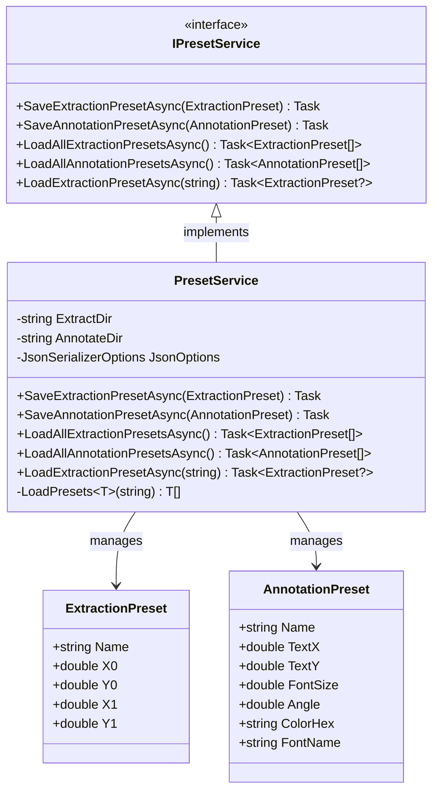
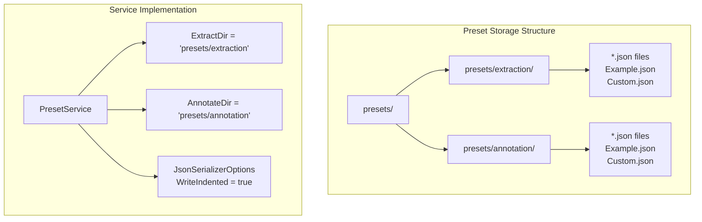
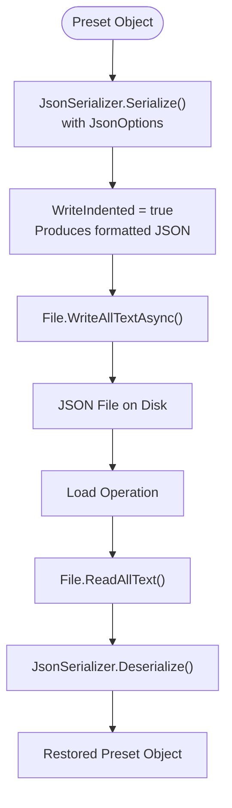
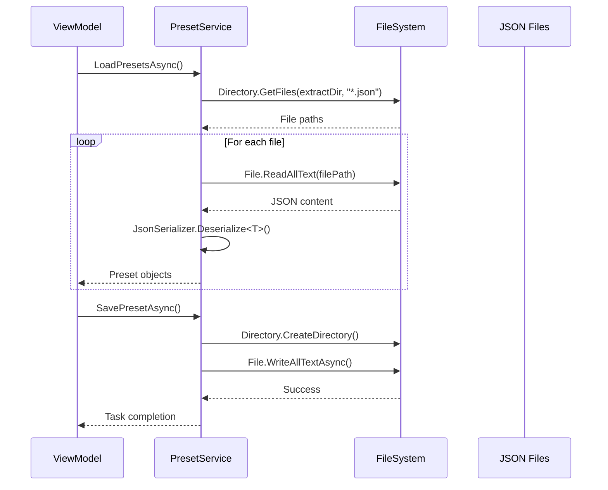
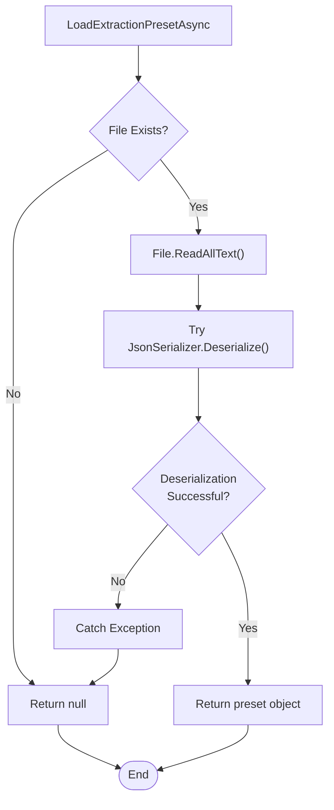

# Preset Service

<cite>
**Referenced Files in This Document**
- [IPresetService.cs](file://src/PdfAnnotator.Core/Services/IPresetService.cs)
- [PresetService.cs](file://src/PdfAnnotator.Core/Services/PresetService.cs)
- [ExtractionPreset.cs](file://src/PdfAnnotator.Core\Models\ExtractionPreset.cs)
- [AnnotationPreset.cs](file://src\PdfAnnotator.Core\Models\AnnotationPreset.cs)
- [PresetServiceTests.cs](file://tests\PdfAnnotator.Tests\PresetServiceTests.cs)
- [AnnotationViewModel.cs](file://src\PdfAnnotator.ViewModels\AnnotationViewModel.cs)
- [ExtractionViewModel.cs](file://src\PdfAnnotator.ViewModels\ExtractionViewModel.cs)
- [Example.json](file://presets\extraction\Example.json)
- [Example.json](file://presets\annotation\Example.json)
</cite>

## Table of Contents
1. [Introduction](#introduction)
2. [Service Architecture](#service-architecture)
3. [Core Interfaces and Models](#core-interfaces-and-models)
4. [PresetService Implementation](#presetservice-implementation)
5. [JSON Serialization and File Management](#json-serialization-and-file-management)
6. [Integration with ViewModels](#integration-with-viewmodels)
7. [Error Handling and Edge Cases](#error-handling-and-edge-cases)
8. [Testing and Validation](#testing-and-validation)
9. [Common Issues and Troubleshooting](#common-issues-and-troubleshooting)
10. [Best Practices](#best-practices)

## Introduction

The Preset Service is a crucial component of the PDF Annotator application that manages extraction and annotation presets through JSON file storage. It provides a persistent way to save and load configuration settings for PDF text extraction regions and annotation parameters, enabling users to reuse frequently used configurations across different PDF documents.

The service operates through two primary preset types:
- **Extraction Presets**: Define rectangular regions (X0, Y0, X1, Y1 coordinates) for text extraction from PDF pages
- **Annotation Presets**: Store text positioning, font settings, color information, and rotation angles for PDF annotations

## Service Architecture

The Preset Service follows a clean architecture pattern with clear separation of concerns:



**Diagram sources**
- [IPresetService.cs](file://src\PdfAnnotator.Core\services\IPresetService.cs#L7-L14)
- [PresetService.cs](file://src\PdfAnnotator.Core\services\PresetService.cs#L6-L82)
- [ExtractionPreset.cs](file://src\PdfAnnotator.Core\models\ExtractionPreset.cs#L3-L10)
- [AnnotationPreset.cs](file://src\PdfAnnotator.Core\models\AnnotationPreset.cs#L3-L12)

**Section sources**
- [IPresetService.cs](file://src\PdfAnnotator.Core\services\IPresetService.cs#L1-L15)
- [PresetService.cs](file://src\PdfAnnotator.Core\services\PresetService.cs#L1-L82)

## Core Interfaces and Models

### IPresetService Interface

The service interface defines five core methods for preset management:

| Method | Return Type | Purpose |
|--------|-------------|---------|
| `SaveExtractionPresetAsync` | `Task` | Saves an extraction preset to JSON file |
| `SaveAnnotationPresetAsync` | `Task` | Saves an annotation preset to JSON file |
| `LoadAllExtractionPresetsAsync` | `Task<List<ExtractionPreset>>` | Loads all extraction presets from the extraction directory |
| `LoadAllAnnotationPresetsAsync` | `Task<List<AnnotationPreset>>` | Loads all annotation presets from the annotation directory |
| `LoadExtractionPresetAsync` | `Task<ExtractionPreset?>` | Loads a specific extraction preset by file path |

### ExtractionPreset Model

The ExtractionPreset model represents rectangular regions for text extraction:

| Property | Type | Description | JSON Key |
|----------|------|-------------|----------|
| `Name` | `string` | Unique identifier for the preset | `"name"` |
| `X0` | `double` | Left coordinate of the rectangle | `"x0"` |
| `Y0` | `double` | Top coordinate of the rectangle | `"y0"` |
| `X1` | `double` | Right coordinate of the rectangle | `"x1"` |
| `Y1` | `double` | Bottom coordinate of the rectangle | `"y1"` |

### AnnotationPreset Model

The AnnotationPreset model stores text positioning and formatting parameters:

| Property | Type | Description | JSON Key | Default Value |
|----------|------|-------------|----------|---------------|
| `Name` | `string` | Unique identifier for the preset | `"name"` | Empty string |
| `TextX` | `double` | Horizontal position of text | `"textX"` | N/A |
| `TextY` | `double` | Vertical position of text | `"textY"` | N/A |
| `FontSize` | `double` | Font size in points | `"fontSize"` | N/A |
| `Angle` | `double` | Rotation angle in degrees | `"angle"` | N/A |
| `ColorHex` | `string` | Hexadecimal color code | `"color"` | `"#000000"` |
| `FontName` | `string` | Font family name | `"fontName"` | `"Helvetica"` |

**Section sources**
- [IPresetService.cs](file://src\PdfAnnotator.Core\services\IPresetService.cs#L7-L14)
- [ExtractionPreset.cs](file://src\PdfAnnotator.Core\models\ExtractionPreset.cs#L3-L10)
- [AnnotationPreset.cs](file://src\PdfAnnotator.Core\models\AnnotationPreset.cs#L3-L12)

## PresetService Implementation

### Directory Structure and Constants

The service maintains separate directories for different preset types:



**Diagram sources**
- [PresetService.cs](file://src\PdfAnnotator.Core\services\PresetService.cs#L8-L14)

### Core Methods Implementation

#### Save Operations

Both save methods follow a consistent pattern:

1. **Directory Creation**: Ensures the target directory exists using `Directory.CreateDirectory()`
2. **File Path Construction**: Creates path combining directory constant and preset name
3. **JSON Serialization**: Uses `JsonSerializer.Serialize()` with pre-configured options
4. **Asynchronous Writing**: Employs `File.WriteAllTextAsync()` for non-blocking I/O

#### Load Operations

##### LoadAll Methods
- Scan directory for `.json` files
- Deserialize each file to the appropriate preset type
- Handle deserialization failures gracefully
- Return empty list if directory doesn't exist

##### LoadExtractionPresetAsync
- Validates file existence before attempting to read
- Implements robust error handling for malformed JSON
- Returns null for both missing files and deserialization errors

**Section sources**
- [PresetService.cs](file://src\PdfAnnotator.Core\services\PresetService.cs#L16-L82)

## JSON Serialization and File Management

### JsonSerializerOptions Configuration

The service uses a specialized `JsonSerializerOptions` instance configured with `WriteIndented = true` to produce human-readable JSON files:



**Diagram sources**
- [PresetService.cs](file://src\PdfAnnotator.Core\services\PresetService.cs#L11-L14)

### File Naming Convention

Preset files follow a consistent naming pattern:
- **Format**: `{PresetName}.json`
- **Example**: `TestExtract.json`, `ExampleAnnot.json`
- **Location**: Based on preset type (`presets/extraction/` or `presets/annotation/`)
- **Uniqueness**: Names serve as identifiers for preset selection

### Directory Management

The service automatically creates directories when needed:
- **Automatic Creation**: `Directory.CreateDirectory()` ensures target directories exist
- **Idempotent Operation**: Safe to call multiple times without side effects
- **Relative Paths**: Uses relative paths from application root

**Section sources**
- [PresetService.cs](file://src\PdfAnnotator.Core\services\PresetService.cs#L11-L28)

## Integration with ViewModels

### ViewModel Architecture

The Preset Service integrates seamlessly with ViewModels through dependency injection:



**Diagram sources**
- [AnnotationViewModel.cs](file://src\PdfAnnotator.ViewModels\AnnotationViewModel.cs#L140-L148)
- [ExtractionViewModel.cs](file://src\PdfAnnotator.ViewModels\ExtractionViewModel.cs#L168-L178)

### AnnotationViewModel Integration

The AnnotationViewModel demonstrates comprehensive preset management:

#### Key Features:
- **Observable Collection**: Maintains `ObservableCollection<AnnotationPreset>` for UI binding
- **Preset Selection**: Supports dropdown selection with automatic parameter updates
- **Dynamic Loading**: Reloads presets when saving new ones
- **Parameter Synchronization**: Automatically applies selected preset values

#### Workflow:
1. **Initialization**: Calls `await LoadPresetsAsync()` during construction
2. **Saving**: Creates preset from current form values and saves
3. **Loading**: Clears collection and reloads all available presets
4. **Application**: Updates form controls when preset selection changes

### ExtractionViewModel Integration

The ExtractionViewModel provides specialized preset loading capabilities:

#### Key Features:
- **File-Based Loading**: Supports loading presets from arbitrary JSON files
- **Manual Path Selection**: Integrates with file picker dialogs
- **Conflict Resolution**: Handles duplicate preset names by replacing existing entries
- **Direct Application**: Applies loaded presets immediately to extraction controls

**Section sources**
- [AnnotationViewModel.cs](file://src\PdfAnnotator.ViewModels\AnnotationViewModel.cs#L140-L168)
- [ExtractionViewModel.cs](file://src\PdfAnnotator.ViewModels\ExtractionViewModel.cs#L140-L195)

## Error Handling and Edge Cases

### File System Errors

The service handles various error conditions gracefully:

#### Directory Operations
- **Missing Directories**: Automatically created via `Directory.CreateDirectory()`
- **Permission Issues**: Propagated to caller as exceptions
- **Path Conflicts**: Handled by .NET file system APIs

#### File Operations
- **Missing Files**: `LoadExtractionPresetAsync` returns null for non-existent paths
- **Access Denied**: Exceptions propagated to caller
- **Disk Full**: Handled by underlying file system operations

### JSON Deserialization Errors

Robust error handling prevents application crashes:



**Diagram sources**
- [PresetService.cs](file://src\PdfAnnotator.Core\services\PresetService.cs#L36-L52)

### Common Error Scenarios

| Scenario | Behavior | Recovery Strategy |
|----------|----------|-------------------|
| Malformed JSON | Returns null | User notification required |
| Invalid paths | Returns null | Path validation recommended |
| Missing directories | Automatically created | No action needed |
| Permission denied | Throws exception | User intervention required |
| Concurrent access | Undefined behavior | Locking mechanism required |

**Section sources**
- [PresetService.cs](file://src\PdfAnnotator.Core\services\PresetService.cs#L36-L52)
- [PresetService.cs](file://src\PdfAnnotator.Core\services\PresetService.cs#L61-L80)

## Testing and Validation

### Test Coverage

The PresetService includes comprehensive unit tests demonstrating proper functionality:

#### Extraction Preset Tests
- **Save and Load Cycle**: Verifies round-trip serialization/deserialization
- **Name Preservation**: Ensures preset names survive the save/load process
- **Value Integrity**: Confirms numeric values remain accurate

#### Annotation Preset Tests
- **Complete Parameter Test**: Tests all annotation preset properties
- **Default Values**: Validates proper handling of default property values
- **Complex Properties**: Tests color hex codes and font names

### Test Implementation Pattern

Both test methods follow a consistent pattern:

1. **Service Instantiation**: Creates fresh PresetService instance
2. **Preset Creation**: Constructs preset with known values
3. **Save Operation**: Calls appropriate save method
4. **Load Verification**: Loads all presets and verifies inclusion
5. **Assertion**: Uses `Assert.Contains()` to verify successful operation

**Section sources**
- [PresetServiceTests.cs](file://tests\PdfAnnotator.Tests\PresetServiceTests.cs#L1-L46)

## Common Issues and Troubleshooting

### Deserialization Failures

#### Symptoms
- Preset loads as null object
- Missing or incorrect property values
- Application crashes during preset loading

#### Causes and Solutions

| Issue | Cause | Solution |
|-------|-------|----------|
| Missing Properties | JSON file lacks required fields | Update JSON to include all required properties |
| Type Mismatches | Incorrect data types in JSON | Verify JSON property types match C# model |
| Invalid JSON | Malformed JSON syntax | Validate JSON syntax using online tools |
| Encoding Issues | Non-UTF8 character encoding | Ensure files use UTF-8 encoding |

### File Path Problems

#### Relative vs Absolute Paths
- **Issue**: Preset files saved to unexpected locations
- **Solution**: Use relative paths from application root
- **Prevention**: Always use `Path.Combine()` for path construction

#### Permission Issues
- **Issue**: Cannot create directories or write files
- **Solution**: Run application with appropriate permissions
- **Prevention**: Test directory creation during application startup

### Memory and Performance Issues

#### Large Preset Collections
- **Problem**: Slow loading with many preset files
- **Solution**: Implement lazy loading or pagination
- **Alternative**: Filter files by modification date

#### Concurrent Access
- **Problem**: Race conditions during file operations
- **Solution**: Implement file locking mechanisms
- **Prevention**: Design single-threaded access patterns

### JSON Format Validation

#### Extraction Preset JSON Schema
```json
{
  "name": "string",
  "x0": "number",
  "y0": "number", 
  "x1": "number",
  "y1": "number"
}
```

#### Annotation Preset JSON Schema
```json
{
  "name": "string",
  "textX": "number",
  "textY": "number",
  "fontSize": "number",
  "angle": "number",
  "color": "string",
  "fontName": "string"
}
```

**Section sources**
- [Example.json](file://presets\extraction\Example.json#L1-L8)
- [Example.json](file://presets\annotation\Example.json#L1-L10)

## Best Practices

### Preset Naming Conventions

#### Recommended Patterns
- **Descriptive Names**: Use meaningful names that indicate preset purpose
- **Consistent Formatting**: Adopt camelCase or PascalCase consistently
- **Version Control**: Include version numbers for major changes
- **Category Prefixes**: Use prefixes to group related presets

#### Example Names
- `InvoiceExtraction_v2.1`
- `ReceiptAnnotation_Default`
- `ContractSignatureArea`
- `BankStatementHeader`

### Error Handling Strategies

#### Graceful Degradation
- **Missing Presets**: Provide default fallback values
- **Corrupted Files**: Log warnings and continue with remaining valid presets
- **IO Errors**: Implement retry logic with exponential backoff

#### User Experience
- **Clear Error Messages**: Provide actionable feedback for users
- **Progress Indicators**: Show loading progress for large preset collections
- **Validation Feedback**: Validate preset data before saving

### Performance Optimization

#### Caching Strategies
- **Memory Caching**: Cache frequently accessed presets in memory
- **Lazy Loading**: Load presets only when needed
- **Background Loading**: Preload common presets during idle periods

#### File System Optimization
- **Batch Operations**: Group multiple file operations together
- **Async Operations**: Use asynchronous I/O for all file operations
- **Resource Cleanup**: Properly dispose of file streams and readers

### Security Considerations

#### Input Validation
- **Path Sanitization**: Validate file paths to prevent directory traversal
- **Size Limits**: Limit JSON file sizes to prevent denial-of-service attacks
- **Type Checking**: Verify JSON structure matches expected schema

#### Access Control
- **File Permissions**: Set appropriate file system permissions
- **User Isolation**: Separate user data from system files
- **Backup Protection**: Protect against accidental deletion or corruption

### Maintenance and Extensibility

#### Version Compatibility
- **Schema Evolution**: Design forward-compatible JSON schemas
- **Migration Strategies**: Implement upgrade paths for preset formats
- **Backward Compatibility**: Support older preset formats gracefully

#### Testing and Quality Assurance
- **Unit Testing**: Comprehensive test coverage for all service methods
- **Integration Testing**: Test with real file systems and JSON files
- **Performance Testing**: Monitor loading times with large preset collections