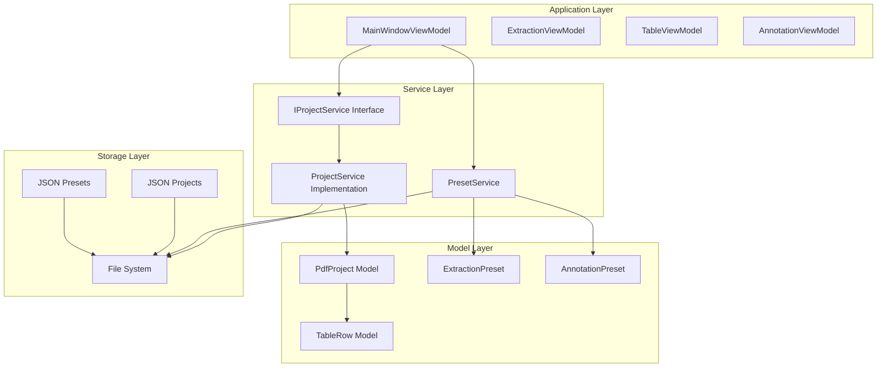
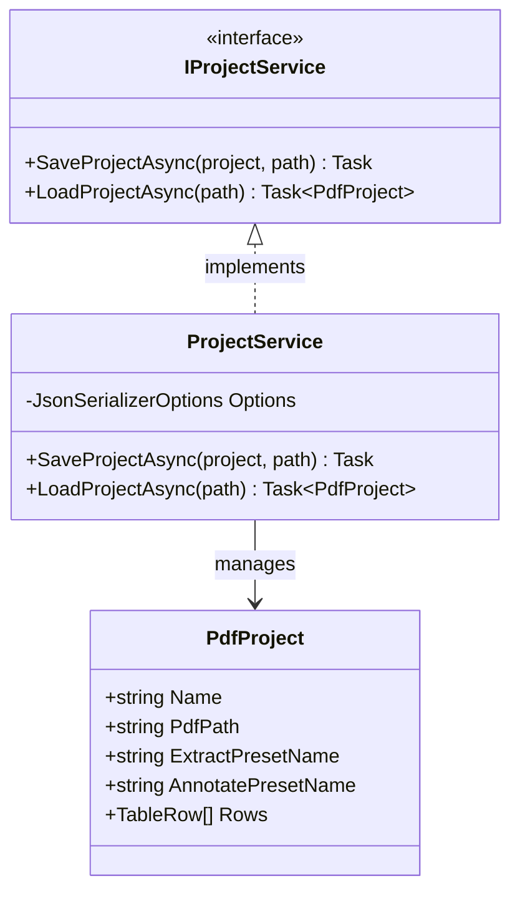
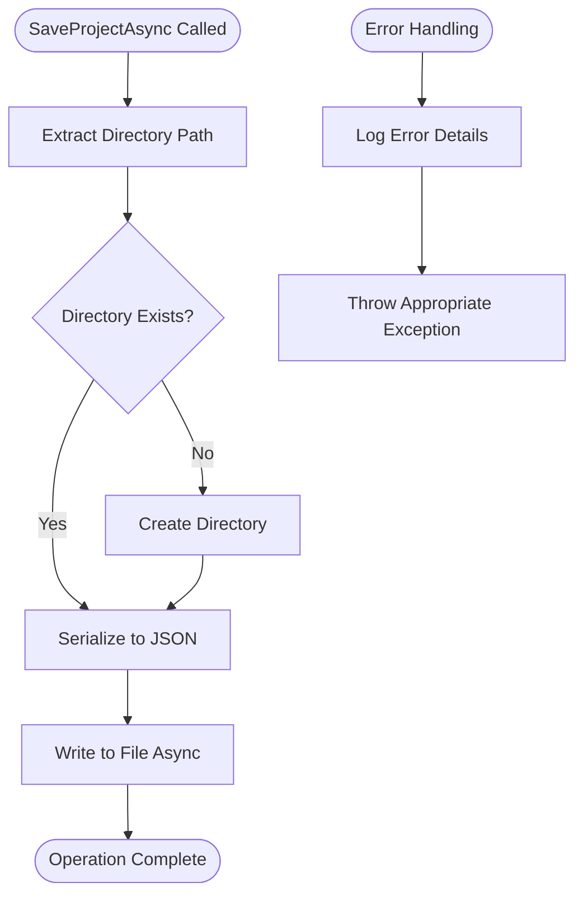
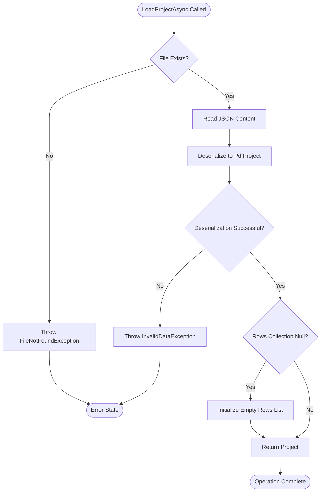
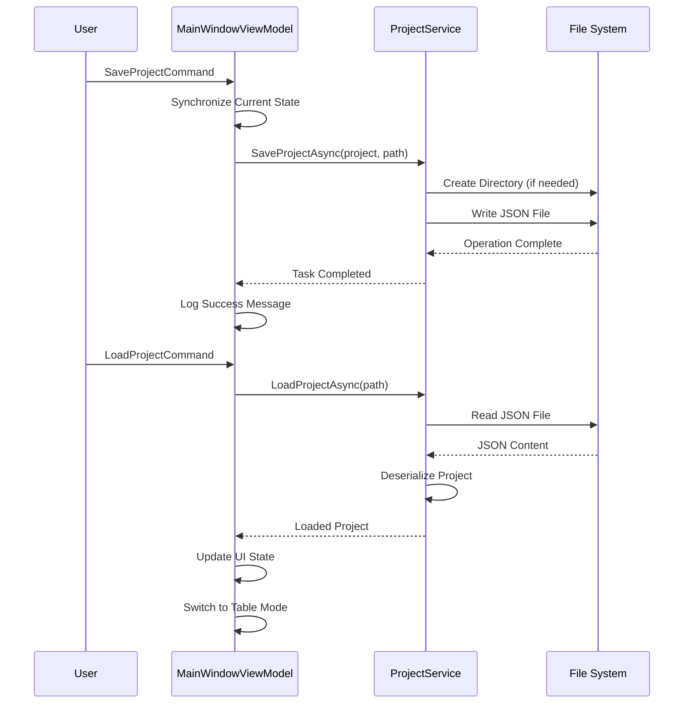
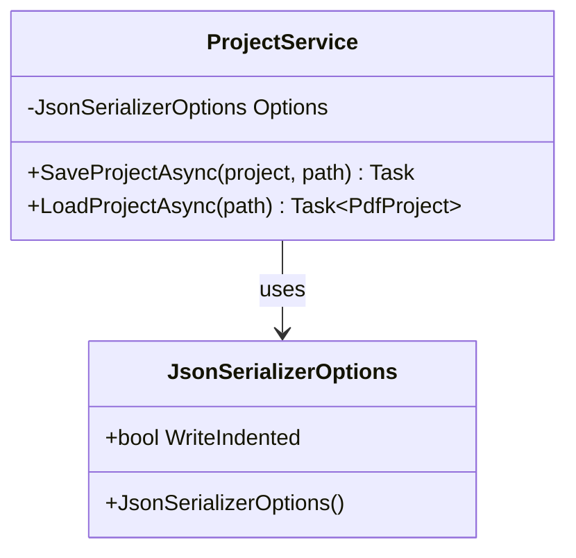
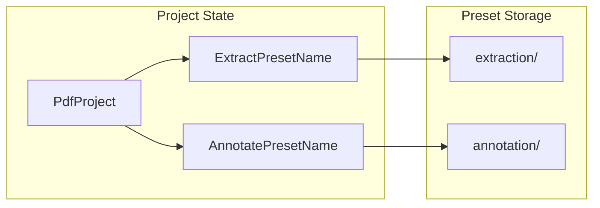
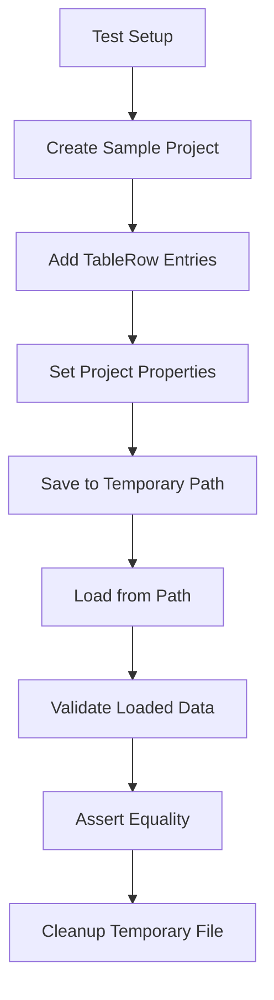
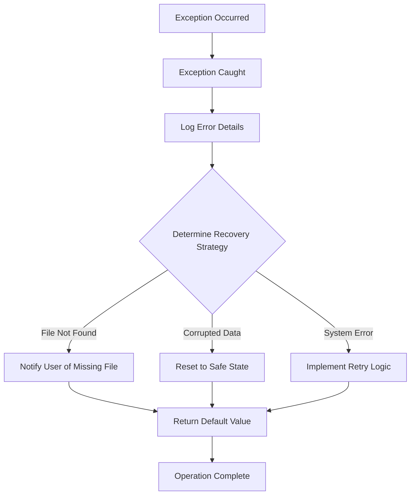

# Project Service

<cite>
**Referenced Files in This Document**
- [IProjectService.cs](file://src/PdfAnnotator.Core/Services/IProjectService.cs)
- [ProjectService.cs](file://src/PdfAnnotator.Core/Services/ProjectService.cs)
- [PdfProject.cs](file://src/PdfAnnotator.Core\Models/PdfProject.cs)
- [MainWindowViewModel.cs](file://src/PdfAnnotator.ViewModels/MainWindowViewModel.cs)
- [ProjectServiceTests.cs](file://tests/PdfAnnotator.Tests/ProjectServiceTests.cs)
- [TableRow.cs](file://src/PdfAnnotator.Core\Models/TableRow.cs)
- [PresetService.cs](file://src/PdfAnnotator.Core/Services/PresetService.cs)
- [IPresetService.cs](file://src/PdfAnnotator.Core/Services/IPresetService.cs)
- [AnnotationPreset.cs](file://src/PdfAnnotator.Core\Models/AnnotationPreset.cs)
- [ExtractionPreset.cs](file://src/PdfAnnotator.Core\Models/ExtractionPreset.cs)
</cite>

## Table of Contents
1. [Introduction](#introduction)
2. [Project Service Architecture](#project-service-architecture)
3. [Core Components](#core-components)
4. [Interface Definition](#interface-definition)
5. [Implementation Details](#implementation-details)
6. [Integration with Application](#integration-with-application)
7. [Serialization and Persistence](#serialization-and-persistence)
8. [Testing and Validation](#testing-and-validation)
9. [Error Handling and Exception Management](#error-handling-and-exception-management)
10. [Performance Considerations](#performance-considerations)
11. [Troubleshooting Guide](#troubleshooting-guide)
12. [Best Practices](#best-practices)

## Introduction

The Project Service is a critical component of the PDF Annotator application that enables full project persistence by serializing the PdfProject model to JSON files. This service facilitates the complete workflow of saving and loading project data, including PDF paths, table row data, preset configurations, and metadata. The service operates asynchronously to prevent UI blocking during file operations and uses System.Text.Json for efficient serialization.

The Project Service serves as the bridge between the application's runtime state and persistent storage, enabling users to save their progress through different annotation modes (Extraction, Table, Annotation) and resume work seamlessly. It integrates closely with the MainWindowViewModel to synchronize state across the application's various functional areas.

## Project Service Architecture

The Project Service follows a clean architecture pattern with clear separation of concerns:

**Diagram sources**
- [MainWindowViewModel.cs](file://src/PdfAnnotator.ViewModels/MainWindowViewModel.cs#L21-L120)
- [IProjectService.cs](file://src/PdfAnnotator.Core/Services/IProjectService.cs#L6-L10)
- [ProjectService.cs](file://src/PdfAnnotator.Core/Services/ProjectService.cs#L6-L43)

## Core Components

### PdfProject Model

The PdfProject model represents the complete state of a project session and contains the following essential properties:

| Property | Type | Description | Purpose |
|----------|------|-------------|---------|
| Name | string | Project identifier | Used for file naming and display |
| PdfPath | string | Path to source PDF | References the original document |
| ExtractPresetName | string | Associated extraction preset | Stores template configuration |
| AnnotatePresetName | string | Associated annotation preset | Stores annotation configuration |
| Rows | List\<TableRow\> | Table data collection | Contains extracted and annotated data |

### TableRow Model

Each TableRow represents a single data entry in the project's table:

| Property | Type | Description | Usage |
|----------|------|-------------|-------|
| Page | int | Target page number | Specifies where data belongs |
| FieldText | string | Original field text | Preserves source content |
| Code | string | Processing code | Used for data manipulation |

**Section sources**
- [PdfProject.cs](file://src/PdfAnnotator.Core\Models/PdfProject.cs#L5-L12)
- [TableRow.cs](file://src/PdfAnnotator.Core\Models/TableRow.cs#L3-L8)

## Interface Definition

The IProjectService interface defines the contract for project persistence operations:

**Diagram sources**
- [IProjectService.cs](file://src/PdfAnnotator.Core/Services/IProjectService.cs#L6-L10)
- [ProjectService.cs](file://src/PdfAnnotator.Core/Services/ProjectService.cs#L6-L43)
- [PdfProject.cs](file://src/PdfAnnotator.Core\Models/PdfProject.cs#L5-L12)

**Section sources**
- [IProjectService.cs](file://src/PdfAnnotator.Core/Services/IProjectService.cs#L6-L10)

## Implementation Details

### SaveProjectAsync Method

The SaveProjectAsync method handles the complete process of persisting a project to disk:

**Diagram sources**
- [ProjectService.cs](file://src/PdfAnnotator.Core/Services/ProjectService.cs#L13-L22)

Key implementation features:
- **Directory Creation**: Automatically creates parent directories if they don't exist
- **JSON Serialization**: Uses System.Text.Json with indented formatting for readability
- **Async Operations**: All file operations are performed asynchronously to prevent UI blocking
- **Error Handling**: Validates input parameters and handles file system exceptions

### LoadProjectAsync Method

The LoadProjectAsync method reconstructs project state from persisted JSON:

**Diagram sources**
- [ProjectService.cs](file://src/PdfAnnotator.Core/Services/ProjectService.cs#L25-L41)

**Section sources**
- [ProjectService.cs](file://src/PdfAnnotator.Core/Services/ProjectService.cs#L13-L43)

## Integration with Application

### MainWindowViewModel Integration

The Project Service integrates seamlessly with the MainWindowViewModel to manage project lifecycle:

**Diagram sources**
- [MainWindowViewModel.cs](file://src/PdfAnnotator.ViewModels/MainWindowViewModel.cs#L93-L118)
- [ProjectService.cs](file://src/PdfAnnotator.Core/Services/ProjectService.cs#L13-L41)

### State Synchronization Across Modes

The service enables seamless state synchronization between different application modes:

| Mode Transition | Data Synchronization | Purpose |
|-----------------|---------------------|---------|
| Extraction → Table | Table rows from extraction | Preserve extracted data |
| Table → Annotation | Rows synchronized to annotation | Enable continued annotation |
| Project Load | Full state restoration | Resume work from saved state |

**Section sources**
- [MainWindowViewModel.cs](file://src/PdfAnnotator.ViewModels/MainWindowViewModel.cs#L60-L89)

## Serialization and Persistence

### JSON Serialization Configuration

The Project Service uses System.Text.Json with specific configuration for optimal persistence:

**Diagram sources**
- [ProjectService.cs](file://src/PdfAnnotator.Core/Services/ProjectService.cs#L8-L11)

### File Path Management

The service handles file paths with automatic directory creation and validation:

- **Relative Paths**: Supports relative paths for project isolation
- **Automatic Creation**: Creates parent directories when needed
- **Cross-Platform**: Uses Path APIs for platform-independent paths
- **Naming Convention**: Projects stored as `{name}.json` in `projects/` directory

### Preset Integration

The Project Service works in conjunction with PresetService to maintain complete project state:

**Diagram sources**
- [PresetService.cs](file://src/PdfAnnotator.Core/Services/PresetService.cs#L8-L9)
- [ProjectService.cs](file://src/PdfAnnotator.Core/Services/ProjectService.cs#L35-L36)

**Section sources**
- [ProjectService.cs](file://src/PdfAnnotator.Core/Services/ProjectService.cs#L8-L11)
- [PresetService.cs](file://src/PdfAnnotator.Core/Services/PresetService.cs#L8-L9)

## Testing and Validation

### Unit Test Implementation

The ProjectServiceTests demonstrate comprehensive validation of project persistence:

**Diagram sources**
- [ProjectServiceTests.cs](file://tests/PdfAnnotator.Tests/ProjectServiceTests.cs#L8-L32)

### Test Validation Criteria

The test validates several critical aspects:

| Validation Point | Assertion | Purpose |
|------------------|-----------|---------|
| Project Name | `Assert.Equal(project.Name, loaded.Name)` | Verify identity preservation |
| Row Count | `Assert.Single(loaded.Rows)` | Confirm data integrity |
| Row Data | `Assert.Equal("C1", loaded.Rows[0].Code)` | Validate content accuracy |

**Section sources**
- [ProjectServiceTests.cs](file://tests/PdfAnnotator.Tests/ProjectServiceTests.cs#L8-L32)

## Error Handling and Exception Management

### Exception Types and Scenarios

The Project Service implements comprehensive error handling for various failure scenarios:

| Exception Type | Scenario | Handling Strategy |
|----------------|----------|-------------------|
| FileNotFoundException | Project file not found during load | Clear error message with path |
| InvalidDataException | Corrupted or invalid JSON | Descriptive parsing error |
| IOException | File system access issues | Graceful degradation |
| ArgumentNullException | Null parameters | Parameter validation |

### Error Recovery Strategies

### Best Practices for Error Handling

- **Specific Exceptions**: Uses appropriate exception types for different failure modes
- **Descriptive Messages**: Provides clear error messages with context
- **Graceful Degradation**: Maintains application stability during failures
- **Logging Integration**: Works with the application's logging infrastructure

## Performance Considerations

### Asynchronous I/O Operations

The Project Service prioritizes UI responsiveness through asynchronous operations:

- **Non-blocking Saves**: Save operations don't freeze the user interface
- **Background Loading**: Project loading occurs without UI interruption
- **Progress Indication**: Can support progress reporting for large projects
- **Resource Management**: Proper disposal of file resources

### Memory Efficiency

- **Streaming Serialization**: Uses streaming JSON serialization for large projects
- **Lazy Loading**: Presets are loaded on-demand
- **Garbage Collection**: Minimal memory footprint for temporary objects

### File System Optimization

- **Atomic Writes**: Ensures data integrity during write operations
- **Directory Caching**: Minimizes repeated directory existence checks
- **Path Normalization**: Consistent path handling across platforms

## Troubleshooting Guide

### Common Issues and Solutions

#### Missing Project Files

**Symptoms**: FileNotFoundException during project load
**Causes**: 
- Deleted or moved project files
- Incorrect project name
- Permission issues

**Solutions**:
1. Verify file exists in `projects/` directory
2. Check project name matches exactly
3. Ensure read/write permissions
4. Restore from backup if available

#### Corrupted JSON Data

**Symptoms**: InvalidDataException during project load
**Causes**:
- Interrupted save operation
- Manual file editing errors
- Disk corruption

**Solutions**:
1. Check JSON syntax validity
2. Restore from recent backup
3. Recreate project from scratch
4. Use JSON validation tools

#### Permission Denied Errors

**Symptoms**: IOException during file operations
**Causes**:
- Insufficient file system permissions
- File locked by another process
- Network drive access issues

**Solutions**:
1. Run application with appropriate permissions
2. Close conflicting applications
3. Use local storage instead of network drives
4. Check antivirus software interference

### Data Loss Prevention

#### Best Practices for Data Safety

| Practice | Description | Benefit |
|----------|-------------|---------|
| Regular Backups | Maintain copies of project files | Protect against accidental deletion |
| Version Control | Track project file changes | Enable rollback capabilities |
| Validation Checks | Verify data integrity | Prevent corruption propagation |
| Graceful Shutdown | Save state before exit | Minimize interruption impact |

#### Recovery Procedures

1. **Immediate Action**: Stop application immediately on crash
2. **File Inspection**: Check for partial writes or corruption
3. **Backup Restoration**: Restore from most recent backup
4. **Data Reconstruction**: Rebuild from available fragments
5. **Prevention Measures**: Implement safeguards to prevent recurrence

### Debugging Techniques

#### Logging and Monitoring

- **Operation Logs**: Track save/load operations
- **Error Tracking**: Monitor exception patterns
- **Performance Metrics**: Measure I/O operation timing
- **State Validation**: Verify data consistency

#### Diagnostic Tools

- **File System Watchers**: Monitor file changes
- **JSON Validators**: Verify serialization integrity
- **Memory Profilers**: Detect resource leaks
- **Concurrency Analyzers**: Identify threading issues

## Best Practices

### Development Guidelines

#### Interface Design
- **Single Responsibility**: Each method has a clear, focused purpose
- **Consistent Naming**: Follows established naming conventions
- **Parameter Validation**: Validates inputs before processing
- **Documentation**: Comprehensive XML documentation

#### Implementation Excellence
- **Async Patterns**: Uses async/await consistently
- **Resource Management**: Proper disposal of resources
- **Error Handling**: Comprehensive exception management
- **Performance Awareness**: Optimizes for common use cases

#### Testing Standards
- **Unit Tests**: Comprehensive coverage of all methods
- **Integration Tests**: Validates service integration
- **Edge Case Testing**: Handles boundary conditions
- **Error Scenario Testing**: Validates exception handling

### Production Deployment

#### Configuration Management
- **Environment Variables**: Externalize configuration
- **Default Values**: Provide sensible defaults
- **Validation**: Verify configuration integrity
- **Logging**: Track configuration changes

#### Monitoring and Maintenance
- **Health Checks**: Monitor service availability
- **Performance Metrics**: Track operation timing
- **Error Rates**: Monitor exception frequencies
- **Capacity Planning**: Estimate resource requirements

### Security Considerations

#### Data Protection
- **Input Validation**: Sanitize file paths and names
- **Access Control**: Respect file system permissions
- **Data Integrity**: Verify file authenticity
- **Secure Storage**: Protect sensitive project data

#### Privacy Compliance
- **Data Minimization**: Store only necessary information
- **Retention Policies**: Implement data lifecycle management
- **Audit Trails**: Track data access and modifications
- **Secure Deletion**: Properly remove sensitive data