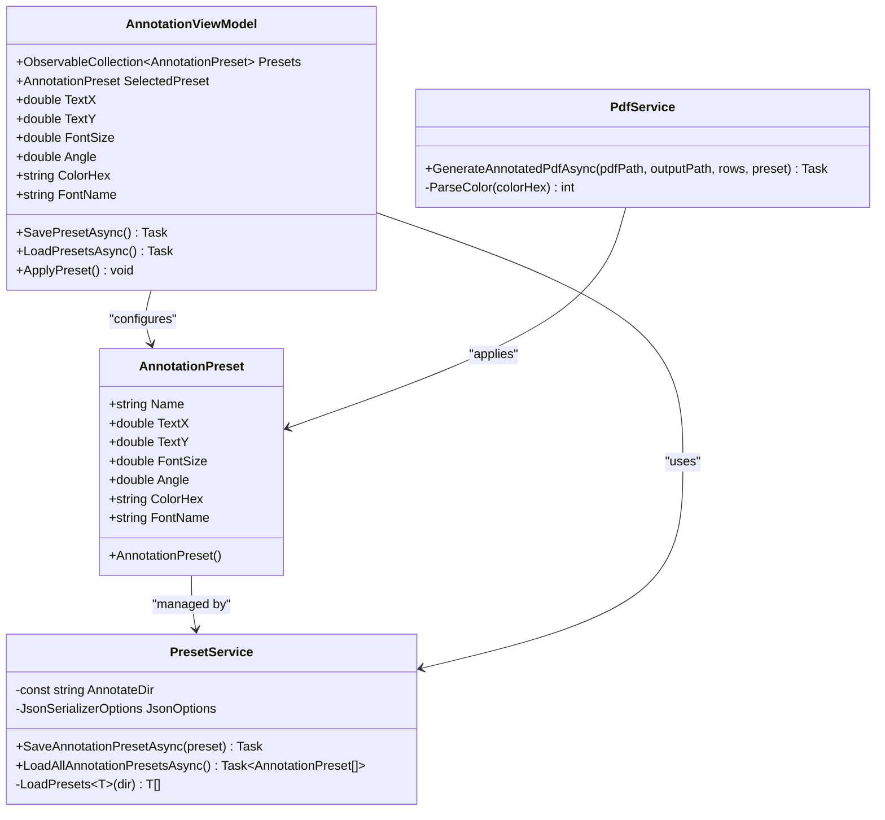
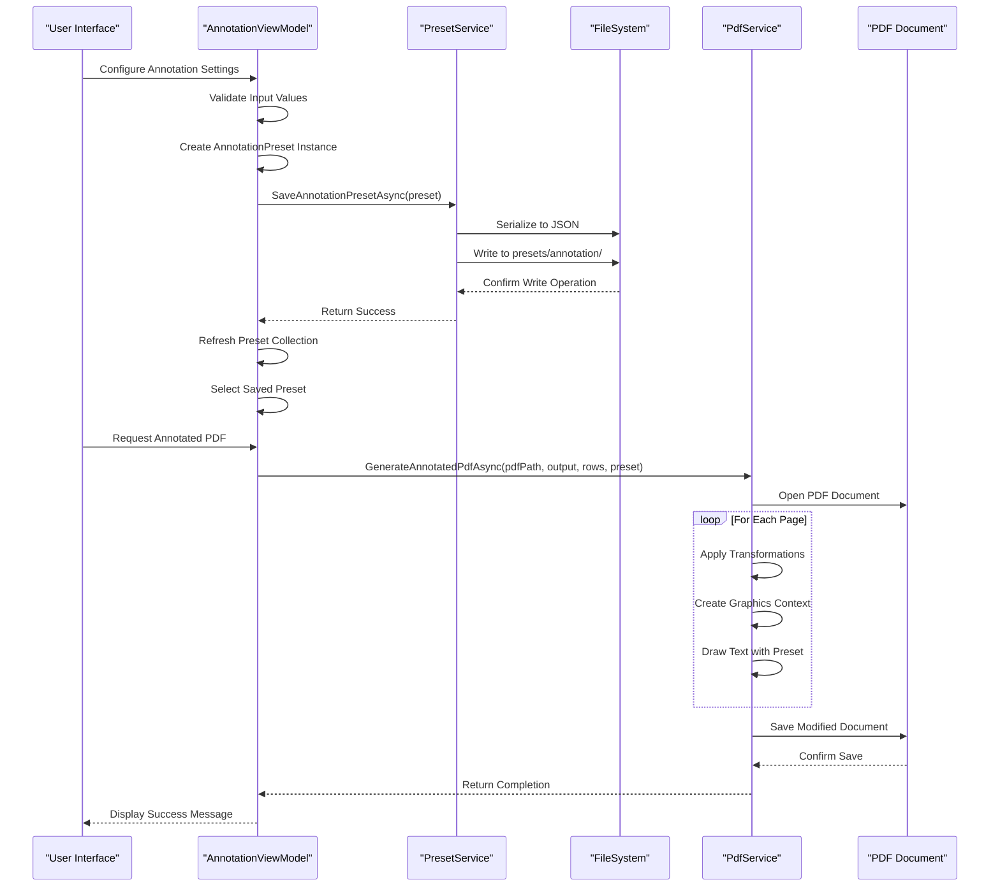
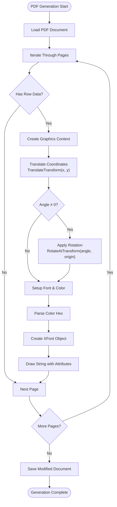
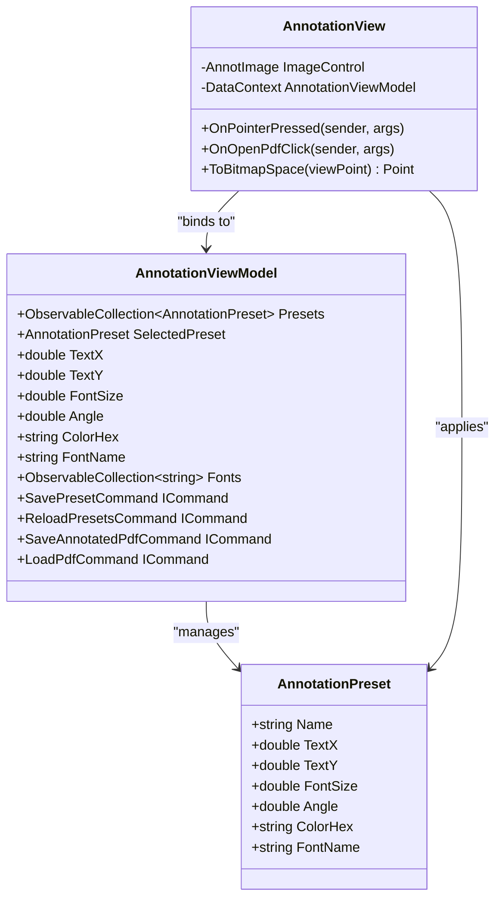
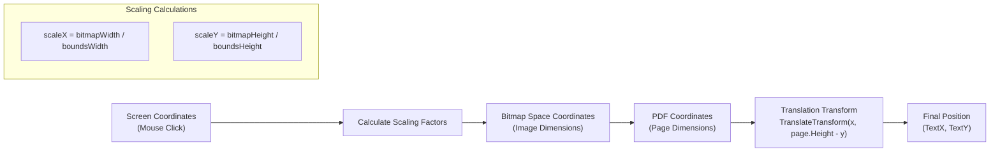
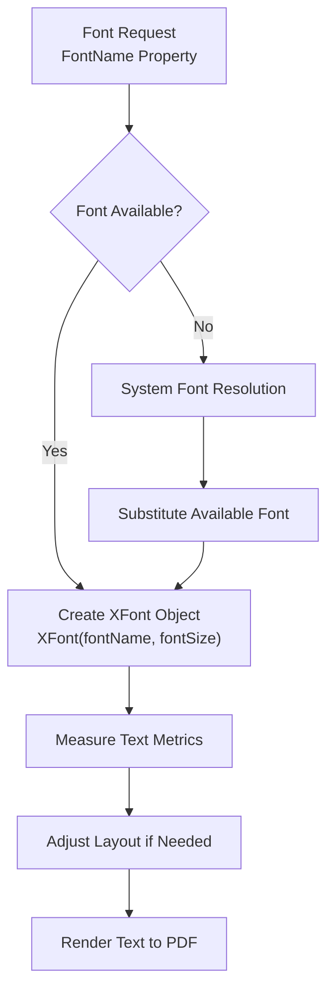
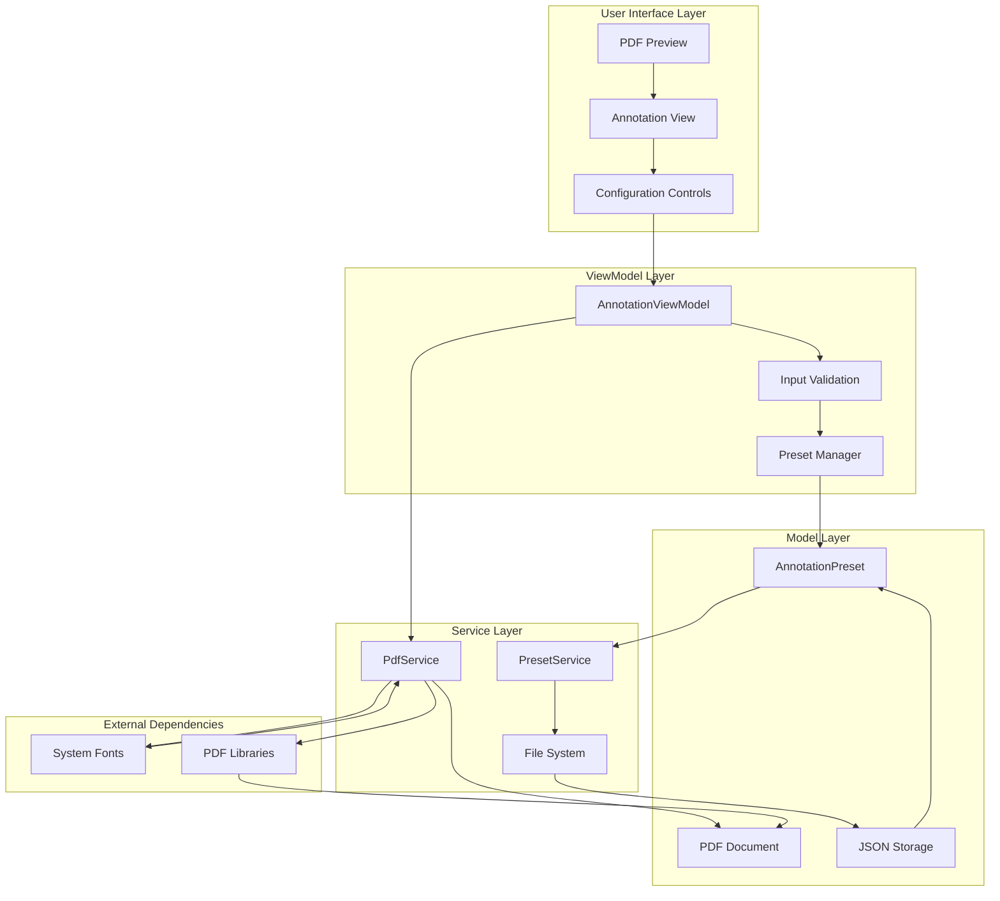

# AnnotationPreset Entity Documentation

<cite>
**Referenced Files in This Document**
- [AnnotationPreset.cs](file://src/PdfAnnotator.Core/Models/AnnotationPreset.cs)
- [Example.json](file://presets/annotation/Example.json)
- [PresetService.cs](file://src/PdfAnnotator.Core/Services/PresetService.cs)
- [AnnotationViewModel.cs](file://src/PdfAnnotator.ViewModels/AnnotationViewModel.cs)
- [PdfService.cs](file://src/PdfAnnotator.App/Services/PdfService.cs)
- [IPdfService.cs](file://src/PdfAnnotator.Core/Services/IPdfService.cs)
- [IPresetService.cs](file://src/PdfAnnotator.Core/Services/IPresetService.cs)
- [PresetServiceTests.cs](file://tests/PdfAnnotator.Tests/PresetServiceTests.cs)
- [AnnotationView.axaml.cs](file://src/PdfAnnotator.App/Views/AnnotationView.axaml.cs)
</cite>

## Table of Contents
1. [Introduction](#introduction)
2. [Entity Definition](#entity-definition)
3. [Properties Specification](#properties-specification)
4. [JSON Serialization Format](#json-serialization-format)
5. [Storage and Management](#storage-and-management)
6. [Application Workflow](#application-workflow)
7. [Integration with PdfService](#integration-with-pdfservic)
8. [UI Configuration](#ui-configuration)
9. [Coordinate System and Positioning](#coordinate-system-and-positioning)
10. [Font Availability Considerations](#font-availability-considerations)
11. [Complete Workflow Diagram](#complete-workflow-diagram)
12. [Best Practices](#best-practices)
13. [Troubleshooting](#troubleshooting)

## Introduction

The AnnotationPreset entity serves as a standardized configuration container for PDF annotation styling and positioning. It encapsulates all necessary parameters for consistent text rendering across multiple PDF pages, enabling users to define reusable annotation templates that maintain uniform appearance and placement throughout document processing workflows.

This entity plays a crucial role in the PDF annotation pipeline, providing a structured approach to managing text appearance, positioning, and rotation while supporting various font families and color schemes. The preset system ensures consistency across different annotation sessions and facilitates efficient batch processing of PDF documents.

## Entity Definition

The AnnotationPreset class is defined as a simple data transfer object containing six core properties that collectively describe the visual and positional characteristics of text annotations in PDF documents.



**Diagram sources**
- [AnnotationPreset.cs](file://src/PdfAnnotator.Core/Models/AnnotationPreset.cs#L3-L12)
- [PresetService.cs](file://src/PdfAnnotator.Core/Services/PresetService.cs#L6-L82)
- [AnnotationViewModel.cs](file://src/PdfAnnotator.ViewModels/AnnotationViewModel.cs#L15-L195)
- [PdfService.cs](file://src/PdfAnnotator.App/Services/PdfService.cs#L128-L155)

**Section sources**
- [AnnotationPreset.cs](file://src/PdfAnnotator.Core/Models/AnnotationPreset.cs#L3-L12)

## Properties Specification

### Core Positioning Properties

#### Name (string identifier)
- **Type**: `string`
- **Default Value**: `string.Empty`
- **Purpose**: Unique identifier for the preset configuration
- **Constraints**: Must be unique within the preset collection
- **Usage**: Used for preset selection and identification in the UI

#### TextX/TextY (position coordinates)
- **Type**: `double`
- **Purpose**: Absolute positioning coordinates for text placement
- **Coordinate System**: PDF page coordinates (0,0 at bottom-left corner)
- **Precision**: Double precision floating-point values
- **Relationship**: Together form the anchor point for text rendering

### Typography Properties

#### FontSize (text size in points)
- **Type**: `double`
- **Purpose**: Specifies the font size in points
- **Range**: Typically 6-72 points for standard PDF fonts
- **Unit**: Points (1 point = 1/72 inch)
- **Impact**: Directly affects text scaling and readability

#### Angle (rotation in degrees)
- **Type**: `double`
- **Purpose**: Rotation angle for text orientation
- **Range**: -360 to +360 degrees
- **Direction**: Positive values rotate counter-clockwise
- **Precision**: Double precision for smooth rotation

### Visual Properties

#### ColorHex (color in hexadecimal format)
- **Type**: `string`
- **Default Value**: `"#000000"`
- **Format**: Hexadecimal RGB color code with alpha channel
- **Supported Formats**: `#RRGGBB` or `#AARRGGBB`
- **Validation**: Supports both 6-digit and 8-digit hex formats

#### FontName (font family)
- **Type**: `string`
- **Default Value**: `"Helvetica"`
- **Purpose**: Specifies the font family for text rendering
- **Available Options**: Helvetica, Arial, Times New Roman (default fonts)
- **Fallback**: System font resolution handles unavailable fonts

**Section sources**
- [AnnotationPreset.cs](file://src/PdfAnnotator.Core/Models/AnnotationPreset.cs#L5-L11)

## JSON Serialization Format

The AnnotationPreset entity follows a standardized JSON format for persistence and interchange. The serialization process maintains backward compatibility while supporting future extensions.

### Standard JSON Schema

```json
{
  "name": "string",
  "textX": number,
  "textY": number,
  "fontSize": number,
  "angle": number,
  "color": "string",
  "fontName": "string"
}
```

### Property Mapping

| JSON Property | C# Property | Type | Description |
|---------------|-------------|------|-------------|
| `name` | `Name` | string | Unique preset identifier |
| `textX` | `TextX` | double | Horizontal position coordinate |
| `textY` | `TextY` | double | Vertical position coordinate |
| `fontSize` | `FontSize` | double | Font size in points |
| `angle` | `Angle` | double | Rotation angle in degrees |
| `color` | `ColorHex` | string | Hexadecimal color code |
| `fontName` | `FontName` | string | Font family name |

### Sample JSON Representation

```json
{
  "name": "ExampleAnnot",
  "textX": 120,
  "textY": 150,
  "fontSize": 12,
  "angle": 0,
  "color": "#000000",
  "fontName": "Helvetica"
}
```

### Serialization Configuration

The JSON serialization process utilizes .NET's built-in `System.Text.Json` with specific configuration:

- **Formatting**: Indented output for readability
- **Property Naming**: CamelCase to match JSON conventions
- **Null Handling**: Null values are omitted
- **Precision**: Full double precision maintained

**Section sources**
- [Example.json](file://presets/annotation/Example.json#L1-L10)
- [PresetService.cs](file://src/PdfAnnotator.Core/Services/PresetService.cs#L11-L14)

## Storage and Management

### Directory Structure

Annotation presets are stored in a dedicated directory structure that separates different types of configurations:

```
presets/
├── annotation/
│   ├── Example.json
│   ├── CustomStyle.json
│   └── ProfessionalTemplate.json
└── extraction/
    └── DefaultExtraction.json
```

### Storage Location

- **Base Directory**: `presets/annotation/`
- **File Pattern**: `{preset-name}.json`
- **Naming Convention**: Lowercase with underscores for readability
- **Character Restrictions**: Alphanumeric characters, underscores, hyphens

### Management Operations

The PresetService provides comprehensive management capabilities for annotation presets:

#### Creation and Persistence
- Automatic directory creation if missing
- Atomic write operations to prevent corruption
- Validation of preset uniqueness
- Error handling for file system operations

#### Loading and Discovery
- Recursive directory scanning for all JSON files
- Automatic deserialization with type safety
- Error recovery for corrupted or invalid files
- Collection sorting by preset name

#### Retrieval and Selection
- Asynchronous loading for responsive UI
- Filtering and searching capabilities
- Memory caching for frequently accessed presets
- Change notification support

**Section sources**
- [PresetService.cs](file://src/PdfAnnotator.Core/Services/PresetService.cs#L8-L28)
- [PresetService.cs](file://src/PdfAnnotator.Core/Services/PresetService.cs#L55-L82)

## Application Workflow

### Complete Preset Lifecycle

The AnnotationPreset follows a well-defined lifecycle from creation to application, involving multiple components and validation steps.



**Diagram sources**
- [AnnotationViewModel.cs](file://src/PdfAnnotator.ViewModels/AnnotationViewModel.cs#L122-L138)
- [PresetService.cs](file://src/PdfAnnotator.Core/Services/PresetService.cs#L23-L28)
- [PdfService.cs](file://src/PdfAnnotator.App/Services/PdfService.cs#L128-L155)

### Step-by-Step Process

#### 1. Configuration Phase
- User adjusts positioning controls (TextX, TextY)
- Typography settings modified (FontSize, FontName)
- Visual preferences configured (Angle, ColorHex)
- Preset naming and validation performed

#### 2. Persistence Phase
- ViewModel creates AnnotationPreset instance
- PresetService serializes to JSON format
- File written to appropriate directory
- Collection refreshed for immediate availability

#### 3. Application Phase
- Selected preset passed to PdfService
- Coordinate transformations applied
- Graphics context configured
- Text rendered with specified attributes
- Document saved with modifications

**Section sources**
- [AnnotationViewModel.cs](file://src/PdfAnnotator.ViewModels/AnnotationViewModel.cs#L122-L138)
- [AnnotationViewModel.cs](file://src/PdfAnnotator.ViewModels/AnnotationViewModel.cs#L170-L187)

## Integration with PdfService

### Rendering Pipeline

The PdfService integrates AnnotationPreset data into the PDF rendering pipeline through a series of coordinated transformations and drawing operations.



**Diagram sources**
- [PdfService.cs](file://src/PdfAnnotator.App/Services/PdfService.cs#L130-L155)

### Transformation Matrix Operations

The PdfService applies a series of geometric transformations to position and orient text according to the preset specification:

#### Coordinate Translation
- **Operation**: `gfx.TranslateTransform(preset.TextX, page.Height - preset.TextY)`
- **Purpose**: Moves drawing origin to specified position
- **Coordinate Adjustment**: Y-axis inverted for PDF coordinate system
- **Precision**: Maintains double precision throughout

#### Rotation Application
- **Condition**: `Math.Abs(preset.Angle) > 0.01`
- **Operation**: `gfx.RotateAtTransform(preset.Angle, new XPoint(0, 0))`
- **Center Point**: Origin (0,0) for local coordinate system
- **Direction**: Counter-clockwise rotation for positive angles

#### Font and Color Setup
- **Font Creation**: `new XFont(preset.FontName, preset.FontSize)`
- **Color Parsing**: `XColor.FromArgb(ParseColor(preset.ColorHex))`
- **Brush Creation**: `new XSolidBrush(color)`
- **Drawing**: `gfx.DrawString(row.Code, font, brush, new XPoint(0, 0))`

### Color Processing

The color conversion process handles various hexadecimal formats and ensures proper alpha channel interpretation:

#### Color Format Support
- **RGB Format**: `#RRGGBB` → Alpha assumed FF
- **ARGB Format**: `#AARRGGBB` → Full alpha transparency
- **Validation**: Automatic format detection and conversion

#### Conversion Process
1. Remove hash prefix if present
2. Expand 6-digit format to 8 digits (add FF prefix)
3. Parse hexadecimal string to integer
4. Create XColor object with ARGB values

**Section sources**
- [PdfService.cs](file://src/PdfAnnotator.App/Services/PdfService.cs#L139-L149)
- [PdfService.cs](file://src/PdfAnnotator.App/Services/PdfService.cs#L164-L177)

## UI Configuration

### Annotation Mode Interface

The AnnotationView provides an intuitive interface for configuring annotation presets through interactive controls and real-time preview capabilities.



**Diagram sources**
- [AnnotationView.axaml.cs](file://src/PdfAnnotator.App/Views/AnnotationView.axaml.cs#L13-L91)
- [AnnotationViewModel.cs](file://src/PdfAnnotator.ViewModels/AnnotationViewModel.cs#L15-L195)

### Interactive Configuration Controls

#### Position Control System
- **Mouse Interaction**: Click on PDF preview to set annotation position
- **Coordinate Mapping**: Automatic conversion from screen to PDF coordinates
- **Real-time Preview**: Immediate visual feedback of position changes
- **Scaling Support**: Handles different zoom levels and DPI settings

#### Typography Controls
- **Font Size Slider**: Range from 6 to 72 points with step increments
- **Font Family Dropdown**: Predefined font options (Helvetica, Arial, Times New Roman)
- **Color Picker**: Hexadecimal color input with preview
- **Rotation Control**: Degree slider from -360 to +360

#### Preset Management
- **Save Button**: Creates new preset from current settings
- **Load Button**: Refreshes preset collection from disk
- **Selection List**: Dropdown for choosing existing presets
- **Naming Convention**: Automatic timestamp-based naming for unsaved presets

### Event Handling and Data Binding

#### Mouse Position Events
- **Event Trigger**: Pointer pressed on PDF preview image
- **Coordinate Calculation**: Conversion from screen to bitmap space
- **PDF Coordinate Mapping**: Scaling based on image dimensions
- **Value Assignment**: Automatic update of TextX and TextY properties

#### Preset Application
- **Selection Change**: Automatic application of selected preset values
- **Property Synchronization**: Bidirectional binding between UI and model
- **Validation**: Input validation for numeric and color values
- **Error Handling**: Graceful degradation for invalid inputs

**Section sources**
- [AnnotationView.axaml.cs](file://src/PdfAnnotator.App/Views/AnnotationView.axaml.cs#L27-L38)
- [AnnotationViewModel.cs](file://src/PdfAnnotator.ViewModels/AnnotationViewModel.cs#L47-L56)

## Coordinate System and Positioning

### PDF Coordinate System

The AnnotationPreset operates within the standard PDF coordinate system, which differs from typical screen coordinate systems commonly used in UI development.

#### Coordinate System Characteristics
- **Origin**: Bottom-left corner (0,0)
- **X-axis**: Rightward direction increases values
- **Y-axis**: Upward direction increases values
- **Units**: Points (1 point = 1/72 inch)
- **Scale**: Consistent across all PDF pages

#### Coordinate Transformation

The system implements automatic coordinate transformation to accommodate different display contexts:



**Diagram sources**
- [AnnotationView.axaml.cs](file://src/PdfAnnotator.App/Views/AnnotationView.axaml.cs#L73-L89)

#### Position Precision and Accuracy

- **Double Precision**: All coordinates use double-precision floating-point
- **Sub-pixel Accuracy**: Supports fractional point values for fine positioning
- **Boundary Validation**: Coordinates validated against page dimensions
- **Overflow Handling**: Graceful handling of out-of-bounds positions

### Positioning Strategies

#### Anchor Point System
- **Primary Anchor**: Specified by TextX and TextY coordinates
- **Text Alignment**: Baseline alignment for consistent text appearance
- **Rotation Center**: Anchor point remains fixed during rotation
- **Multi-page Consistency**: Same anchor point across all document pages

#### Layout Considerations
- **Margin Awareness**: Coordinate system accounts for PDF margins
- **Content Area**: Focus on usable content area rather than full page
- **Overlap Prevention**: Manual adjustment required for overlapping annotations
- **Responsive Design**: Coordinates scale with page dimensions

**Section sources**
- [AnnotationView.axaml.cs](file://src/PdfAnnotator.App/Views/AnnotationView.axaml.cs#L73-L89)
- [PdfService.cs](file://src/PdfAnnotator.App/Services/PdfService.cs#L143-L144)

## Font Availability Considerations

### Font Support Architecture

The AnnotationPreset system provides flexible font handling that accommodates various font availability scenarios across different operating systems and PDF viewers.

#### Default Font Stack
- **Primary Font**: Helvetica (default, widely supported)
- **Secondary Fonts**: Arial (Windows fallback), Times New Roman (Mac fallback)
- **System Resolution**: Automatic font substitution for unavailable fonts
- **Font Metrics**: Consistent sizing across different font families

#### Font Loading Process



**Diagram sources**
- [PdfService.cs](file://src/PdfAnnotator.App/Services/PdfService.cs#L143)

#### Font Compatibility Matrix

| Font Family | Platform Support | PDF Embedding | Recommended Use |
|-------------|------------------|---------------|-----------------|
| Helvetica | Universal | Yes | Default choice |
| Arial | Windows | Yes | Primary Windows alternative |
| Times New Roman | Mac/Linux | Yes | Primary Mac alternative |
| Courier | Universal | Yes | Monospace option |
| Custom Fonts | Variable | Conditional | Requires embedding |

#### Font Rendering Quality

- **Anti-aliasing**: Enabled for smooth text rendering
- **Hinting**: Optimized for screen and print quality
- **Metrics Preservation**: Accurate character spacing and kerning
- **Size Adaptation**: Responsive scaling for different font sizes

### Font Configuration Best Practices

#### Selection Guidelines
- **Readability Priority**: Choose fonts with good legibility at target sizes
- **Platform Consistency**: Test across different operating systems
- **PDF Compatibility**: Verify font embedding capabilities
- **Accessibility**: Consider font choices for accessibility requirements

#### Performance Considerations
- **Font Caching**: System-level font caching reduces memory usage
- **Subset Embedding**: Only embedded fonts needed for specific characters
- **Memory Management**: Efficient cleanup of font resources
- **Rendering Speed**: Balanced quality vs. performance trade-offs

**Section sources**
- [AnnotationViewModel.cs](file://src/PdfAnnotator.ViewModels/AnnotationViewModel.cs#L56-L57)
- [PdfService.cs](file://src/PdfAnnotator.App/Services/PdfService.cs#L143)

## Complete Workflow Diagram

### End-to-End Process Flow

The complete workflow encompasses user interaction, data persistence, and PDF generation in a seamless integrated process.



**Diagram sources**
- [AnnotationViewModel.cs](file://src/PdfAnnotator.ViewModels/AnnotationViewModel.cs#L15-L195)
- [PresetService.cs](file://src/PdfAnnotator.Core/Services/PresetService.cs#L6-L82)
- [PdfService.cs](file://src/PdfAnnotator.App/Services/PdfService.cs#L128-L155)

### Workflow Phases

#### Phase 1: Configuration and Creation
1. User interacts with UI controls to set annotation parameters
2. ViewModel validates inputs and creates AnnotationPreset instance
3. PresetService serializes and persists configuration to JSON file
4. Preset collection refreshed for immediate availability

#### Phase 2: Application and Rendering
1. User selects generated preset for PDF processing
2. PdfService loads preset data and applies transformations
3. Graphics context configured with font, color, and positioning
4. Text rendered to PDF document with specified attributes

#### Phase 3: Output and Persistence
1. Modified PDF saved to output directory
2. Success notification displayed to user
3. Log entries created for audit trail
4. Resources cleaned up and disposed appropriately

**Section sources**
- [AnnotationViewModel.cs](file://src/PdfAnnotator.ViewModels/AnnotationViewModel.cs#L122-L187)
- [PresetService.cs](file://src/PdfAnnotator.Core/Services/PresetService.cs#L23-L28)

## Best Practices

### Preset Design Guidelines

#### Naming Conventions
- **Descriptive Names**: Use meaningful names that indicate preset purpose
- **Consistent Formatting**: Adopt camelCase or snake_case consistently
- **Version Control**: Include version numbers for iterative improvements
- **Category Prefixes**: Use prefixes to group related presets (e.g., "Form_", "Header_")

#### Parameter Optimization
- **Reasonable Ranges**: Keep coordinates within page boundaries
- **Font Size Limits**: Use sizes between 6 and 72 points for optimal readability
- **Angle Constraints**: Limit rotation to ±360 degrees for practical applications
- **Color Accessibility**: Choose colors with sufficient contrast ratios

#### Reusability Patterns
- **Modular Design**: Create presets for common annotation types
- **Parameter Variants**: Develop base presets with customizable parameters
- **Template Systems**: Establish template hierarchies for consistent styling
- **Documentation**: Include comments or metadata for preset purposes

### Performance Optimization

#### Memory Management
- **Object Pooling**: Reuse AnnotationPreset instances where possible
- **Lazy Loading**: Load presets only when needed
- **Resource Cleanup**: Dispose graphics contexts properly
- **Caching Strategies**: Cache frequently used presets in memory

#### File System Efficiency
- **Atomic Writes**: Use temporary files for atomic preset updates
- **Directory Organization**: Maintain clean directory structures
- **Backup Strategies**: Implement backup mechanisms for critical presets
- **Cleanup Procedures**: Regular cleanup of orphaned or invalid files

### Error Handling and Validation

#### Input Validation
- **Range Checking**: Validate numeric parameters against reasonable ranges
- **Format Verification**: Ensure color hex codes follow expected formats
- **Font Availability**: Check font availability before applying presets
- **Coordinate Bounds**: Verify positions remain within page dimensions

#### Recovery Mechanisms
- **Default Fallbacks**: Provide sensible defaults for invalid inputs
- **Graceful Degradation**: Continue operation with reduced functionality when possible
- **Error Logging**: Comprehensive logging for debugging and monitoring
- **User Feedback**: Clear error messages and recovery suggestions

**Section sources**
- [PresetServiceTests.cs](file://tests/PdfAnnotator.Tests/PresetServiceTests.cs#L26-L44)
- [AnnotationViewModel.cs](file://src/PdfAnnotator.ViewModels/AnnotationViewModel.cs#L122-L138)

## Troubleshooting

### Common Issues and Solutions

#### Preset Loading Problems

**Issue**: Presets fail to load from storage
- **Symptoms**: Empty preset list despite existing files
- **Causes**: JSON parsing errors, file permission issues, corrupted files
- **Solution**: Check file permissions, validate JSON syntax, review error logs
- **Prevention**: Implement robust error handling and file validation

**Issue**: Preset values not persisting
- **Symptoms**: Changes lost after application restart
- **Causes**: File write failures, concurrent access issues, disk space problems
- **Solution**: Verify write permissions, check available disk space, implement retry logic
- **Prevention**: Use atomic write operations and backup mechanisms

#### Rendering and Display Issues

**Issue**: Text appears in wrong position
- **Symptoms**: Annotations misplaced or off-screen
- **Causes**: Coordinate system confusion, scaling errors, DPI mismatches
- **Solution**: Verify coordinate calculations, check display scaling settings
- **Prevention**: Implement coordinate validation and testing across different displays

**Issue**: Font rendering problems
- **Symptoms**: Missing characters, incorrect sizing, poor quality
- **Causes**: Unavailable fonts, embedding issues, platform differences
- **Solution**: Use widely available fonts, enable font embedding, test across platforms
- **Prevention**: Implement font fallback mechanisms and quality checks

#### Performance and Stability

**Issue**: Slow preset switching
- **Symptoms**: Delayed response when changing presets
- **Causes**: Large preset files, inefficient loading, UI thread blocking
- **Solution**: Optimize file sizes, implement asynchronous loading, improve UI responsiveness
- **Prevention**: Monitor performance metrics and implement caching strategies

**Issue**: Memory leaks in long-running sessions
- **Symptoms**: Increasing memory usage over time
- **Causes**: Unclosed resources, event handler leaks, cache overflow
- **Solution**: Review resource disposal patterns, monitor memory usage, implement cleanup routines
- **Prevention**: Follow proper disposal patterns and implement resource monitoring

### Debugging Techniques

#### Logging and Monitoring
- **Enable Verbose Logging**: Increase log levels for detailed troubleshooting
- **Track File Operations**: Monitor preset file read/write operations
- **Monitor Resource Usage**: Track memory and CPU consumption during operations
- **Exception Tracking**: Capture and analyze exception patterns

#### Testing and Validation
- **Unit Tests**: Run preset service tests to verify core functionality
- **Integration Tests**: Test complete workflow from UI to PDF generation
- **Visual Inspection**: Manually verify rendered PDF output quality
- **Cross-platform Testing**: Validate behavior across different operating systems

**Section sources**
- [PresetService.cs](file://src/PdfAnnotator.Core/Services/PresetService.cs#L43-L52)
- [PdfService.cs](file://src/PdfAnnotator.App/Services/PdfService.cs#L164-L177)