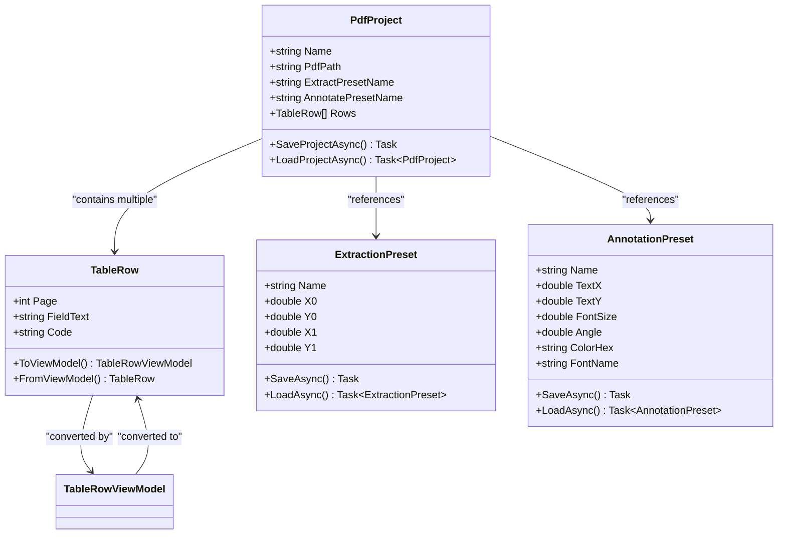
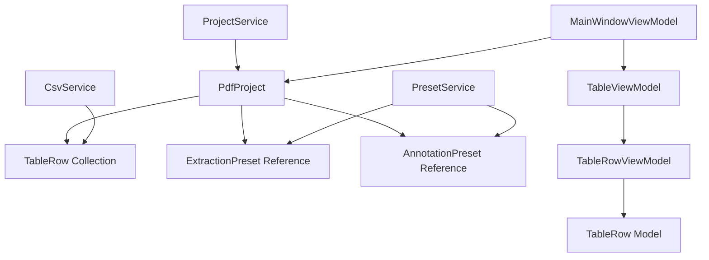
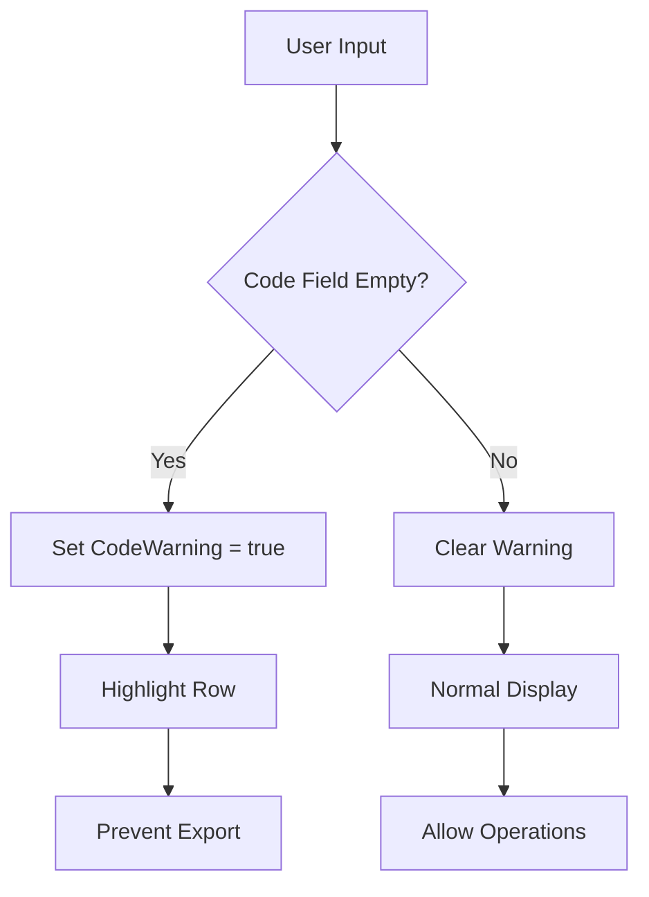
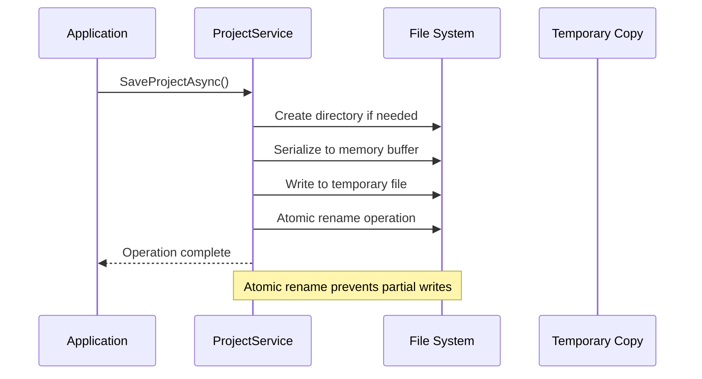
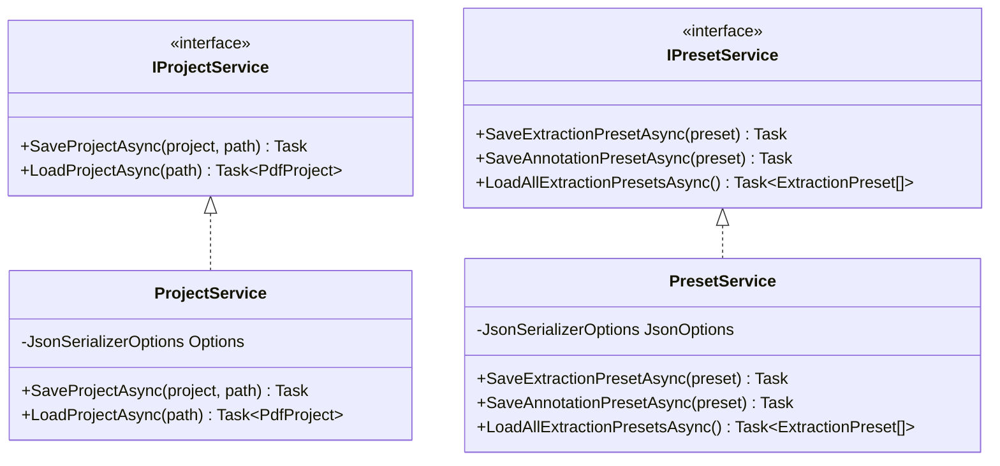

# Data Models

<cite>
**Referenced Files in This Document**
- [TableRow.cs](file://src/PdfAnnotator.Core/Models/TableRow.cs)
- [PdfProject.cs](file://src/PdfAnnotator.Core/Models/PdfProject.cs)
- [ExtractionPreset.cs](file://src/PdfAnnotator.Core/Models/ExtractionPreset.cs)
- [AnnotationPreset.cs](file://src/PdfAnnotator.Core/Models/AnnotationPreset.cs)
- [ProjectService.cs](file://src/PdfAnnotator.Core/Services/ProjectService.cs)
- [PresetService.cs](file://src/PdfAnnotator.Core/Services/PresetService.cs)
- [CsvService.cs](file://src/PdfAnnotator.Core/Services/CsvService.cs)
- [TableViewModel.cs](file://src/PdfAnnotator.ViewModels/TableViewModel.cs)
- [TableRowViewModel.cs](file://src/PdfAnnotator.ViewModels/TableRowViewModel.cs)
- [IProjectService.cs](file://src/PdfAnnotator.Core/Services/IProjectService.cs)
- [IPresetService.cs](file://src/PdfAnnotator.Core/Services/IPresetService.cs)
- [ICsvService.cs](file://src/PdfAnnotator.Core/Services/ICsvService.cs)
- [Example.json](file://presets/extraction/Example.json)
- [Example.json](file://presets/annotation/Example.json)
- [SampleProject.json](file://projects/SampleProject.json)
</cite>

## Table of Contents
1. [Introduction](#introduction)
2. [Core Data Models](#core-data-models)
3. [TableRow Model](#tablerow-model)
4. [PdfProject Model](#pdfproject-model)
5. [ExtractionPreset Model](#extractionpreset-model)
6. [AnnotationPreset Model](#annotationpreset-model)
7. [Model Relationships and Usage](#model-relationships-and-usage)
8. [Serialization and Persistence](#serialization-and-persistence)
9. [Validation and Constraints](#validation-and-constraints)
10. [File-Based Storage Architecture](#file-based-storage-architecture)
11. [Best Practices and Design Patterns](#best-practices-and-design-patterns)

## Introduction

The PDF Annotator application utilizes a comprehensive data model architecture built around four primary entities that work together to capture and persist application state. These models form the foundation for text extraction, annotation, project management, and data persistence. Each model serves a specific purpose while maintaining clear separation of concerns and enabling efficient file-based storage through JSON serialization.

The data model system follows established design patterns including the Repository pattern for persistence, ViewModel pattern for UI binding, and Factory pattern for model creation. All models support bidirectional JSON serialization, ensuring seamless data exchange between the application and persistent storage.

## Core Data Models

The application's data architecture consists of four fundamental models that represent different aspects of the PDF annotation workflow:



**Diagram sources**
- [PdfProject.cs](file://src/PdfAnnotator.Core/Models/PdfProject.cs#L5-L12)
- [TableRow.cs](file://src/PdfAnnotator.Core/Models/TableRow.cs#L3-L8)
- [ExtractionPreset.cs](file://src/PdfAnnotator.Core/Models/ExtractionPreset.cs#L3-L10)
- [AnnotationPreset.cs](file://src/PdfAnnotator.Core/Models/AnnotationPreset.cs#L3-L12)

## TableRow Model

The `TableRow` model represents individual data entries extracted from PDF documents. It serves as the fundamental building block for tabular data representation within the application.

### Properties and Data Types

| Property | Type | Description | Default Value | Validation |
|----------|------|-------------|---------------|------------|
| `Page` | `int` | PDF page number where text was extracted | - | Must be positive integer |
| `FieldText` | `string` | Extracted text content | `string.Empty` | Can be empty but validated in ViewModels |
| `Code` | `string` | Associated identifier or code | `string.Empty` | Used for validation in UI |

### Role in Data Architecture

The TableRow model acts as a pure data container that captures essential information about extracted text regions. It maintains a simple structure focused solely on representing the extracted data without any business logic or validation rules.

### Usage Context

TableRow instances are primarily used within the `PdfProject` model to maintain collections of extracted data. They serve as the bridge between the extraction process and the project persistence layer. The model supports conversion to and from ViewModel representations for UI binding scenarios.

**Section sources**
- [TableRow.cs](file://src/PdfAnnotator.Core/Models/TableRow.cs#L1-L9)
- [TableRowViewModel.cs](file://src/PdfAnnotator.ViewModels/TableRowViewModel.cs#L29-L46)

## PdfProject Model

The `PdfProject` model encapsulates the complete state of a PDF annotation project, serving as the central coordination entity that ties together all aspects of the annotation workflow.

### Structure and Properties

| Property | Type | Description | Default Value | Purpose |
|----------|------|-------------|---------------|---------|
| `Name` | `string` | Project display name | `string.Empty` | Human-readable project identifier |
| `PdfPath` | `string` | Relative path to PDF file | `string.Empty` | References source document |
| `ExtractPresetName` | `string` | Associated extraction preset | `string.Empty` | Defines extraction boundaries |
| `AnnotatePresetName` | `string` | Associated annotation preset | `string.Empty` | Controls annotation appearance |
| `Rows` | `List<TableRow>` | Collection of extracted data | `new List<TableRow>()` | Contains all extracted entries |

### Complete Application State Capture

The PdfProject model represents the complete state required to resume annotation work, including:
- **Document Reference**: Maintains link to original PDF file
- **Extraction Configuration**: Stores which extraction preset was used
- **Annotation Configuration**: Tracks annotation styling preferences
- **Extracted Data**: Preserves all extracted text entries with their metadata

### Persistence Behavior

The model supports automatic initialization of the `Rows` collection during deserialization, ensuring robust handling of legacy or corrupted project files. This design prevents null reference exceptions and maintains data integrity.

**Section sources**
- [PdfProject.cs](file://src/PdfAnnotator.Core/Models/PdfProject.cs#L1-L13)
- [ProjectService.cs](file://src/PdfAnnotator.Core/Services/ProjectService.cs#L38-L40)

## ExtractionPreset Model

The `ExtractionPreset` model defines rectangular regions within PDF documents used for automated text extraction. It represents a reusable configuration that specifies precise coordinates for extraction areas.

### Rectangular Region Definition

The model uses a coordinate system based on PDF page dimensions with the origin (0,0) at the bottom-left corner:

| Coordinate | Type | Description | Usage |
|------------|------|-------------|-------|
| `X0` | `double` | Left boundary X-coordinate | Horizontal start position |
| `Y0` | `double` | Bottom boundary Y-coordinate | Vertical start position |
| `X1` | `double` | Right boundary X-coordinate | Horizontal end position |
| `Y1` | `double` | Top boundary Y-coordinate | Vertical end position |

### JSON Serialization Format

The ExtractionPreset uses a compact JSON representation optimized for storage and readability:

```json
{
  "name": "ExampleExtract",
  "x0": 100.0,
  "y0": 100.0,
  "x1": 300.0,
  "y1": 200.0
}
```

### Coordinate System and Units

The coordinate system follows PDF standards where:
- Coordinates are measured in points (1/72 inch)
- Origin (0,0) is at bottom-left of page
- Positive X-axis extends rightward
- Positive Y-axis extends upward
- Values are floating-point for precision

### Usage in Text Extraction

Extraction presets enable consistent and repeatable text extraction across multiple documents by defining standardized regions. The rectangular boundaries allow precise targeting of specific areas containing structured data.

**Section sources**
- [ExtractionPreset.cs](file://src/PdfAnnotator.Core/Models/ExtractionPreset.cs#L1-L11)
- [PresetService.cs](file://src/PdfAnnotator.Core/Services/PresetService.cs#L16-L20)
- [Example.json](file://presets/extraction/Example.json#L1-L8)

## AnnotationPreset Model

The `AnnotationPreset` model controls the visual presentation and positioning of annotations within PDF documents. It provides comprehensive styling capabilities for consistent annotation appearance.

### Styling and Positioning Fields

| Property | Type | Description | Default Value | Range/Format |
|----------|------|-------------|---------------|--------------|
| `Name` | `string` | Preset display name | `string.Empty` | Human-readable identifier |
| `TextX` | `double` | Horizontal position | - | PDF coordinate system |
| `TextY` | `double` | Vertical position | - | PDF coordinate system |
| `FontSize` | `double` | Text size in points | - | Positive numeric values |
| `Angle` | `double` | Rotation angle in degrees | - | -360° to +360° |
| `ColorHex` | `string` | Hexadecimal color code | `"#000000"` | `#RRGGBB` format |
| `FontName` | `string` | Font family name | `"Helvetica"` | Standard font names |

### Consistent Annotation Control

The AnnotationPreset enables uniform annotation appearance across all documents by:
- **Positioning**: Precise control over annotation placement
- **Typography**: Standardized font selection and sizing
- **Visual Appearance**: Consistent color schemes and rotation
- **Reusability**: Shareable configurations across projects

### Default Values and Standards

The model establishes sensible defaults for common annotation scenarios:
- **Black Text**: Default color ensures good contrast
- **Helvetica Font**: Universally available font family
- **Zero Rotation**: Default orientation for horizontal text
- **Empty Name**: Allows for flexible naming strategies

### JSON Serialization Format

The AnnotationPreset uses a comprehensive JSON structure that captures all styling aspects:

```json
{
  "name": "ExampleAnnot",
  "textX": 120.0,
  "textY": 150.0,
  "fontSize": 12.0,
  "angle": 0.0,
  "color": "#000000",
  "fontName": "Helvetica"
}
```

**Section sources**
- [AnnotationPreset.cs](file://src/PdfAnnotator.Core/Models/AnnotationPreset.cs#L1-L13)
- [PresetService.cs](file://src/PdfAnnotator.Core/Services/PresetService.cs#L23-L27)
- [Example.json](file://presets/annotation/Example.json#L1-L10)

## Model Relationships and Usage

The data models establish clear hierarchical relationships that reflect the application's functional architecture. Understanding these relationships is crucial for proper data manipulation and persistence.

### Hierarchical Structure



**Diagram sources**
- [PdfProject.cs](file://src/PdfAnnotator.Core/Models/PdfProject.cs#L11)
- [TableViewModel.cs](file://src/PdfAnnotator.ViewModels/TableViewModel.cs#L23)
- [ProjectService.cs](file://src/PdfAnnotator.Core/Services/ProjectService.cs#L13-L22)
- [PresetService.cs](file://src/PdfAnnotator.Core/Services/PresetService.cs#L16-L27)

### Service Layer Integration

Each model integrates with specific service layers that handle persistence, validation, and business logic:

- **ProjectService**: Manages PdfProject lifecycle and JSON persistence
- **PresetService**: Handles ExtractionPreset and AnnotationPreset storage
- **CsvService**: Processes TableRow collections for CSV export/import
- **TableViewModel**: Provides UI binding and validation for TableRow data

### ViewModel Pattern Implementation

The application employs the ViewModel pattern to separate data models from UI concerns:

- **TableRowViewModel**: Adds validation logic and UI state
- **TableViewModel**: Manages collections and commands
- **MainWindowViewModel**: Coordinates overall application state

**Section sources**
- [TableViewModel.cs](file://src/PdfAnnotator.ViewModels/TableViewModel.cs#L36-L48)
- [TableRowViewModel.cs](file://src/PdfAnnotator.ViewModels/TableRowViewModel.cs#L29-L46)

## Serialization and Persistence

The application implements comprehensive JSON serialization using .NET's System.Text.Json library, ensuring reliable data persistence and cross-platform compatibility.

### JSON Serialization Configuration

The serialization system uses consistent formatting options across all models:

```csharp
private static readonly JsonSerializerOptions Options = new()
{
    WriteIndented = true
};
```

This configuration produces human-readable JSON with proper indentation, facilitating debugging and manual editing when necessary.

### File-Based Storage Strategy

The application employs a structured file system approach for data persistence:

| Model Type | Storage Location | File Pattern | Format |
|------------|------------------|--------------|--------|
| PdfProject | `projects/` | `{project-name}.json` | Full project state |
| ExtractionPreset | `presets/extraction/` | `{preset-name}.json` | Extraction configuration |
| AnnotationPreset | `presets/annotation/` | `{preset-name}.json` | Annotation styling |
| TableRow | CSV files | `tables/latest.csv` | Tabular data export |

### Data Integrity Measures

The serialization system implements several data integrity safeguards:

- **Null Handling**: Automatic initialization of collections during deserialization
- **Type Safety**: Strongly-typed property mapping preventing invalid data
- **Validation**: Business logic enforcement through service layers
- **Backup Strategy**: Separate file locations prevent data corruption

### Cross-Platform Compatibility

JSON serialization ensures platform independence by:
- Using standard text encoding (UTF-8)
- Employing universal date/time formats
- Supporting international character sets
- Maintaining consistent numeric precision

**Section sources**
- [ProjectService.cs](file://src/PdfAnnotator.Core/Services/ProjectService.cs#L8-L11)
- [PresetService.cs](file://src/PdfAnnotator.Core/Services/PresetService.cs#L11-L14)
- [CsvService.cs](file://src/PdfAnnotator.Core/Services/CsvService.cs#L10)

## Validation and Constraints

The data models implement validation at multiple levels to ensure data integrity and prevent runtime errors.

### Model-Level Validation

Each model enforces basic constraints through property setters and business logic:

#### TableRow Validation Rules
- **Page Number**: Must be positive integer (validated in ViewModel)
- **FieldText**: Can be empty but should contain meaningful content
- **Code**: Empty by default, but may be required for specific workflows

#### ExtractionPreset Constraints
- **Coordinates**: No explicit bounds checking (assumes valid PDF coordinates)
- **Names**: Must be non-empty for identification purposes
- **Regions**: X1 > X0 and Y1 > Y0 (enforced in extraction logic)

#### AnnotationPreset Defaults
- **ColorHex**: Must follow `#RRGGBB` format (validated in service layer)
- **FontName**: Must be valid font family name (service layer validation)
- **Dimensions**: Positive numeric values for positioning and sizing

### ViewModel-Level Validation

The ViewModel layer implements UI-specific validation rules:



**Diagram sources**
- [TableRowViewModel.cs](file://src/PdfAnnotator.ViewModels/TableRowViewModel.cs#L15-L22)

### Service Layer Validation

Services implement additional validation for business logic compliance:

- **Project Loading**: Validates file existence and JSON structure
- **Preset Loading**: Ensures required properties are present
- **CSV Import**: Validates header format and data consistency

### Error Handling Strategies

The application implements comprehensive error handling:

- **Graceful Degradation**: Null-initialized collections prevent crashes
- **User Feedback**: Validation warnings appear in UI for immediate correction
- **Logging**: All validation failures are logged for debugging
- **Recovery**: Default values ensure minimal disruption

**Section sources**
- [TableRowViewModel.cs](file://src/PdfAnnotator.ViewModels/TableRowViewModel.cs#L15-L22)
- [ProjectService.cs](file://src/PdfAnnotator.Core/Services/ProjectService.cs#L25-L40)
- [CsvService.cs](file://src/PdfAnnotator.Core/Services/CsvService.cs#L32-L73)

## File-Based Storage Architecture

The application implements a sophisticated file-based storage system that separates concerns between data models, persistence logic, and file management.

### Directory Structure Organization

The storage architecture follows a logical directory hierarchy:

```
PDFAnnotator/
├── projects/           # Project state files
├── presets/
│   ├── extraction/     # Text extraction configurations
│   └── annotation/     # Annotation styling configurations
└── tables/            # CSV export/import files
```

### File Naming Conventions

Each model type follows specific naming patterns:

- **Projects**: `{project-name}.json` - Human-readable project identifiers
- **Presets**: `{preset-name}.json` - Descriptive preset names
- **Tables**: `latest.csv` - Single file for temporary table data

### Atomic Operations and Data Safety

The persistence system implements atomic operations to prevent data corruption:



**Diagram sources**
- [ProjectService.cs](file://src/PdfAnnotator.Core/Services/ProjectService.cs#L15-L22)

### Backup and Recovery Mechanisms

The file system architecture supports several recovery strategies:

- **Atomic Writes**: Prevent partial file corruption during save operations
- **Directory Creation**: Automatic creation of required directory structures
- **File Existence Checks**: Validation before loading operations
- **Default Initialization**: Safe fallback values for missing data

### Performance Considerations

The storage system optimizes for different usage patterns:

- **Lazy Loading**: Presets are loaded only when referenced
- **Memory Efficiency**: Streaming JSON serialization for large datasets
- **Caching Strategy**: In-memory caching of frequently accessed presets
- **Asynchronous Operations**: Non-blocking I/O for responsive UI

**Section sources**
- [ProjectService.cs](file://src/PdfAnnotator.Core/Services/ProjectService.cs#L15-L22)
- [PresetService.cs](file://src/PdfAnnotator.Core/Services/PresetService.cs#L16-L27)
- [CsvService.cs](file://src/PdfAnnotator.Core/Services/CsvService.cs#L13-L30)

## Best Practices and Design Patterns

The data model architecture demonstrates several established software engineering principles and design patterns that ensure maintainability, extensibility, and reliability.

### Repository Pattern Implementation

The service layer implements the Repository pattern for data access:



**Diagram sources**
- [IProjectService.cs](file://src/PdfAnnotator.Core/Services/IProjectService.cs#L6-L10)
- [ProjectService.cs](file://src/PdfAnnotator.Core/Services/ProjectService.cs#L6-L42)
- [IPresetService.cs](file://src/PdfAnnotator.Core/Services/IPresetService.cs#L7-L14)
- [PresetService.cs](file://src/PdfAnnotator.Core/Services/PresetService.cs#L6-L81)

### Factory Pattern for Model Creation

The ViewModel system uses factory methods for model creation:

- **FromModel**: Converts model to ViewModel for UI binding
- **ToModel**: Converts ViewModel back to model for persistence
- **Static Factory Methods**: Centralized creation logic with validation

### Separation of Concerns

The architecture maintains clear separation between:
- **Data Models**: Pure data containers with no business logic
- **Services**: Business logic and persistence operations
- **ViewModels**: UI-specific logic and data binding
- **Views**: Presentation layer only

### Extensibility Design

The model architecture supports future enhancements through:

- **Interface-Based Design**: Easy mocking and testing
- **Open/Closed Principle**: New model types can be added without modifying existing code
- **Strategy Pattern**: Different serialization strategies for various data types
- **Plugin Architecture**: New preset types can be added easily

### Testing and Maintainability

The design facilitates comprehensive testing through:
- **Dependency Injection**: Easy service mocking in unit tests
- **Immutable Models**: Predictable behavior in test scenarios
- **Clear Contracts**: Well-defined interfaces for testing boundaries
- **Consistent Patterns**: Uniform approach across all model types

**Section sources**
- [ProjectService.cs](file://src/PdfAnnotator.Core/Services/ProjectService.cs#L1-L43)
- [PresetService.cs](file://src/PdfAnnotator.Core/Services/PresetService.cs#L1-L82)
- [TableViewModel.cs](file://src/PdfAnnotator.ViewModels/TableViewModel.cs#L1-L71)
- [TableRowViewModel.cs](file://src/PdfAnnotator.ViewModels/TableRowViewModel.cs#L1-L47)