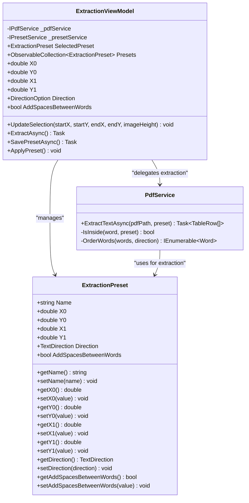
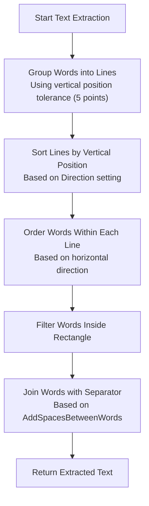
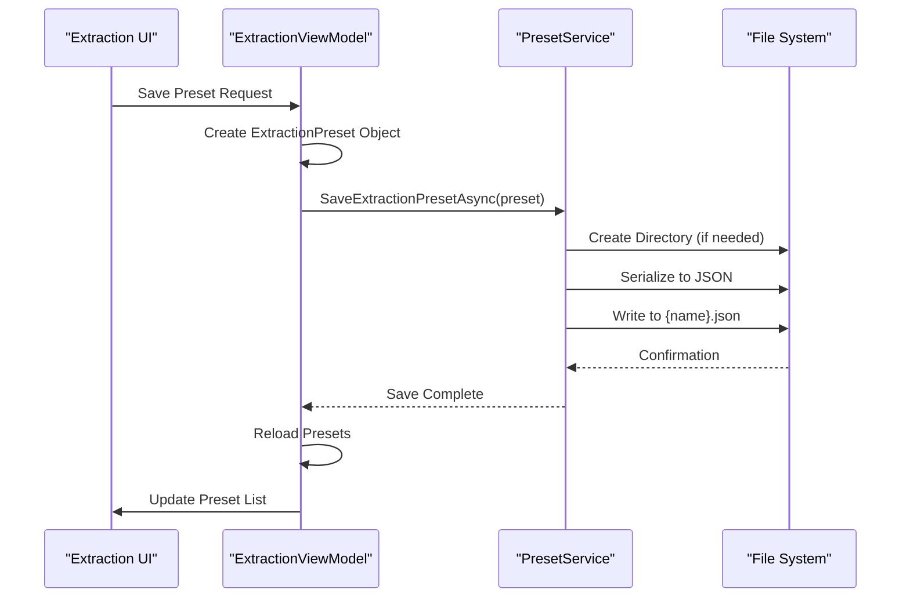
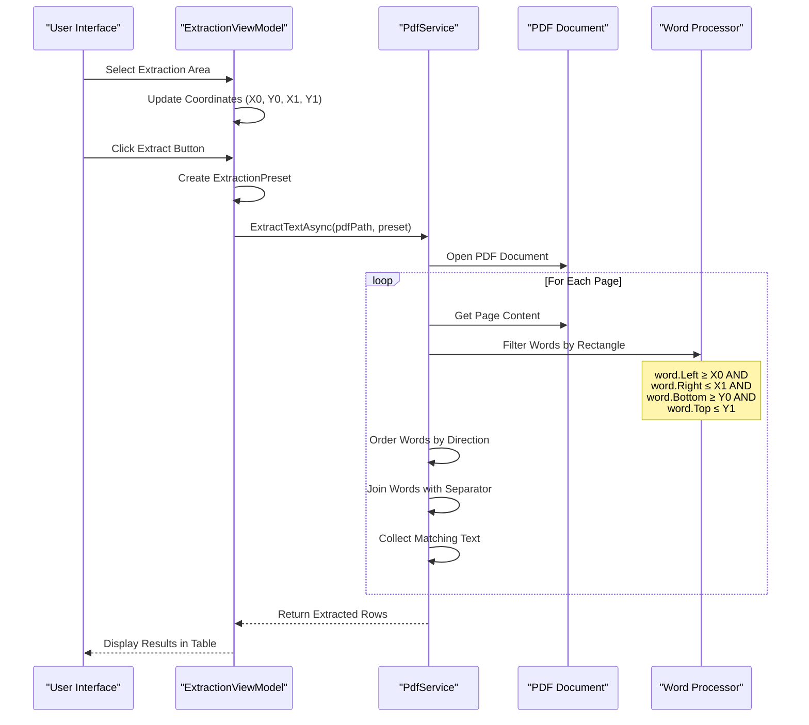
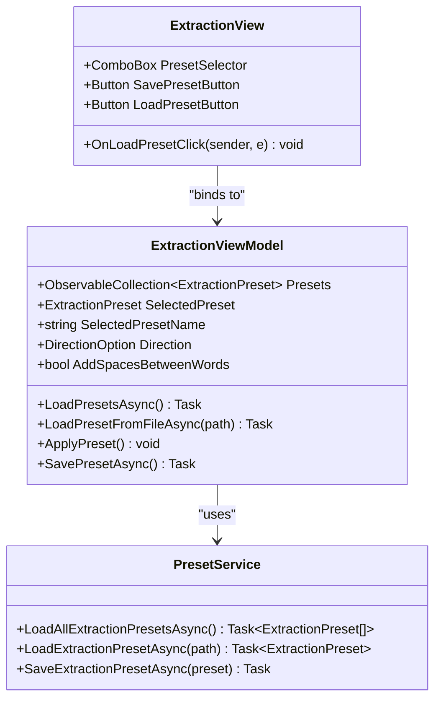
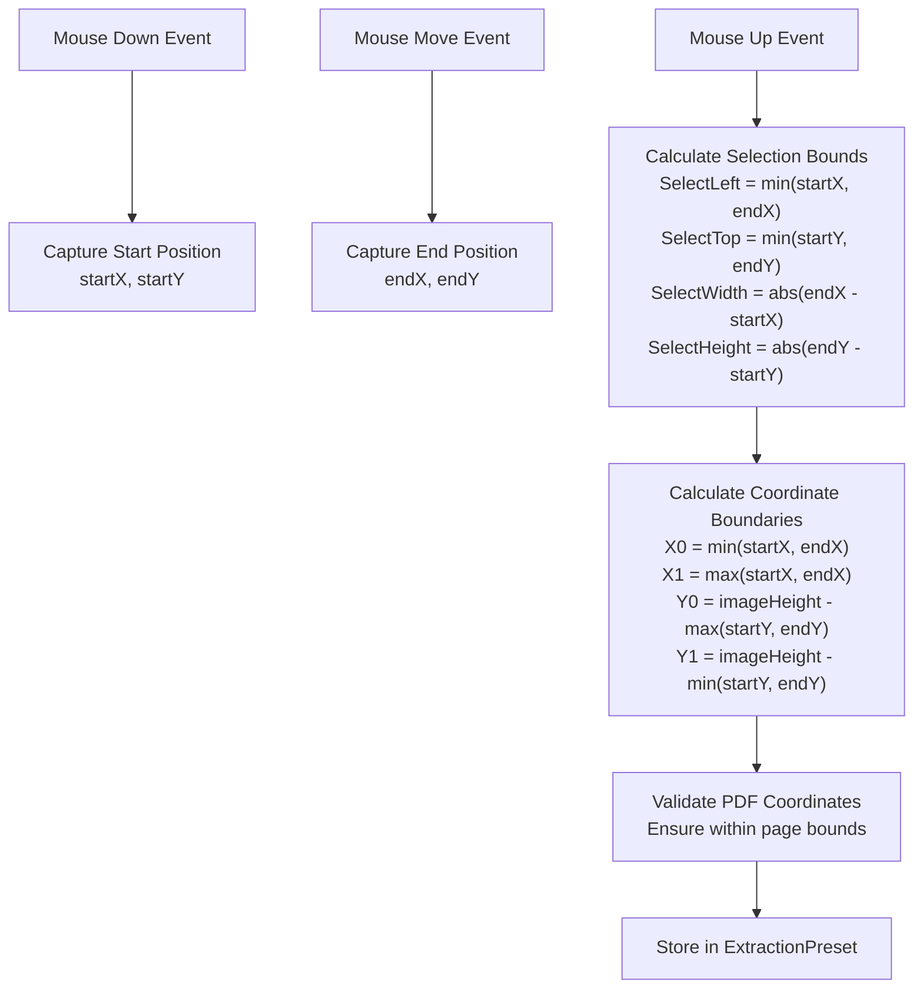
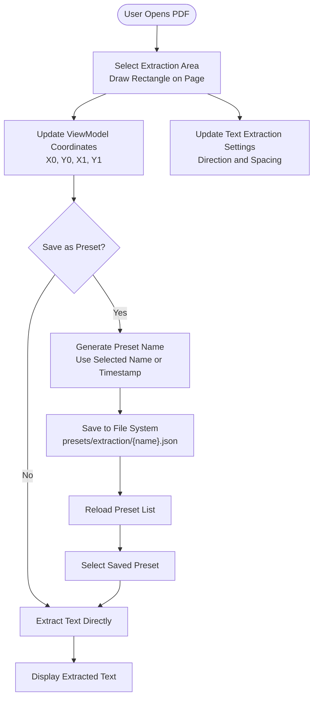
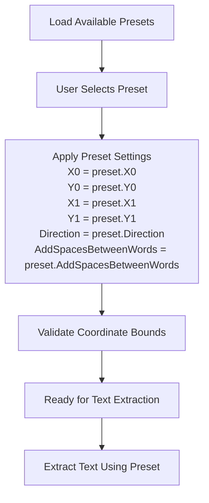

# ExtractionPreset Entity Documentation

<cite>
**Referenced Files in This Document**
- [ExtractionPreset.cs](file://src/PdfAnnotator.Core/Models/ExtractionPreset.cs) - *Updated with Direction and AddSpacesBetweenWords properties*
- [Example.json](file://presets/extraction/Example.json)
- [ExtractionViewModel.cs](file://src/PdfAnnotator.ViewModels/ExtractionViewModel.cs) - *Updated to handle new properties*
- [PdfService.cs](file://src/PdfAnnotator.App/Services/PdfService.cs) - *Updated text extraction logic*
- [PresetService.cs](file://src/PdfAnnotator.Core/Services/PresetService.cs)
- [TextDirection.cs](file://src/PdfAnnotator.Core/Models/TextDirection.cs) - *New enum for text direction control*
- [ExtractionView.axaml.cs](file://src/PdfAnnotator.App/Views/ExtractionView.axaml.cs)
- [README.md](file://README.md)
</cite>

## Update Summary
**Changes Made**
- Added documentation for new Direction and AddSpacesBetweenWords properties in ExtractionPreset
- Updated JSON serialization format to include new properties
- Added section on text extraction control parameters
- Updated entity definition diagram to reflect new properties
- Added documentation for TextDirection enum
- Updated usage workflow to include new text extraction controls
- Modified coordinate system section to clarify text ordering behavior

## Table of Contents
1. [Introduction](#introduction)
2. [Entity Definition](#entity-definition)
3. [Properties Overview](#properties-overview)
4. [Text Extraction Control Parameters](#text-extraction-control-parameters)
5. [Coordinate System and PDF Space](#coordinate-system-and-pdf-space)
6. [JSON Serialization Format](#json-serialization-format)
7. [Storage and Management](#storage-and-management)
8. [Usage in Text Extraction Workflow](#usage-in-text-extraction-workflow)
9. [UI Integration and Selection](#ui-integration-and-selection)
10. [Coordinate Transformation Process](#coordinate-transformation-process)
11. [Workflow for Creating and Applying Presets](#workflow-for-creating-and-applying-presets)
12. [Best Practices and Considerations](#best-practices-and-considerations)
13. [Troubleshooting Guide](#troubleshooting-guide)

## Introduction

The ExtractionPreset entity serves as a fundamental component in the PDFAnnotator application, enabling repeatable and consistent text extraction from specific rectangular regions within PDF documents. It defines a precise area on a PDF page using coordinate boundaries that can be saved, loaded, and reused across different extraction operations.

This entity is crucial for automating text extraction tasks where the same document structure appears consistently across multiple files, allowing users to capture predefined regions without manual reselection for each document. The updated model now includes text extraction control parameters that allow users to specify text direction and spacing behavior during extraction.

## Entity Definition

The ExtractionPreset is implemented as a simple data transfer object containing six essential properties that define a rectangular extraction area and text extraction behavior:



**Diagram sources**
- [ExtractionPreset.cs](file://src/PdfAnnotator.Core/Models/ExtractionPreset.cs#L3-L11)
- [ExtractionViewModel.cs](file://src/PdfAnnotator.ViewModels/ExtractionViewModel.cs#L18-L196)
- [PdfService.cs](file://src/PdfAnnotator.App/Services/PdfService.cs#L100-L126)

**Section sources**
- [ExtractionPreset.cs](file://src/PdfAnnotator.Core/Models/ExtractionPreset.cs#L1-L12)

## Properties Overview

### Name Property
- **Type**: `string`
- **Purpose**: Unique identifier for the preset
- **Default Value**: Empty string (`string.Empty`)
- **Usage**: Used for preset identification, display, and file naming
- **Constraints**: Must be unique within the preset collection

### Coordinate Properties (X0, Y0, X1, Y1)
These four properties define the rectangular boundary of the extraction area:

#### X0 (Horizontal Minimum)
- **Type**: `double`
- **Purpose**: Leftmost x-coordinate of the rectangle
- **Range**: Typically corresponds to PDF page width in points (72 DPI)
- **Constraint**: Must be less than or equal to X1

#### Y0 (Vertical Minimum)
- **Type**: `double`
- **Purpose**: Bottommost y-coordinate of the rectangle
- **Range**: Typically corresponds to PDF page height in points (72 DPI)
- **Constraint**: Must be less than or equal to Y1

#### X1 (Horizontal Maximum)
- **Type**: `double`
- **Purpose**: Rightmost x-coordinate of the rectangle
- **Range**: Typically corresponds to PDF page width in points (72 DPI)
- **Constraint**: Must be greater than or equal to X0

#### Y1 (Vertical Maximum)
- **Type**: `double`
- **Purpose**: Topmost y-coordinate of the rectangle
- **Range**: Typically corresponds to PDF page height in points (72 DPI)
- **Constraint**: Must be greater than or equal to Y0

**Section sources**
- [ExtractionPreset.cs](file://src/PdfAnnotator.Core/Models/ExtractionPreset.cs#L5-L9)

## Text Extraction Control Parameters

### Direction Property
- **Type**: `TextDirection`
- **Purpose**: Controls the reading order and text direction for extracted words
- **Default Value**: `TextDirection.LeftToRightTopToBottom`
- **Usage**: Determines how words are ordered in the extracted text output
- **Constraints**: Must be a valid TextDirection enum value

The TextDirection enum defines four possible text flow directions:

| Value | Description |
|-------|-------------|
| `LeftToRightTopToBottom` | Standard left-to-right, top-to-bottom reading order |
| `RightToLeftTopToBottom` | Right-to-left, top-to-bottom (e.g., Arabic, Hebrew) |
| `LeftToRightBottomToTop` | Left-to-right, bottom-to-top |
| `RightToLeftBottomToTop` | Right-to-left, bottom-to-top |

**Section sources**
- [ExtractionPreset.cs](file://src/PdfAnnotator.Core/Models/ExtractionPreset.cs#L10)
- [TextDirection.cs](file://src/PdfAnnotator.Core/Models/TextDirection.cs#L3-L9)

### AddSpacesBetweenWords Property
- **Type**: `bool`
- **Purpose**: Controls whether spaces are added between extracted words
- **Default Value**: `true`
- **Usage**: When true, a single space is inserted between consecutive words; when false, words are concatenated without spaces
- **Constraints**: None (boolean value)

This property allows users to control the formatting of extracted text, particularly useful when extracting data from forms or structured documents where specific spacing is required.

**Section sources**
- [ExtractionPreset.cs](file://src/PdfAnnotator.Core/Models/ExtractionPreset.cs#L11)
- [PdfService.cs](file://src/PdfAnnotator.App/Services/PdfService.cs#L226-L227)

## Coordinate System and PDF Space

The ExtractionPreset operates within the PDF coordinate system, which follows specific conventions:

### PDF Coordinate System Characteristics
- **Origin**: Bottom-left corner of the PDF page
- **Units**: Points (1 point = 1/72 inch)
- **Orientation**: X-axis increases rightward, Y-axis increases upward
- **Page Dimensions**: Typically 612×792 points for US Letter size (8.5×11 inches)

### Text Direction and Word Ordering
The Direction property affects how words are ordered during text extraction:



The text extraction process first groups words into lines based on their vertical position (using a 5-point tolerance), then sorts the lines according to the specified direction, and finally orders the words within each line according to the horizontal reading direction.

**Diagram sources**
- [PdfService.cs](file://src\PdfAnnotator.App\Services\PdfService.cs#L230-L287)
- [ExtractionPreset.cs](file://src\PdfAnnotator.Core\Models\ExtractionPreset.cs#L10)

### Coordinate Validation
The system ensures coordinate validity through several mechanisms:
- **Boundary Checking**: X0 ≤ X1 and Y0 ≤ Y1 constraints
- **Range Validation**: Coordinates must fall within PDF page dimensions
- **Type Safety**: All coordinates use `double` precision for accuracy

**Section sources**
- [ExtractionViewModel.cs](file://src\PdfAnnotator.ViewModels\ExtractionViewModel.cs#L106-L117)
- [PdfService.cs](file://src\PdfAnnotator.App\Services\PdfService.cs#L158-L162)

## JSON Serialization Format

The ExtractionPreset is serialized to JSON format for persistent storage and cross-platform compatibility. The serialization follows a straightforward structure with the addition of new text extraction control properties:

### Standard JSON Schema
```json
{
  "name": "PresetName",
  "x0": 100.0,
  "y0": 100.0,
  "x1": 300.0,
  "y1": 200.0,
  "direction": "LeftToRightTopToBottom",
  "addSpacesBetweenWords": true
}
```

### JSON Property Mapping
| JSON Property | C# Property | Type | Description |
|---------------|-------------|------|-------------|
| `name` | `Name` | string | Unique preset identifier |
| `x0` | `X0` | double | Left boundary coordinate |
| `y0` | `Y0` | double | Bottom boundary coordinate |
| `x1` | `X1` | double | Right boundary coordinate |
| `y1` | `Y1` | double | Top boundary coordinate |
| `direction` | `Direction` | TextDirection | Text reading direction |
| `addSpacesBetweenWords` | `AddSpacesBetweenWords` | boolean | Whether to add spaces between words |

### Serialization Configuration
The JSON serialization uses the following configuration:
- **Formatting**: Indented for readability
- **Property Naming**: Lowercase with hyphens (camelCase)
- **Precision**: Full double precision maintained
- **Validation**: Automatic type checking during deserialization
- **Enum Handling**: TextDirection enum is serialized as string values using JsonStringEnumConverter

**Section sources**
- [Example.json](file://presets/extraction/Example.json#L1-L8)
- [PresetService.cs](file://src\PdfAnnotator.Core\Services\PresetService.cs#L11-L14)
- [ExtractionPreset.cs](file://src\PdfAnnotator.Core\Models\ExtractionPreset.cs#L10-L11)

## Storage and Management

### Directory Structure
Extraction presets are stored in the `presets/extraction/` directory with the following organization:

```
presets/
└── extraction/
    ├── Example.json          # Sample preset file
    ├── InvoiceTemplate.json  # Business template preset
    ├── FormLayout.json       # Form extraction preset
    └── CustomRegion.json     # User-defined preset
```

### File Naming Convention
- **Pattern**: `{preset-name}.json`
- **Naming Rules**: Alphanumeric characters, spaces, and special characters allowed
- **Uniqueness**: Names must be unique within the directory
- **Default Naming**: Generated timestamps for unnamed presets

### Storage Operations



**Diagram sources**
- [PresetService.cs](file://src\PdfAnnotator.Core\Services\PresetService.cs#L16-L20)
- [ExtractionViewModel.cs](file://src\PdfAnnotator.ViewModels\ExtractionViewModel.cs#L134-L147)

**Section sources**
- [PresetService.cs](file://src\PdfAnnotator.Core\Services\PresetService.cs#L8-L20)

## Usage in Text Extraction Workflow

### Integration with PdfService

The ExtractionPreset serves as the primary input parameter for the text extraction process:



**Diagram sources**
- [PdfService.cs](file://src\PdfAnnotator.App\Services\PdfService.cs#L100-L126)
- [ExtractionViewModel.cs](file://src\PdfAnnotator.ViewModels\ExtractionViewModel.cs#L119-L132)

### Text Filtering and Ordering Algorithm

The core filtering and ordering mechanism uses a spatial intersection algorithm combined with text direction processing:

```csharp
private static string ExtractTextFromPage(PdfDocument document, int pageNumber, ExtractionPreset preset)
{
    var page = document.GetPage(pageNumber);
    var words = page.GetWords();
    
    var filtered = OrderWords(words, preset.Direction)
        .Where(w => IsInside(w, preset))
        .Select(w => w.Text)
        .ToList();

    var separator = preset.AddSpacesBetweenWords ? " " : string.Empty;
    return string.Join(separator, filtered);
}
```

This algorithm ensures that only words completely contained within the specified rectangle are extracted, orders them according to the specified direction, and joins them with the appropriate separator.

**Section sources**
- [PdfService.cs](file://src\PdfAnnotator.App\Services\PdfService.cs#L216-L228)
- [PdfService.cs](file://src\PdfAnnotator.App\Services\PdfService.cs#L230-L287)

## UI Integration and Selection

### Preset Selection Interface

The user interface provides intuitive preset management through the ExtractionViewModel:



**Diagram sources**
- [ExtractionViewModel.cs](file://src\PdfAnnotator.ViewModels\ExtractionViewModel.cs#L55-L62)
- [ExtractionView.axaml.cs](file://src\PdfAnnotator.App\Views\ExtractionView.axaml.cs#L107-L137)

### Selection Process

1. **Preset Loading**: Available presets are loaded from the `presets/extraction/` directory
2. **Selection**: Users select a preset from the dropdown menu
3. **Application**: Selected preset coordinates and text extraction settings are applied to the extraction area
4. **Validation**: Coordinates are validated against current PDF page dimensions

### Dynamic Preset Management

The system supports real-time preset operations:
- **Loading**: Presets can be loaded from JSON files
- **Saving**: Current extraction area becomes a named preset with text extraction settings
- **Reloading**: Preset list refreshes automatically
- **Deletion**: Not directly supported (requires file system manipulation)

**Section sources**
- [ExtractionViewModel.cs](file://src\PdfAnnotator.ViewModels\ExtractionViewModel.cs#L168-L196)
- [ExtractionView.axaml.cs](file://src\PdfAnnotator.App\Views\ExtractionView.axaml.cs#L107-L137)

## Coordinate Transformation Process

### Mouse-to-PDF Coordinate Conversion

The coordinate transformation involves multiple steps to convert user interface coordinates to PDF-compatible coordinates:



**Diagram sources**
- [ExtractionViewModel.cs](file://src\PdfAnnotator.ViewModels\ExtractionViewModel.cs#L106-L117)

### Coordinate System Differences

The transformation accounts for differences between:
- **Image Coordinates**: Top-left origin, scaled to UI dimensions
- **PDF Coordinates**: Bottom-left origin, unscaled to actual page dimensions
- **Word Coordinates**: PDF coordinate system, used for text filtering

### Precision Considerations

- **Double Precision**: All coordinates use `double` type for accuracy
- **Rounding**: Minimal rounding occurs during coordinate calculations
- **Validation**: Boundary checks prevent invalid coordinate combinations

**Section sources**
- [ExtractionViewModel.cs](file://src\PdfAnnotator.ViewModels\ExtractionViewModel.cs#L106-L117)

## Workflow for Creating and Applying Presets

### Creation Workflow

The preset creation process follows these steps:



**Diagram sources**
- [ExtractionViewModel.cs](file://src\PdfAnnotator.ViewModels\ExtractionViewModel.cs#L134-L147)

### Application Workflow

When applying an existing preset:



**Diagram sources**
- [ExtractionViewModel.cs](file://src\PdfAnnotator.ViewModels\ExtractionViewModel.cs#L183-L194)

### Default Values and Behaviors

- **Default Name**: Uses "Current" when no preset is selected
- **Timestamp Generation**: Presets without explicit names get generated timestamps
- **Empty State**: Initial coordinates are zero until selection is made
- **Validation**: Coordinates are validated before extraction attempts
- **Direction Default**: Defaults to LeftToRightTopToBottom if not specified
- **Spacing Default**: Defaults to true (add spaces between words) if not specified

**Section sources**
- [ExtractionViewModel.cs](file://src\PdfAnnotator.ViewModels\ExtractionViewModel.cs#L119-L147)

## Best Practices and Considerations

### Coordinate Management
- **Boundary Validation**: Always validate that X0 ≤ X1 and Y0 ≤ Y1
- **PDF Dimension Awareness**: Ensure coordinates fit within actual PDF page dimensions
- **Precision Maintenance**: Use double precision for all coordinate calculations
- **Coordinate System Consistency**: Maintain bottom-left origin convention

### Text Extraction Control
- **Direction Selection**: Choose the appropriate text direction based on the document's language and layout
- **Spacing Configuration**: Set AddSpacesBetweenWords based on the desired output format
- **Testing**: Verify text extraction results with different direction and spacing settings
- **Consistency**: Use consistent settings for similar document types

### Preset Organization
- **Descriptive Naming**: Use meaningful names that describe the extraction purpose
- **Template Categories**: Group related presets by document type or layout
- **Version Control**: Consider backing up important preset collections
- **Documentation**: Add comments or external documentation for complex extraction scenarios

### Performance Considerations
- **Caching**: The PdfService implements rendering cache for improved performance
- **Batch Processing**: Extract multiple pages efficiently using the same preset
- **Memory Management**: Dispose of PDF resources properly in long-running operations

### Error Handling
- **File Access**: Handle file system errors during preset loading/saving
- **Coordinate Validation**: Validate coordinates before attempting extraction
- **PDF Compatibility**: Handle various PDF formats and page sizes
- **Resource Cleanup**: Ensure proper disposal of PDF resources

## Troubleshooting Guide

### Common Issues and Solutions

#### Issue: Coordinates Outside PDF Bounds
**Symptoms**: Extraction returns empty results or throws exceptions
**Cause**: Preset coordinates exceed PDF page dimensions
**Solution**: 
- Verify PDF page dimensions using `GetPageCountAsync()` and page metadata
- Adjust preset coordinates to fit within page boundaries
- Use the coordinate validation features built into the system

#### Issue: Preset Not Loading
**Symptoms**: Preset does not appear in dropdown list
**Cause**: JSON parsing errors or file system issues
**Solution**:
- Check JSON syntax in preset file
- Verify file permissions and accessibility
- Review application logs for detailed error messages

#### Issue: Inconsistent Extraction Results
**Symptoms**: Same preset produces different results across documents
**Cause**: Coordinate system mismatches or PDF scaling issues
**Solution**:
- Verify PDF page dimensions match preset expectations
- Check for PDF compression or rendering variations
- Recreate preset with precise measurements

#### Issue: Unexpected Text Ordering
**Symptoms**: Extracted text appears in wrong order
**Cause**: Incorrect Direction setting for the document's text flow
**Solution**:
- Verify the correct TextDirection is selected for the document
- Test different direction settings to find the appropriate one
- Check if the document uses mixed text directions

#### Issue: Missing Spaces in Extracted Text
**Symptoms**: Words are concatenated without spaces
**Cause**: AddSpacesBetweenWords is set to false
**Solution**:
- Check the AddSpacesBetweenWords setting in the preset
- Enable the setting if spaces are needed between words
- Verify the setting is correctly saved and loaded

#### Issue: Performance Problems
**Symptoms**: Slow extraction or UI responsiveness
**Cause**: Large PDF files or inefficient coordinate calculations
**Solution**:
- Optimize PDF rendering DPI settings
- Reduce extraction area size when possible
- Monitor memory usage during batch operations

### Debugging Tools and Techniques

1. **Logging**: Enable detailed logging in the PdfService for coordinate tracking
2. **Visualization**: Overlay extraction rectangles on rendered PDF pages
3. **Validation**: Use coordinate validation methods to verify boundary correctness
4. **Testing**: Create test cases with known document layouts and expected results
5. **Preview**: Use the text preview feature to verify extraction settings before full extraction

**Section sources**
- [PdfService.cs](file://src\PdfAnnotator.App\Services\PdfService.cs#L24-L27)
- [ExtractionViewModel.cs](file://src\PdfAnnotator.ViewModels\ExtractionViewModel.cs#L85-L94)