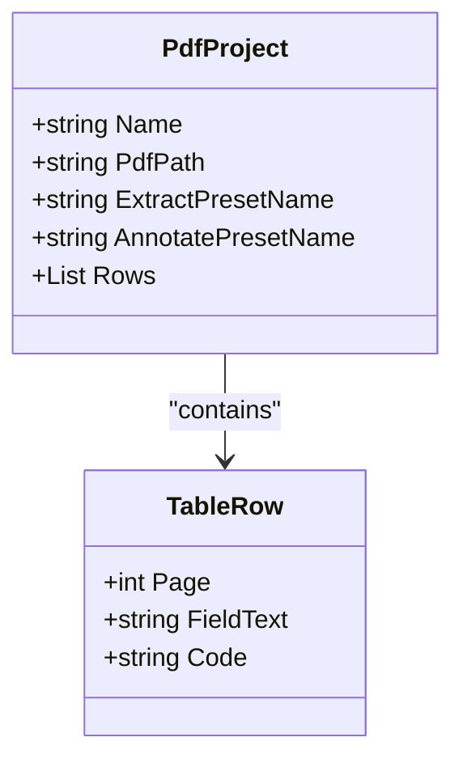
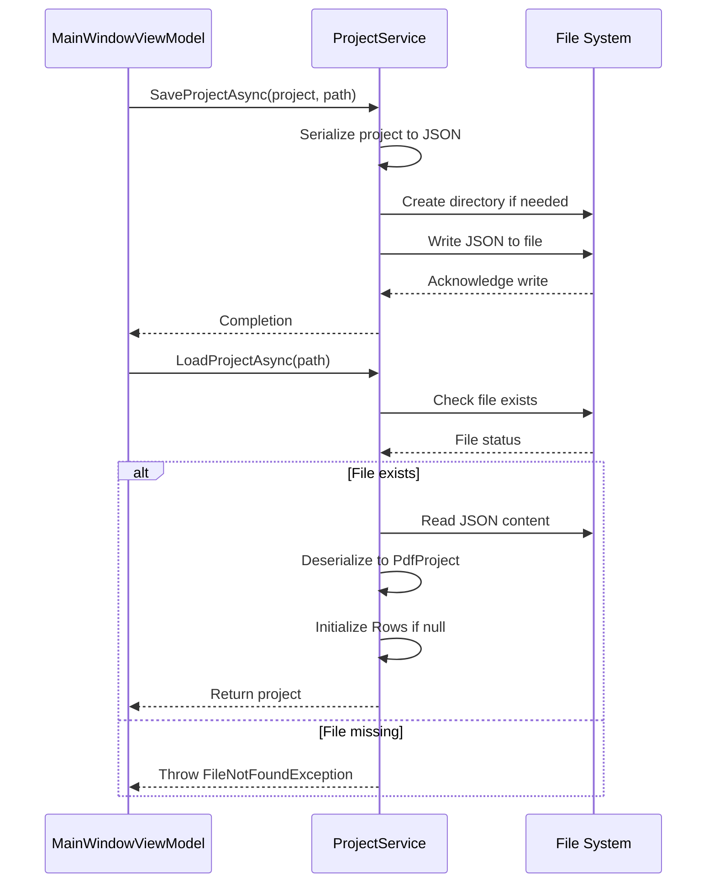
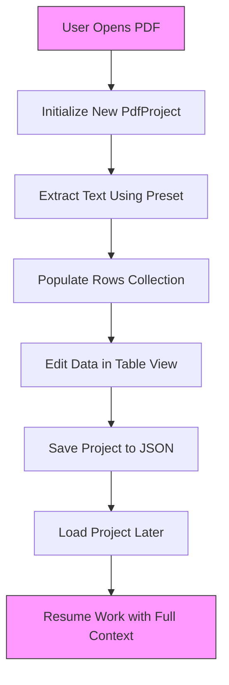

# PdfProject

<cite>
**Referenced Files in This Document**   
- [PdfProject.cs](file://src/PdfAnnotator.Core/Models/PdfProject.cs)
- [TableRow.cs](file://src/PdfAnnotator.Core/Models/TableRow.cs)
- [ProjectService.cs](file://src/PdfAnnotator.Core/Services/ProjectService.cs)
- [IProjectService.cs](file://src/PdfAnnotator.Core/Services/IProjectService.cs)
- [SampleProject.json](file://projects/SampleProject.json)
- [MainWindowViewModel.cs](file://src/PdfAnnotator.ViewModels/MainWindowViewModel.cs)
- [TableRowViewModel.cs](file://src/PdfAnnotator.ViewModels/TableRowViewModel.cs)
</cite>

## Table of Contents
1. [Introduction](#introduction)
2. [Core Properties](#core-properties)
3. [Data Relationships](#data-relationships)
4. [Serialization and Storage](#serialization-and-storage)
5. [Project Lifecycle Management](#project-lifecycle-management)
6. [Sample JSON Representation](#sample-json-representation)
7. [Validation and Initialization](#validation-and-initialization)
8. [Integration with Application Workflow](#integration-with-application-workflow)

## Introduction

The `PdfProject` entity serves as the central persistence model in the PDFAnnotator application, capturing the complete state required to resume document processing workflows. It encapsulates all user-defined context related to a specific PDF processing task, including source document reference, active configuration presets, and extracted data. This model enables users to save their progress and return to it later without losing work, forming the backbone of the application's state management system.

**Section sources**
- [PdfProject.cs](file://src/PdfAnnotator.Core/Models/PdfProject.cs#L5-L12)

## Core Properties

The `PdfProject` class defines five essential properties that collectively represent a complete processing session:

- **Name**: A string identifier for the project, used for display and file naming purposes.
- **PdfPath**: The file system path to the source PDF document being processed.
- **ExtractPresetName**: References the active extraction preset that defines the region from which text should be extracted on each page.
- **AnnotatePresetName**: References the active annotation preset that specifies formatting and positioning for output annotations.
- **Rows**: A collection of `TableRow` objects containing the extracted and user-edited data.

Each property is initialized to a default value to prevent null reference issues during initialization.



**Diagram sources**
- [PdfProject.cs](file://src/PdfAnnotator.Core/Models/PdfProject.cs#L5-L12)
- [TableRow.cs](file://src/PdfAnnotator.Core/Models/TableRow.cs#L3-L8)

**Section sources**
- [PdfProject.cs](file://src/PdfAnnotator.Core/Models/PdfProject.cs#L5-L12)

## Data Relationships

The `PdfProject` entity maintains two types of relationships with other models in the system:

1. **Composition**: It contains a collection of `TableRow` instances, representing a one-to-many relationship where each row corresponds to data extracted from a specific page of the PDF.
2. **Reference by Name**: It references `ExtractionPreset` and `AnnotationPreset` entities by their string names rather than direct object references, enabling flexible preset management and reuse across projects.

This design allows multiple projects to share the same presets while maintaining independent data sets.

```mermaid
erDiagram
PdfProject ||--o{ TableRow : "has"
PdfProject }|--|| ExtractionPreset : "references by name"
PdfProject }|--|| AnnotationPreset : "references by name"
PdfProject {
string Name
string PdfPath
string ExtractPresetName
string AnnotatePresetName
List<TableRow> Rows
}
TableRow {
int Page
string FieldText
string Code
}
ExtractionPreset {
string Name
double X0
double Y0
double X1
double Y1
}
AnnotationPreset {
string Name
double TextX
double TextY
double FontSize
double Angle
string ColorHex
string FontName
}
```

**Diagram sources**
- [PdfProject.cs](file://src/PdfAnnotator.Core/Models/PdfProject.cs#L5-L12)
- [TableRow.cs](file://src/PdfAnnotator.Core/Models/TableRow.cs#L3-L8)
- [ExtractionPreset.cs](file://src/PdfAnnotator.Core/Models/ExtractionPreset.cs#L3-L10)
- [AnnotationPreset.cs](file://src/PdfAnnotator.Core/Models/AnnotationPreset.cs#L3-L12)

## Serialization and Storage

`PdfProject` instances are serialized to JSON format and stored in the `projects/` directory with a `.json` extension. The serialization process uses `System.Text.Json` with indented formatting for readability. Each project file is named using the project's `Name` property (with appropriate sanitization) to ensure human-readable file names.

The `ProjectService` class handles all serialization operations, ensuring directory creation before saving and validating file existence before loading.



**Diagram sources**
- [ProjectService.cs](file://src/PdfAnnotator.Core/Services/ProjectService.cs#L6-L42)
- [IProjectService.cs](file://src/PdfAnnotator.Core/Services/IProjectService.cs#L6-L10)

**Section sources**
- [ProjectService.cs](file://src/PdfAnnotator.Core/Services/ProjectService.cs#L6-L42)

## Project Lifecycle Management

The lifecycle of a `PdfProject` is managed through the `IProjectService` interface, which provides asynchronous methods for persistence operations:

- **Saving**: The `SaveProjectAsync` method serializes the project to JSON and writes it to the specified path, creating directories as needed.
- **Loading**: The `LoadProjectAsync` method reads and deserializes a project file, with validation to ensure data integrity and proper initialization of the `Rows` collection if missing.

These operations are integrated into the application's main view model, allowing users to save and load projects through UI commands.

**Section sources**
- [ProjectService.cs](file://src/PdfAnnotator.Core/Services/ProjectService.cs#L6-L42)
- [MainWindowViewModel.cs](file://src/PdfAnnotator.ViewModels/MainWindowViewModel.cs#L41-L71)

## Sample JSON Representation

The following example shows a complete `PdfProject` serialized to JSON format:

```json
{
  "name": "Sample Project",
  "pdfPath": "samples/sample.pdf",
  "extractPresetName": "ExampleExtract",
  "annotatePresetName": "ExampleAnnot",
  "table": [
    { "page": 1, "field_text": "Sample text page 1", "code": "" },
    { "page": 2, "field_text": "Sample text page 2", "code": "ABC123" }
  ]
}
```

Note that JSON property names use snake_case formatting, which is automatically handled by the serialization system when mapping to the camelCase C# properties.

**Section sources**
- [SampleProject.json](file://projects/SampleProject.json#L1-L11)
- [PdfProject.cs](file://src/PdfAnnotator.Core/Models/PdfProject.cs#L5-L12)

## Validation and Initialization

The `PdfProject` class employs defensive initialization patterns to prevent null reference exceptions. All properties are initialized to safe default values:

- String properties default to `string.Empty`
- The `Rows` collection is initialized to a new `List<TableRow>()`

During deserialization, the `ProjectService` ensures the `Rows` collection is never null by initializing it if the deserialized value is null. No additional validation rules are enforced at the model level, as validation is handled at the service and UI layers.

**Section sources**
- [PdfProject.cs](file://src/PdfAnnotator.Core/Models/PdfProject.cs#L7-L11)
- [ProjectService.cs](file://src/PdfAnnotator.Core/Services/ProjectService.cs#L39-L40)

## Integration with Application Workflow

The `PdfProject` model is central to the application's workflow, serving as the bridge between the three main processing modes: extraction, table editing, and annotation. The `MainWindowViewModel` maintains a current project instance that is shared across view models, ensuring data consistency.

When switching between modes, the current project's data is synchronized between components. For example, after text extraction, the resulting `TableRow` objects are added to the project and displayed in the table view. Similarly, when entering annotation mode, the project's data is used to generate the annotated PDF.



**Diagram sources**
- [MainWindowViewModel.cs](file://src/PdfAnnotator.ViewModels/MainWindowViewModel.cs#L41-L81)
- [PdfProject.cs](file://src/PdfAnnotator.Core/Models/PdfProject.cs#L5-L12)

**Section sources**
- [MainWindowViewModel.cs](file://src/PdfAnnotator.ViewModels/MainWindowViewModel.cs#L41-L81)
- [TableRowViewModel.cs](file://src/PdfAnnotator.ViewModels/TableRowViewModel.cs#L29-L45)