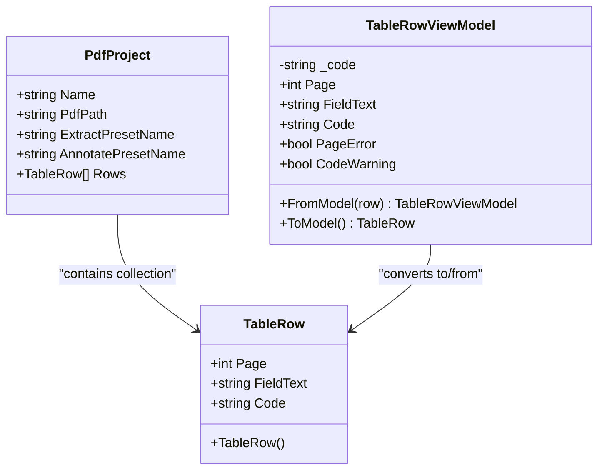
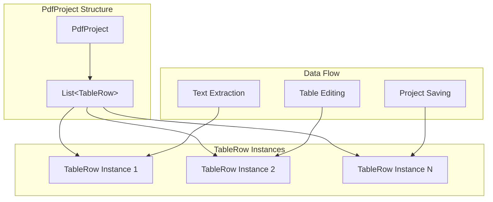
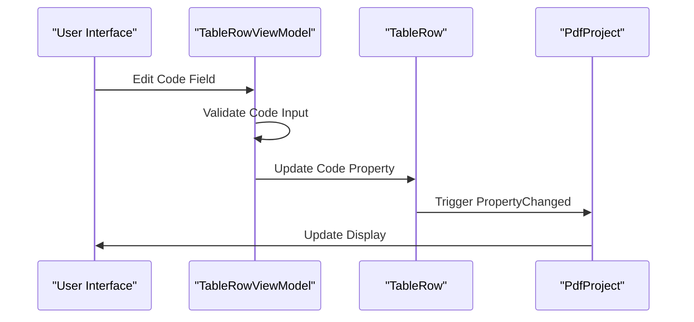
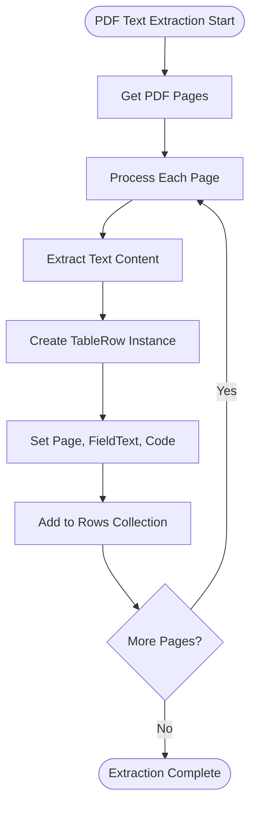
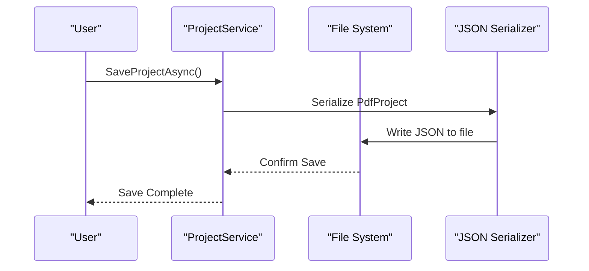
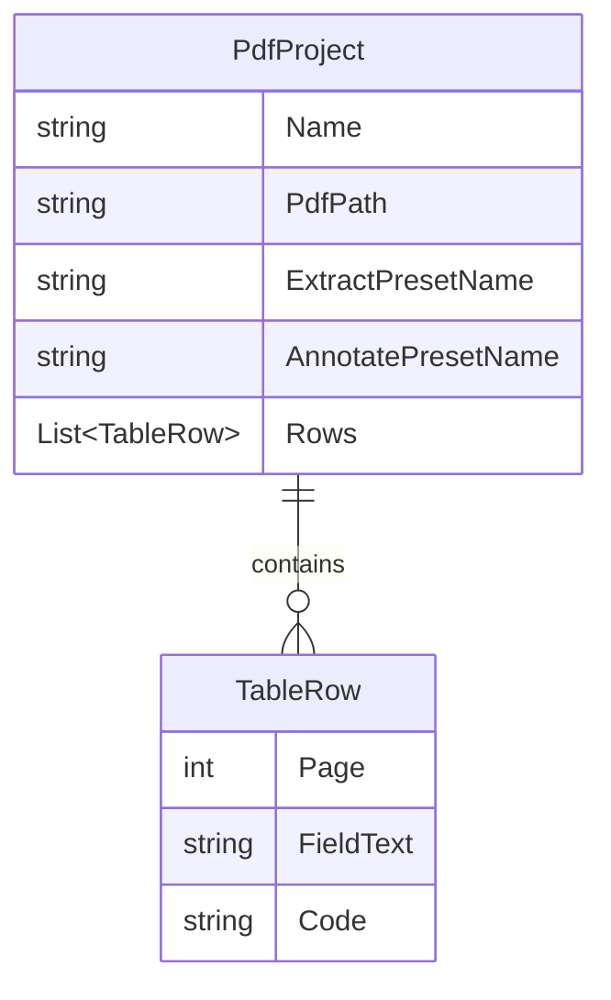
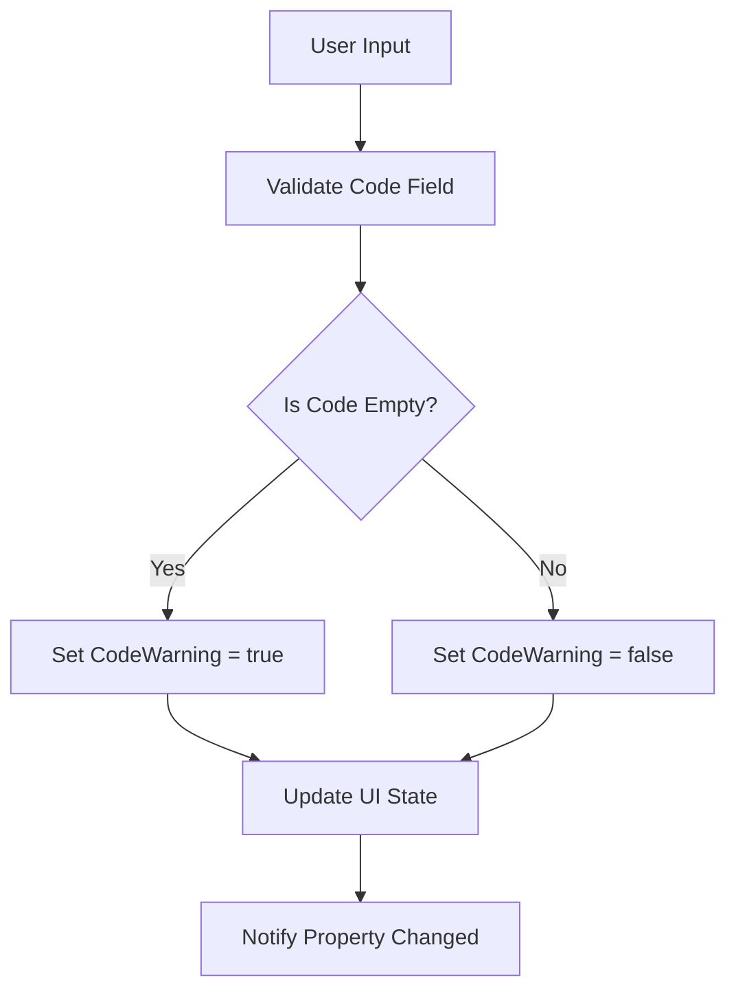
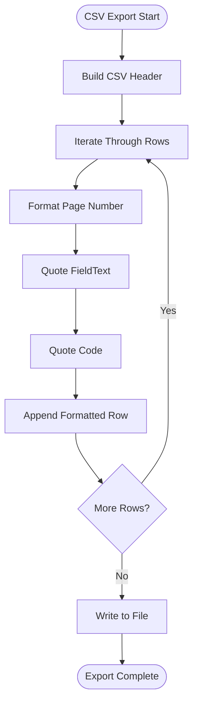
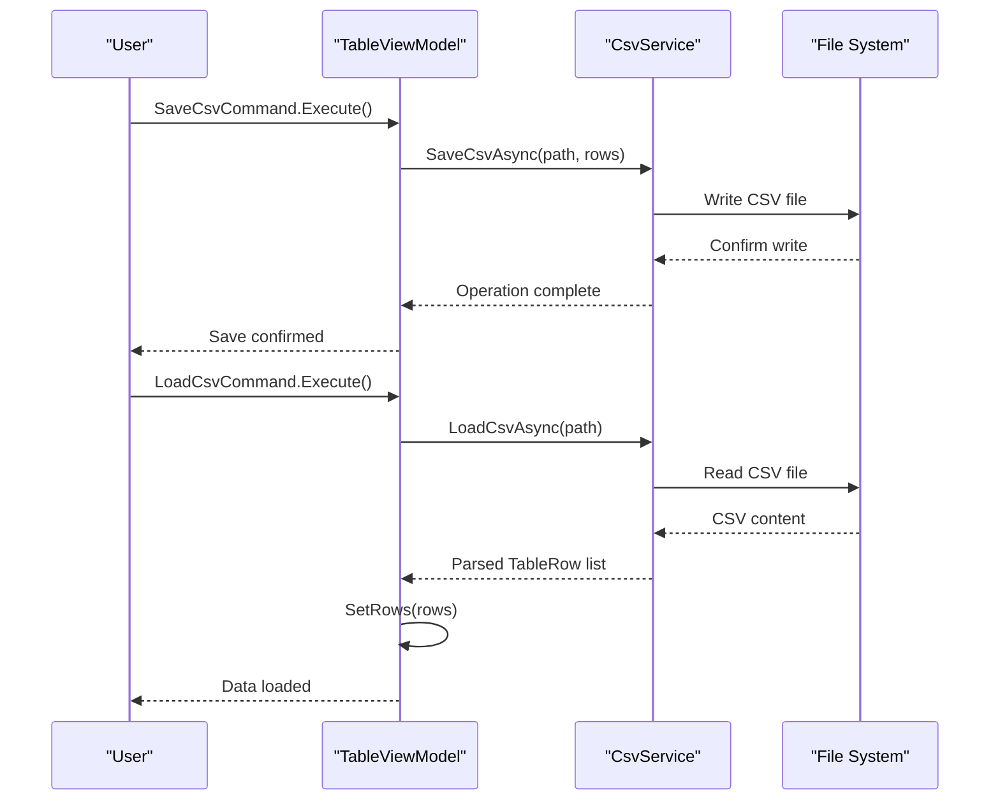

# TableRow Entity Documentation

<cite>
**Referenced Files in This Document**
- [TableRow.cs](file://src/PdfAnnotator.Core/Models/TableRow.cs)
- [PdfProject.cs](file://src/PdfAnnotator.Core/Models/PdfProject.cs)
- [TableRowViewModel.cs](file://src/PdfAnnotator.ViewModels/TableRowViewModel.cs)
- [TableViewModel.cs](file://src/PdfAnnotator.ViewModels/TableViewModel.cs)
- [CsvService.cs](file://src/PdfAnnotator.Core/Services/CsvService.cs)
- [ProjectService.cs](file://src/PdfAnnotator.Core/Services/ProjectService.cs)
- [PdfService.cs](file://src\PdfAnnotator.App\Services\PdfService.cs)
- [SampleProject.json](file://projects/SampleProject.json)
- [Example.json](file://presets/extraction/Example.json)
</cite>

## Table of Contents
1. [Introduction](#introduction)
2. [Entity Definition](#entity-definition)
3. [Properties Overview](#properties-overview)
4. [Role in Application Architecture](#role-in-application-architecture)
5. [Data Flow and Lifecycle](#data-flow-and-lifecycle)
6. [Serialization and Persistence](#serialization-and-persistence)
7. [Validation and Constraints](#validation-and-constraints)
8. [CSV Export Functionality](#csv-export-functionality)
9. [Usage Examples](#usage-examples)
10. [Best Practices](#best-practices)

## Introduction

The TableRow entity serves as the fundamental unit of extracted data in the PDFAnnotator application. It represents a single row of structured information derived from PDF text extraction, containing essential metadata about the extracted content and enabling user-defined classification through editable codes. This entity forms the backbone of the application's data model, bridging the gap between raw text extraction and organized tabular representation.

## Entity Definition

The TableRow class is a simple yet powerful data structure defined in the core models namespace, designed for efficient storage and manipulation of extracted PDF text data.



**Diagram sources**
- [TableRow.cs](file://src/PdfAnnotator.Core/Models/TableRow.cs#L3-L8)
- [PdfProject.cs](file://src/PdfAnnotator.Core/Models/PdfProject.cs#L5-L12)
- [TableRowViewModel.cs](file://src/PdfAnnotator.ViewModels/TableRowViewModel.cs#L7-L46)

**Section sources**
- [TableRow.cs](file://src/PdfAnnotator.Core/Models/TableRow.cs#L1-L9)

## Properties Overview

### Page Property
- **Type**: `int`
- **Description**: Represents the PDF page number where the extracted text was found
- **Constraints**: Must be a positive integer greater than zero
- **Default Value**: Not applicable (property must be explicitly set)
- **Usage Context**: Used for organizing extracted text by page and maintaining spatial relationships

### FieldText Property
- **Type**: `string`
- **Description**: Contains the actual extracted text content from the PDF
- **Default Value**: Empty string (`string.Empty`)
- **Constraints**: Can be empty but typically contains meaningful text content
- **Usage Context**: Stores the raw text extracted during PDF processing

### Code Property  
- **Type**: `string`
- **Description**: User-editable classification or identifier field
- **Default Value**: Empty string (`string.Empty`)
- **Constraints**: Primarily used for categorization and linking to external systems
- **Usage Context**: Enables manual tagging and classification of extracted content

**Section sources**
- [TableRow.cs](file://src/PdfAnnotator.Core/Models/TableRow.cs#L5-L7)

## Role in Application Architecture

### Central Data Structure
The TableRow entity acts as the primary building block for the application's data model, serving as the individual record within the larger PdfProject structure. Each TableRow represents a discrete piece of extracted information that can be independently manipulated and classified.

### Collection Management
Within the PdfProject context, TableRow instances are stored in a List collection, allowing for efficient batch operations and maintaining the order of extraction:



**Diagram sources**
- [PdfProject.cs](file://src/PdfAnnotator.Core/Models/PdfProject.cs#L11)
- [TableRow.cs](file://src/PdfAnnotator.Core/Models/TableRow.cs#L3-L8)

### ViewModel Integration
The TableRow entity is seamlessly integrated with the application's MVVM architecture through the TableRowViewModel, which provides data binding capabilities and validation logic:



**Diagram sources**
- [TableRowViewModel.cs](file://src/PdfAnnotator.ViewModels/TableRowViewModel.cs#L15-L23)
- [TableViewModel.cs](file://src\PdfAnnotator.ViewModels\TableViewModel.cs#L40-L45)

**Section sources**
- [PdfProject.cs](file://src\PdfAnnotator.Core\Models\PdfProject.cs#L11)
- [TableRowViewModel.cs](file://src\PdfAnnotator.ViewModels/TableRowViewModel.cs#L29-L46)

## Data Flow and Lifecycle

### Creation During Text Extraction
TableRow instances are created automatically during the PDF text extraction process. The extraction service generates TableRow objects by processing each page of the PDF document:



**Diagram sources**
- [PdfService.cs](file://src\PdfAnnotator.App\Services\PdfService.cs#L107-L121)

### Editing in Table View
Users interact with TableRow data through the TableViewModel, which manages the collection of TableRowViewModel instances. The editing process involves:

1. **Data Binding**: TableRowViewModel instances are bound to UI controls
2. **Property Change Notification**: Changes trigger property change events
3. **Validation**: Input validation occurs during editing
4. **Persistence**: Changes are automatically propagated back to TableRow instances

### Persistence Through Project Saving
TableRow data is persisted through the project save/load mechanism, which serializes the entire PdfProject including all TableRow collections:



**Diagram sources**
- [ProjectService.cs](file://src\PdfAnnotator.Core\Services\ProjectService.cs#L13-L22)

**Section sources**
- [PdfService.cs](file://src\PdfAnnotator.App\Services\PdfService.cs#L107-L121)
- [ProjectService.cs](file://src\PdfAnnotator.Core\Services\ProjectService.cs#L13-L22)

## Serialization and Persistence

### JSON Serialization Format
TableRow instances are serialized to JSON format using the built-in .NET JSON serializer. The serialization process ensures that all properties are properly represented:

**Sample JSON Representation:**
```json
{
  "page": 1,
  "field_text": "Sample text content from page 1",
  "code": "CODE123"
}
```

### Default Initialization Behavior
The TableRow class demonstrates defensive programming by initializing string properties to empty strings rather than null values. This design choice eliminates the need for null checks throughout the application and ensures consistent behavior:

| Property | Default Value | Rationale |
|----------|---------------|-----------|
| `FieldText` | `string.Empty` | Prevents null reference exceptions in string operations |
| `Code` | `string.Empty` | Ensures consistent display and comparison behavior |

### Project File Integration
TableRow data is embedded within the broader PdfProject JSON structure, allowing for comprehensive project state preservation:



**Diagram sources**
- [PdfProject.cs](file://src\PdfAnnotator.Core\Models\PdfProject.cs#L5-L12)
- [TableRow.cs](file://src\PdfAnnotator.Core\Models\TableRow.cs#L3-L8)

**Section sources**
- [TableRow.cs](file://src\PdfAnnotator.Core\Models\TableRow.cs#L6-L7)
- [SampleProject.json](file://projects/SampleProject.json#L6-L9)

## Validation and Constraints

### Input Validation
The TableRowViewModel implements comprehensive validation logic to ensure data integrity:



**Diagram sources**
- [TableRowViewModel.cs](file://src\PdfAnnotator.ViewModels\TableRowViewModel.cs#L15-L23)

### Constraint Enforcement
The TableRow entity enforces several implicit constraints:

| Constraint Type | Description | Implementation |
|----------------|-------------|----------------|
| **Page Number** | Must be positive | Enforced by property setter |
| **Text Content** | Can be empty but typically contains data | No explicit validation |
| **Code Field** | User-editable classification | Optional field with warning system |
| **Null Safety** | String properties initialized to empty | Defensive programming |

### CSV Export Validation
During CSV export operations, the CsvService performs additional validation:

- **Header Validation**: Ensures CSV files contain the expected column structure
- **Data Type Validation**: Verifies page numbers are integers
- **Format Validation**: Handles quoted fields with special characters

**Section sources**
- [TableRowViewModel.cs](file://src\PdfAnnotator.ViewModels\TableRowViewModel.cs#L15-L23)
- [CsvService.cs](file://src\PdfAnnotator.Core\Services\CsvService.cs#L38-L70)

## CSV Export Functionality

### Export Process
The CSV export functionality transforms TableRow collections into comma-separated value format with proper escaping:



**Diagram sources**
- [CsvService.cs](file://src\PdfAnnotator.Core\Services\CsvService.cs#L13-L29)

### CSV Format Specification
The CSV export follows a standardized format with semicolon delimiters:

| Column | Data Type | Description | Example |
|--------|-----------|-------------|---------|
| `page` | Integer | PDF page number | `1` |
| `field_text` | String | Extracted text content | `"Invoice Amount"` |
| `code` | String | Classification code | `"INV-2024-001"` |

### Import/Export Operations
The TableViewModel coordinates CSV import and export operations through dedicated commands:



**Diagram sources**
- [TableViewModel.cs](file://src\PdfAnnotator.ViewModels\TableViewModel.cs#L25-L34)
- [CsvService.cs](file://src\PdfAnnotator.Core\Services\CsvService.cs#L13-L74)

**Section sources**
- [CsvService.cs](file://src\PdfAnnotator.Core\Services\CsvService.cs#L10-L12)
- [TableViewModel.cs](file://src\PdfAnnotator.ViewModels\TableViewModel.cs#L51-L64)

## Usage Examples

### Typical TableRow Values
Here are representative examples of TableRow instances in various scenarios:

**Example 1: Basic Extraction**
```json
{
  "page": 1,
  "field_text": "Total Amount Due",
  "code": ""
}
```

**Example 2: Classified Information**
```json
{
  "page": 2,
  "field_text": "Invoice Number: INV-2024-001",
  "code": "INV-2024-001"
}
```

**Example 3: Multi-page Content**
```json
{
  "page": 3,
  "field_text": "Payment Terms: Net 30 days",
  "code": "PAYMENT_TERMS"
}
```

### Integration with Project Workflow
TableRow instances participate in the complete project lifecycle:

1. **Extraction Phase**: Text is extracted and TableRow objects are created
2. **Classification Phase**: Users edit the Code field to classify content
3. **Export Phase**: Data is exported to CSV for external processing
4. **Import Phase**: CSV data can be re-imported to restore state
5. **Persistence Phase**: Complete project state is saved to JSON

### Error Handling Scenarios
The TableRow entity handles various error conditions gracefully:

- **Empty Text**: FieldText can be empty while maintaining structural integrity
- **Missing Codes**: Code field defaults to empty string for unclassified items
- **Invalid Pages**: Page numbers are validated during CSV import
- **Corrupted Data**: JSON deserialization handles missing or malformed properties

**Section sources**
- [SampleProject.json](file://projects/SampleProject.json#L6-L9)
- [CsvService.cs](file://src\PdfAnnotator.Core\Services\CsvService.cs#L65-L70)

## Best Practices

### Data Integrity Guidelines
When working with TableRow entities, follow these best practices:

1. **Initialize Properly**: Always initialize TableRow instances with appropriate values
2. **Validate Input**: Use the built-in validation mechanisms for user input
3. **Handle Empty Strings**: Treat empty string values consistently across the application
4. **Maintain Page Order**: Preserve the natural page ordering when manipulating collections

### Performance Considerations
- **Batch Operations**: Use collection operations for bulk updates to TableRow instances
- **Lazy Loading**: Consider lazy loading of TableRow data for large PDF documents
- **Memory Management**: Dispose of TableRow collections appropriately when switching projects

### Extensibility Patterns
The TableRow entity design supports future enhancements:

- **Property Extensions**: New properties can be added without breaking existing functionality
- **Validation Rules**: Additional validation logic can be incorporated through the ViewModel layer
- **Serialization Formats**: Alternative serialization formats can be supported through service interfaces

### Error Recovery
Implement robust error recovery mechanisms:

- **Graceful Degradation**: Handle missing or corrupted TableRow data gracefully
- **Data Validation**: Validate TableRow data at multiple points in the application lifecycle
- **User Feedback**: Provide clear feedback when TableRow operations fail

The TableRow entity represents a well-designed balance between simplicity and functionality, providing the foundation for the PDFAnnotator application's core data management capabilities while remaining extensible for future requirements.