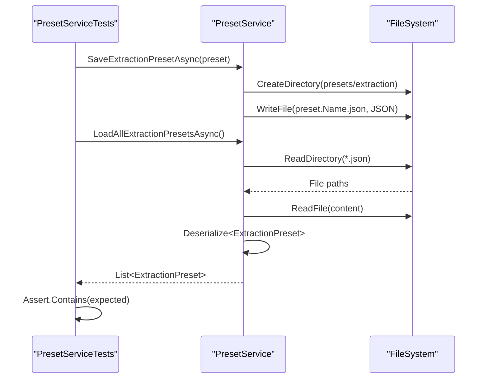
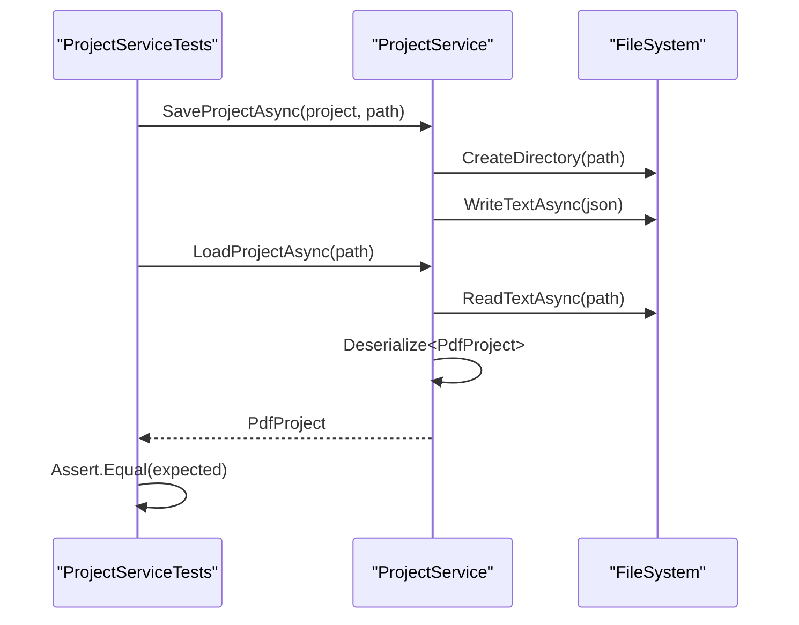

# Development Guide

<cite>
**Referenced Files in This Document**   
- [PresetService.cs](file://src/PdfAnnotator.Core/Services/PresetService.cs)
- [ProjectService.cs](file://src/PdfAnnotator.Core/Services/ProjectService.cs)
- [CsvService.cs](file://src/PdfAnnotator.Core/Services/CsvService.cs)
- [ICsvService.cs](file://src/PdfAnnotator.Core/Services/ICsvService.cs)
- [IPresetService.cs](file://src/PdfAnnotator.Core/Services/IPresetService.cs)
- [IProjectService.cs](file://src/PdfAnnotator.Core/Services/IProjectService.cs)
- [PresetServiceTests.cs](file://tests/PdfAnnotator.Tests/PresetServiceTests.cs)
- [ProjectServiceTests.cs](file://tests/PdfAnnotator.Tests/ProjectServiceTests.cs)
- [CsvServiceTests.cs](file://tests/PdfAnnotator.Tests/CsvServiceTests.cs)
- [PdfAnnotator.Tests.csproj](file://tests/PdfAnnotator.Tests/PdfAnnotator.Tests.csproj)
- [PdfAnnotator.Core.csproj](file://src/PdfAnnotator.Core/PdfAnnotator.Core.csproj)
- [FodyWeavers.xml](file://src/PdfAnnotator.ViewModels/FodyWeavers.xml)
- [FileLogger.cs](file://src/PdfAnnotator.App/Logging/FileLogger.cs)
</cite>

## Table of Contents
1. [Building and Testing the Application](#building-and-testing-the-application)
2. [Testing Strategy and Structure](#testing-strategy-and-structure)
3. [Extending Functionality](#extending-functionality)
4. [Contribution Guidelines](#contribution-guidelines)
5. [Debugging and Edge Case Handling](#debugging-and-edge-case-handling)
6. [Build Configuration and Dependency Management](#build-configuration-and-dependency-management)
7. [Cross-Platform Development Considerations](#cross-platform-development-considerations)

## Building and Testing the Application

To build the application, use the .NET CLI command `dotnet build`, which compiles all projects in the solution and restores NuGet dependencies automatically. The main application entry point is located in the `PdfAnnotator.App` project, which can be built and run using standard .NET 8 SDK tools.

To execute unit tests, run `dotnet test`, which triggers the test runner for the `PdfAnnotator.Tests` project. This command executes all xUnit test cases and provides coverage reporting if configured.

The test project is structured as a separate project under the `tests` directory and references the core logic via a project reference to `PdfAnnotator.Core.csproj`. This ensures that business logic can be tested independently of the UI layer.

**Section sources**
- [PdfAnnotator.Tests.csproj](file://tests/PdfAnnotator.Tests/PdfAnnotator.Tests.csproj)
- [PdfAnnotator.Core.csproj](file://src/PdfAnnotator.Core/PdfAnnotator.Core.csproj)
- [README.md](file://README.md#L8-L9)

## Testing Strategy and Structure

The testing strategy focuses on unit testing core services in the `PdfAnnotator.Core` assembly, specifically `PresetService`, `ProjectService`, and `CsvService`. These services handle JSON serialization, file I/O operations, and data integrity, making them critical for application reliability.

### PresetService Tests

The `PresetServiceTests.cs` file contains test cases that verify the ability to save and load extraction and annotation presets. Each test instantiates the `PresetService`, creates a model object (`ExtractionPreset` or `AnnotationPreset`), saves it asynchronously, and then loads all presets to confirm persistence.

For example, `ShouldSaveAndLoadExtractionPreset` validates that a created `ExtractionPreset` with defined coordinates is correctly serialized to JSON and stored in the `presets/extraction` directory. Upon loading, the test asserts that the preset with the expected name exists in the result set.

Similarly, `ShouldSaveAndLoadAnnotationPreset` confirms that annotation settings such as font, color, and position are preserved across serialization cycles.



**Diagram sources**
- [PresetServiceTests.cs](file://tests/PdfAnnotator.Tests/PresetServiceTests.cs#L9-L24)
- [PresetService.cs](file://src/PdfAnnotator.Core/Services/PresetService.cs#L16-L34)

### ProjectService Tests

The `ProjectServiceTests.cs` file includes `SaveAndLoadProject_Works`, which verifies full round-trip serialization of a `PdfProject` object containing metadata and table rows. The test uses a temporary file path to avoid side effects and confirms that all properties, including nested `Rows`, are preserved.

The implementation uses `System.Text.Json` with indented output for readability. The test asserts equality of project name, row count, and specific field values after deserialization.



**Diagram sources**
- [ProjectServiceTests.cs](file://tests/PdfAnnotator.Tests/ProjectServiceTests.cs#L9-L32)
- [ProjectService.cs](file://src/PdfAnnotator.Core/Services/ProjectService.cs#L13-L42)

### CsvService Tests

The `CsvServiceTests.cs` file defines `SaveAndLoad_ShouldRoundtrip`, which ensures that a list of `TableRow` objects can be written to CSV and reloaded with identical content. The test uses a temporary file and validates field-level data integrity.

This test confirms correct handling of empty string values and proper mapping between object properties and CSV columns.

**Section sources**
- [PresetServiceTests.cs](file://tests/PdfAnnotator.Tests/PresetServiceTests.cs)
- [ProjectServiceTests.cs](file://tests/PdfAnnotator.Tests/ProjectServiceTests.cs)
- [CsvServiceTests.cs](file://tests/PdfAnnotator.Tests/CsvServiceTests.cs)

## Extending Functionality

New features can be added by implementing existing interfaces to maintain loose coupling and adherence to dependency inversion.

### Adding Export Formats

To support new export formats (e.g., Excel, XML), implement a service that adheres to a common interface pattern similar to `ICsvService`. Register the new service in the DI container via `AppBootstrapper` to make it available to ViewModels.

### PDF Rendering Backends

The `IPdfService` interface (referenced in README) abstracts PDF operations such as rendering and text extraction. To add alternative backends (e.g., SkiaSharp, iText), create a new class implementing `IPdfService` and register it in the DI configuration. The current implementation uses Docnet for rendering and PdfPig for text extraction.

Example extension pattern:
```csharp
public class SkiaPdfService : IPdfService
{
    // Implement rendering and text extraction using SkiaSharp
}
```

Then register in DI:
```csharp
services.AddSingleton<IPdfService, SkiaPdfService>();
```

**Section sources**
- [IPdfService.cs](file://src/PdfAnnotator.Core/Services/IPdfService.cs)
- [AppBootstrapper.cs](file://src/PdfAnnotator.App/Services/AppBootstrapper.cs)

## Contribution Guidelines

### Code Style

All C# code should follow standard .NET naming conventions and formatting rules. Use `async`/`await` for I/O operations and ensure proper disposal of resources where applicable.

### MVVM and INotifyPropertyChanged

The application follows the MVVM pattern with ViewModels in the `PdfAnnotator.ViewModels` project. Property change notifications are automated using Fody.PropertyChanged, which weaves `INotifyPropertyChanged` code at compile time.

The `FodyWeavers.xml` file enables the PropertyChanged weaver globally. ViewModels do not need to implement `INotifyPropertyChanged` manually—simply declare properties with `set`, and Fody will inject the notification logic.

Example:
```csharp
public string PdfPath { get; set; } // Notifies automatically
```

Ensure Fody is installed as a NuGet package and the weaver is configured correctly.

**Section sources**
- [FodyWeavers.xml](file://src/PdfAnnotator.ViewModels/FodyWeavers.xml#L1-L4)
- [MainWindowViewModel.cs](file://src/PdfAnnotator.ViewModels/MainWindowViewModel.cs)

## Debugging and Edge Case Handling

### File-Based Logging

The application includes a simple file logger that writes to `logs/app.log`. This logger is registered via `FileLoggerProvider.cs` and uses standard Microsoft.Extensions.Logging interfaces.

Enable logging in ViewModels or services by accepting `ILogger<T>` via constructor injection. Log messages at appropriate levels (Information, Warning, Error) to aid debugging.

### Testing Edge Cases

Unit tests should cover:
- Missing files: Verify graceful handling in `LoadProjectAsync` and preset loading methods
- Malformed JSON: Confirm that deserialization failures return null or throw appropriate exceptions
- Invalid paths: Test directory creation and file access permissions
- Empty collections: Ensure `Rows` are initialized to empty lists if null

The `ProjectService` already handles null `Rows` by initializing them to a new list during deserialization.

**Section sources**
- [FileLogger.cs](file://src/PdfAnnotator.App/Logging/FileLogger.cs)
- [ProjectService.cs](file://src/PdfAnnotator.Core/Services/ProjectService.cs#L39-L40)

## Build Configuration and Dependency Management

Dependencies are managed via NuGet packages referenced in `.csproj` files. The core project depends on Avalonia for UI, while the app project includes additional packages for PDF processing:

- `Docnet.Core`: PDF rendering
- `UglyToad.PdfPig`: Text extraction
- `PdfSharpCore`: PDF annotation and output
- `Microsoft.Extensions.DependencyInjection`: DI container

The test project uses xUnit for testing and coverlet for code coverage. All packages are versioned with floating versions (e.g., `11.*`) to allow minor updates.

Implicit usings and nullable reference types are enabled in all projects for improved code clarity and safety.

**Section sources**
- [PdfAnnotator.App.csproj](file://src/PdfAnnotator.App/PdfAnnotator.App.csproj)
- [PdfAnnotator.Core.csproj](file://src/PdfAnnotator.Core/PdfAnnotator.Core.csproj)

## Cross-Platform Development Considerations

The application is built on Avalonia UI and .NET 8, making it cross-platform by design. It runs on Windows, Linux, and macOS. However, file path handling must account for platform-specific separators.

The codebase uses `Path.Combine()` and `Path.GetTempPath()` for portability. Avoid hardcoded paths or assumptions about directory structure.

PDF rendering and font handling may vary across platforms. Test font availability and rendering accuracy on target operating systems. The current implementation uses Helvetica as a default font, which may not be available on all systems.

Ensure that file permissions and logging directories are accessible across platforms, especially when deployed in restricted environments.

**Section sources**
- [README.md](file://README.md#L12)
- [PresetService.cs](file://src/PdfAnnotator.Core/Services/PresetService.cs#L8-L9)