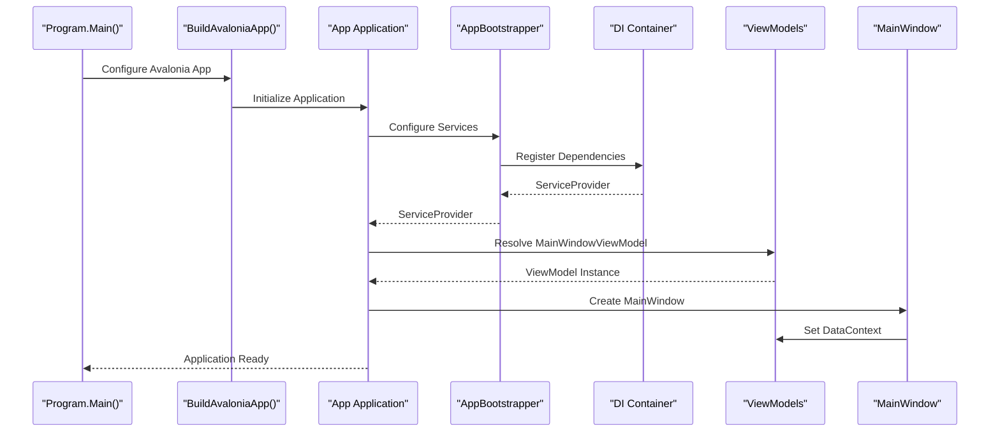
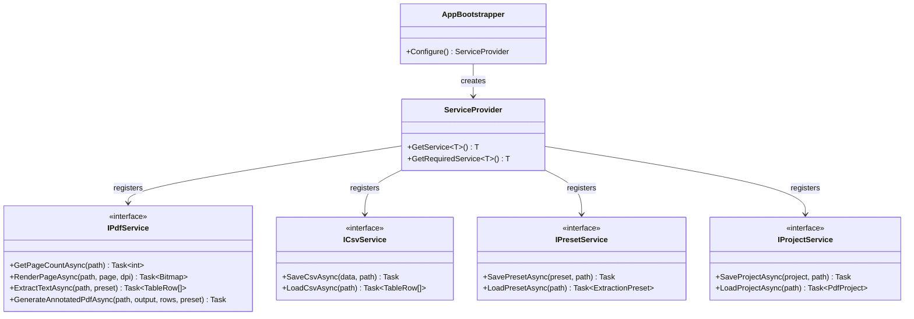
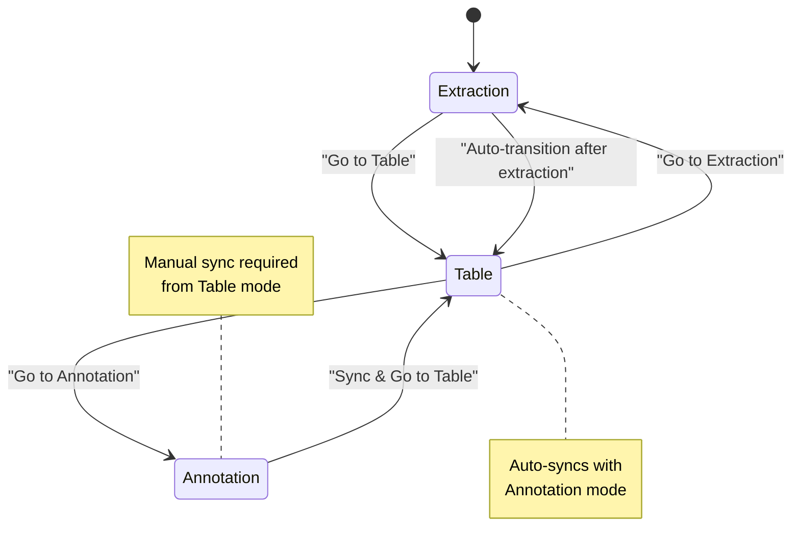

# Getting Started

<cite>
**Referenced Files in This Document**
- [README.md](file://README.md)
- [Program.cs](file://src/PdfAnnotator.App/Program.cs)
- [App.axaml.cs](file://src/PdfAnnotator.App/App.axaml.cs)
- [App.axaml](file://src/PdfAnnotator.App/App.axaml)
- [AppBootstrapper.cs](file://src/PdfAnnotator.App/Services/AppBootstrapper.cs)
- [PdfAnnotator.App.csproj](file://src/PdfAnnotator.App/PdfAnnotator.App.csproj)
- [MainWindowViewModel.cs](file://src/PdfAnnotator.ViewModels/MainWindowViewModel.cs)
- [MainWindow.axaml.cs](file://src/PdfAnnotator.App/MainWindow.axaml.cs)
- [ExtractionView.axaml.cs](file://src/PdfAnnotator.App/Views/ExtractionView.axaml.cs)
- [TableView.axaml.cs](file://src/PdfAnnotator.App/Views/TableView.axaml.cs)
- [AnnotationView.axaml.cs](file://src/PdfAnnotator.App/Views\AnnotationView.axaml.cs)
- [IPdfService.cs](file://src/PdfAnnotator.Core/Services/IPdfService.cs)
- [Example.json](file://presets/extraction/Example.json)
- [Example.json](file://presets/annotation/Example.json)
- [SampleProject.json](file://projects/SampleProject.json)
</cite>

## Table of Contents
1. [Introduction](#introduction)
2. [System Requirements](#system-requirements)
3. [Installation Guide](#installation-guide)
4. [Project Structure Overview](#project-structure-overview)
5. [Development Environment Setup](#development-environment-setup)
6. [Building and Running the Application](#building-and-running-the-application)
7. [Understanding the Application Architecture](#understanding-the-application-architecture)
8. [Exploring Interface Modes](#exploring-interface-modes)
9. [Common Issues and Troubleshooting](#common-issues-and-troubleshooting)
10. [Next Steps](#next-steps)

## Introduction

PDF Extract → Table → Annotate Tool is a cross-platform desktop application built with Avalonia UI framework and .NET 8. The application enables users to extract text from PDF documents, organize extracted data into editable tables, and annotate PDF pages with customizable text overlays. It features three primary operational modes: Extraction (text selection and preset saving), Table (data editing and CSV export), and Annotation (adding text annotations to PDFs).

The application follows modern software architecture principles including MVVM pattern, dependency injection, and modular service design. It leverages powerful libraries such as Docnet for PDF rendering, PdfPig for text extraction, and PdfSharpCore for PDF generation.

## System Requirements

### Operating System Compatibility
The application is cross-platform and supports all major operating systems:

- **Windows**: Windows 10 or later (64-bit recommended)
- **Linux**: Ubuntu 18.04+, Debian 10+, Fedora 32+, or other distributions with .NET 8 support
- **macOS**: macOS 10.15 (Catalina) or later

### Hardware Requirements
- **Minimum RAM**: 4 GB (8 GB recommended for optimal performance)
- **Storage Space**: 1 GB free disk space for installation and temporary files
- **Graphics**: Standard graphics card with OpenGL support (for Avalonia rendering)

### Software Dependencies
- **.NET 8 SDK**: Required for building and running the application
- **Git**: For cloning the repository (optional)
- **Modern Web Browser**: For accessing online resources and documentation

## Installation Guide

### Step 1: Install .NET 8 SDK

Before proceeding, ensure you have the .NET 8 SDK installed on your system.

#### Windows Installation
1. Download the .NET 8 SDK installer from the official Microsoft website
2. Run the downloaded installer (typically named `dotnet-sdk-8.x.x-win-x64.exe`)
3. Follow the installation wizard prompts
4. Verify installation by opening Command Prompt and running:
   ```bash
   dotnet --version
   ```
   Expected output: `8.x.x` (specific version number)

#### Linux Installation
For Ubuntu/Debian-based systems:
```bash
wget https://packages.microsoft.com/config/ubuntu/22.04/packages-microsoft-prod.deb
sudo dpkg -i packages-microsoft-prod.deb
sudo apt update
sudo apt install -y dotnet-sdk-8.0
```

For Red Hat/Fedora-based systems:
```bash
sudo rpm -Uvh https://packages.microsoft.com/config/rhel/8/packages-microsoft-prod.rpm
sudo dnf install -y dotnet-sdk-8.0
```

#### macOS Installation
```bash
brew install --cask dotnet-sdk
```

### Step 2: Clone the Repository

Choose your preferred method to obtain the source code:

#### Method 1: Using Git (Recommended)
```bash
git clone https://github.com/your-repository-url.git
cd PDFAnnotator
```

#### Method 2: Download ZIP Archive
1. Visit the repository URL
2. Click "Code" > "Download ZIP"
3. Extract the archive to your desired location
4. Open terminal/command prompt in the extracted folder

### Step 3: Verify Project Structure

After cloning/download, verify the project structure matches the expected layout:
```
PDFAnnotator/
├── presets/
│   ├── annotation/
│   │   └── Example.json
│   └── extraction/
│       └── Example.json
├── projects/
│   └── SampleProject.json
├── src/
│   ├── PdfAnnotator.App/
│   ├── PdfAnnotator.Core/
│   └── PdfAnnotator.ViewModels/
├── README.md
└── [other project files]
```

## Development Environment Setup

### Prerequisites Verification

Before building the project, verify all prerequisites are met:

1. **Check .NET SDK Version**:
   ```bash
   dotnet --version
   ```
   Should display `.NET 8.x.x`

2. **Verify Git Installation** (if using Git):
   ```bash
   git --version
   ```

### Initial Build Process

The first build will automatically restore all NuGet packages required by the project.

#### Automatic Package Restoration
During the initial build, NuGet will automatically download and install all dependencies listed in the project files. This includes:
- **Avalonia UI Framework** (v11.*)
- **Microsoft.Extensions.DependencyInjection** (v8.*)
- **Docnet.Core** (v2.*) for PDF rendering
- **PdfSharpCore** (v1.*) for PDF generation
- **UglyToad.PdfPig** (v1.7.0-custom-5) for text extraction

#### Offline Considerations
If you're working in an environment without internet access:
1. **Pre-download Dependencies**: Run `dotnet restore` on a connected machine
2. **Copy NuGet Cache**: Transfer the NuGet cache folder to the offline machine
3. **Configure NuGet Sources**: Add local package sources if needed

## Building and Running the Application

### Step-by-Step Build Process

#### 1. Navigate to Project Directory
```bash
cd PDFAnnotator
```

#### 2. Build the Solution
Execute the build command from the root directory:
```bash
dotnet build
```

The build process will:
- Compile all C# source files
- Resolve and download NuGet dependencies (if not previously cached)
- Generate executable binaries
- Perform project-specific optimizations

#### 3. Run the Application
After successful compilation, launch the application using:
```bash
dotnet run --project src/PdfAnnotator.App
```

Alternatively, you can use the compiled executable:
```bash
dotnet run --project src/PdfAnnotator.App --configuration Release
```

### Application Startup Flow

The application follows a specific initialization sequence that demonstrates modern .NET application architecture:



**Diagram sources**
- [Program.cs](file://src/PdfAnnotator.App/Program.cs#L11-L20)
- [App.axaml.cs](file://src/PdfAnnotator.App/App.axaml.cs#L19-L31)
- [AppBootstrapper.cs](file://src/PdfAnnotator.App/Services/AppBootstrapper.cs#L12-L33)

**Section sources**
- [Program.cs](file://src/PdfAnnotator.App/Program.cs#L11-L20)
- [App.axaml.cs](file://src/PdfAnnotator.App/App.axaml.cs#L19-L31)
- [AppBootstrapper.cs](file://src/PdfAnnotator.App/Services/AppBootstrapper.cs#L12-L33)

## Understanding the Application Architecture

### Dependency Injection Container

The application uses Microsoft.Extensions.DependencyInjection for service registration and dependency resolution. The bootstrapper handles all service registrations:



**Diagram sources**
- [AppBootstrapper.cs](file://src/PdfAnnotator.App/Services/AppBootstrapper.cs#L23-L26)
- [IPdfService.cs](file://src/PdfAnnotator.Core/Services/IPdfService.cs#L8-L14)

### Service Registration Details

The bootstrapper registers the following services with singleton lifetime:

| Service Type | Implementation | Purpose |
|--------------|----------------|---------|
| `IPdfService` | `PdfService` | PDF rendering, text extraction, annotation generation |
| `ICsvService` | `CsvService` | CSV file operations for table data |
| `IPresetService` | `PresetService` | JSON-based preset management for extraction and annotation |
| `IProjectService` | `ProjectService` | Project persistence and loading |
| `MainWindowViewModel` | `MainWindowViewModel` | Main application state and navigation |
| `ExtractionViewModel` | `ExtractionViewModel` | Text extraction mode functionality |
| `TableViewModel` | `TableViewModel` | Table editing and CSV operations |
| `AnnotationViewModel` | `AnnotationViewModel` | PDF annotation functionality |

**Section sources**
- [AppBootstrapper.cs](file://src/PdfAnnotator.App/Services/AppBootstrapper.cs#L12-L33)

## Exploring Interface Modes

The application operates in three distinct modes, each serving specific document processing tasks:

### Mode 1: Extraction Mode

Extraction mode enables users to select text regions within PDF documents and save them as reusable presets.

#### Key Features:
- **PDF Loading**: Open PDF files through file picker dialog
- **Text Selection**: Drag rectangle selection over text areas
- **Preset Management**: Save and load extraction configurations
- **Text Extraction**: Convert selected regions to structured data

#### Workflow:
1. Open PDF file using "Open PDF" button
2. Navigate to target page
3. Drag-select rectangular region containing text
4. Configure extraction parameters
5. Save preset for future reuse
6. Extract text to populate table view

**Section sources**
- [ExtractionView.axaml.cs](file://src/PdfAnnotator.App/Views/ExtractionView.axaml.cs#L74-L104)
- [MainWindowViewModel.cs](file://src/PdfAnnotator.ViewModels/MainWindowViewModel.cs#L14-L19)

### Mode 2: Table Mode

Table mode provides spreadsheet-like functionality for editing extracted data and exporting to CSV format.

#### Key Features:
- **Data Editing**: Inline cell editing with real-time validation
- **CSV Operations**: Import/export CSV files
- **Row Synchronization**: Automatic synchronization with annotation mode
- **Project Persistence**: Save/load complete project state

#### Workflow:
1. Load extracted data from extraction mode
2. Edit table cells directly
3. Export to CSV using "Export to CSV" button
4. Save project for later continuation

**Section sources**
- [TableView.axaml.cs](file://src/PdfAnnotator.App/Views/TableView.axaml.cs#L1-L18)

### Mode 3: Annotation Mode

Annotation mode allows adding customized text overlays to PDF documents with various formatting options.

#### Key Features:
- **PDF Rendering**: High-quality PDF page rendering
- **Text Positioning**: Precise text placement using coordinate system
- **Formatting Options**: Font family, size, color, and rotation angle
- **Preset Management**: Save annotation configurations
- **PDF Generation**: Export annotated PDF files

#### Workflow:
1. Open target PDF file
2. Select page for annotation
3. Click position for text placement
4. Configure font and appearance settings
5. Save annotation preset
6. Generate final annotated PDF

**Section sources**
- [AnnotationView.axaml.cs](file://src/PdfAnnotator.App/Views\AnnotationView.axaml.cs#L27-L37)
- [MainWindowViewModel.cs](file://src/PdfAnnotator.ViewModels/MainWindowViewModel.cs#L64-L67)

### Navigation Between Modes

The application provides seamless navigation between modes through command buttons:



**Diagram sources**
- [MainWindowViewModel.cs](file://src\PdfAnnotator.ViewModels\MainWindowViewModel.cs#L63-L67)

**Section sources**
- [MainWindowViewModel.cs](file://src\PdfAnnotator.ViewModels/MainWindowViewModel.cs#L33-L37)

## Common Issues and Troubleshooting

### Issue 1: Missing .NET 8 SDK

**Problem**: `The specified SDK version could not be found`

**Solution**:
1. Verify .NET installation: `dotnet --version`
2. Download and install .NET 8 SDK from [Microsoft's official website](https://dotnet.microsoft.com/download/dotnet/8.0)
3. Restart terminal/command prompt
4. Verify installation completion

### Issue 2: NuGet Package Restore Failures

**Problem**: Build fails with package restore errors

**Solutions**:
1. **Network Connectivity**: Ensure internet connection for initial package download
2. **Offline Mode**: Pre-download packages on connected machine
3. **NuGet Configuration**: Clear NuGet cache:
   ```bash
   dotnet nuget locals all --clear
   ```
4. **Proxy Settings**: Configure proxy if behind corporate firewall

### Issue 3: File Permission Errors

**Problem**: Access denied when saving projects or logs

**Solutions**:
1. **Run as Administrator**: Right-click terminal and select "Run as administrator"
2. **Directory Permissions**: Ensure write access to project directory
3. **Antivirus Interference**: Temporarily disable antivirus software
4. **Path Length**: Use shorter project paths (< 260 characters)

### Issue 4: PDF Rendering Problems

**Problem**: PDF pages fail to render or appear corrupted

**Solutions**:
1. **PDF Format**: Verify PDF file integrity
2. **Memory Issues**: Close other applications to free memory
3. **DPI Settings**: Adjust rendering DPI in extraction mode
4. **File Locking**: Ensure PDF file is not open in other applications

### Issue 5: Cross-Platform Compatibility

**Problem**: Application behaves differently on different operating systems

**Solutions**:
1. **Font Availability**: Ensure required fonts are installed
2. **File Paths**: Use forward slashes or verified path separators
3. **Line Endings**: Check for platform-specific line ending issues
4. **Locale Settings**: Verify system locale compatibility

### Debugging Tips

1. **Enable Logging**: Check `logs/app.log` for detailed error information
2. **Verbose Output**: Use `dotnet build -v d` for detailed build output
3. **Clean Build**: `dotnet clean` followed by `dotnet build`
4. **Dependency Analysis**: `dotnet list package --outdated` to check updates

## Next Steps

### Learning Resources

1. **Avalonia UI Documentation**: [avaloniaui.net](https://avaloniaui.net/)
2. **.NET 8 Documentation**: [docs.microsoft.com/dotnet](https://docs.microsoft.com/dotnet)
3. **MVVM Pattern**: Understand Model-View-ViewModel architecture principles
4. **Dependency Injection**: Learn service registration and resolution patterns

### Development Opportunities

1. **Feature Enhancement**: Add new PDF processing capabilities
2. **UI Improvements**: Enhance user interface and experience
3. **Testing**: Expand automated test coverage
4. **Documentation**: Improve inline code documentation
5. **Localization**: Add support for multiple languages

### Contributing Guidelines

1. **Code Style**: Follow established C# coding conventions
2. **Testing**: Write unit tests for new functionality
3. **Documentation**: Update README with new features
4. **Pull Requests**: Submit changes through GitHub pull requests
5. **Issue Reporting**: Report bugs and feature requests appropriately

### Advanced Usage

Once comfortable with basic operation, explore:
- **Custom Presets**: Create specialized extraction and annotation configurations
- **Batch Processing**: Develop scripts for bulk PDF processing
- **Integration**: Connect with external data sources and APIs
- **Performance Optimization**: Profile and optimize resource-intensive operations

**Section sources**
- [README.md](file://README.md#L1-L41)