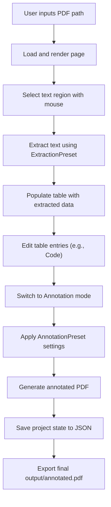

# Introduction

<cite>
**Referenced Files in This Document**   
- [README.md](file://README.md)
- [App.axaml.cs](file://src/PdfAnnotator.App/App.axaml.cs)
- [MainWindowViewModel.cs](file://src/PdfAnnotator.ViewModels/MainWindowViewModel.cs)
- [IPdfService.cs](file://src/PdfAnnotator.Core/Services/IPdfService.cs)
- [PdfProject.cs](file://src/PdfAnnotator.Core/Models/PdfProject.cs)
- [ExtractionViewModel.cs](file://src/PdfAnnotator.ViewModels/ExtractionViewModel.cs)
- [AnnotationViewModel.cs](file://src/PdfAnnotator.ViewModels/AnnotationViewModel.cs)
- [TableViewModel.cs](file://src/PdfAnnotator.ViewModels/TableViewModel.cs)
- [PdfService.cs](file://src/PdfAnnotator.App/Services/PdfService.cs)
</cite>

## Table of Contents
1. [Introduction](#introduction)
2. [Core Functionality and Application Purpose](#core-functionality-and-application-purpose)
3. [Target Audience and Use Cases](#target-audience-and-use-cases)
4. [High-Level Feature Set](#high-level-feature-set)
5. [Application Flow Overview](#application-flow-overview)
6. [Architectural Foundations](#architectural-foundations)
7. [Technical Limitations and Considerations](#technical-limitations-and-considerations)

## Core Functionality and Application Purpose

PDFAnnotator is a desktop application designed to streamline the transformation of unstructured PDF content into structured, editable data through a cohesive workflow of extraction, editing, and annotation. The tool enables users to extract text from specific regions of PDF documents, manage the extracted content in a tabular format, and apply customizable annotations back onto the original document. Its primary purpose is to facilitate reproducible data processing workflows for technical users who require precision and consistency when handling document-based information.

The application operates on a modular workflow that separates concerns into distinct modes: extraction, table editing, and annotation. This separation allows users to focus on individual stages of processing while maintaining data continuity across the pipeline. At its core, PDFAnnotator leverages the `IPdfService` interface to abstract PDF operations, enabling rendering, text extraction, and annotation generation through backend libraries such as Docnet, PdfPig, and PdfSharpCore.

**Section sources**
- [README.md](file://README.md#L1-L41)
- [IPdfService.cs](file://src/PdfAnnotator.Core/Services/IPdfService.cs#L1-L15)
- [PdfService.cs](file://src/PdfAnnotator.App/Services/PdfService.cs#L1-L179)

## Target Audience and Use Cases

The primary users of PDFAnnotator are developers, data analysts, and technical professionals who frequently work with PDF documents containing structured or semi-structured data—such as invoices, forms, reports, or technical specifications. These users often need to convert static document content into machine-readable formats for integration into databases, spreadsheets, or automated systems.

Key use cases include:
- **Manual Path Input**: Users input the file path directly into the application, allowing for quick processing without reliance on file dialogs.
- **CSV Synchronization**: Extracted data is synchronized with CSV files stored in `tables/latest.csv`, enabling external editing and version control.
- **Reproducible Workflows**: By saving and reusing presets and projects, users can standardize processing steps across multiple documents.

These scenarios support workflows where consistency, repeatability, and traceability are essential, particularly in environments where automation scripts or data pipelines depend on predictable input formatting.

**Section sources**
- [README.md](file://README.md#L15-L17)
- [TableViewModel.cs](file://src/PdfAnnotator.ViewModels/TableViewModel.cs#L1-L71)
- [CsvService.cs](file://src/PdfAnnotator.Core/Services/CsvService.cs)

## High-Level Feature Set

PDFAnnotator provides four core capabilities that interoperate seamlessly within the MVVM (Model-View-ViewModel) architecture:

1. **Text Extraction**: Users define rectangular regions on a PDF page using mouse selection. The coordinates are stored in `ExtractionPreset` objects, which can be saved and reused. The extracted text is mapped to table rows associated with specific pages.
   
2. **Table Editing**: The extracted data appears in a tabular interface where users can edit fields such as `Code`. Changes are synchronized across the application, particularly to the annotation phase.

3. **Annotation**: Using `AnnotationPreset` configurations, users specify font, color, angle, and position to overlay text (e.g., codes) onto the original PDF. These annotations are applied via PdfSharpCore and saved to `output/annotated.pdf`.

4. **Project Persistence**: Entire workflows—including PDF paths, selected presets, and table data—are saved as JSON files in the `projects/` directory using the `PdfProject` model and `ProjectService`. This enables resuming work across sessions.

These features are unified through shared data models and event-driven synchronization between view models, ensuring changes in one mode propagate appropriately to others.

**Section sources**
- [PdfProject.cs](file://src/PdfAnnotator.Core/Models/PdfProject.cs#L1-L13)
- [ExtractionPreset.cs](file://src/PdfAnnotator.Core/Models/ExtractionPreset.cs#L1-L11)
- [AnnotationPreset.cs](file://src/PdfAnnotator.Core/Models/AnnotationPreset.cs#L1-L13)
- [TableRow.cs](file://src/PdfAnnotator.Core/Models/TableRow.cs#L1-L9)
- [ProjectService.cs](file://src/PdfAnnotator.Core/Services/ProjectService.cs#L1-L43)
- [PresetService.cs](file://src/PdfAnnotator.Core/Services/PresetService.cs#L1-L82)

## Application Flow Overview

The typical user journey in PDFAnnotator follows a linear yet flexible sequence:

1. **Load PDF**: In Extraction mode, the user inputs a PDF file path and loads a specific page for rendering.
2. **Define Region**: Using mouse interaction, the user selects a rectangular area on the rendered page. The coordinates are captured and converted to PDF space (bottom-left origin).
3. **Extract Text**: Upon clicking "Extract Text", the application uses PdfPig to retrieve words within the defined region and populates a table.
4. **Edit Table**: The user switches to Table mode to modify entries (e.g., assigning codes), with changes automatically synced to the annotation preview.
5. **Annotate**: In Annotation mode, the user selects a preset or configures annotation properties (font, color, position). Clicking "Save Annotated PDF" generates a new PDF with overlays using PdfSharpCore.
6. **Save Project**: At any point, the user can save the entire state—including presets, table data, and file paths—as a `.json` project file for later retrieval.

This flow is orchestrated by the `MainWindowViewModel`, which manages navigation between modes and coordinates data updates via event handlers like `TableUpdated` and `RowsUpdated`.

**Diagram sources**
- [MainWindowViewModel.cs](file://src/PdfAnnotator.ViewModels/MainWindowViewModel.cs#L1-L120)
- [ExtractionViewModel.cs](file://src/PdfAnnotator.ViewModels/ExtractionViewModel.cs#L1-L196)
- [AnnotationViewModel.cs](file://src/PdfAnnotator.ViewModels/AnnotationViewModel.cs#L1-L195)
- [TableViewModel.cs](file://src/PdfAnnotator.ViewModels/TableViewModel.cs#L1-L71)

## Architectural Foundations

PDFAnnotator is built on the MVVM (Model-View-ViewModel) pattern, with a clear separation between UI components and business logic. The application uses Avalonia UI, a cross-platform .NET framework for building desktop applications, and targets .NET 8 for performance and modern language features.

Key architectural elements include:
- **Views**: Located in `src/PdfAnnotator.App/Views`, these define the UI layout using XAML.
- **ViewModels**: Found in `src/PdfAnnotator.ViewModels`, they expose data and commands to the views, implementing `INotifyPropertyChanged` via Fody/PropertyChanged.
- **Core Services**: In `src/PdfAnnotator.Core/Services`, interfaces like `IPdfService`, `ICsvService`, and `IProjectService` encapsulate domain logic.
- **Dependency Injection**: Services are registered via `Microsoft.Extensions.DependencyInjection` and bootstrapped in `AppBootstrapper`, with the service provider accessible globally through `App.Services`.

This structure promotes testability, maintainability, and extensibility, allowing new features to be added without disrupting existing functionality.

**Section sources**
- [App.axaml.cs](file://src/PdfAnnotator.App/App.axaml.cs#L1-L34)
- [MainWindowViewModel.cs](file://src/PdfAnnotator.ViewModels/MainWindowViewModel.cs#L1-L120)
- [IPdfService.cs](file://src/PdfAnnotator.Core/Services/IPdfService.cs#L1-L15)
- [README.md](file://README.md#L20-L25)

## Technical Limitations and Considerations

While PDFAnnotator provides a robust foundation for PDF processing, several limitations are documented in the README and reflected in the codebase:

- **Coordinate Scaling Inaccuracies**: Rendering and selection occur in display coordinates, which may not perfectly align with PDF coordinates under different DPI settings or scaling factors. This can lead to misalignment between selection regions and actual text content.
- **Manual File Path Entry**: The application does not include built-in file open dialogs; users must manually type or paste file paths, which may reduce usability for non-technical users.
- **Basic Annotation Support**: Font and color options are limited to predefined choices, and advanced PDF features like form fields or digital signatures are not supported.
- **No Real-Time Preview in Extraction Mode**: The selection rectangle is visualized in the UI, but there is no live feedback of how the extracted text will appear in the table until the extraction is executed.

These constraints reflect the application's status as a working prototype, prioritizing core functionality and extensibility over polished UX. Future improvements could include coordinate transformation refinement, drag-and-drop support, and enhanced preset management.

**Section sources**
- [README.md](file://README.md#L38-L40)
- [ExtractionViewModel.cs](file://src/PdfAnnotator.ViewModels/ExtractionViewModel.cs#L106-L117)
- [AnnotationViewModel.cs](file://src/PdfAnnotator.ViewModels/AnnotationViewModel.cs#L89-L96)
- [PdfService.cs](file://src/PdfAnnotator.App/Services/PdfService.cs#L68-L70)