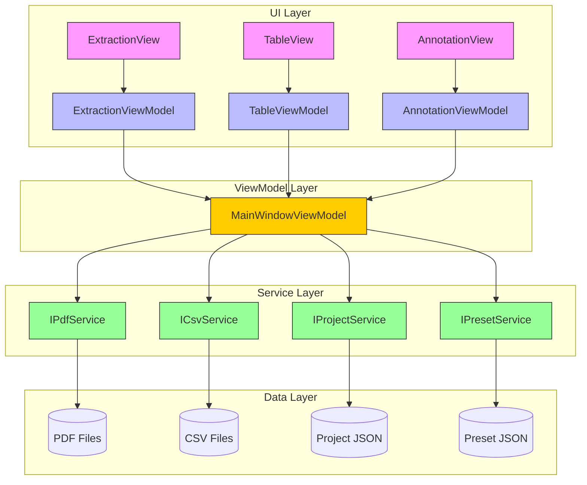
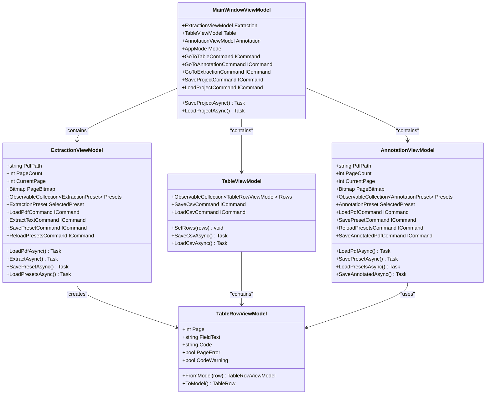
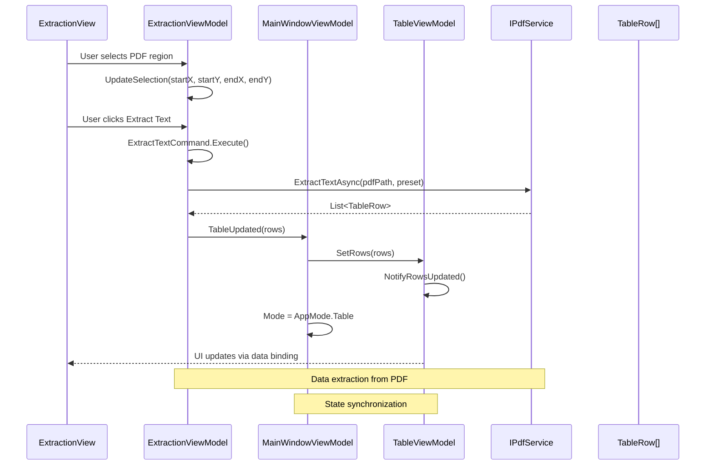
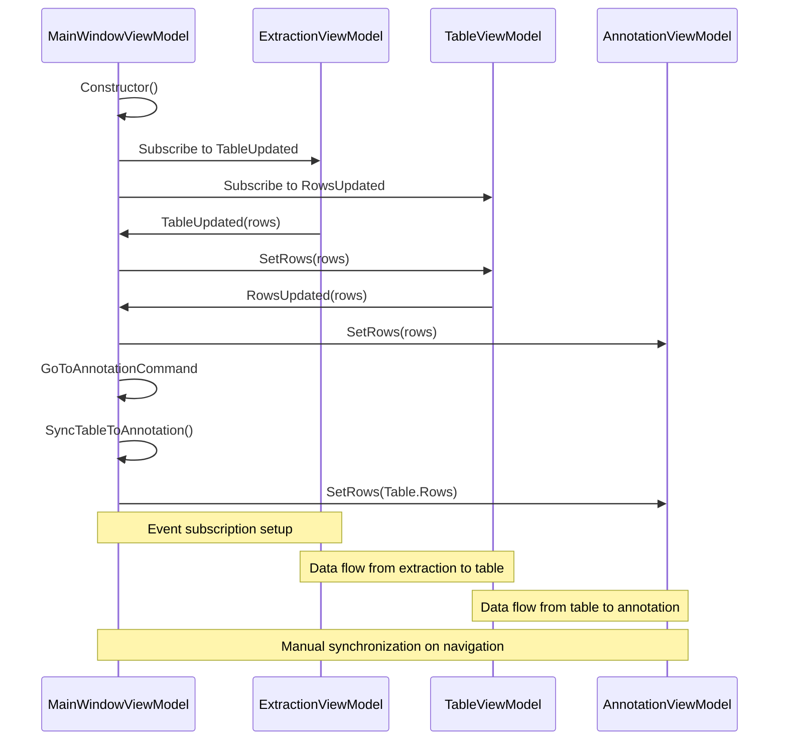
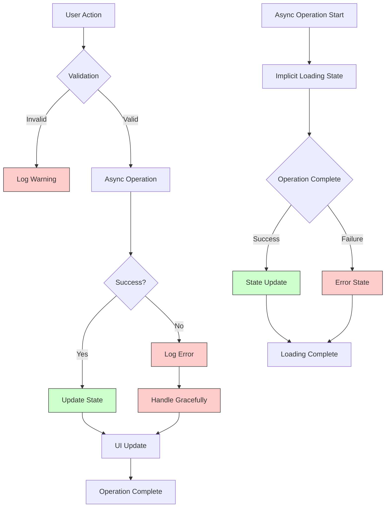

# Data Flow and Event Communication

<cite>
**Referenced Files in This Document**   
- [MainWindowViewModel.cs](file://src/PdfAnnotator.ViewModels/MainWindowViewModel.cs)
- [ExtractionViewModel.cs](file://src/PdfAnnotator.ViewModels/ExtractionViewModel.cs)
- [TableViewModel.cs](file://src/PdfAnnotator.ViewModels/TableViewModel.cs)
- [AnnotationViewModel.cs](file://src/PdfAnnotator.ViewModels/AnnotationViewModel.cs)
- [TableRowViewModel.cs](file://src/PdfAnnotator.ViewModels/TableRowViewModel.cs)
- [TableRow.cs](file://src/PdfAnnotator.Core/Models/TableRow.cs)
- [PdfProject.cs](file://src/PdfAnnotator.Core/Models/PdfProject.cs)
- [IPdfService.cs](file://src/PdfAnnotator.Core/Services/IPdfService.cs)
- [ICsvService.cs](file://src/PdfAnnotator.Core/Services/ICsvService.cs)
- [IProjectService.cs](file://src/PdfAnnotator.Core/Services/IProjectService.cs)
- [ExtractionView.axaml.cs](file://src/PdfAnnotator.App/Views/ExtractionView.axaml.cs)
- [AnnotationView.axaml.cs](file://src/PdfAnnotator.App/Views/AnnotationView.axaml.cs)
- [TableView.axaml.cs](file://src/PdfAnnotator.App/Views/TableView.axaml.cs)
- [App.axaml.cs](file://src/PdfAnnotator.App/App.axaml.cs)
- [AppBootstrapper.cs](file://src/PdfAnnotator.App/Services/AppBootstrapper.cs)
</cite>

## Table of Contents
1. [Introduction](#introduction)
2. [Architecture Overview](#architecture-overview)
3. [Core Components](#core-components)
4. [Data Flow Lifecycle](#data-flow-lifecycle)
5. [Event-Driven Communication System](#event-driven-communication-system)
6. [ViewModel Coordination via MainWindowViewModel](#viewmodel-coordination-via-mainwindowviewmodel)
7. [Error Handling and State Management](#error-handling-and-state-management)
8. [Debugging Strategies](#debugging-strategies)
9. [Best Practices for Data Coherence](#best-practices-for-data-coherence)
10. [Conclusion](#conclusion)

## Introduction

The PDFAnnotator application implements a robust event-driven architecture for managing user interactions, data extraction, and annotation workflows. This document details the complete lifecycle of user actions from UI input through ViewModel coordination, service invocation, and data persistence. The system leverages a centralized ViewModel pattern with event publication for inter-component communication, ensuring data consistency across Extraction, Table, and Annotation modules.

**Section sources**
- [MainWindowViewModel.cs](file://src/PdfAnnotator.ViewModels/MainWindowViewModel.cs#L1-L120)

## Architecture Overview

The PDFAnnotator follows a layered MVVM (Model-View-ViewModel) architecture with clear separation between UI components, business logic, and data services. The application uses dependency injection for service management and implements event-driven communication between ViewModels.



**Diagram sources**
- [MainWindowViewModel.cs](file://src/PdfAnnotator.ViewModels/MainWindowViewModel.cs#L1-L120)
- [AppBootstrapper.cs](file://src/PdfAnnotator.App/Services/AppBootstrapper.cs#L1-L36)
- [App.axaml.cs](file://src/PdfAnnotator.App/App.axaml.cs#L1-L34)

## Core Components

The core components of PDFAnnotator include specialized ViewModels for extraction, table management, and annotation, coordinated by a central MainWindowViewModel. Each ViewModel manages its own state and exposes commands to the UI layer, while sharing data through event-driven communication.



**Diagram sources**
- [MainWindowViewModel.cs](file://src/PdfAnnotator.ViewModels/MainWindowViewModel.cs#L1-L120)
- [ExtractionViewModel.cs](file://src/PdfAnnotator.ViewModels/ExtractionViewModel.cs#L1-L196)
- [TableViewModel.cs](file://src/PdfAnnotator.ViewModels/TableViewModel.cs#L1-L71)
- [AnnotationViewModel.cs](file://src/PdfAnnotator.ViewModels/AnnotationViewModel.cs#L1-L195)
- [TableRowViewModel.cs](file://src/PdfAnnotator.ViewModels/TableRowViewModel.cs#L1-L47)

**Section sources**
- [MainWindowViewModel.cs](file://src/PdfAnnotator.ViewModels/MainWindowViewModel.cs#L1-L120)
- [ExtractionViewModel.cs](file://src/PdfAnnotator.ViewModels/ExtractionViewModel.cs#L1-L196)
- [TableViewModel.cs](file://src/PdfAnnotator.ViewModels/TableViewModel.cs#L1-L71)
- [AnnotationViewModel.cs](file://src/PdfAnnotator.ViewModels/AnnotationViewModel.cs#L1-L195)

## Data Flow Lifecycle

The data flow in PDFAnnotator begins with user interaction in the View layer and progresses through ViewModel processing, service invocation, and data persistence. This section details the complete lifecycle of a user action from selection to persistence.



**Diagram sources**
- [ExtractionView.axaml.cs](file://src/PdfAnnotator.App/Views/ExtractionView.axaml.cs#L1-L157)
- [ExtractionViewModel.cs](file://src/PdfAnnotator.ViewModels/ExtractionViewModel.cs#L1-L196)
- [MainWindowViewModel.cs](file://src/PdfAnnotator.ViewModels/MainWindowViewModel.cs#L1-L120)
- [TableViewModel.cs](file://src/PdfAnnotator.ViewModels/TableViewModel.cs#L1-L71)
- [IPdfService.cs](file://src/PdfAnnotator.Core/Services/IPdfService.cs#L1-L15)

## Event-Driven Communication System

PDFAnnotator employs an event-driven communication system to coordinate state changes between ViewModels. The system uses direct property access for simple state sharing and event publication for complex data updates, ensuring loose coupling while maintaining data consistency.

```mermaid
flowchart TD
A[Extraction Complete] --> B{ExtractionViewModel}
B --> |TableUpdated| C[MainWindowViewModel]
C --> D[TableViewModel.SetRows()]
D --> E[Table Updates UI]
E --> F{Rows Changed}
F --> |RowsUpdated| C
C --> G[AnnotationViewModel.SetRows()]
G --> H[Annotation Updates Preview]
I[User Navigates to Annotation] --> J[MainWindowViewModel]
J --> K[SyncTableToAnnotation()]
K --> L[AnnotationViewModel.SetRows()]
L --> M[Annotation Updates UI]
style B fill:#ffcccc,stroke:#333
style C fill:#ccccff,stroke:#333
style D fill:#ccffcc,stroke:#333
style G fill:#ccffcc,stroke:#333
style K fill:#ccffcc,stroke:#333
style L fill:#ccffcc,stroke:#333
```

**Diagram sources**
- [MainWindowViewModel.cs](file://src/PdfAnnotator.ViewModels/MainWindowViewModel.cs#L1-L120)
- [ExtractionViewModel.cs](file://src/PdfAnnotator.ViewModels/ExtractionViewModel.cs#L1-L196)
- [TableViewModel.cs](file://src/PdfAnnotator.ViewModels/TableViewModel.cs#L1-L71)
- [AnnotationViewModel.cs](file://src/PdfAnnotator.ViewModels/AnnotationViewModel.cs#L1-L195)

**Section sources**
- [MainWindowViewModel.cs](file://src/PdfAnnotator.ViewModels/MainWindowViewModel.cs#L1-L120)
- [ExtractionViewModel.cs](file://src/PdfAnnotator.ViewModels/ExtractionViewModel.cs#L1-L196)
- [TableViewModel.cs](file://src/PdfAnnotator.ViewModels/TableViewModel.cs#L1-L71)
- [AnnotationViewModel.cs](file://src/PdfAnnotator.ViewModels/AnnotationViewModel.cs#L1-L195)

## ViewModel Coordination via MainWindowViewModel

The MainWindowViewModel serves as the central coordinator, managing navigation between modes and synchronizing state between the ExtractionViewModel, TableViewModel, and AnnotationViewModel. It establishes event subscriptions during initialization and handles cross-ViewModel data flow.



**Diagram sources**
- [MainWindowViewModel.cs](file://src/PdfAnnotator.ViewModels/MainWindowViewModel.cs#L1-L120)
- [ExtractionViewModel.cs](file://src/PdfAnnotator.ViewModels/ExtractionViewModel.cs#L1-L196)
- [TableViewModel.cs](file://src/PdfAnnotator.ViewModels/TableViewModel.cs#L1-L71)
- [AnnotationViewModel.cs](file://src/PdfAnnotator.ViewModels/AnnotationViewModel.cs#L1-L195)

**Section sources**
- [MainWindowViewModel.cs](file://src/PdfAnnotator.ViewModels/MainWindowViewModel.cs#L1-L120)

## Error Handling and State Management

The application implements comprehensive error handling and loading state management throughout the data flow. Errors are logged and propagated appropriately, while loading states are managed implicitly through asynchronous operations.



**Diagram sources**
- [ExtractionViewModel.cs](file://src/PdfAnnotator.ViewModels/ExtractionViewModel.cs#L1-L196)
- [TableViewModel.cs](file://src/PdfAnnotator.ViewModels/TableViewModel.cs#L1-L71)
- [AnnotationViewModel.cs](file://src/PdfAnnotator.ViewModels/AnnotationViewModel.cs#L1-L195)
- [MainWindowViewModel.cs](file://src/PdfAnnotator.ViewModels/MainWindowViewModel.cs#L1-L120)

**Section sources**
- [ExtractionViewModel.cs](file://src/PdfAnnotator.ViewModels/ExtractionViewModel.cs#L1-L196)
- [TableViewModel.cs](file://src/PdfAnnotator.ViewModels/TableViewModel.cs#L1-L71)
- [AnnotationViewModel.cs](file://src/PdfAnnotator.ViewModels/AnnotationViewModel.cs#L1-L195)

## Debugging Strategies

Effective debugging of data inconsistencies and performance bottlenecks in PDFAnnotator requires understanding the event flow and state synchronization patterns. The following strategies can help identify and resolve issues in the data flow system.

### Tracing Data Inconsistencies
1. **Event Subscription Verification**: Ensure all event handlers are properly subscribed in MainWindowViewModel constructor
2. **Data Flow Inspection**: Check that TableRow objects maintain consistency when converted between ViewModel and Model representations
3. **State Synchronization Points**: Verify that SetRows calls properly update all dependent ViewModels
4. **Logging Analysis**: Examine log files for warnings about missing files or failed operations

### Performance Bottleneck Identification
1. **Asynchronous Operation Monitoring**: Ensure all file I/O and PDF operations are performed asynchronously
2. **Bitmap Rendering Optimization**: Check DPI settings in RenderPageAsync calls for appropriate quality/performance balance
3. **Event Handler Efficiency**: Verify that event handlers perform minimal work and don't create unnecessary object allocations
4. **Collection Updates**: Ensure ObservableCollection modifications are batched when possible to reduce UI update frequency

**Section sources**
- [MainWindowViewModel.cs](file://src/PdfAnnotator.ViewModels/MainWindowViewModel.cs#L1-L120)
- [ExtractionViewModel.cs](file://src/PdfAnnotator.ViewModels/ExtractionViewModel.cs#L1-L196)
- [TableViewModel.cs](file://src/PdfAnnotator.ViewModels/TableViewModel.cs#L1-L71)
- [AnnotationViewModel.cs](file://src/PdfAnnotator.ViewModels/AnnotationViewModel.cs#L1-L195)
- [App.axaml.cs](file://src/PdfAnnotator.App/App.axaml.cs#L1-L34)

## Best Practices for Data Coherence

Maintaining data coherence across components in PDFAnnotator requires adherence to specific patterns and practices that ensure consistency and prevent race conditions.

### Data Flow Best Practices
- **Single Source of Truth**: Treat the TableViewModel.Rows collection as the authoritative source for extracted data
- **Event-Driven Updates**: Use event publication (TableUpdated, RowsUpdated) rather than direct method calls for cross-ViewModel communication
- **Immutable Data Transfer**: Pass data between components via immutable collections to prevent unintended modifications
- **Synchronous State Updates**: Ensure all state updates from a single event are processed synchronously to maintain consistency

### ViewModel Interaction Guidelines
- **Centralized Coordination**: Route all cross-ViewModel communication through MainWindowViewModel when possible
- **Clear Event Semantics**: Use descriptive event names that clearly indicate the data being transferred and its purpose
- **Proper Subscription Management**: Subscribe to events during ViewModel initialization and avoid dynamic subscription changes
- **Error Resilience**: Implement graceful degradation when event handlers encounter errors, preventing cascading failures

### Performance Considerations
- **Asynchronous Operations**: Perform all file I/O, PDF rendering, and text extraction asynchronously to maintain UI responsiveness
- **Efficient Data Binding**: Use ObservableCollection for collections that support UI binding to minimize unnecessary updates
- **Resource Management**: Dispose of Bitmap resources appropriately to prevent memory leaks during PDF navigation
- **Batched Updates**: When updating multiple rows, consider batch operations to reduce the frequency of UI updates

**Section sources**
- [MainWindowViewModel.cs](file://src/PdfAnnotator.ViewModels/MainWindowViewModel.cs#L1-L120)
- [ExtractionViewModel.cs](file://src/PdfAnnotator.ViewModels/ExtractionViewModel.cs#L1-L196)
- [TableViewModel.cs](file://src/PdfAnnotator.ViewModels/TableViewModel.cs#L1-L71)
- [AnnotationViewModel.cs](file://src/PdfAnnotator.ViewModels/AnnotationViewModel.cs#L1-L195)

## Conclusion

The PDFAnnotator application implements a sophisticated event-driven architecture that effectively manages data flow and state synchronization across multiple ViewModels. The MainWindowViewModel serves as a central coordinator, establishing event subscriptions that enable seamless data transfer from extraction to table display to annotation. By leveraging both direct property access and event publication, the system maintains loose coupling while ensuring data consistency. The architecture supports robust error handling and provides clear pathways for debugging data inconsistencies and performance issues. Following the documented best practices will help maintain data coherence and system stability as the application evolves.