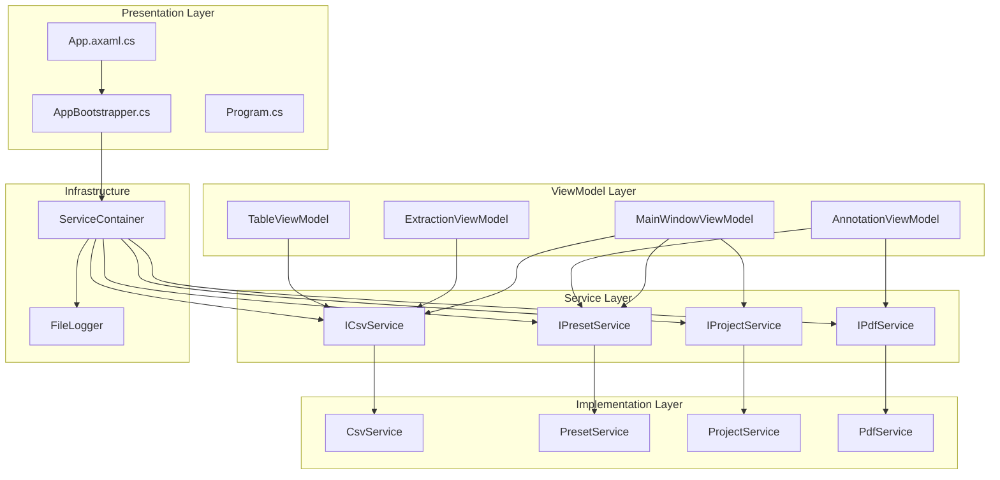
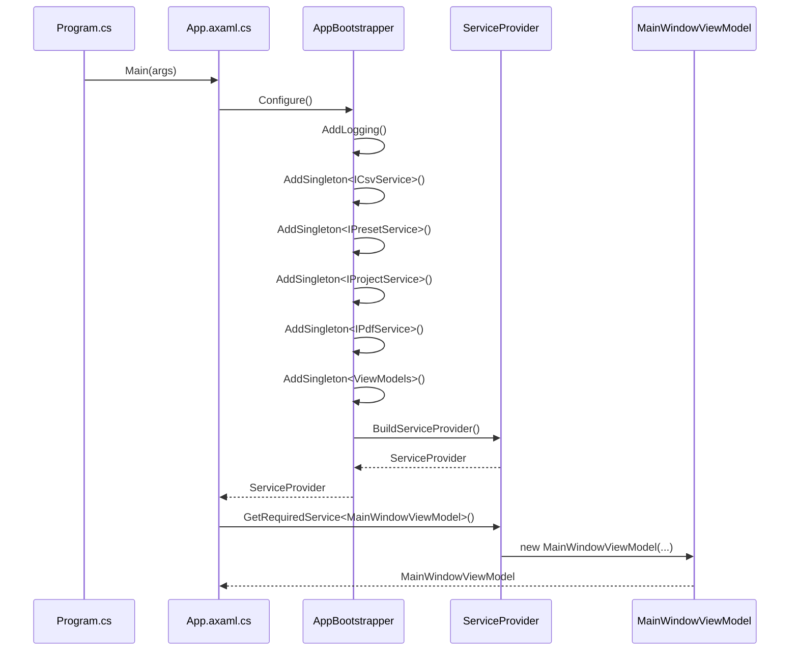
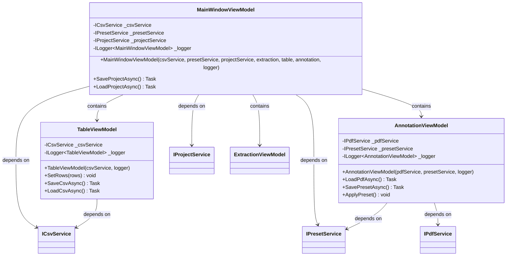
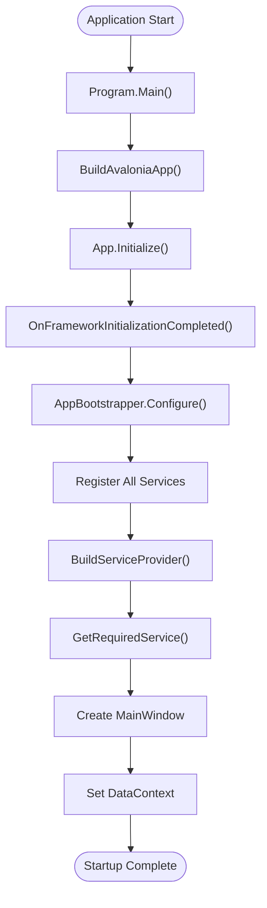

# Dependency Injection Setup

<cite>
**Referenced Files in This Document**
- [AppBootstrapper.cs](file://src/PdfAnnotator.App/Services/AppBootstrapper.cs)
- [Program.cs](file://src/PdfAnnotator.App/Program.cs)
- [App.axaml.cs](file://src/PdfAnnotator.App/App.axaml.cs)
- [MainWindowViewModel.cs](file://src/PdfAnnotator.ViewModels/MainWindowViewModel.cs)
- [AnnotationViewModel.cs](file://src/PdfAnnotator.ViewModels/AnnotationViewModel.cs)
- [TableViewModel.cs](file://src/PdfAnnotator.ViewModels/TableViewModel.cs)
- [CsvService.cs](file://src/PdfAnnotator.Core/Services/CsvService.cs)
- [PresetService.cs](file://src/PdfAnnotator.Core/Services/PresetService.cs)
- [ProjectService.cs](file://src/PdfAnnotator.Core/Services/ProjectService.cs)
- [IPresetService.cs](file://src/PdfAnnotator.Core/Services/IPresetService.cs)
- [IPdfService.cs](file://src/PdfAnnotator.Core/Services/IPdfService.cs)
- [IProjectService.cs](file://src/PdfAnnotator.Core/Services/IProjectService.cs)
- [PdfAnnotator.App.csproj](file://src/PdfAnnotator.App/PdfAnnotator.App.csproj)
</cite>

## Table of Contents
1. [Introduction](#introduction)
2. [Architecture Overview](#architecture-overview)
3. [DI Container Configuration](#di-container-configuration)
4. [Service Registration Analysis](#service-registration-analysis)
5. [ViewModel Injection Pattern](#viewmodel-injection-pattern)
6. [Application Startup Process](#application-startup-process)
7. [Benefits and Design Principles](#benefits-and-design-principles)
8. [Common Issues and Solutions](#common-issues-and-solutions)
9. [Extending the DI Container](#extending-the-di-container)
10. [Testing and Maintainability](#testing-and-maintainability)
11. [Conclusion](#conclusion)

## Introduction

PDFAnnotator implements a robust dependency injection (DI) architecture using Microsoft.Extensions.DependencyInjection to manage service lifetimes and enable loose coupling between application components. The DI container serves as the central orchestrator for all service dependencies, providing automatic constructor injection and lifecycle management throughout the application.

This documentation explores the complete DI setup, from container initialization to service resolution, highlighting how the architecture promotes testability, maintainability, and clean separation of concerns. The implementation demonstrates best practices for enterprise-level applications while maintaining simplicity and clarity.

## Architecture Overview

The dependency injection architecture in PDFAnnotator follows a layered approach with clear separation between presentation, business logic, and infrastructure concerns:



**Diagram sources**
- [App.axaml.cs](file://src/PdfAnnotator.App/App.axaml.cs#L12-L33)
- [AppBootstrapper.cs](file://src/PdfAnnotator.App/Services/AppBootstrapper.cs#L12-L33)

The architecture demonstrates several key principles:
- **Layered Separation**: Clear boundaries between presentation, business logic, and infrastructure
- **Interface Segregation**: Services are defined through interfaces for flexibility
- **Singleton Pattern**: Core services are registered as singletons for state consistency
- **Constructor Injection**: All dependencies are injected through constructors
- **Lifecycle Management**: Proper service lifetime management throughout the application

## DI Container Configuration

The dependency injection container is configured in a centralized bootstrap process that establishes all service registrations and their lifetimes. The configuration follows a fluent API pattern for clarity and maintainability.



**Diagram sources**
- [Program.cs](file://src/PdfAnnotator.App/Program.cs#L11-L13)
- [App.axaml.cs](file://src/PdfAnnotator.App/App.axaml.cs#L21-L28)
- [AppBootstrapper.cs](file://src/PdfAnnotator.App/Services/AppBootstrapper.cs#L12-L33)

**Section sources**
- [AppBootstrapper.cs](file://src/PdfAnnotator.App/Services/AppBootstrapper.cs#L12-L33)
- [App.axaml.cs](file://src/PdfAnnotator.App/App.axaml.cs#L12-L33)

## Service Registration Analysis

The DI container registers five core services with singleton lifetime scope, ensuring consistent state management and optimal performance throughout the application lifecycle.

### Core Infrastructure Services

| Service Interface | Implementation | Lifetime Scope | Rationale |
|-------------------|----------------|----------------|-----------|
| `ICsvService` | `CsvService` | Singleton | Stateless CSV operations, shared across all ViewModels |
| `IPresetService` | `PresetService` | Singleton | Persistent preset management, shared state |
| `IProjectService` | `ProjectService` | Singleton | Project persistence, shared across sessions |
| `IPdfService` | `PdfService` | Singleton | PDF processing, shared resources |

### ViewModel Registrations

The container also registers ViewModels as singletons, enabling the MVVM pattern with proper dependency injection:

| ViewModel | Purpose | Dependencies |
|-----------|---------|--------------|
| `MainWindowViewModel` | Main application coordination | All core services + child ViewModels |
| `ExtractionViewModel` | PDF text extraction | `ICsvService`, `IPresetService` |
| `TableViewModel` | Data table management | `ICsvService` |
| `AnnotationViewModel` | PDF annotation | `IPdfService`, `IPresetService` |

**Section sources**
- [AppBootstrapper.cs](file://src/PdfAnnotator.App/Services/AppBootstrapper.cs#L23-L31)

### Singleton Lifetime Justification

The singleton lifetime scope is chosen for several strategic reasons:

1. **State Consistency**: Core services maintain consistent state across the application
2. **Resource Efficiency**: Shared instances reduce memory footprint and initialization overhead
3. **Configuration Persistence**: Services maintain configuration and cached data
4. **Thread Safety**: All registered services are designed to be thread-safe
5. **Testability**: Singletons can be easily mocked in unit tests

## ViewModel Injection Pattern

PDFAnnotator employs constructor injection throughout the ViewModel layer, ensuring all dependencies are explicitly declared and automatically resolved by the DI container.



**Diagram sources**
- [MainWindowViewModel.cs](file://src/PdfAnnotator.ViewModels/MainWindowViewModel.cs#L24-L58)
- [AnnotationViewModel.cs](file://src/PdfAnnotator.ViewModels/AnnotationViewModel.cs#L67-L76)
- [TableViewModel.cs](file://src/PdfAnnotator.ViewModels/TableViewModel.cs#L28-L32)

### Constructor Injection Benefits

The constructor injection pattern provides several advantages:

1. **Explicit Dependencies**: All dependencies are clearly visible in the constructor signature
2. **Immutable Dependencies**: Once injected, dependencies cannot be changed
3. **Testability**: Easy mocking and dependency replacement in unit tests
4. **Fail-Fast Principle**: Missing dependencies cause immediate exceptions
5. **Documentation**: Constructor signatures serve as self-documenting API contracts

**Section sources**
- [MainWindowViewModel.cs](file://src/PdfAnnotator.ViewModels/MainWindowViewModel.cs#L43-L58)
- [AnnotationViewModel.cs](file://src/PdfAnnotator.ViewModels/AnnotationViewModel.cs#L67-L76)
- [TableViewModel.cs](file://src/PdfAnnotator.ViewModels/TableViewModel.cs#L28-L32)

## Application Startup Process

The application startup follows a carefully orchestrated sequence that ensures proper DI container initialization and service resolution before UI construction begins.



**Diagram sources**
- [Program.cs](file://src/PdfAnnotator.App/Program.cs#L11-L13)
- [App.axaml.cs](file://src/PdfAnnotator.App/App.axaml.cs#L19-L30)

### Startup Sequence Details

The startup process involves several critical steps:

1. **Avalonia Initialization**: Platform detection and framework setup
2. **DI Container Creation**: Service registration and provider building
3. **Service Resolution**: Main ViewModel instantiation through DI
4. **UI Construction**: Window creation with injected ViewModel as DataContext
5. **Event Binding**: Automatic property change notifications and command binding

**Section sources**
- [Program.cs](file://src/PdfAnnotator.App/Program.cs#L11-L13)
- [App.axaml.cs](file://src/PdfAnnotator.App/App.axaml.cs#L19-L30)

## Benefits and Design Principles

The DI architecture in PDFAnnotator delivers significant advantages in terms of testability, maintainability, and architectural clarity.

### Testability Benefits

The DI container enables comprehensive testing strategies:

1. **Unit Testing**: Services can be easily mocked and isolated
2. **Integration Testing**: Real service implementations with controlled environments
3. **End-to-End Testing**: Complete dependency graphs for functional testing
4. **Dependency Replacement**: Runtime service substitution for testing scenarios

### Maintainability Advantages

The architecture promotes long-term maintainability:

1. **Single Responsibility**: Each service has a focused, well-defined purpose
2. **Loose Coupling**: Components depend on abstractions, not concrete implementations
3. **Open/Closed Principle**: New services can be added without modifying existing code
4. **Dependency Graph Clarity**: Explicit dependency relationships are visible

### Architectural Integrity

The DI setup maintains architectural boundaries:

1. **Layer Separation**: Clear distinction between presentation and business logic
2. **Interface Abstraction**: Implementation details hidden behind service interfaces
3. **Lifecycle Management**: Proper resource cleanup and state management
4. **Error Handling**: Centralized logging and error propagation

## Common Issues and Solutions

Understanding potential DI-related challenges helps developers avoid common pitfalls and implement robust solutions.

### Service Registration Order

**Issue**: Dependencies between services can cause registration ordering problems.

**Solution**: Register services in dependency order or use factory patterns for complex dependencies.

**Best Practice**: Design services with minimal dependencies to avoid complex dependency graphs.

### Circular Dependencies

**Issue**: Two or more services depending on each other creates circular dependency loops.

**Solution**: Refactor dependencies using interfaces or introduce intermediate services.

**Example**: Instead of `ServiceA` depending on `ServiceB` and vice versa, create an abstraction or mediator.

### Debugging DI Failures

**Issue**: Runtime DI failures can be difficult to diagnose.

**Solution**: Enable detailed logging and use container diagnostics:

```csharp
// Enable diagnostic logging
services.AddLogging(builder => builder.AddConsole().SetMinimumLevel(LogLevel.Debug));
```

**Debugging Steps**:
1. Verify service registration completeness
2. Check constructor parameter types match registered services
3. Validate singleton lifetime requirements
4. Review dependency graph for circular references

### Memory Leaks

**Issue**: Improper singleton lifecycle management can cause memory leaks.

**Solution**: Ensure singletons are lightweight and properly dispose of unmanaged resources.

**Best Practice**: Implement `IDisposable` for services that manage external resources and configure appropriate disposal patterns.

## Extending the DI Container

The DI architecture is designed to accommodate future extensions while maintaining architectural integrity.

### Adding New Services

To add a new service to the DI container:

1. **Define Interface**: Create a service interface in the Core layer
2. **Implement Service**: Create the concrete implementation class
3. **Register Service**: Add registration to `AppBootstrapper.Configure()`
4. **Inject Dependencies**: Update consuming ViewModels with new dependencies

### Extension Patterns

Several extension patterns are supported:

1. **Decorator Pattern**: Wrap existing services with additional functionality
2. **Factory Pattern**: Create services dynamically based on runtime conditions
3. **Strategy Pattern**: Implement multiple service variations for different scenarios
4. **Middleware Pattern**: Add cross-cutting concerns like logging or caching

### Preserving Architectural Integrity

When extending the DI container:

1. **Maintain Layer Boundaries**: Don't introduce cross-layer dependencies
2. **Follow SOLID Principles**: Design services with single responsibilities
3. **Use Interface Abstractions**: Never expose concrete implementations
4. **Consider Lifecycle Implications**: Choose appropriate lifetime scopes
5. **Document Dependencies**: Maintain clear documentation of service relationships

## Testing and Maintainability

The DI architecture significantly enhances both testing capabilities and long-term maintainability.

### Unit Testing Strategies

The constructor injection pattern enables comprehensive unit testing:

```csharp
// Example test setup
var mockCsvService = new Mock<ICsvService>();
var mockPresetService = new Mock<IPresetService>();
var mockProjectService = new Mock<IProjectService>();

var viewModel = new MainWindowViewModel(
    mockCsvService.Object,
    mockPresetService.Object,
    mockProjectService.Object,
    extractionViewModel,
    tableViewModel,
    annotationViewModel,
    logger);
```

### Integration Testing

Integration tests can leverage the full DI container:

```csharp
// Full container setup for integration testing
var serviceProvider = AppBootstrapper.Configure();
var viewModel = serviceProvider.GetRequiredService<MainWindowViewModel>();
```

### Maintenance Considerations

Long-term maintenance benefits include:

1. **Refactoring Safety**: Dependencies can be refactored without breaking consumers
2. **Feature Isolation**: New features can be developed independently
3. **Technical Debt Reduction**: Clear dependency relationships prevent spaghetti code
4. **Team Productivity**: Standardized patterns improve development velocity

**Section sources**
- [MainWindowViewModel.cs](file://src/PdfAnnotator.ViewModels/MainWindowViewModel.cs#L43-L58)
- [AppBootstrapper.cs](file://src/PdfAnnotator.App/Services/AppBootstrapper.cs#L12-L33)

## Conclusion

PDFAnnotator's dependency injection architecture demonstrates a mature, well-designed approach to managing application dependencies. The implementation successfully balances simplicity with power, providing a solid foundation for application growth and maintenance.

Key architectural strengths include:

- **Centralized Configuration**: All service registrations in a single, maintainable location
- **Consistent Lifetime Management**: Appropriate singleton usage for stateful services
- **Clean Dependency Injection**: Constructor injection throughout the application
- **Test-Driven Design**: Architecture that facilitates comprehensive testing
- **Scalable Extension**: Well-defined patterns for adding new services

The DI container serves as the backbone of the application's architecture, enabling loose coupling, high testability, and maintainable code. This design approach provides a robust foundation for continued development while preserving architectural integrity and promoting best practices in software engineering.

Future enhancements can be implemented safely within this established architecture, ensuring that the application continues to evolve while maintaining its core architectural principles and quality standards.