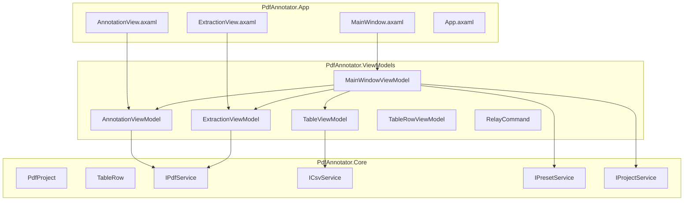
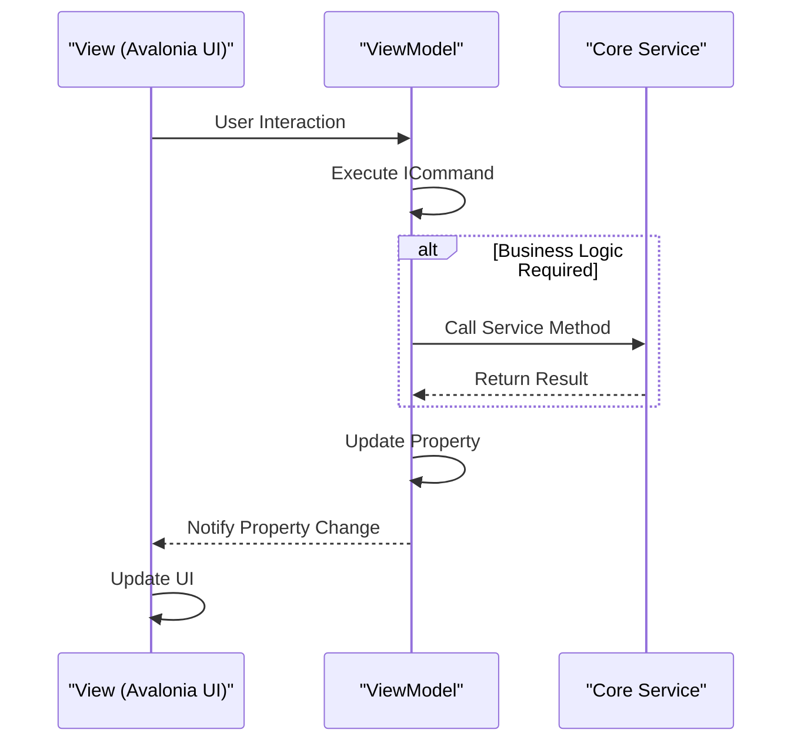
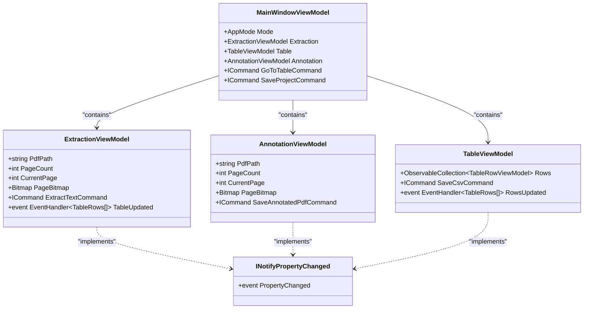
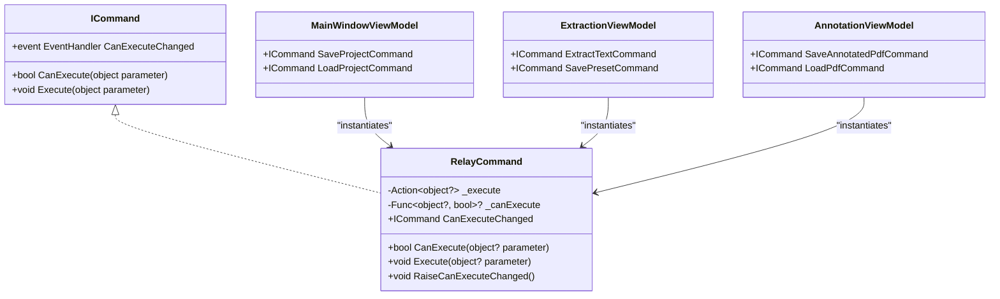
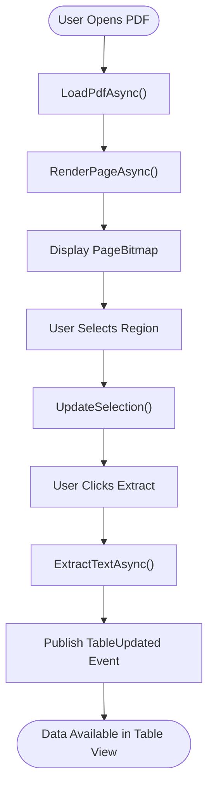
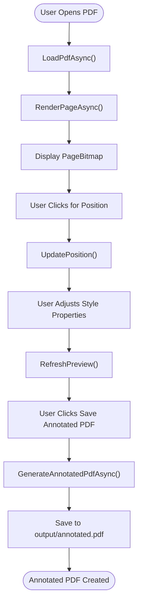
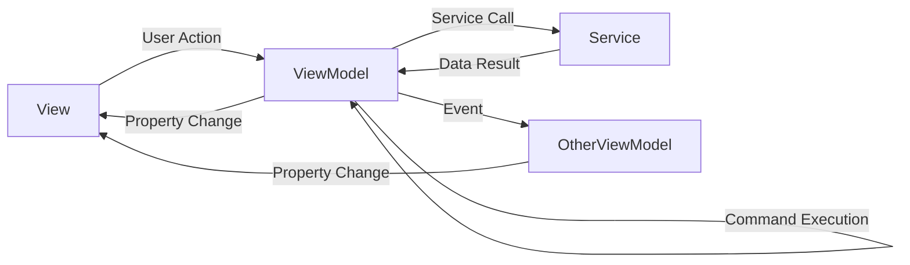
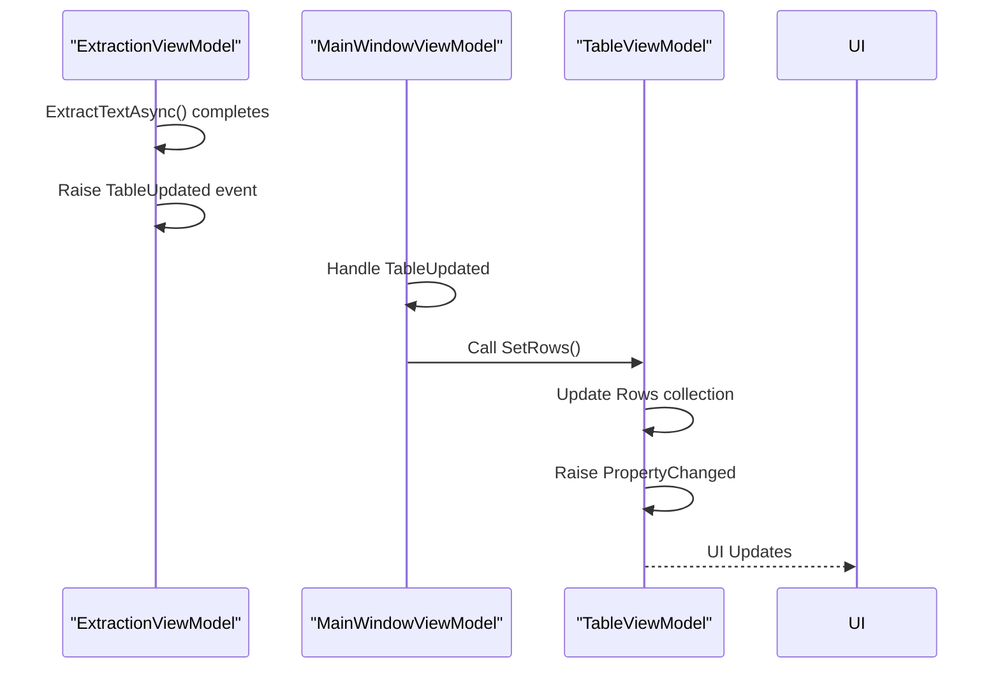
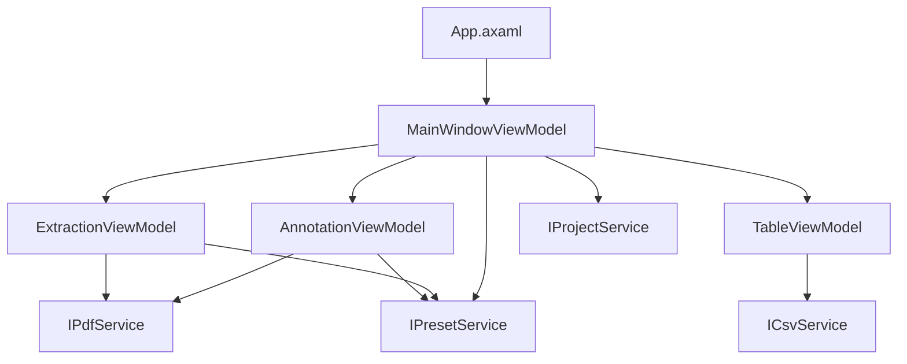

# MVVM Architecture

<cite>
**Referenced Files in This Document**   
- [MainWindow.axaml.cs](file://src/PdfAnnotator.App/MainWindow.axaml.cs)
- [MainWindowViewModel.cs](file://src/PdfAnnotator.ViewModels/MainWindowViewModel.cs)
- [AnnotationViewModel.cs](file://src/PdfAnnotator.ViewModels/AnnotationViewModel.cs)
- [ExtractionViewModel.cs](file://src/PdfAnnotator.ViewModels/ExtractionViewModel.cs)
- [TableViewModel.cs](file://src/PdfAnnotator.ViewModels/TableViewModel.cs)
- [TableRowViewModel.cs](file://src/PdfAnnotator.ViewModels/TableRowViewModel.cs)
- [RelayCommand.cs](file://src/PdfAnnotator.ViewModels/RelayCommand.cs)
- [FodyWeavers.xml](file://src/PdfAnnotator.ViewModels/FodyWeavers.xml)
- [App.axaml.cs](file://src/PdfAnnotator.App/App.axaml.cs)
- [PdfProject.cs](file://src/PdfAnnotator.Core/Models/PdfProject.cs)
- [TableRow.cs](file://src/PdfAnnotator.Core/Models/TableRow.cs)
- [IPdfService.cs](file://src/PdfAnnotator.Core/Services/IPdfService.cs)
- [ICsvService.cs](file://src/PdfAnnotator.Core/Services/ICsvService.cs)
- [IPresetService.cs](file://src/PdfAnnotator.Core/Services/IPresetService.cs)
- [IProjectService.cs](file://src/PdfAnnotator.Core/Services/IProjectService.cs)
- [AnnotationView.axaml.cs](file://src/PdfAnnotator.App/Views/AnnotationView.axaml.cs)
- [ExtractionView.axaml.cs](file://src/PdfAnnotator.App/Views/ExtractionView.axaml.cs)
</cite>

## Table of Contents
1. [Introduction](#introduction)
2. [Project Structure](#project-structure)
3. [Core Components](#core-components)
4. [Architecture Overview](#architecture-overview)
5. [Detailed Component Analysis](#detailed-component-analysis)
6. [Dependency Analysis](#dependency-analysis)
7. [Performance Considerations](#performance-considerations)
8. [Troubleshooting Guide](#troubleshooting-guide)
9. [Conclusion](#conclusion)

## Introduction
This document provides comprehensive architectural documentation for the MVVM (Model-View-ViewModel) pattern implementation in PDFAnnotator. The application follows a clean separation of concerns between Views (Avalonia UI components), ViewModels (data binding and command handling), and Core models/services. The documentation details how data binding works between UI components and ViewModels, the role of PropertyChanged.Fody in reducing boilerplate code, and how user actions are processed through command patterns. It also explains the unidirectional data flow and event-driven updates that maintain loose coupling between components.

## Project Structure
The PDFAnnotator solution is organized into three main projects following the MVVM pattern:

- **PdfAnnotator.App**: Contains Avalonia UI components (Views) and application lifecycle management
- **PdfAnnotator.ViewModels**: Contains ViewModel classes that implement data binding and command handling
- **PdfAnnotator.Core**: Contains domain models and service interfaces for business logic

The structure promotes separation of concerns with clear boundaries between UI presentation, state management, and business logic. Configuration files like FodyWeavers.xml enable compile-time code generation to reduce boilerplate.

**Diagram sources**
- [MainWindow.axaml.cs](file://src/PdfAnnotator.App/MainWindow.axaml.cs)
- [MainWindowViewModel.cs](file://src/PdfAnnotator.ViewModels/MainWindowViewModel.cs)
- [AnnotationViewModel.cs](file://src/PdfAnnotator.ViewModels/AnnotationViewModel.cs)
- [ExtractionViewModel.cs](file://src/PdfAnnotator.ViewModels/ExtractionViewModel.cs)
- [TableViewModel.cs](file://src/PdfAnnotator.ViewModels/TableViewModel.cs)
- [PdfProject.cs](file://src/PdfAnnotator.Core/Models/PdfProject.cs)
- [IPdfService.cs](file://src/PdfAnnotator.Core/Services/IPdfService.cs)
- [ICsvService.cs](file://src/PdfAnnotator.Core/Services/ICsvService.cs)
- [IPresetService.cs](file://src/PdfAnnotator.Core/Services/IPresetService.cs)
- [IProjectService.cs](file://src/PdfAnnotator.Core/Services/IProjectService.cs)

**Section sources**
- [MainWindow.axaml.cs](file://src/PdfAnnotator.App/MainWindow.axaml.cs)
- [MainWindowViewModel.cs](file://src/PdfAnnotator.ViewModels/MainWindowViewModel.cs)
- [PdfProject.cs](file://src/PdfAnnotator.Core/Models/PdfProject.cs)

## Core Components
The MVVM implementation in PDFAnnotator centers around three key components: Views for UI presentation, ViewModels for state management and command handling, and Core models/services for business logic. The MainWindowViewModel acts as the root ViewModel, coordinating between different feature ViewModels (Extraction, Annotation, Table). Each ViewModel exposes properties for data binding and ICommand implementations for user interactions. The architecture uses dependency injection to provide services to ViewModels, ensuring loose coupling and testability.

**Section sources**
- [MainWindowViewModel.cs](file://src/PdfAnnotator.ViewModels/MainWindowViewModel.cs)
- [AnnotationViewModel.cs](file://src/PdfAnnotator.ViewModels/AnnotationViewModel.cs)
- [ExtractionViewModel.cs](file://src/PdfAnnotator.ViewModels/ExtractionViewModel.cs)
- [TableViewModel.cs](file://src/PdfAnnotator.ViewModels/TableViewModel.cs)

## Architecture Overview
The MVVM architecture in PDFAnnotator follows a unidirectional data flow from View to ViewModel to Service. User interactions in Views trigger commands in ViewModels, which process the actions and update state. State changes are automatically propagated to the UI through data binding, with PropertyChanged.Fody handling INotifyPropertyChanged implementation. ViewModels communicate with each other through events (e.g., TableUpdated) rather than direct references, maintaining loose coupling. The root MainWindowViewModel coordinates navigation between different modes (Extraction, Table, Annotation) and manages project state persistence.

**Diagram sources**
- [MainWindowViewModel.cs](file://src/PdfAnnotator.ViewModels/MainWindowViewModel.cs)
- [AnnotationViewModel.cs](file://src/PdfAnnotator.ViewModels/AnnotationViewModel.cs)
- [ExtractionViewModel.cs](file://src/PdfAnnotator.ViewModels/ExtractionViewModel.cs)
- [RelayCommand.cs](file://src/PdfAnnotator.ViewModels/RelayCommand.cs)

## Detailed Component Analysis

### Data Binding and Property Synchronization
The application uses standard Avalonia data binding between Views and ViewModels. Properties in ViewModels are automatically observed for changes through the [AddINotifyPropertyChangedInterface] attribute from PropertyChanged.Fody, which injects INotifyPropertyChanged implementation at compile time. This eliminates boilerplate code for property change notifications while maintaining the benefits of reactive UI updates.

When a property changes in a ViewModel, the UI automatically updates through the binding system. For example, when CurrentPage changes in ExtractionViewModel, the PageBitmap is updated and the UI reflects the new page rendering. Two-way binding is used for form inputs, ensuring that UI changes are immediately reflected in the ViewModel state.

**Diagram sources**
- [MainWindowViewModel.cs](file://src/PdfAnnotator.ViewModels/MainWindowViewModel.cs#L21-L119)
- [ExtractionViewModel.cs](file://src/PdfAnnotator.ViewModels/ExtractionViewModel.cs#L16-L195)
- [AnnotationViewModel.cs](file://src/PdfAnnotator.ViewModels/AnnotationViewModel.cs#L14-L194)
- [TableViewModel.cs](file://src/PdfAnnotator.ViewModels/TableViewModel.cs#L16-L70)

**Section sources**
- [MainWindowViewModel.cs](file://src/PdfAnnotator.ViewModels/MainWindowViewModel.cs)
- [ExtractionViewModel.cs](file://src/PdfAnnotator.ViewModels/ExtractionViewModel.cs)
- [AnnotationViewModel.cs](file://src/PdfAnnotator.ViewModels/AnnotationViewModel.cs)
- [TableViewModel.cs](file://src/PdfAnnotator.ViewModels/TableViewModel.cs)
- [FodyWeavers.xml](file://src/PdfAnnotator.ViewModels/FodyWeavers.xml)

### ICommand Implementation with RelayCommand
The application implements the ICommand pattern using a custom RelayCommand class that supports asynchronous operations. Commands are instantiated in ViewModel constructors and bound to UI elements in XAML. The RelayCommand supports both execution and can-execute logic, enabling UI elements to be automatically enabled/disabled based on application state.

For example, the ExtractTextCommand in ExtractionViewModel is only enabled when a PDF is loaded (PageCount > 0). This prevents invalid operations and provides immediate user feedback. Commands handle exceptions gracefully and support asynchronous operations through async/await, preventing UI blocking during long-running operations like PDF processing.

**Diagram sources**
- [RelayCommand.cs](file://src/PdfAnnotator.ViewModels/RelayCommand.cs)
- [MainWindowViewModel.cs](file://src/PdfAnnotator.ViewModels/MainWindowViewModel.cs)
- [ExtractionViewModel.cs](file://src/PdfAnnotator.ViewModels/ExtractionViewModel.cs)
- [AnnotationViewModel.cs](file://src/PdfAnnotator.ViewModels/AnnotationViewModel.cs)

**Section sources**
- [RelayCommand.cs](file://src/PdfAnnotator.ViewModels/RelayCommand.cs)
- [MainWindowViewModel.cs](file://src/PdfAnnotator.ViewModels/MainWindowViewModel.cs)
- [ExtractionViewModel.cs](file://src/PdfAnnotator.ViewModels/ExtractionViewModel.cs)
- [AnnotationViewModel.cs](file://src/PdfAnnotator.ViewModels/AnnotationViewModel.cs)

### PropertyChanged.Fody Integration
The project uses PropertyChanged.Fody to automatically implement INotifyPropertyChanged, eliminating the need for repetitive boilerplate code. The FodyWeavers.xml configuration enables the weaver, and the [AddINotifyPropertyChangedInterface] attribute is applied to ViewModel classes. At compile time, Fody injects the necessary code to raise PropertyChanged events for all public properties.

This approach reduces code complexity and potential errors while maintaining the performance benefits of direct property change notifications. The weaver handles edge cases like property change validation and prevents memory leaks by properly managing event subscriptions. This allows developers to focus on business logic rather than infrastructure code.

**Section sources**
- [FodyWeavers.xml](file://src/PdfAnnotator.ViewModels/FodyWeavers.xml)
- [MainWindowViewModel.cs](file://src/PdfAnnotator.ViewModels/MainWindowViewModel.cs#L21)
- [ExtractionViewModel.cs](file://src/PdfAnnotator.ViewModels/ExtractionViewModel.cs#L16)
- [AnnotationViewModel.cs](file://src/PdfAnnotator.ViewModels/AnnotationViewModel.cs#L14)

### Feature ViewModel Analysis

#### ExtractionViewModel
The ExtractionViewModel handles PDF text extraction functionality, allowing users to select regions on PDF pages and extract text content. It manages the PDF rendering pipeline, coordinate transformation between UI and PDF space, and preset management for extraction regions. The ViewModel exposes properties for the current selection bounds (X0, Y0, X1, Y1) and provides commands for loading PDFs, extracting text, and managing presets.

Key features include:
- Coordinate system conversion between UI pixel space and PDF coordinate space
- Visual selection feedback through SelectLeft, SelectTop, SelectWidth, SelectHeight properties
- Event publishing (TableUpdated) when text extraction completes
- Preset management for saving and loading extraction configurations

**Diagram sources**
- [ExtractionViewModel.cs](file://src/PdfAnnotator.ViewModels/ExtractionViewModel.cs)
- [ExtractionView.axaml.cs](file://src/PdfAnnotator.App/Views/ExtractionView.axaml.cs)

**Section sources**
- [ExtractionViewModel.cs](file://src/PdfAnnotator.ViewModels/ExtractionViewModel.cs)
- [ExtractionView.axaml.cs](file://src/PdfAnnotator.App/Views/ExtractionView.axaml.cs)

#### AnnotationViewModel
The AnnotationViewModel manages the PDF annotation workflow, allowing users to add text annotations to PDF pages. It handles PDF rendering, position tracking for annotations, and preset management for annotation styling (font, size, color, position). The ViewModel coordinates between the current page display and the annotation data stored in TableRow objects.

Key features include:
- Position synchronization between mouse pointer and annotation preview
- Font and styling property management
- Annotation preset system for consistent styling
- Generation of annotated PDFs with positioned text
- Event-driven updates when row data changes

**Diagram sources**
- [AnnotationViewModel.cs](file://src/PdfAnnotator.ViewModels/AnnotationViewModel.cs)
- [AnnotationView.axaml.cs](file://src/PdfAnnotator.App/Views/AnnotationView.axaml.cs)

**Section sources**
- [AnnotationViewModel.cs](file://src/PdfAnnotator.ViewModels/AnnotationViewModel.cs)
- [AnnotationView.axaml.cs](file://src/PdfAnnotator.App/Views/AnnotationView.axaml.cs)

### Unidirectional Data Flow
The application implements a unidirectional data flow pattern where data moves from View to ViewModel to Service and back through property changes. User actions in Views trigger commands in ViewModels, which may call Core services to perform business logic. Services return data to ViewModels, which update their properties, triggering UI updates through data binding.

State management is centralized in ViewModels, with the MainWindowViewModel acting as the root state container. Feature ViewModels (Extraction, Annotation, Table) manage their own state and communicate with each other through events rather than direct dependencies. This approach ensures predictable state changes and makes the application easier to debug and test.

**Diagram sources**
- [MainWindowViewModel.cs](file://src/PdfAnnotator.ViewModels/MainWindowViewModel.cs)
- [ExtractionViewModel.cs](file://src/PdfAnnotator.ViewModels/ExtractionViewModel.cs)
- [TableViewModel.cs](file://src/PdfAnnotator.ViewModels/TableViewModel.cs)
- [AnnotationViewModel.cs](file://src/PdfAnnotator.ViewModels/AnnotationViewModel.cs)

**Section sources**
- [MainWindowViewModel.cs](file://src/PdfAnnotator.ViewModels/MainWindowViewModel.cs)
- [ExtractionViewModel.cs](file://src/PdfAnnotator.ViewModels/ExtractionViewModel.cs)
- [TableViewModel.cs](file://src/PdfAnnotator.ViewModels/TableViewModel.cs)
- [AnnotationViewModel.cs](file://src/PdfAnnotator.ViewModels/AnnotationViewModel.cs)

### UI Update Mechanisms
UI updates are triggered through property changes and event publishing. The PropertyChanged.Fody library automatically raises PropertyChanged events when properties are modified, which the Avalonia binding system detects and uses to update the UI. For collection updates, ObservableCollection is used to automatically notify the UI of additions, removals, or changes to items.

Event publishing is used for cross-ViewModel communication. For example, when text extraction completes, ExtractionViewModel raises the TableUpdated event, which MainWindowViewModel handles by updating the TableViewModel state. Similarly, when table rows change, TableViewModel raises RowsUpdated, which AnnotationViewModel handles to update its annotation data.

**Diagram sources**
- [ExtractionViewModel.cs](file://src/PdfAnnotator.ViewModels/ExtractionViewModel.cs#L23)
- [MainWindowViewModel.cs](file://src/PdfAnnotator.ViewModels/MainWindowViewModel.cs#L60-L61)
- [TableViewModel.cs](file://src/PdfAnnotator.ViewModels/TableViewModel.cs#L21)

**Section sources**
- [ExtractionViewModel.cs](file://src/PdfAnnotator.ViewModels/ExtractionViewModel.cs)
- [MainWindowViewModel.cs](file://src/PdfAnnotator.ViewModels/MainWindowViewModel.cs)
- [TableViewModel.cs](file://src/PdfAnnotator.ViewModels/TableViewModel.cs)

## Dependency Analysis
The application uses dependency injection to manage component dependencies, with services registered in the AppBootstrapper and accessed through the ServiceProvider. ViewModels receive their dependencies through constructor injection, ensuring loose coupling and testability. The dependency graph shows a clear hierarchy with the MainWindowViewModel at the root, containing feature ViewModels which in turn depend on Core services.

There are no circular dependencies in the architecture. ViewModels communicate through events rather than direct references, and services have no dependencies on UI components. This design enables independent testing of ViewModels with mocked services and allows for easy modification of individual components without affecting the rest of the system.

**Diagram sources**
- [App.axaml.cs](file://src/PdfAnnotator.App/App.axaml.cs#L21)
- [MainWindowViewModel.cs](file://src/PdfAnnotator.ViewModels/MainWindowViewModel.cs#L24-L27)
- [ExtractionViewModel.cs](file://src/PdfAnnotator.ViewModels/ExtractionViewModel.cs#L19-L21)
- [AnnotationViewModel.cs](file://src/PdfAnnotator.ViewModels/AnnotationViewModel.cs#L17-L19)
- [TableViewModel.cs](file://src/PdfAnnotator.ViewModels/TableViewModel.cs#L19-L20)
- [IPdfService.cs](file://src/PdfAnnotator.Core/Services/IPdfService.cs)
- [ICsvService.cs](file://src/PdfAnnotator.Core/Services/ICsvService.cs)
- [IPresetService.cs](file://src/PdfAnnotator.Core/Services/IPresetService.cs)
- [IProjectService.cs](file://src/PdfAnnotator.Core/Services/IProjectService.cs)

**Section sources**
- [App.axaml.cs](file://src/PdfAnnotator.App/App.axaml.cs)
- [MainWindowViewModel.cs](file://src/PdfAnnotator.ViewModels/MainWindowViewModel.cs)
- [ExtractionViewModel.cs](file://src/PdfAnnotator.ViewModels/ExtractionViewModel.cs)
- [AnnotationViewModel.cs](file://src/PdfAnnotator.ViewModels/AnnotationViewModel.cs)
- [TableViewModel.cs](file://src/PdfAnnotator.ViewModels/TableViewModel.cs)
- [IPdfService.cs](file://src/PdfAnnotator.Core/Services/IPdfService.cs)
- [ICsvService.cs](file://src/PdfAnnotator.Core/Services/ICsvService.cs)
- [IPresetService.cs](file://src/PdfAnnotator.Core/Services/IPresetService.cs)
- [IProjectService.cs](file://src/PdfAnnotator.Core/Services/IProjectService.cs)

## Performance Considerations
The MVVM implementation includes several performance optimizations:

1. **Asynchronous Operations**: All I/O operations (PDF rendering, file loading, etc.) are performed asynchronously to prevent UI blocking
2. **Lazy Loading**: PDF pages are rendered on-demand when the user navigates to them
3. **Event Throttling**: Property change notifications are optimized through Fody's implementation
4. **Memory Management**: Proper disposal patterns and weak event handling prevent memory leaks
5. **Collection Updates**: ObservableCollection minimizes UI update overhead by only notifying of actual changes

The architecture balances responsiveness with resource usage, ensuring a smooth user experience even with large PDF files.

## Troubleshooting Guide
Common issues and their solutions:

1. **UI Not Updating**: Ensure PropertyChanged.Fody is properly configured and [AddINotifyPropertyChangedInterface] is applied to ViewModel classes
2. **Commands Not Executing**: Verify that ICommand properties are initialized in the ViewModel constructor
3. **Memory Leaks**: Check for proper event handler cleanup, especially with cross-ViewModel events
4. **Binding Errors**: Verify property names match between XAML and ViewModel, and DataContext is properly set
5. **Async Operations Not Working**: Ensure async commands are properly awaited and exceptions are handled

Best practices for avoiding issues:
- Use ObservableCollection for collections that need UI updates
- Initialize commands in constructors before any property changes
- Use weak references for event handlers when possible
- Test ViewModels in isolation with mocked services
- Monitor memory usage during navigation between views

**Section sources**
- [MainWindowViewModel.cs](file://src/PdfAnnotator.ViewModels/MainWindowViewModel.cs)
- [ExtractionViewModel.cs](file://src/PdfAnnotator.ViewModels/ExtractionViewModel.cs)
- [AnnotationViewModel.cs](file://src/PdfAnnotator.ViewModels/AnnotationViewModel.cs)
- [TableViewModel.cs](file://src/PdfAnnotator.ViewModels/TableViewModel.cs)
- [RelayCommand.cs](file://src/PdfAnnotator.ViewModels/RelayCommand.cs)
- [FodyWeavers.xml](file://src/PdfAnnotator.ViewModels/FodyWeavers.xml)

## Conclusion
The MVVM architecture in PDFAnnotator provides a robust foundation for a complex desktop application. The clear separation of concerns between Views, ViewModels, and Core services enables maintainable, testable code. The use of PropertyChanged.Fody significantly reduces boilerplate while maintaining the benefits of reactive UI updates. The unidirectional data flow and event-driven communication between components ensure predictable state management and loose coupling.

Key strengths of the implementation include:
- Comprehensive use of data binding and command patterns
- Effective dependency injection for testability
- Proper handling of asynchronous operations
- Clean separation between UI, state, and business logic
- Scalable architecture that can accommodate additional features

The architecture follows MVVM best practices while adapting to the specific requirements of a PDF processing application, resulting in a maintainable and extensible codebase.