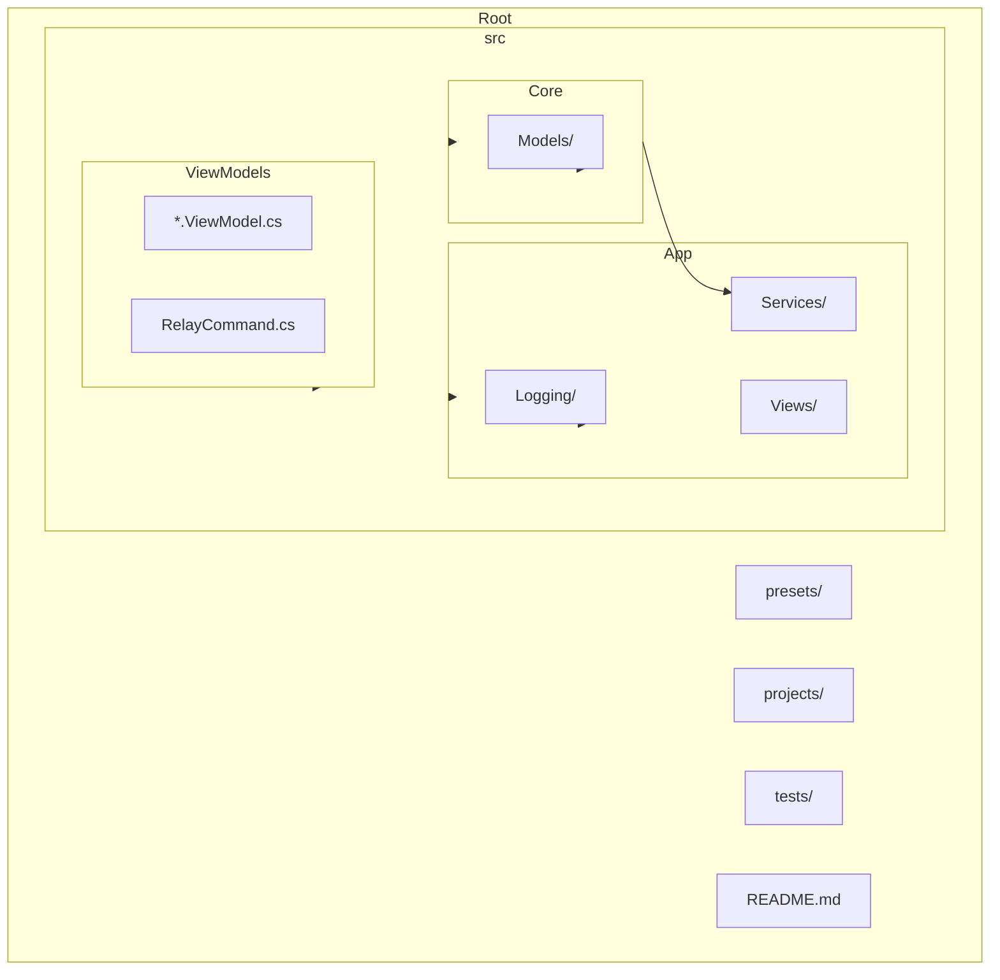
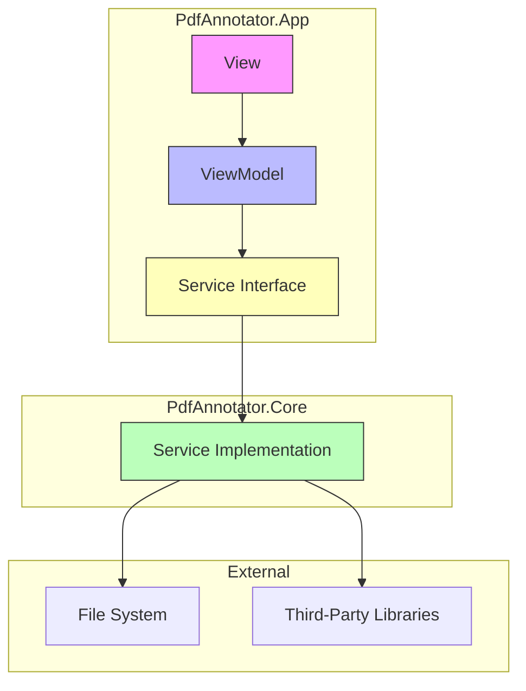
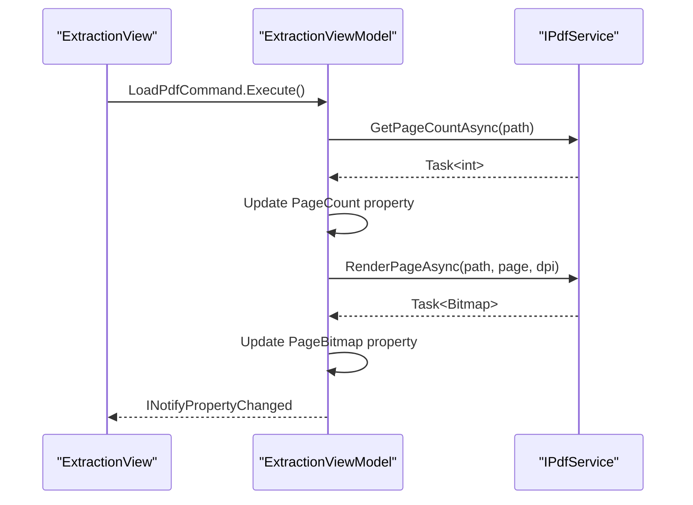
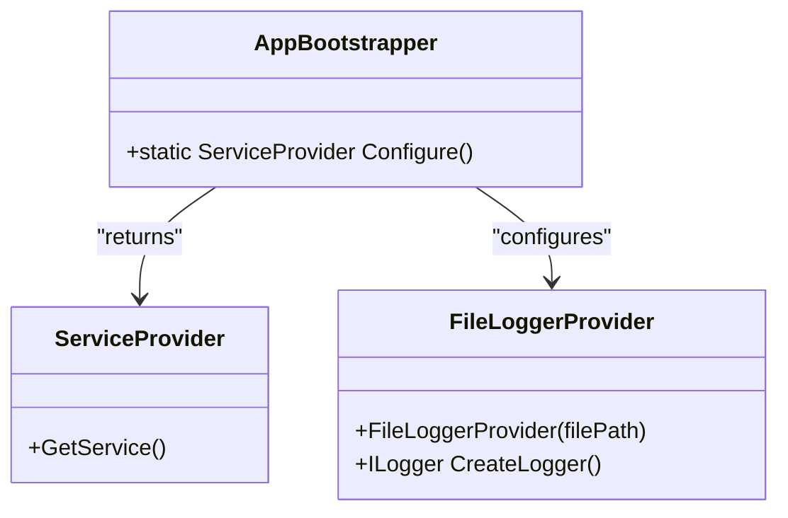
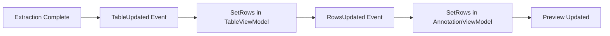
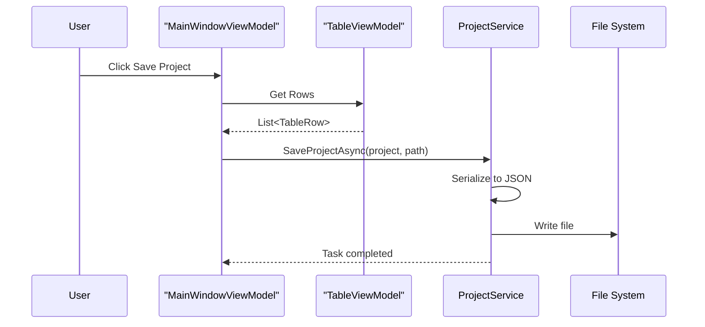
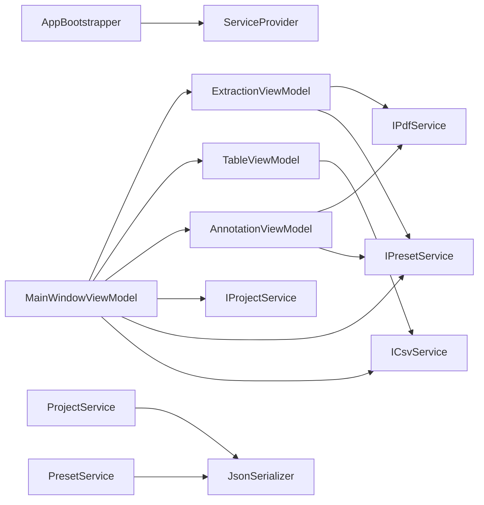

# Technical Architecture

<cite>
**Referenced Files in This Document**   
- [AppBootstrapper.cs](file://src/PdfAnnotator.App/Services/AppBootstrapper.cs)
- [PdfService.cs](file://src/PdfAnnotator.App/Services/PdfService.cs)
- [IPdfService.cs](file://src/PdfAnnotator.Core/Services/IPdfService.cs)
- [IProjectService.cs](file://src/PdfAnnotator.Core/Services/IProjectService.cs)
- [IPresetService.cs](file://src/PdfAnnotator.Core/Services/IPresetService.cs)
- [ProjectService.cs](file://src/PdfAnnotator.Core/Services/ProjectService.cs)
- [MainWindowViewModel.cs](file://src/PdfAnnotator.ViewModels/MainWindowViewModel.cs)
- [ExtractionViewModel.cs](file://src/PdfAnnotator.ViewModels/ExtractionViewModel.cs)
- [AnnotationViewModel.cs](file://src/PdfAnnotator.ViewModels/AnnotationViewModel.cs)
- [TableViewModel.cs](file://src/PdfAnnotator.ViewModels/TableViewModel.cs)
- [FileLoggerProvider.cs](file://src/PdfAnnotator.App/Logging/FileLoggerProvider.cs)
- [PdfProject.cs](file://src/PdfAnnotator.Core/Models/PdfProject.cs)
- [TableRow.cs](file://src/PdfAnnotator.Core/Models/TableRow.cs)
- [README.md](file://README.md)
</cite>

## Table of Contents
1. [Introduction](#introduction)
2. [Project Structure](#project-structure)
3. [Core Components](#core-components)
4. [Architecture Overview](#architecture-overview)
5. [Detailed Component Analysis](#detailed-component-analysis)
6. [Dependency Analysis](#dependency-analysis)
7. [Performance Considerations](#performance-considerations)
8. [Troubleshooting Guide](#troubleshooting-guide)
9. [Conclusion](#conclusion)

## Introduction
The PDFAnnotator application is a cross-platform desktop tool built using the Avalonia UI framework and .NET 8, designed to extract text from PDFs, edit tabular data, and annotate PDFs using customizable presets. The architecture follows the Model-View-ViewModel (MVVM) pattern, ensuring a clean separation between UI, business logic, and core services. This document provides a comprehensive overview of the system's technical architecture, focusing on component interactions, dependency injection, data flow, and design decisions that support scalability and maintainability.

## Project Structure

**Diagram sources**
- [README.md](file://README.md#L20-L22)
- [project structure](file://.)

**Section sources**
- [README.md](file://README.md#L20-L22)

## Core Components

The application is structured into three main projects:
- **PdfAnnotator.App**: Contains UI views, application services, and bootstrapping logic.
- **PdfAnnotator.Core**: Houses domain models and core services for PDF processing, preset management, and project persistence.
- **PdfAnnotator.ViewModels**: Implements MVVM pattern with view models that coordinate UI behavior and service interactions.

Key components include:
- **AppBootstrapper.cs**: Configures dependency injection container using `Microsoft.Extensions.DependencyInjection`.
- **IPdfService**: Abstracts PDF rendering, text extraction, and annotation generation.
- **IProjectService & IPresetService**: Handle JSON-based persistence of projects and presets.
- **MainWindowViewModel**: Orchestrates navigation between modes (Extraction, Table, Annotation).
- **FileLoggerProvider**: Custom logging provider writing to `logs/app.log`.

**Section sources**
- [AppBootstrapper.cs](file://src/PdfAnnotator.App/Services/AppBootstrapper.cs#L1-L36)
- [README.md](file://README.md#L20-L25)
- [PdfProject.cs](file://src/PdfAnnotator.Core/Models/PdfProject.cs#L1-L13)

## Architecture Overview

**Diagram sources**
- [AppBootstrapper.cs](file://src/PdfAnnotator.App/Services/AppBootstrapper.cs#L14-L34)
- [MainWindowViewModel.cs](file://src/PdfAnnotator.ViewModels/MainWindowViewModel.cs#L43-L58)

The application follows a strict MVVM architecture:
- **Views** (Avalonia XAML files) bind to **ViewModels** via data binding.
- **ViewModels** consume **Service Interfaces** (e.g., `IPdfService`, `IProjectService`) for business logic.
- **Core Services** implement these interfaces and handle file I/O, PDF operations, and data persistence.
- **Dependency Injection** is configured in `AppBootstrapper.cs`, registering all services and view models as singletons.

## Detailed Component Analysis

### MVVM and Data Binding

The Avalonia UI framework enables robust data binding between Views and ViewModels. Each View (e.g., `ExtractionView.axaml`) binds to a corresponding ViewModel (e.g., `ExtractionViewModel`), which exposes properties and commands for UI interaction.

**Diagram sources**
- [ExtractionViewModel.cs](file://src/PdfAnnotator.ViewModels/ExtractionViewModel.cs#L77-L94)
- [PdfService.cs](file://src/PdfAnnotator.App/Services/PdfService.cs#L29-L36)

**Section sources**
- [ExtractionViewModel.cs](file://src/PdfAnnotator.ViewModels/ExtractionViewModel.cs#L1-L196)
- [PdfService.cs](file://src/PdfAnnotator.App/Services/PdfService.cs#L1-L179)

### Dependency Injection Setup

The `AppBootstrapper.Configure()` method sets up the service container with singleton registrations for all core services and view models. Logging is configured with a custom `FileLoggerProvider` that writes to `logs/app.log`.

**Diagram sources**
- [AppBootstrapper.cs](file://src/PdfAnnotator.App/Services/AppBootstrapper.cs#L12-L34)
- [FileLoggerProvider.cs](file://src/PdfAnnotator.App/Logging/FileLoggerProvider.cs#L1-L23)

**Section sources**
- [AppBootstrapper.cs](file://src/PdfAnnotator.App/Services/AppBootstrapper.cs#L1-L36)
- [FileLoggerProvider.cs](file://src/PdfAnnotator.App/Logging/FileLoggerProvider.cs#L1-L23)

### Component Interactions and Event Flow

ViewModels communicate via events rather than direct references. For example:
- `ExtractionViewModel.TableUpdated` triggers `MainWindowViewModel.OnExtractionTableUpdated`, which updates the `TableViewModel`.
- `TableViewModel.RowsUpdated` propagates changes to `AnnotationViewModel`.

**Diagram sources**
- [MainWindowViewModel.cs](file://src/PdfAnnotator.ViewModels/MainWindowViewModel.cs#L60-L61)
- [TableViewModel.cs](file://src/PdfAnnotator.ViewModels/TableViewModel.cs#L21-L22)

**Section sources**
- [MainWindowViewModel.cs](file://src/PdfAnnotator.ViewModels/MainWindowViewModel.cs#L1-L120)
- [TableViewModel.cs](file://src/PdfAnnotator.ViewModels/TableViewModel.cs#L1-L71)

### Data Flow from User Action to Persistence

When a user saves a project:
1. `MainWindowViewModel.SaveProjectCommand` is invoked.
2. Current table rows are collected from `TableViewModel`.
3. `ProjectService.SaveProjectAsync()` serializes the `PdfProject` to JSON.
4. File is written to `projects/{name}.json`.

**Diagram sources**
- [MainWindowViewModel.cs](file://src/PdfAnnotator.ViewModels/MainWindowViewModel.cs#L93-L101)
- [ProjectService.cs](file://src/PdfAnnotator.Core/Services/ProjectService.cs#L13-L22)

**Section sources**
- [MainWindowViewModel.cs](file://src/PdfAnnotator.ViewModels/MainWindowViewModel.cs#L93-L101)
- [ProjectService.cs](file://src/PdfAnnotator.Core/Services/ProjectService.cs#L1-L43)

## Dependency Analysis

**Diagram sources**
- [AppBootstrapper.cs](file://src/PdfAnnotator.App/Services/AppBootstrapper.cs#L23-L31)
- [MainWindowViewModel.cs](file://src/PdfAnnotator.ViewModels/MainWindowViewModel.cs#L43-L58)

**Section sources**
- [AppBootstrapper.cs](file://src/PdfAnnotator.App/Services/AppBootstrapper.cs#L1-L36)
- [MainWindowViewModel.cs](file://src/PdfAnnotator.ViewModels/MainWindowViewModel.cs#L1-L120)

## Performance Considerations

The application employs several performance optimizations:
- **PDF Rendering Cache**: `PdfService` maintains a thread-safe cache of rendered pages to avoid redundant rendering.
- **Asynchronous Operations**: All file I/O and PDF operations are performed asynchronously to prevent UI blocking.
- **Event-Driven Updates**: Changes are propagated only when necessary via events, minimizing unnecessary UI refreshes.

No sources needed since this section provides general guidance.

## Troubleshooting Guide

Common issues and their resolutions:
- **PDF not rendering**: Verify file path and permissions; check logs for rendering errors.
- **Presets not loading**: Ensure `presets/` directory exists and contains valid JSON files.
- **Annotations not appearing**: Confirm output directory is writable and preset coordinates are correct.

**Section sources**
- [PdfService.cs](file://src/PdfAnnotator.App/Services/PdfService.cs#L94-L95)
- [ProjectService.cs](file://src/PdfAnnotator.Core/Services/ProjectService.cs#L27-L30)
- [README.md](file://README.md#L38-L40)

## Conclusion

The PDFAnnotator application demonstrates a well-structured MVVM architecture with clear separation of concerns, effective use of dependency injection, and robust event-based communication between components. The use of service interfaces enhances testability and extensibility, while JSON-based persistence simplifies project and preset management. Future improvements could include file dialogs for path selection and enhanced coordinate mapping for more accurate annotations.

No sources needed since this section summarizes without analyzing specific files.