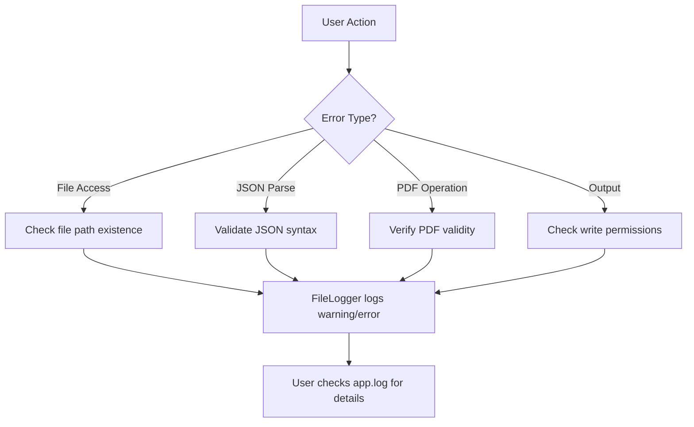
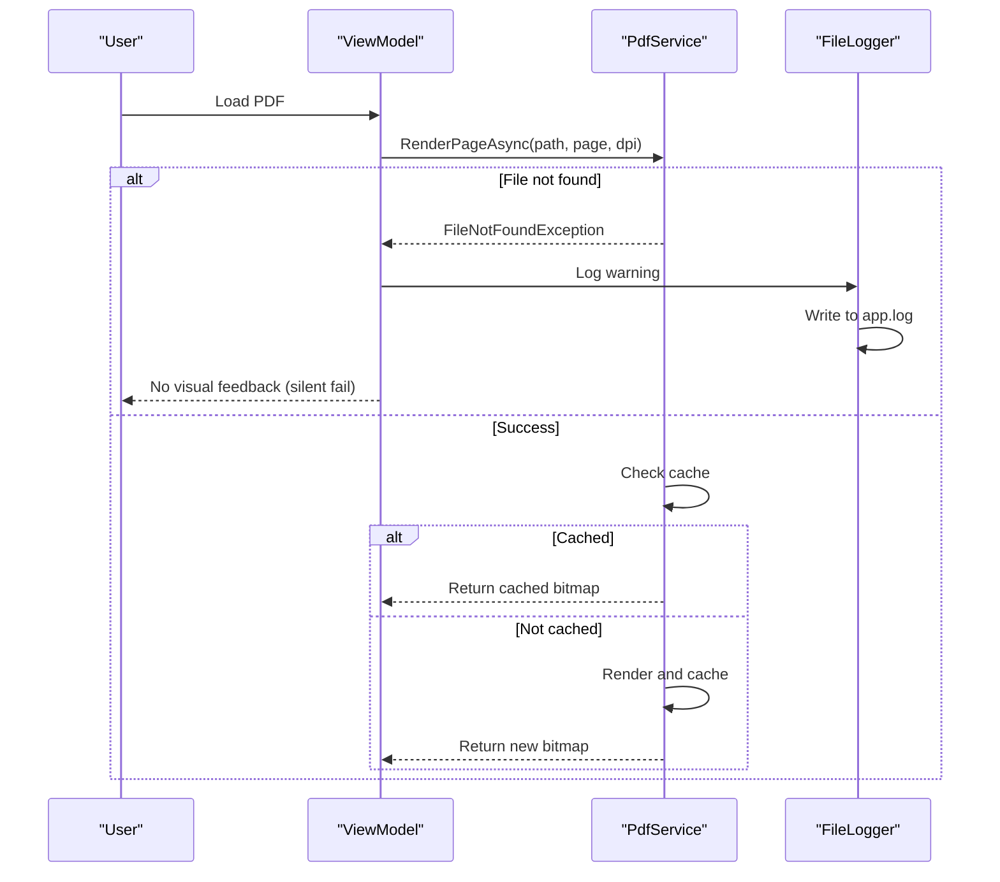

# Troubleshooting

<cite>
**Referenced Files in This Document**   
- [PdfService.cs](file://src/PdfAnnotator.App/Services/PdfService.cs)
- [FileLogger.cs](file://src/PdfAnnotator.App/Logging/FileLogger.cs)
- [ProjectService.cs](file://src/PdfAnnotator.Core/Services/ProjectService.cs)
- [PresetService.cs](file://src/PdfAnnotator.Core/Services/PresetService.cs)
- [AnnotationViewModel.cs](file://src/PdfAnnotator.ViewModels/AnnotationViewModel.cs)
- [ExtractionViewModel.cs](file://src/PdfAnnotator.ViewModels/ExtractionViewModel.cs)
- [README.md](file://README.md)
</cite>

## Table of Contents
1. [Common Issues](#common-issues)
2. [Error Messages and Diagnostics](#error-messages-and-diagnostics)
3. [Debugging Tips](#debugging-tips)
4. [Known Limitations](#known-limitations)
5. [Performance Considerations](#performance-considerations)

## Common Issues

### PDF Not Loading
The application may fail to load a PDF file due to:
- **Invalid file path**: The path entered manually in the UI does not exist or is misspelled.
- **File format issues**: The file is not a valid PDF or is corrupted.
- **Missing file**: The specified PDF file has been moved or deleted.

The `PdfService.RenderPageAsync` method explicitly checks for file existence and throws a `FileNotFoundException` if the file is not found (line 51-54 in `PdfService.cs`). This is also validated in `AnnotationViewModel.LoadPdfAsync` and `ExtractionViewModel.LoadPdfAsync` before attempting to render.

### Text Extraction Inaccuracies
Text extraction inaccuracies may occur due to:
- **Coordinate system scaling**: The selection rectangle drawn in the UI uses display coordinates, which are converted to PDF coordinates (bottom-left origin). This conversion may introduce inaccuracies, especially at different zoom levels.
- **DPI mismatch**: The rendering DPI setting affects coordinate mapping precision.

In `ExtractionViewModel.UpdateSelection`, display coordinates are converted to PDF coordinates by inverting the Y-axis based on image height (lines 114-116), which assumes perfect scaling alignment.

### Missing Output Files
The annotated PDF output file (`output/annotated.pdf`) may not appear because:
- The output directory was not created: Although `AnnotationViewModel.SaveAnnotatedAsync` creates the directory (line 184), permission issues might prevent directory creation.
- Write permissions: The application lacks write permissions in the output directory.
- File in use: The output file is locked by another process.

**Section sources**
- [PdfService.cs](file://src/PdfAnnotator.App/Services/PdfService.cs#L51-L54)
- [AnnotationViewModel.cs](file://src/PdfAnnotator.ViewModels/AnnotationViewModel.cs#L184)
- [ExtractionViewModel.cs](file://src/PdfAnnotator.ViewModels/ExtractionViewModel.cs#L114-L116)

## Error Messages and Diagnostics

### File Access Errors
- **"PDF не найден" (PDF not found)**: Thrown by `PdfService` when the specified PDF file does not exist. This occurs in `RenderPageAsync` and `GetPageCountAsync` methods.
- **"Project file not found."**: Thrown by `ProjectService.LoadProjectAsync` when attempting to load a non-existent project file (line 29 in `ProjectService.cs`).

### JSON Deserialization Failures
- **"Unable to parse project file."**: Thrown when `ProjectService` cannot deserialize a project JSON file (line 36 in `ProjectService.cs`). This typically indicates malformed JSON or missing required fields.
- Preset loading fails silently: `PresetService.LoadExtractionPresetAsync` returns `null` on JSON deserialization failure (lines 49-52), with only a warning logged.

### Missing Dependencies
- **.NET 8 runtime not available**: The application requires .NET 8 SDK to run. If not installed, `dotnet run` will fail with a runtime not found error.
- **NuGet package restoration required**: First-time builds require internet access to restore packages unless previously downloaded.

**Diagram sources**
- [ProjectService.cs](file://src/PdfAnnotator.Core/Services/ProjectService.cs#L29-L36)
- [PresetService.cs](file://src/PdfAnnotator.Core/Services/PresetService.cs#L49-L52)
- [FileLogger.cs](file://src/PdfAnnotator.App/Logging/FileLogger.cs)

**Section sources**
- [ProjectService.cs](file://src/PdfAnnotator.Core/Services/ProjectService.cs#L29-L36)
- [PresetService.cs](file://src/PdfAnnotator.Core/Services/PresetService.cs#L49-L52)

## Debugging Tips

### Check Logs
- **Location**: `logs/app.log` contains detailed error traces.
- **Content**: All exceptions in `PdfService` are logged with full stack traces using `_logger.LogError` (line 94 in `PdfService.cs`).
- **Usage**: Search for `[Error]` or `[Warning]` entries corresponding to the time of failure.

### Validate JSON Structure
- **Project files**: Must conform to `PdfProject` model with required fields: `Name`, `PdfPath`, `Rows`.
- **Presets**: Must match `ExtractionPreset` or `AnnotationPreset` structure.
- **Validation**: Use online JSON validators or IDE tools to check syntax before loading.

### Verify PDF Compatibility
- Test with standard PDFs first (e.g., text-based, not scanned images).
- Ensure the PDF is not password-protected or encrypted.
- Use the example PDF referenced in the README scenarios.

### Confirm .NET 8 Availability
- Run `dotnet --version` to verify .NET 8 is installed.
- Ensure the correct SDK is targeted in the project files.

**Section sources**
- [FileLogger.cs](file://src/PdfAnnotator.App/Logging/FileLogger.cs#L31-L35)
- [PdfService.cs](file://src/PdfAnnotator.App/Services/PdfService.cs#L94)
- [README.md](file://README.md#L7-L9)

## Known Limitations

### Manual File Path Entry
- No file open dialog: Users must manually type the full path to PDF files.
- High risk of typos or incorrect paths.
- Solution: Always double-check the file path before loading.

### Rendering Precision at Different Zoom Levels
- **Coordinate scaling issues**: The application uses display coordinates for selection, which are mapped to PDF coordinates. This can cause misalignment when zooming.
- **Known inaccuracy**: As noted in README line 38, "Рендер и выделение работают в координатах отображения, что может давать неточность при масштабировании."

### Limited Font and Color Support
- Annotation supports basic fonts (Helvetica, Arial, Times New Roman) and hex colors.
- Advanced typography features are not supported in the current implementation.

**Section sources**
- [README.md](file://README.md#L38)
- [AnnotationViewModel.cs](file://src/PdfAnnotator.ViewModels/AnnotationViewModel.cs#L57)
- [PdfService.cs](file://src/PdfAnnotator.App/Services/PdfService.cs#L142-L143)

## Performance Considerations

### Large PDF Handling
- **Memory usage**: Large PDFs consume significant memory during rendering and text extraction.
- **Caching**: `PdfService` implements a render cache (`_renderCache`) to avoid re-rendering the same page at the same DPI (lines 21, 45-48).
- **Recommendation**: Process large documents in smaller batches or increase system memory.

### Memory Management
- Bitmaps are stored in memory for rendered pages.
- The cache uses a dictionary with path, page, and DPI as keys, which could grow large with multiple documents.
- No cache eviction policy implemented—memory usage increases with continued use.

**Diagram sources**
- [PdfService.cs](file://src/PdfAnnotator.App/Services/PdfService.cs#L40-L90)
- [FileLogger.cs](file://src/PdfAnnotator.App/Logging/FileLogger.cs#L31-L42)
- [AnnotationViewModel.cs](file://src/PdfAnnotator.ViewModels/AnnotationViewModel.cs#L100-L104)

**Section sources**
- [PdfService.cs](file://src/PdfAnnotator.App/Services/PdfService.cs#L21)
- [FileLogger.cs](file://src/PdfAnnotator.App/Logging/FileLogger.cs)