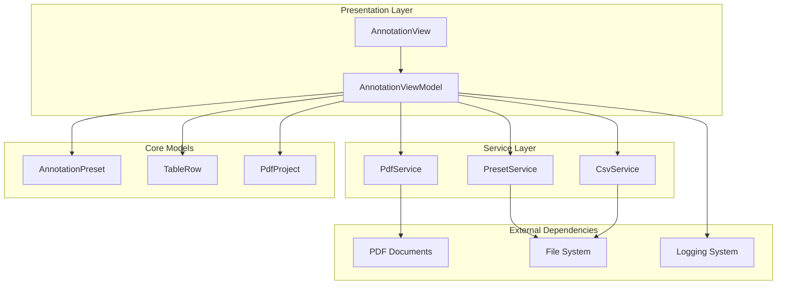
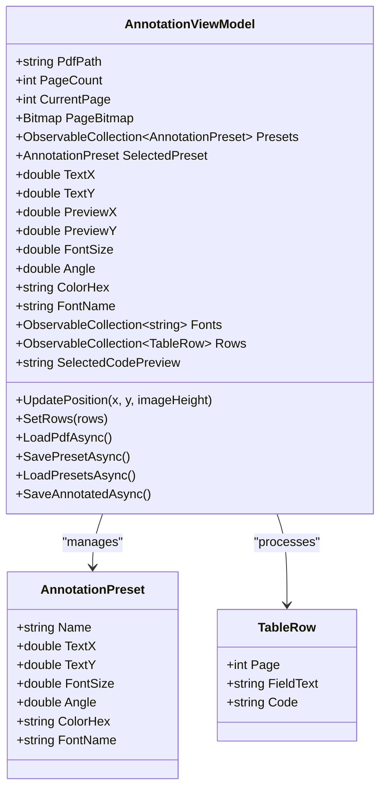
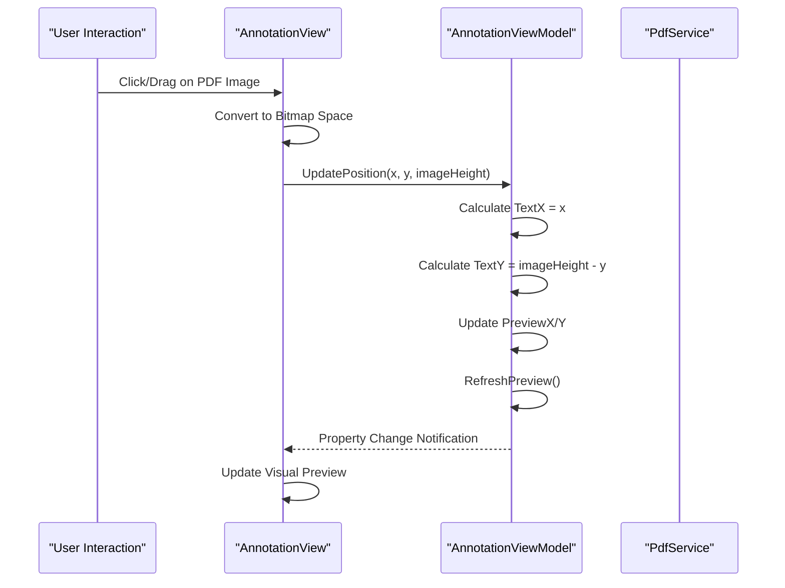
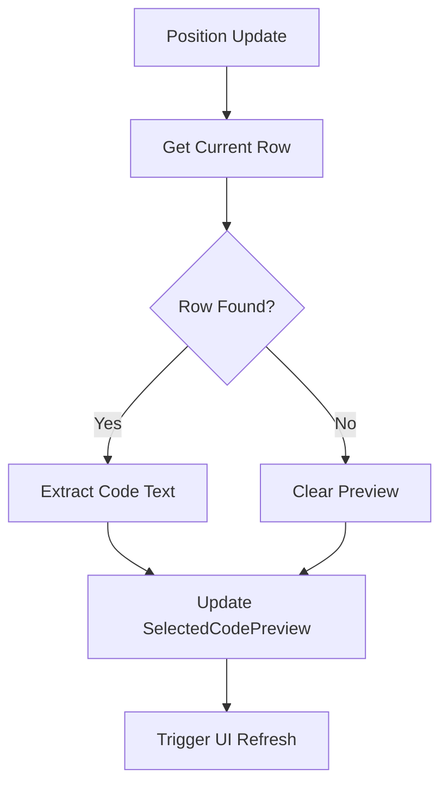
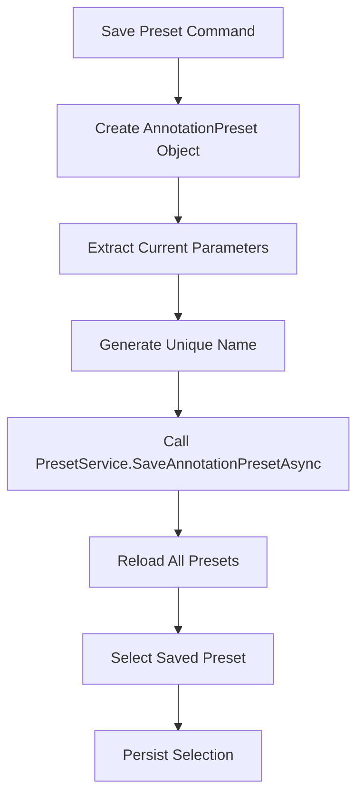
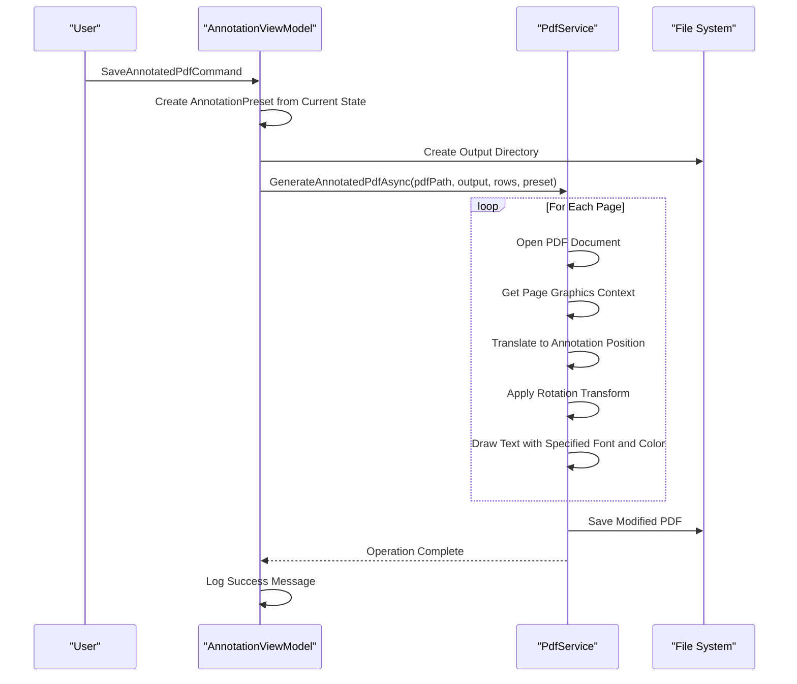
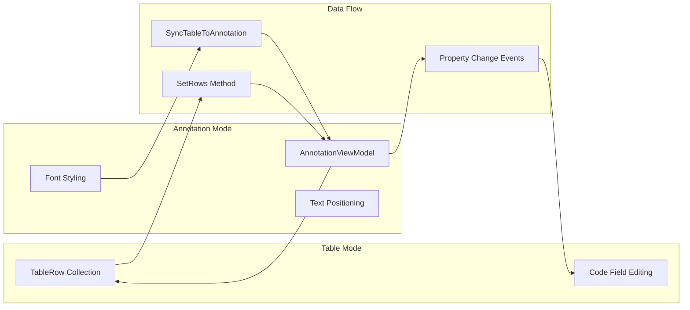
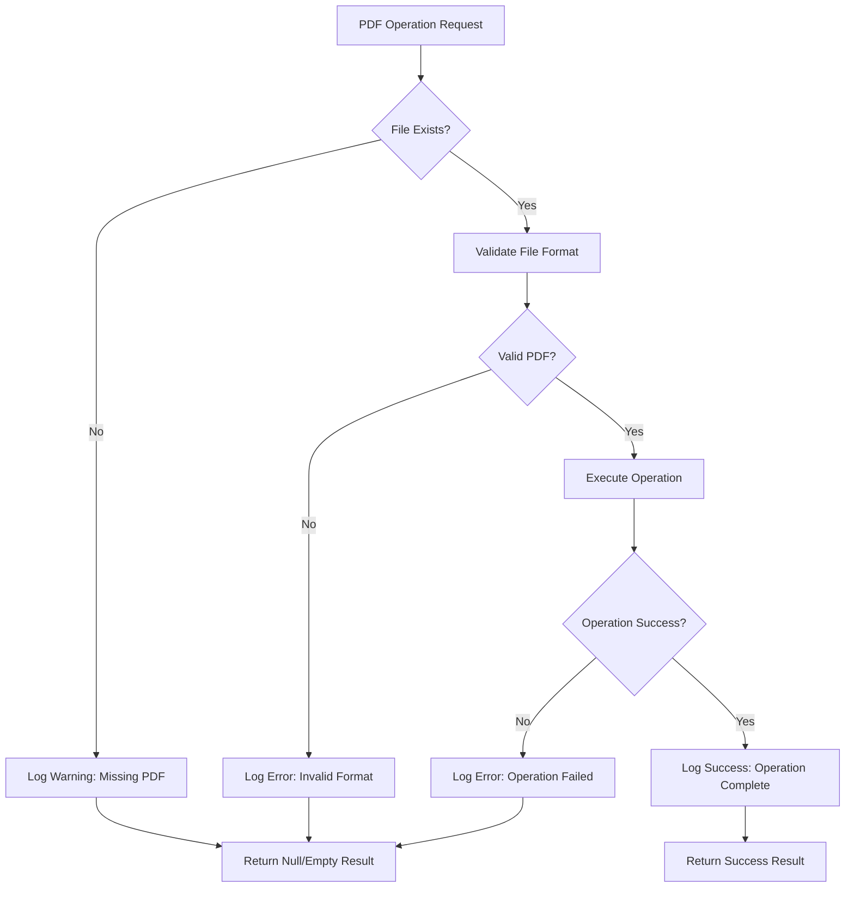

# Annotation Mode

<cite>
**Referenced Files in This Document**
- [AnnotationViewModel.cs](file://src/PdfAnnotator.ViewModels/AnnotationViewModel.cs)
- [AnnotationPreset.cs](file://src/PdfAnnotator.Core/Models/AnnotationPreset.cs)
- [PdfService.cs](file://src/PdfAnnotator.App\Services/PdfService.cs)
- [IPdfService.cs](file://src\PdfAnnotator.Core\Services\IPdfService.cs)
- [AnnotationView.axaml.cs](file://src\PdfAnnotator.App\Views\AnnotationView.axaml.cs)
- [PresetService.cs](file://src\PdfAnnotator.Core\Services\PresetService.cs)
- [IPresetService.cs](file://src\PdfAnnotator.Core\Services\IPresetService.cs)
- [MainWindowViewModel.cs](file://src\PdfAnnotator.ViewModels\MainWindowViewModel.cs)
- [TableRow.cs](file://src\PdfAnnotator.Core\Models\TableRow.cs)
- [Example.json](file://presets\annotation\Example.json)
</cite>

## Table of Contents
1. [Introduction](#introduction)
2. [System Architecture](#system-architecture)
3. [Core Components](#core-components)
4. [Annotation Parameter Management](#annotation-parameter-management)
5. [Position Translation and Preview System](#position-translation-and-preview-system)
6. [Preset Management](#preset-management)
7. [PDF Generation Workflow](#pdf-generation-workflow)
8. [Data Synchronization](#data-synchronization)
9. [Error Handling and Logging](#error-handling-and-logging)
10. [Practical Implementation Examples](#practical-implementation-examples)
11. [Common Issues and Solutions](#common-issues-and-solutions)
12. [Best Practices](#best-practices)

## Introduction

The Annotation Mode in PDFAnnotator is a sophisticated text annotation system that allows users to position and style text annotations on PDF pages. Built on the Avalonia framework with .NET 8, this mode provides comprehensive tools for text positioning, font customization, color selection, and angle adjustment, all managed through a robust ViewModel architecture.

The system operates through a three-stage process: PDF loading and page rendering, interactive text positioning with real-time preview, and final PDF generation with annotated text. Users can save and load annotation presets, synchronize data from table mode, and generate output PDFs with professional-quality annotations.

## System Architecture

The annotation system follows a clean MVVM architecture with clear separation of concerns:



**Diagram sources**
- [AnnotationViewModel.cs](file://src\PdfAnnotator.ViewModels\AnnotationViewModel.cs#L14-L195)
- [PdfService.cs](file://src\PdfAnnotator.App\Services\PdfService.cs#L18-L179)
- [PresetService.cs](file://src\PdfAnnotator.Core\Services\PresetService.cs#L6-L82)

## Core Components

### AnnotationViewModel

The central controller managing all annotation functionality, implementing the MVVM pattern with property change notifications. It orchestrates PDF loading, page rendering, position tracking, and preset management.

Key responsibilities include:
- Managing PDF document lifecycle and page navigation
- Coordinating text positioning and preview updates
- Handling preset saving and reloading
- Synchronizing data from table mode
- Executing PDF generation workflows

### AnnotationPreset Model

Defines the complete set of parameters for text annotation configuration:

| Property | Type | Description | Default Value |
|----------|------|-------------|---------------|
| Name | string | Unique preset identifier | Empty |
| TextX | double | Horizontal position coordinate | 0 |
| TextY | double | Vertical position coordinate | 0 |
| FontSize | double | Text font size in points | 12 |
| Angle | double | Rotation angle in degrees | 0 |
| ColorHex | string | Hexadecimal color code | "#000000" |
| FontName | string | Font family name | "Helvetica" |

### PdfService Implementation

Provides the core PDF manipulation capabilities through a service-oriented architecture:

- **Page Rendering**: Converts PDF pages to bitmap images with caching
- **Text Extraction**: Extracts text content using PdfPig library
- **PDF Generation**: Creates annotated PDFs using PdfSharpCore
- **Coordinate Transformation**: Handles PDF coordinate system conversions

**Section sources**
- [AnnotationViewModel.cs](file://src\PdfAnnotator.ViewModels\AnnotationViewModel.cs#L14-L195)
- [AnnotationPreset.cs](file://src\PdfAnnotator.Core\Models\AnnotationPreset.cs#L3-L13)
- [PdfService.cs](file://src\PdfAnnotator.App\Services\PdfService.cs#L18-L179)

## Annotation Parameter Management

### Core Properties and Their Functions

The AnnotationViewModel maintains several critical properties that define annotation appearance and positioning:



**Diagram sources**
- [AnnotationViewModel.cs](file://src\PdfAnnotator.ViewModels\AnnotationViewModel.cs#L48-L57)
- [AnnotationPreset.cs](file://src\PdfAnnotator.Core\Models\AnnotationPreset.cs#L3-L13)
- [TableRow.cs](file://src\PdfAnnotator.Core\Models\TableRow.cs#L3-L8)

### Parameter Validation and Constraints

The system implements several validation mechanisms:

- **Color Validation**: Hex color codes must follow the `#RRGGBB` or `#AARRGGBB` format
- **Font Selection**: Predefined font families with fallback support
- **Position Constraints**: Coordinates validated against PDF page boundaries
- **Angle Range**: Rotation angles constrained to reasonable values

### Dynamic Font Management

The system provides a predefined set of fonts that can be dynamically selected:

- **Helvetica**: Default sans-serif font
- **Arial**: Alternative sans-serif option  
- **Times New Roman**: Professional serif font

Users can extend this list by modifying the Fonts collection in the ViewModel.

**Section sources**
- [AnnotationViewModel.cs](file://src\PdfAnnotator.ViewModels\AnnotationViewModel.cs#L57-L58)
- [AnnotationPreset.cs](file://src\PdfAnnotator.Core\Models\AnnotationPreset.cs#L10-L11)

## Position Translation and Preview System

### Coordinate System Transformation

The UpdatePosition method handles the critical task of translating mouse coordinates from the UI space to PDF coordinate space:



**Diagram sources**
- [AnnotationViewModel.cs](file://src\PdfAnnotator.ViewModels\AnnotationViewModel.cs#L89-L96)
- [AnnotationView.axaml.cs](file://src\PdfAnnotator.App\Views\AnnotationView.axaml.cs#L27-L38)

### Mouse-to-PDF Coordinate Conversion

The coordinate translation process involves several steps:

1. **Mouse Position Capture**: Raw mouse coordinates from pointer events
2. **Scaling Calculation**: Converting view coordinates to bitmap pixel coordinates
3. **PDF Coordinate System**: Transforming to PDF coordinate system (origin at bottom-left)
4. **Preview Synchronization**: Updating both display and annotation positions

### Real-Time Preview Updates

The RefreshPreview method provides immediate visual feedback:



**Diagram sources**
- [AnnotationViewModel.cs](file://src\PdfAnnotator.ViewModels\AnnotationViewModel.cs#L189-L193)

**Section sources**
- [AnnotationViewModel.cs](file://src\PdfAnnotator.ViewModels\AnnotationViewModel.cs#L89-L96)
- [AnnotationView.axaml.cs](file://src\PdfAnnotator.App\Views\AnnotationView.axaml.cs#L73-L89)

## Preset Management

### SavePresetCommand Implementation

The preset saving mechanism captures the current annotation state and persists it for future use:



**Diagram sources**
- [AnnotationViewModel.cs](file://src\PdfAnnotator.ViewModels\AnnotationViewModel.cs#L122-L138)

### Preset Loading and Application

The preset loading system provides seamless parameter restoration:

1. **File Discovery**: Scans preset directory for JSON files
2. **JSON Deserialization**: Converts stored data to AnnotationPreset objects
3. **Parameter Application**: Updates ViewModel properties from preset values
4. **UI Synchronization**: Triggers property change notifications

### Preset Storage Format

Presets are stored as JSON files with the following structure:

```json
{
  "name": "ExampleAnnot",
  "textX": 120,
  "textY": 150,
  "fontSize": 12,
  "angle": 0,
  "color": "#000000",
  "fontName": "Helvetica"
}
```

**Section sources**
- [AnnotationViewModel.cs](file://src\PdfAnnotator.ViewModels\AnnotationViewModel.cs#L122-L138)
- [PresetService.cs](file://src\PdfAnnotator.Core\Services\PresetService.cs#L23-L28)
- [Example.json](file://presets\annotation\Example.json#L1-L10)

## PDF Generation Workflow

### SaveAnnotatedPdfCommand Process

The PDF generation workflow creates a new document with embedded annotations:



**Diagram sources**
- [AnnotationViewModel.cs](file://src\PdfAnnotator.ViewModels\AnnotationViewModel.cs#L170-L187)
- [PdfService.cs](file://src\PdfAnnotator.App\Services\PdfService.cs#L128-L155)

### PDF Generation Implementation Details

The PdfService.GenerateAnnotatedPdfAsync method implements the core annotation logic:

1. **Document Opening**: Opens the original PDF in modify mode
2. **Page Iteration**: Processes each page individually
3. **Content Retrieval**: Extracts text content from corresponding table rows
4. **Graphics Context Setup**: Configures drawing parameters
5. **Transformation Application**: Applies position, rotation, and scaling
6. **Text Rendering**: Draws the annotated text with specified styling

### Output Directory Management

The system automatically creates the output directory structure:

- **Directory Creation**: Ensures `output/` directory exists
- **Path Resolution**: Uses relative paths for consistent output locations
- **Error Handling**: Gracefully handles directory creation failures

**Section sources**
- [AnnotationViewModel.cs](file://src\PdfAnnotator.ViewModels\AnnotationViewModel.cs#L170-L187)
- [PdfService.cs](file://src\PdfAnnotator.App\Services\PdfService.cs#L128-L155)

## Data Synchronization

### Table Mode Integration

The annotation system seamlessly integrates with table mode through bidirectional synchronization:



**Diagram sources**
- [MainWindowViewModel.cs](file://src\PdfAnnotator.ViewModels\MainWindowViewModel.cs#L82-L91)
- [AnnotationViewModel.cs](file://src\PdfAnnotator.ViewModels\AnnotationViewModel.cs#L79-L87)

### SetRows Method Implementation

The SetRows method handles data synchronization between table and annotation modes:

1. **Row Clearing**: Removes existing table rows from the collection
2. **Data Transfer**: Copies new rows from the source collection
3. **Preview Refresh**: Updates the visual preview with new content
4. **Event Propagation**: Triggers property change notifications

### Cross-Mode Navigation

The system supports smooth navigation between annotation and table modes:

- **Mode Switching**: Updates the main window mode property
- **Data Preservation**: Maintains current state during mode transitions
- **Synchronization Trigger**: Automatically syncs data when switching to annotation mode

**Section sources**
- [MainWindowViewModel.cs](file://src\PdfAnnotator.ViewModels\MainWindowViewModel.cs#L82-L91)
- [AnnotationViewModel.cs](file://src\PdfAnnotator.ViewModels\AnnotationViewModel.cs#L79-L87)

## Error Handling and Logging

### PDF Loading Error Management

The system implements comprehensive error handling for PDF operations:



**Diagram sources**
- [AnnotationViewModel.cs](file://src\PdfAnnotator.ViewModels\AnnotationViewModel.cs#L98-L108)
- [PdfService.cs](file://src\PdfAnnotator.App\Services\PdfService.cs#L51-L54)

### Logging Strategy

The annotation system employs a structured logging approach:

- **Warning Level**: Missing PDF files, invalid paths
- **Error Level**: Operation failures, exceptions
- **Information Level**: Successful operations, state changes
- **Debug Level**: Detailed operation traces

### Exception Handling Patterns

Common error scenarios and their handling:

1. **Missing PDF Files**: Graceful degradation with warning messages
2. **Invalid Paths**: Path validation and user-friendly error messages
3. **Rendering Failures**: Fallback to default images or empty states
4. **Preset Loading Errors**: Safe deserialization with null returns
5. **PDF Generation Failures**: Comprehensive error reporting with stack traces

**Section sources**
- [AnnotationViewModel.cs](file://src\PdfAnnotator.ViewModels\AnnotationViewModel.cs#L100-L103)
- [PdfService.cs](file://src\PdfAnnotator.App\Services\PdfService.cs#L93-L96)

## Practical Implementation Examples

### Basic Annotation Setup

Creating a simple annotation configuration:

```csharp
// Configure basic annotation parameters
viewModel.FontSize = 14;
viewModel.FontName = "Arial";
viewModel.ColorHex = "#FF0000"; // Red color
viewModel.Angle = 0;

// Position annotation at specific coordinates
viewModel.UpdatePosition(100, 200, imageHeight);

// Save preset for reuse
await viewModel.SavePresetAsync();
```

### Advanced Font and Color Configuration

Implementing custom font and color combinations:

```csharp
// Available font options
var availableFonts = new[] { "Helvetica", "Arial", "Times New Roman", "Courier New" };

// Color validation and conversion
var colorHex = "#4A90E2"; // Blue color
if (IsValidHexColor(colorHex))
{
    viewModel.ColorHex = colorHex;
}

// Dynamic font selection
viewModel.FontName = "Times New Roman";
viewModel.FontSize = 12;
```

### Multi-Page Annotation Strategy

Handling annotations across multiple PDF pages:

```csharp
// Process each page systematically
for (int page = 1; page <= totalPageCount; page++)
{
    viewModel.CurrentPage = page;
    await viewModel.LoadPageAsync();
    
    // Apply consistent positioning logic
    viewModel.UpdatePosition(baseX + (page - 1) * offset, baseY, imageHeight);
    
    // Generate page-specific annotations
    await viewModel.SaveAnnotatedAsync();
}
```

### Preset-Based Workflow

Using presets for consistent annotation styling:

```csharp
// Load existing preset
await viewModel.LoadPresetsAsync();
var preset = viewModel.Presets.FirstOrDefault(p => p.Name == "StandardHeader");

if (preset != null)
{
    viewModel.SelectedPreset = preset;
    // Parameters automatically applied
    // TextX, TextY, FontSize, Angle, ColorHex, FontName
}
```

**Section sources**
- [AnnotationViewModel.cs](file://src\PdfAnnotator.ViewModels\AnnotationViewModel.cs#L122-L138)
- [AnnotationPreset.cs](file://src\PdfAnnotator.Core\Models\AnnotationPreset.cs#L3-L13)

## Common Issues and Solutions

### Missing PDF Files

**Problem**: Attempting to load a PDF that doesn't exist or has been moved.

**Solution**: 
- Verify PDF path validity before loading
- Implement file existence checks
- Provide user-friendly error messages
- Offer file browser integration for path selection

**Code Reference**: [AnnotationViewModel.cs](file://src\PdfAnnotator.ViewModels\AnnotationViewModel.cs#L100-L103)

### Invalid Coordinate Systems

**Problem**: Position coordinates falling outside PDF page boundaries.

**Solution**:
- Validate coordinates against page dimensions
- Implement boundary checking and clamping
- Provide visual indicators for valid positioning areas

**Code Reference**: [AnnotationView.axaml.cs](file://src\PdfAnnotator.App\Views\AnnotationView.axaml.cs#L73-L89)

### Preset Loading Failures

**Problem**: JSON deserialization errors when loading annotation presets.

**Solution**:
- Implement robust JSON validation
- Provide default values for missing properties
- Log detailed error information for debugging

**Code Reference**: [PresetService.cs](file://src\PdfAnnotator.Core\Services\PresetService.cs#L43-L52)

### Memory Management Issues

**Problem**: Large PDF files causing memory pressure during rendering.

**Solution**:
- Implement caching with size limits
- Use streaming for large documents
- Dispose resources promptly

**Code Reference**: [PdfService.cs](file://src\PdfAnnotator.App\Services\PdfService.cs#L21-L27)

### Font Rendering Problems

**Problem**: Custom fonts not displaying correctly in generated PDFs.

**Solution**:
- Verify font availability on target system
- Implement font fallback mechanisms
- Test font embedding in PDF generation

**Code Reference**: [PdfService.cs](file://src\PdfAnnotator.App\Services\PdfService.cs#L143)

## Best Practices

### Annotation Design Guidelines

1. **Consistency**: Use standardized presets for corporate or project-specific styles
2. **Readability**: Choose appropriate font sizes and colors for document legibility
3. **Positioning**: Maintain logical placement relative to document content
4. **Rotation**: Use angles sparingly and only when necessary for layout

### Performance Optimization

1. **Caching**: Leverage the built-in bitmap cache for frequently accessed pages
2. **Batch Operations**: Group multiple annotation operations when possible
3. **Resource Management**: Properly dispose of graphics contexts and file handles
4. **Memory Monitoring**: Track memory usage for large document processing

### User Experience Enhancement

1. **Visual Feedback**: Provide immediate preview updates during positioning
2. **Interactive Help**: Include tooltips and contextual guidance
3. **Keyboard Shortcuts**: Implement efficient navigation and editing shortcuts
4. **Undo/Redo**: Consider adding undo functionality for annotation changes

### Development and Testing

1. **Unit Testing**: Test individual ViewModel methods independently
2. **Integration Testing**: Verify PDF service interactions
3. **Cross-Platform Testing**: Validate functionality across different operating systems
4. **Accessibility**: Ensure keyboard navigation and screen reader compatibility

### Security Considerations

1. **Path Validation**: Sanitize file paths to prevent directory traversal attacks
2. **Input Validation**: Validate all user inputs before processing
3. **Resource Limits**: Implement limits on file sizes and processing time
4. **Error Handling**: Avoid exposing sensitive information in error messages