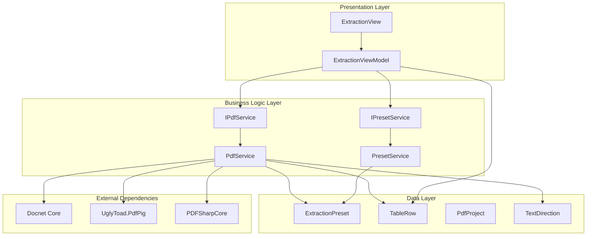
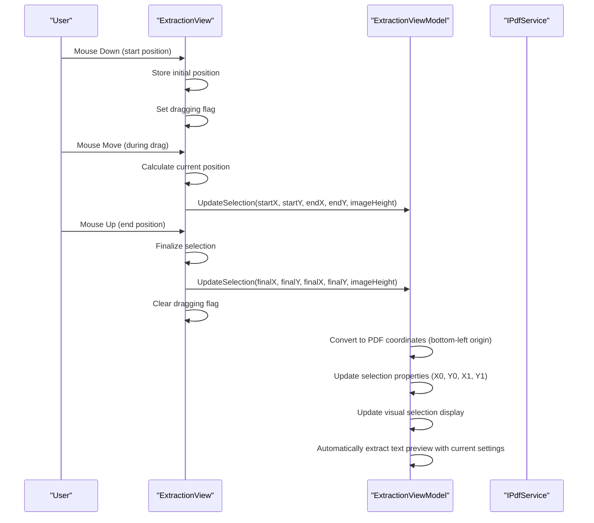
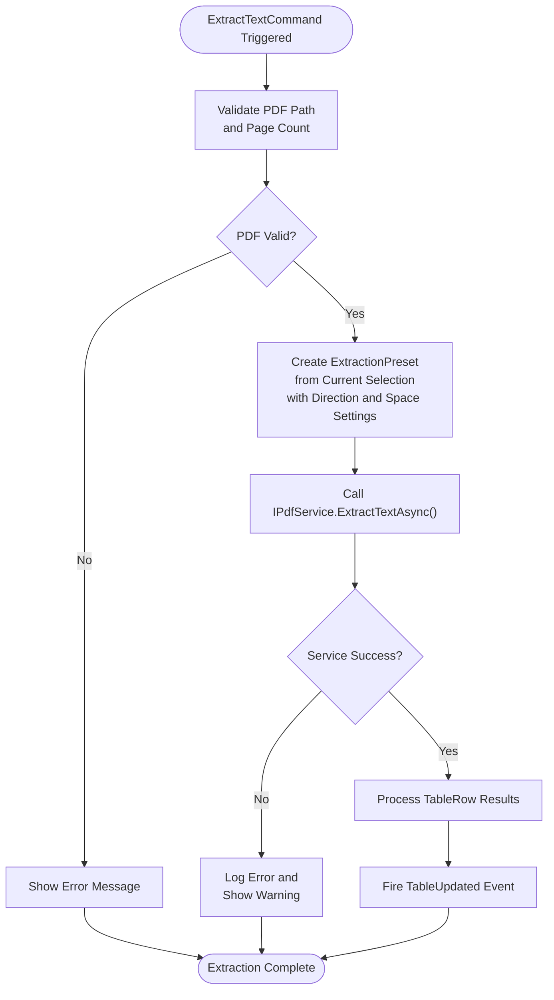
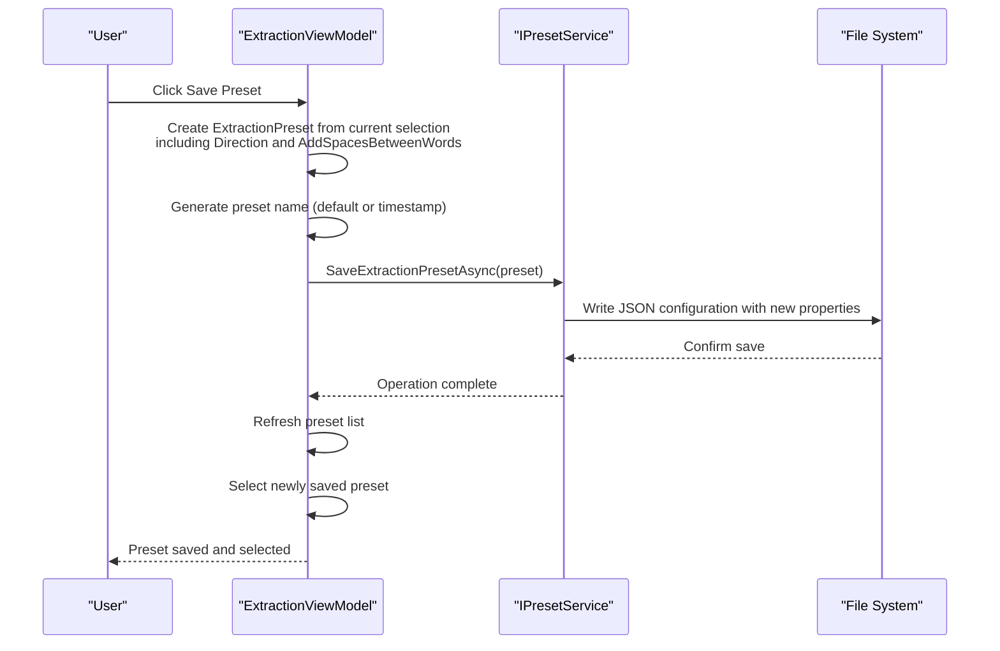
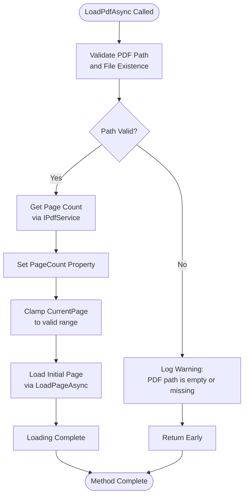
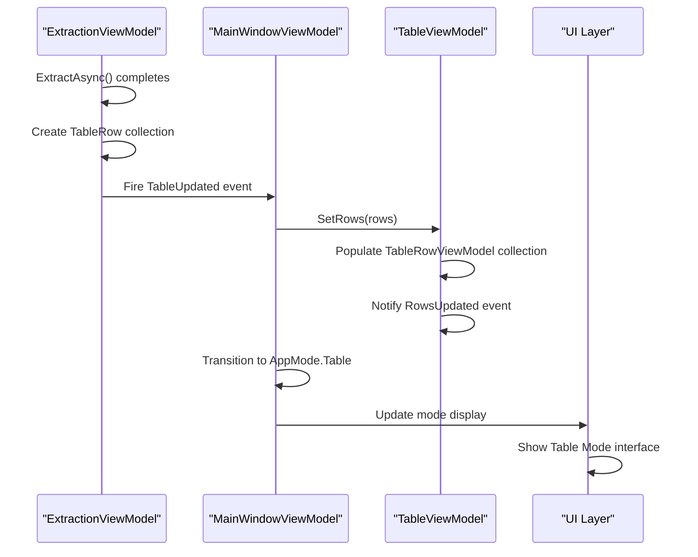

# Extraction Mode

<cite>
**Referenced Files in This Document**
- [ExtractionViewModel.cs](file://src/PdfAnnotator.ViewModels/ExtractionViewModel.cs) - *Updated with text direction and space handling controls*
- [ExtractionPreset.cs](file://src/PdfAnnotator.Core/Models/ExtractionPreset.cs) - *Updated with Direction and AddSpacesBetweenWords properties*
- [TextDirection.cs](file://src/PdfAnnotator.Core/Models/TextDirection.cs) - *New enum for text direction control*
- [PdfService.cs](file://src/PdfAnnotator.App/Services/PdfService.cs) - *Updated with text direction and space handling logic*
- [Example.json](file://presets/extraction/Example.json) - *Updated example with Direction property*
- [IPdfService.cs](file://src/PdfAnnotator.Core/Services/IPdfService.cs) - *Updated interface with new methods*
- [ExtractionView.axaml.cs](file://src/PdfAnnotator.App/Views/ExtractionView.axaml.cs) - *Updated view with coordinate conversion*
- [TextDirectionTests.cs](file://tests/PdfAnnotator.Tests/TextDirectionTests.cs) - *Added tests for text direction functionality*
</cite>

## Update Summary
**Changes Made**
- Added comprehensive documentation for text direction controls and space handling options
- Updated coordinate conversion explanation with bidirectional transformation details
- Enhanced ExtractionPreset model documentation with new properties
- Added detailed implementation of text ordering algorithm based on direction
- Updated text extraction process to include space handling logic
- Added examples of text direction configurations in JSON presets
- Improved error handling documentation for coordinate conversion

## Table of Contents
1. [Introduction](#introduction)
2. [System Architecture](#system-architecture)
3. [Core Components](#core-components)
4. [Region Selection Implementation](#region-selection-implementation)
5. [Text Extraction Process](#text-extraction-process)
6. [Preset Management](#preset-management)
7. [PDF Loading and Rendering](#pdf-loading-and-rendering)
8. [Event Propagation and Mode Synchronization](#event-propagation-and-mode-synchronization)
9. [Error Handling and Validation](#error-handling-and-validation)
10. [User Workflow Examples](#user-workflow-examples)
11. [Best Practices and Troubleshooting](#best-practices-and-troubleshooting)

## Introduction

The Extraction Mode in PDFAnnotator provides a comprehensive solution for extracting text from specific regions within PDF documents. This mode enables users to load PDF files, visually select rectangular regions using mouse input, and extract text content from those areas. The system implements sophisticated coordinate conversion between screen space and PDF coordinate systems, manages extraction presets for reusability, and seamlessly integrates with other application modes for data flow continuity.

The extraction process follows a structured workflow: PDF loading and page rendering, interactive region selection through mouse drag operations, text extraction from selected areas, and automatic transition to Table Mode for data manipulation. The system maintains robust error handling for common scenarios such as invalid file paths, missing PDF files, and rendering failures. This update introduces enhanced text direction controls and space handling options, allowing users to specify the reading order of extracted text and control spacing between words.

## System Architecture

The Extraction Mode operates within a layered architecture that separates concerns between presentation, business logic, and data access layers. The system employs the MVVM pattern with clear separation of responsibilities across ViewModels, services, and models.

**Diagram sources**
- [ExtractionView.axaml.cs](file://src\PdfAnnotator.App\Views\ExtractionView.axaml.cs#L1-L157)
- [ExtractionViewModel.cs](file://src\PdfAnnotator.ViewModels\ExtractionViewModel.cs#L1-L196)
- [PdfService.cs](file://src\PdfAnnotator.App\Services\PdfService.cs#L1-L179)

## Core Components

### ExtractionViewModel

The ExtractionViewModel serves as the central controller for extraction operations, managing PDF loading, page navigation, region selection, and text extraction workflows. It implements the MVVM pattern with property change notifications and command-based user interactions.

Key responsibilities include:
- Managing PDF document lifecycle and page rendering
- Coordinating region selection through mouse input
- Orchestrating text extraction operations with text direction and space handling options
- Handling preset management and storage
- Event propagation for mode transitions

### ExtractionView

The ExtractionView handles user interface interactions, translating mouse events into region selection operations and providing visual feedback during selection. It implements coordinate transformation between screen space and bitmap space for accurate region mapping.

### ExtractionPreset Model

The ExtractionPreset model defines the data structure for storing extraction regions, containing coordinate boundaries (X0, Y0, X1, Y1), text direction settings, and space handling options. The model now includes two new properties:
- **Direction**: Specifies the reading order of extracted text (LeftToRightTopToBottom, RightToLeftTopToBottom, LeftToRightBottomToTop, RightToLeftBottomToTop)
- **AddSpacesBetweenWords**: Controls whether spaces are inserted between extracted words

### TableRow Model

The TableRow model represents extracted text data with page information, field text content, and associated codes, serving as the primary data structure for extracted content.

**Section sources**
- [ExtractionViewModel.cs](file://src\PdfAnnotator.ViewModels\ExtractionViewModel.cs#L16-L196)
- [ExtractionView.axaml.cs](file://src\PdfAnnotator.App\Views\ExtractionView.axaml.cs#L14-L157)
- [ExtractionPreset.cs](file://src\PdfAnnotator.Core\Models\ExtractionPreset.cs#L1-L12) - *Updated with Direction and AddSpacesBetweenWords properties*
- [TableRow.cs](file://src\PdfAnnotator.Core\Models\TableRow.cs#L1-L9)

## Region Selection Implementation

### Mouse Interaction Workflow

The region selection process begins when users click and drag on the PDF page display. The system captures mouse events and translates them into coordinate transformations for accurate region definition.

**Diagram sources**
- [ExtractionView.axaml.cs](file://src\PdfAnnotator.App\Views\ExtractionView.axaml.cs#L32-L64)
- [ExtractionViewModel.cs](file://src\PdfAnnotator.ViewModels\ExtractionViewModel.cs#L106-L117)

### Coordinate System Transformation

The UpdateSelection method performs critical coordinate transformations to convert screen coordinates to PDF coordinate space. The system accounts for the difference in coordinate origins between screen space (top-left origin) and PDF space (bottom-left origin).

Key transformation steps:
1. **Screen to Bitmap Space**: Converting pointer positions to bitmap pixel coordinates
2. **Coordinate Normalization**: Determining left/top and right/bottom boundaries
3. **PDF Coordinate Conversion**: Transforming y-coordinates from top-down to bottom-up orientation using the original PDF page dimensions
4. **Visual Feedback Update**: Updating selection rectangle properties for display

The coordinate conversion formula ensures accurate positioning regardless of image scaling or DPI settings, maintaining precision across different display configurations. The system now stores the original PDF page dimensions in points (72 DPI) before rotation, which are used for accurate coordinate conversion.

**Section sources**
- [ExtractionViewModel.cs](file://src\PdfAnnotator.ViewModels\ExtractionViewModel.cs#L192-L231) - *Updated with bidirectional coordinate conversion*
- [ExtractionView.axaml.cs](file://src\PdfAnnotator.App\Views\ExtractionView.axaml.cs#L53-L90) - *Updated with coordinate transformation for preset application*

## Text Extraction Process

### ExtractTextCommand Implementation

The text extraction process is initiated through the ExtractTextCommand, which validates the current selection and triggers text extraction via the IPdfService interface. The command ensures that extraction occurs only when a valid PDF is loaded and a selection region is defined.

**Diagram sources**
- [ExtractionViewModel.cs](file://src\PdfAnnotator.ViewModels\ExtractionViewModel.cs#L119-L132)
- [IPdfService.cs](file://src\PdfAnnotator.Core\Services\IPdfService.cs#L11-L12)

### IPdfService Integration

The IPdfService interface provides the abstraction layer for PDF text extraction operations. The service implementation utilizes multiple PDF processing libraries to ensure compatibility and reliability across different document formats.

Extraction algorithm steps:
1. **Document Opening**: Safely opening the PDF document with proper resource management
2. **Page Iteration**: Processing each page within the document boundaries
3. **Word Filtering**: Applying spatial filtering based on the extraction preset coordinates
4. **Text Ordering**: Arranging words according to the specified text direction (LeftToRightTopToBottom, RightToLeftTopToBottom, LeftToRightBottomToTop, RightToLeftBottomToTop)
5. **Space Handling**: Adding or removing spaces between words based on AddSpacesBetweenWords setting
6. **Text Aggregation**: Collecting filtered words into coherent text blocks
7. **Row Creation**: Creating TableRow objects with page information and extracted text

The service handles coordinate validation, boundary checking, and error recovery to ensure robust text extraction capabilities.

**Section sources**
- [ExtractionViewModel.cs](file://src\PdfAnnotator.ViewModels\ExtractionViewModel.cs#L269-L283) - *Updated with text direction and space handling*
- [PdfService.cs](file://src\PdfAnnotator.App\Services\PdfService.cs#L215-L227) - *Updated with text direction and space handling logic*
- [IPdfService.cs](file://src\PdfAnnotator.Core\Services\IPdfService.cs#L11-L13) - *Updated with new methods*

## Preset Management

### SavePresetCommand Workflow

The preset management system allows users to save current extraction regions as reusable configurations. The SavePresetCommand creates a new ExtractionPreset from the current selection and stores it for future use.

**Diagram sources**
- [ExtractionViewModel.cs](file://src\PdfAnnotator.ViewModels\ExtractionViewModel.cs#L286-L304) - *Updated with text direction and space handling*
- [IPresetService.cs](file://src\PdfAnnotator.Core\Services\IPresetService.cs#L8-L8) - *Updated interface*

### Preset Loading and Application

The ReloadPresetsCommand refreshes the available preset collection by loading all stored extraction configurations from the preset directory. The SelectedPreset property automatically applies the selected preset to update the current extraction region.

Preset loading process:
1. **Directory Scanning**: Enumerating preset files in the extraction directory
2. **JSON Deserialization**: Parsing preset configuration files with backward compatibility for old presets without Direction property
3. **Collection Management**: Adding presets to the observable collection
4. **Selection Handling**: Automatically selecting the specified preset
5. **Region Application**: Applying preset coordinates to the current selection
6. **Settings Application**: Applying text direction and space handling settings

The system maintains preset uniqueness and handles conflicts by replacing existing entries with newer versions. For backward compatibility, presets without a Direction property default to LeftToRightTopToBottom.

**Section sources**
- [ExtractionViewModel.cs](file://src\PdfAnnotator.ViewModels\ExtractionViewModel.cs#L366-L378) - *Updated with text direction and space handling*
- [IPresetService.cs](file://src\PdfAnnotator.Core\Services\IPresetService.cs#L12-L14) - *Updated interface*
- [TextDirectionTests.cs](file://tests/PdfAnnotator.Tests/TextDirectionTests.cs#L57-L77) - *Added test for backward compatibility*

## PDF Loading and Rendering

### Asynchronous PDF Loading

The LoadPdfAsync method implements a robust PDF loading mechanism that handles file validation, page count determination, and initial page rendering. The method ensures thread safety and provides appropriate error handling for various failure scenarios.

**Diagram sources**
- [ExtractionViewModel.cs](file://src\PdfAnnotator.ViewModels\ExtractionViewModel.cs#L156-L166)

### Page Rendering at Specified DPI

The LoadPageAsync method renders individual PDF pages at configurable DPI settings, enabling high-quality visual representation for precise region selection. The rendering process includes caching mechanisms to optimize performance for repeated page access.

Rendering pipeline:
1. **Cache Lookup**: Checking for existing rendered page in cache
2. **File Validation**: Ensuring PDF file exists and is accessible
3. **Page Dimensions**: Calculating target dimensions based on DPI
4. **Document Processing**: Using Docnet Core for PDF rendering
5. **Bitmap Generation**: Creating Avalonia-compatible bitmap images
6. **Cache Storage**: Storing rendered pages for future reuse

The system implements intelligent caching with thread-safe access patterns and memory management to handle large documents efficiently.

**Section sources**
- [ExtractionViewModel.cs](file://src\PdfAnnotator.ViewModels\ExtractionViewModel.cs#L169-L190)
- [PdfService.cs](file://src\PdfAnnotator.App\Services\PdfService.cs#L57-L117)

## Event Propagation and Mode Synchronization

### TableUpdated Event Flow

The TableUpdated event serves as the primary mechanism for transferring extracted data to the Table Mode. When text extraction completes successfully, the event propagates the resulting TableRow collection to downstream components.

**Diagram sources**
- [ExtractionViewModel.cs](file://src\PdfAnnotator.ViewModels\ExtractionViewModel.cs#L282-L283)
- [MainWindowViewModel.cs](file://src\PdfAnnotator.ViewModels\MainWindowViewModel.cs#L77-L81)

### Cross-Mode Data Flow

The application implements seamless data flow between modes, ensuring that extracted information transitions smoothly from Extraction Mode to Table Mode and eventually to Annotation Mode. This synchronization maintains data integrity and provides a cohesive user experience.

Mode transition triggers:
- **Automatic Transition**: Extraction completion automatically switches to Table Mode
- **Manual Navigation**: Users can navigate between modes via dedicated commands
- **Data Preservation**: Row data persists across mode transitions
- **State Synchronization**: Preset selections and project state are maintained

**Section sources**
- [MainWindowViewModel.cs](file://src\PdfAnnotator.ViewModels\MainWindowViewModel.cs#L77-L81)
- [TableViewModel.cs](file://src\PdfAnnotator.ViewModels\TableViewModel.cs#L36-L49)

## Error Handling and Validation

### Common Error Scenarios

The extraction system implements comprehensive error handling for typical failure scenarios encountered during PDF processing and user interactions.

| Error Type | Cause | Handling Strategy | Recovery Action |
|------------|-------|-------------------|-----------------|
| Invalid PDF Path | Empty or non-existent file path | Path validation and logging | Prompt user for valid file |
| Missing PDF File | File deleted or moved after selection | File existence check | Re-select valid file |
| Rendering Failure | PDF corruption or unsupported format | Exception catching and logging | Show error message |
| Coordinate Out of Bounds | Selection extends beyond page boundaries | Boundary validation | Clip selection to valid area |
| Service Unavailability | IPdfService unavailable or failed | Null checks and fallback | Retry operation |
| Text Direction Error | Invalid text direction setting | Default to LeftToRightTopToBottom | Use default direction |

### Logging and Diagnostics

The system implements structured logging throughout the extraction pipeline, providing detailed diagnostic information for troubleshooting and monitoring. Log messages include contextual information such as file paths, operation parameters, and error details.

Logging categories:
- **Warning Level**: Non-critical issues that don't prevent operation
- **Error Level**: Critical failures requiring user intervention
- **Information Level**: Successful operations and state changes
- **Debug Level**: Detailed execution traces for development

**Section sources**
- [ExtractionViewModel.cs](file://src\PdfAnnotator.ViewModels\ExtractionViewModel.cs#L159-L160)
- [PdfService.cs](file://src\PdfAnnotator.App\Services\PdfService.cs#L114-L116)
- [ExtractionViewModel.cs](file://src\PdfAnnotator.ViewModels\ExtractionViewModel.cs#L263-L265) - *Updated with text extraction preview error handling*

## User Workflow Examples

### Basic Extraction Workflow

1. **PDF Loading**: User selects a PDF file through the Open PDF dialog
2. **Page Navigation**: User navigates to the desired page using page controls
3. **Region Selection**: User clicks and drags to define extraction area
4. **Text Direction Setting**: User selects appropriate text direction (e.g., RightToLeftTopToBottom for Arabic text)
5. **Space Handling Setting**: User configures whether spaces should be added between words
6. **Text Extraction**: User clicks Extract Text to process the selection
7. **Data Review**: System automatically transitions to Table Mode for review
8. **Preset Saving**: User saves the successful extraction as a preset for future use

### Advanced Preset Management Workflow

1. **Preset Creation**: User defines multiple extraction regions for different document types
2. **Preset Organization**: User categorizes presets by document type or project
3. **Quick Application**: User loads previously saved presets with a single click
4. **Batch Processing**: User applies multiple presets to process similar documents
5. **Configuration Sharing**: User exports presets for team collaboration

### Troubleshooting Workflow

1. **Issue Detection**: User notices extraction errors or unexpected results
2. **Diagnostic Steps**: User checks PDF validity and selection boundaries
3. **Error Resolution**: User adjusts selection or reloads PDF
4. **Validation Testing**: User verifies extraction results with smaller regions
5. **Documentation**: User saves successful configurations as reference presets

## Best Practices and Troubleshooting

### Optimal Extraction Settings

**DPI Configuration**: Use higher DPI values (300-600) for detailed documents, lower DPI (72-150) for quick previews
**Selection Precision**: Make selections tight around text areas to minimize noise
**Text Direction**: Select appropriate text direction based on document language (LeftToRightTopToBottom for English, RightToLeftTopToBottom for Arabic/Hebrew)
**Space Handling**: Enable AddSpacesBetweenWords for normal text extraction, disable for continuous data fields
**Preset Organization**: Group related extractions by document type or business process
**File Management**: Maintain organized preset directories with descriptive naming conventions

### Performance Optimization

**Caching Strategy**: Leverage the built-in page rendering cache for repeated page access
**Memory Management**: Close unused PDF documents to free memory resources
**Batch Operations**: Process multiple pages sequentially rather than concurrently
**Resource Cleanup**: Ensure proper disposal of graphics resources and file handles

### Common Issues and Solutions

**Issue**: Extraction returns empty results
- **Cause**: Selection outside text content or incorrect DPI settings
- **Solution**: Adjust selection boundaries and verify DPI configuration

**Issue**: Slow extraction performance
- **Cause**: Large document size or low DPI rendering
- **Solution**: Use appropriate DPI settings and process documents in smaller batches

**Issue**: Presets not loading correctly
- **Cause**: Corrupted JSON files or directory permission issues
- **Solution**: Verify file permissions and check JSON syntax in preset files

**Issue**: Coordinate conversion errors
- **Cause**: Screen resolution changes or display scaling issues
- **Solution**: Recreate presets or adjust coordinate calculations

**Issue**: Text appears in wrong order
- **Cause**: Incorrect text direction setting for the document language
- **Solution**: Change Direction setting to match document reading order

**Issue**: Extra spaces in extracted text
- **Cause**: AddSpacesBetweenWords enabled for continuous data fields
- **Solution**: Disable AddSpacesBetweenWords for fields that should be continuous

### Integration Guidelines

**Cross-Mode Consistency**: Ensure data integrity when transitioning between modes
**Error Propagation**: Implement proper error handling across mode boundaries
**State Management**: Maintain consistent application state during mode transitions
**User Experience**: Provide clear feedback for long-running operations

The Extraction Mode provides a robust foundation for PDF text extraction with comprehensive features for region selection, preset management, and seamless integration with other application modes. By following established patterns and best practices, users can achieve efficient and reliable text extraction workflows tailored to their specific document processing needs.