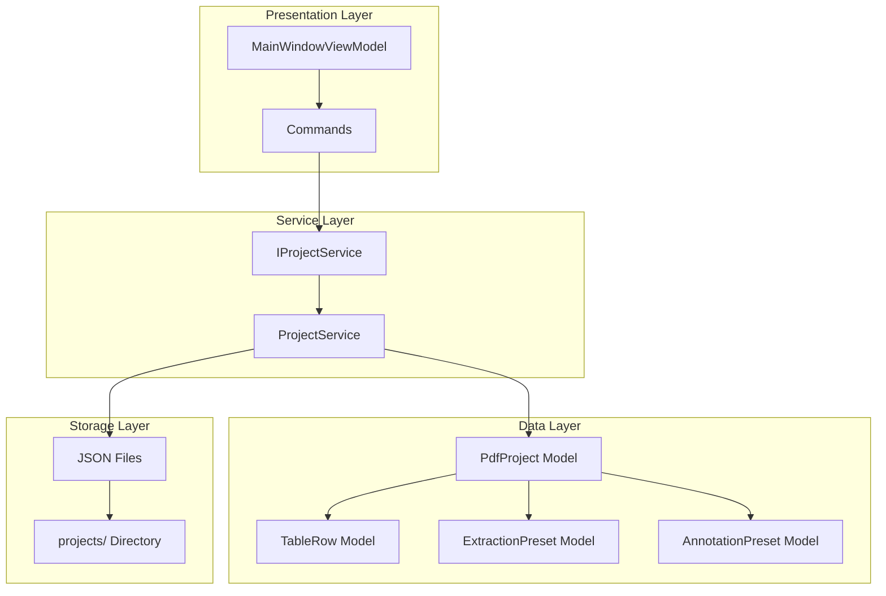
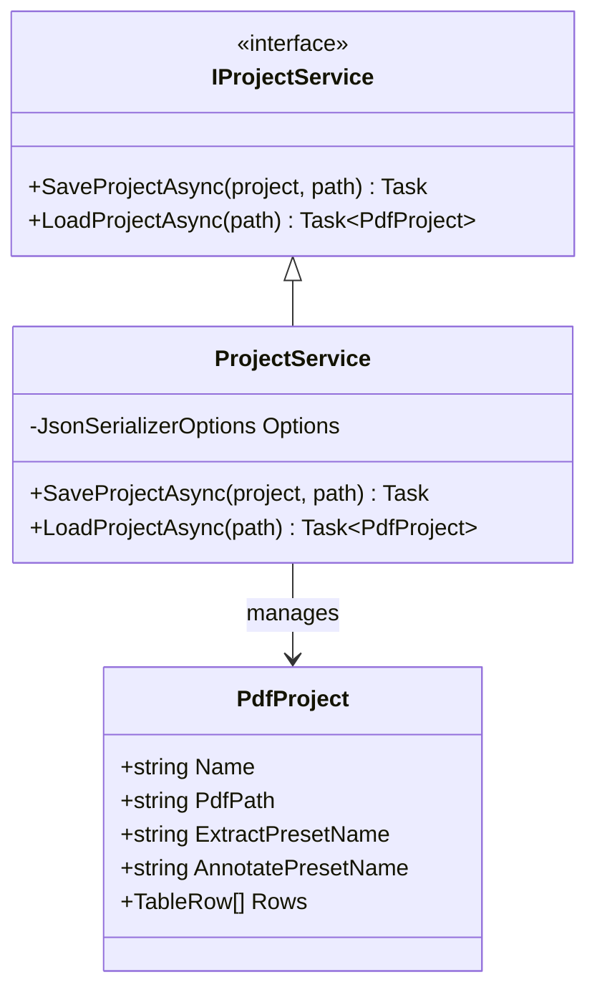
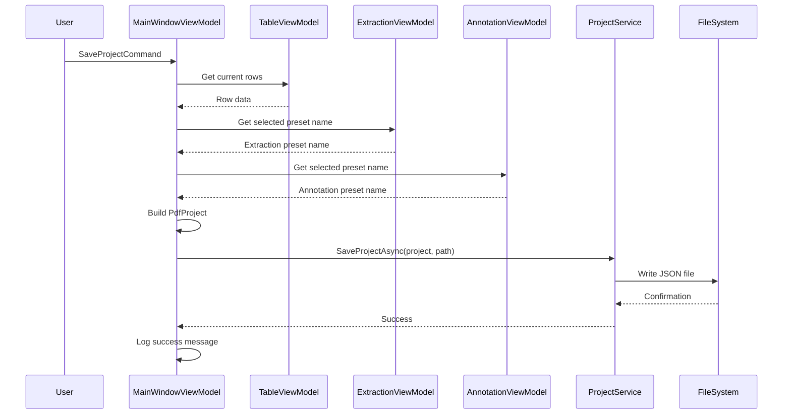
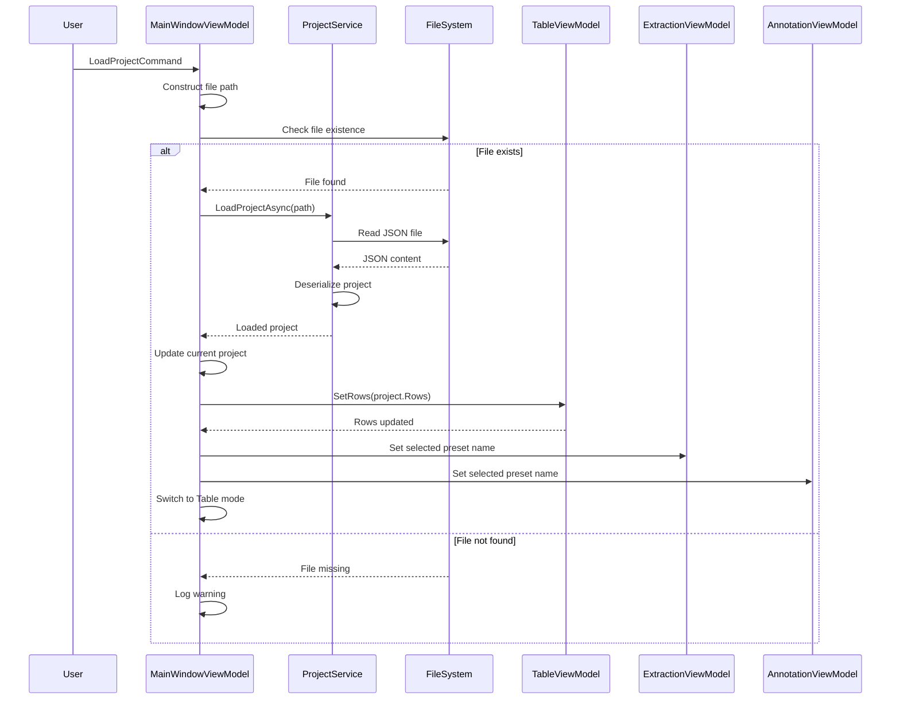
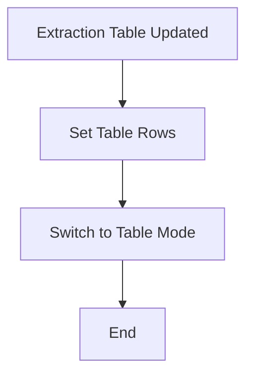
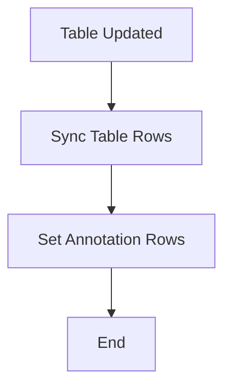
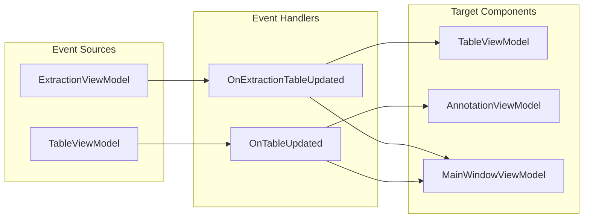
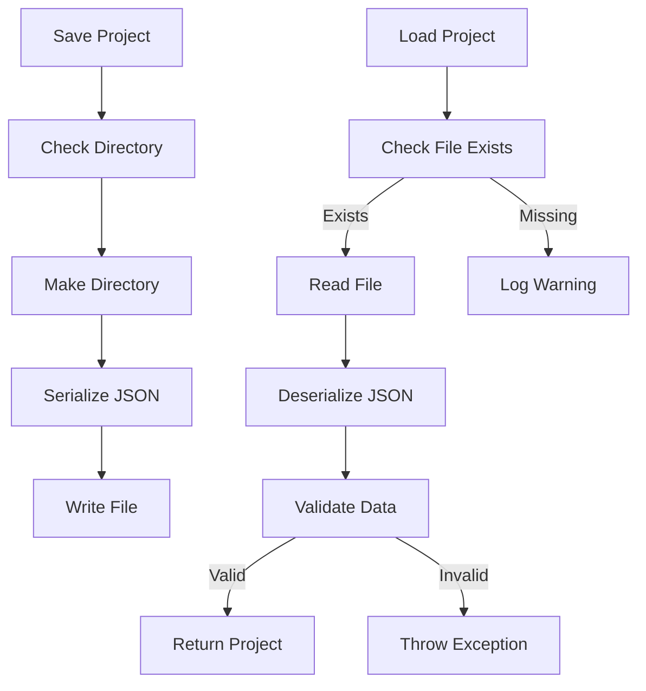
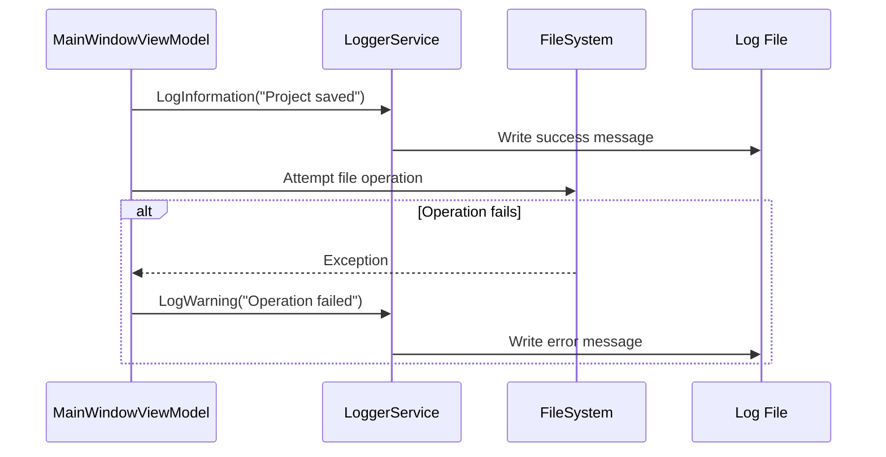
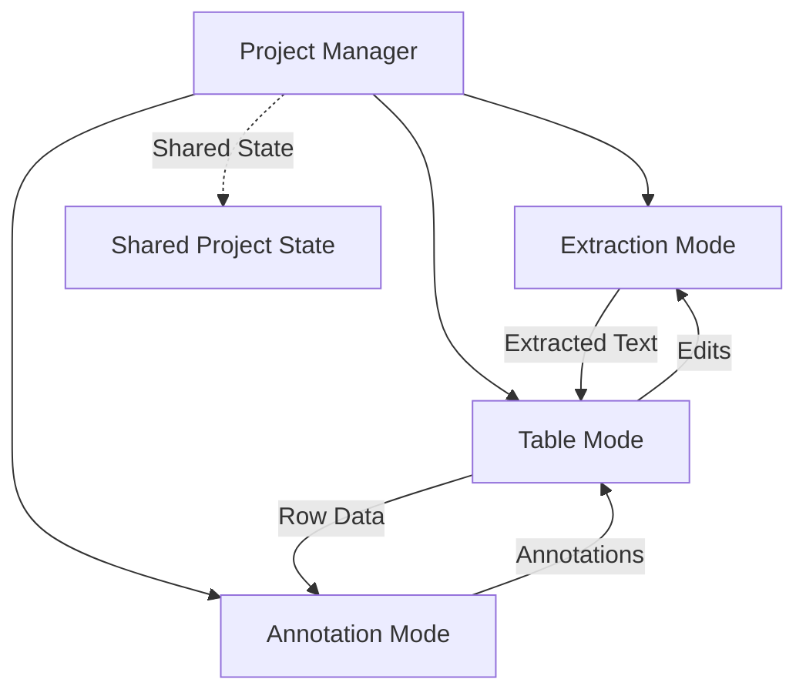

# Project Management

<cite>
**Referenced Files in This Document**
- [MainWindowViewModel.cs](file://src/PdfAnnotator.ViewModels/MainWindowViewModel.cs)
- [IProjectService.cs](file://src/PdfAnnotator.Core/Services/IProjectService.cs)
- [ProjectService.cs](file://src/PdfAnnotator.Core/Services/ProjectService.cs)
- [PdfProject.cs](file://src/PdfAnnotator.Core/Models/PdfProject.cs)
- [TableViewModel.cs](file://src/PdfAnnotator.ViewModels/TableViewModel.cs)
- [ExtractionViewModel.cs](file://src/PdfAnnotator.ViewModels/ExtractionViewModel.cs)
- [AnnotationViewModel.cs](file://src/PdfAnnotator.ViewModels/AnnotationViewModel.cs)
- [TableRow.cs](file://src\PdfAnnotator.Core\Models/TableRow.cs)
- [ExtractionPreset.cs](file://src\PdfAnnotator.Core\Models/ExtractionPreset.cs)
- [AnnotationPreset.cs](file://src\PdfAnnotator.Core\Models/AnnotationPreset.cs)
- [ProjectServiceTests.cs](file://tests/PdfAnnotator.Tests/ProjectServiceTests.cs)
- [README.md](file://README.md)
</cite>

## Table of Contents
1. [Introduction](#introduction)
2. [Project Management Architecture](#project-management-architecture)
3. [Core Components](#core-components)
4. [Save Project Workflow](#save-project-workflow)
5. [Load Project Workflow](#load-project-workflow)
6. [Internal Synchronization Mechanisms](#internal-synchronization-mechanisms)
7. [Event-Driven Architecture](#event-driven-architecture)
8. [File Management and Persistence](#file-management-and-persistence)
9. [Error Handling and Logging](#error-handling-and-logging)
10. [Integration Across Application Modes](#integration-across-application-modes)
11. [Common Issues and Troubleshooting](#common-issues-and-troubleshooting)
12. [Best Practices](#best-practices)

## Introduction

The PDF Annotator application implements a sophisticated project management system that enables users to save and load complete application states across different operational modes. This system ensures seamless state preservation and restoration while maintaining data integrity across the Extraction, Table, and Annotation modes.

The project management functionality centers around two primary commands: `SaveProjectCommand` and `LoadProjectCommand` in the `MainWindowViewModel`. These commands orchestrate the collection of current application data, including table row information, active preset configurations, and mode-specific settings, and persist them into structured JSON files within the 'projects/' directory.

## Project Management Architecture

The project management system follows a layered architecture with clear separation of concerns:

**Diagram sources**
- [MainWindowViewModel.cs](file://src/PdfAnnotator.ViewModels/MainWindowViewModel.cs#L22-L120)
- [IProjectService.cs](file://src\PdfAnnotator.Core/Services/IProjectService.cs#L6-L11)
- [ProjectService.cs](file://src\PdfAnnotator.Core/Services/ProjectService.cs#L6-L43)
- [PdfProject.cs](file://src\PdfAnnotator.Core/Models/PdfProject.cs#L5-L12)

## Core Components

### MainWindowViewModel

The `MainWindowViewModel` serves as the central orchestrator for project management operations. It maintains references to all major view models and coordinates state transitions between different application modes.

Key responsibilities include:
- Managing the current project state through `_currentProject`
- Coordinating save and load operations via dedicated commands
- Maintaining application mode state (`AppMode`)
- Establishing event subscriptions for real-time synchronization

### Project Service Infrastructure

The project management system relies on a well-defined service layer:

**Diagram sources**
- [IProjectService.cs](file://src\PdfAnnotator.Core/Services/IProjectService.cs#L6-L11)
- [ProjectService.cs](file://src\PdfAnnotator.Core/Services/ProjectService.cs#L6-L43)
- [PdfProject.cs](file://src\PdfAnnotator.Core/Models/PdfProject.cs#L5-L12)

**Section sources**
- [MainWindowViewModel.cs](file://src/PdfAnnotator.ViewModels/MainWindowViewModel.cs#L22-L120)
- [IProjectService.cs](file://src\PdfAnnotator.Core/Services/IProjectService.cs#L6-L11)
- [ProjectService.cs](file://src\PdfAnnotator.Core/Services/ProjectService.cs#L6-L43)

## Save Project Workflow

The `SaveProjectAsync` method implements a comprehensive state capture mechanism that collects data from all active components:

**Diagram sources**
- [MainWindowViewModel.cs](file://src/PdfAnnotator.ViewModels/MainWindowViewModel.cs#L93-L101)
- [ProjectService.cs](file://src\PdfAnnotator.Core/Services/ProjectService.cs#L13-L23)

### Data Collection Process

The save operation systematically gathers state information:

1. **Row Data Collection**: Converts current table rows from `TableViewModel` using `ToModel()` transformations
2. **Preset Information**: Captures active preset names from both `ExtractionViewModel` and `AnnotationViewModel`
3. **Project Metadata**: Updates project metadata including name, PDF path, and creation timestamps

### File Persistence Strategy

The system employs a structured file naming convention:
- **Location**: `projects/{project_name}.json`
- **Format**: JSON with indented formatting for readability
- **Directory Creation**: Automatically creates the projects directory if it doesn't exist

**Section sources**
- [MainWindowViewModel.cs](file://src/PdfAnnotator.ViewModels/MainWindowViewModel.cs#L93-L101)
- [ProjectService.cs](file://src\PdfAnnotator.Core/Services/ProjectService.cs#L13-L23)

## Load Project Workflow

The `LoadProjectAsync` method implements a robust restoration process that reconstructs the complete application state:

**Diagram sources**
- [MainWindowViewModel.cs](file://src/PdfAnnotator.ViewModels/MainWindowViewModel.cs#L103-L118)
- [ProjectService.cs](file://src\PdfAnnotator.Core/Services/ProjectService.cs#L25-L41)

### Restoration Process

The load operation follows a precise restoration sequence:

1. **File Validation**: Checks for file existence before attempting to load
2. **State Reconstruction**: Rebuilds the `PdfProject` model from persisted JSON
3. **Component Synchronization**: Restores table rows, preset selections, and mode state
4. **Automatic Mode Transition**: Transitions to Table Mode upon successful restoration

### Error Handling During Loading

The system implements comprehensive error handling for various failure scenarios:
- **Missing Files**: Gracefully logs warnings and continues operation
- **Corrupted Data**: Throws appropriate exceptions with descriptive messages
- **Deserialization Failures**: Handles invalid JSON format gracefully

**Section sources**
- [MainWindowViewModel.cs](file://src/PdfAnnotator.ViewModels/MainWindowViewModel.cs#L103-L118)
- [ProjectService.cs](file://src\PdfAnnotator.Core/Services/ProjectService.cs#L25-L41)

## Internal Synchronization Mechanisms

The application implements sophisticated synchronization mechanisms to maintain consistency across different operational modes.

### OnExtractionTableUpdated Event Handler

The `OnExtractionTableUpdated` method implements automatic mode switching and data propagation:

**Diagram sources**
- [MainWindowViewModel.cs](file://src\PdfAnnotator.ViewModels/MainWindowViewModel.cs#L77-L81)

This mechanism ensures that after text extraction completes, the application automatically transitions to Table Mode, allowing users to review and edit extracted data immediately.

### OnTableUpdated Event Handler

The `OnTableUpdated` method facilitates bidirectional synchronization between Table Mode and Annotation Mode:

**Diagram sources**
- [MainWindowViewModel.cs](file://src\PdfAnnotator.ViewModels/MainWindowViewModel.cs#L83-L86)

**Section sources**
- [MainWindowViewModel.cs](file://src/PdfAnnotator.ViewModels/MainWindowViewModel.cs#L77-L86)

## Event-Driven Architecture

The project management system leverages a sophisticated event-driven architecture for real-time state synchronization:

**Diagram sources**
- [MainWindowViewModel.cs](file://src\PdfAnnotator.ViewModels/MainWindowViewModel.cs#L60-L61)

### Event Subscription Pattern

The constructor establishes critical event subscriptions:

1. **Extraction to Table Synchronization**: `Extraction.TableUpdated += OnExtractionTableUpdated`
2. **Table to Annotation Synchronization**: `Table.RowsUpdated += OnTableUpdated`

These subscriptions enable automatic state propagation without manual intervention, ensuring data consistency across all application modes.

**Section sources**
- [MainWindowViewModel.cs](file://src\PdfAnnotator.ViewModels/MainWindowViewModel.cs#L60-L61)

## File Management and Persistence

### Directory Structure and Naming Conventions

The project management system follows established conventions for file organization:

| Component | Location | Format | Purpose |
|-----------|----------|---------|---------|
| Projects | `projects/` | `{name}.json` | Complete project state |
| Extraction Presets | `presets/extraction/` | `{name}.json` | Extraction configuration templates |
| Annotation Presets | `presets/annotation/` | `{name}.json` | Annotation configuration templates |
| CSV Data | `tables/` | `latest.csv` | Intermediate table data |

### JSON Serialization Strategy

The `ProjectService` employs structured JSON serialization with the following characteristics:

- **Indentation**: `WriteIndented = true` for human-readable output
- **Null Handling**: Properly handles nullable collections and properties
- **Type Safety**: Strong typing with explicit model definitions

### File Operations

The persistence layer implements robust file management:

**Diagram sources**
- [ProjectService.cs](file://src\PdfAnnotator.Core/Services/ProjectService.cs#L13-L41)

**Section sources**
- [ProjectService.cs](file://src\PdfAnnotator.Core/Services/ProjectService.cs#L13-L41)
- [README.md](file://README.md#L33-L34)

## Error Handling and Logging

### Comprehensive Logging Strategy

The project management system implements a multi-layered logging approach:

1. **Success Logging**: Confirms successful operations with informational messages
2. **Warning Logging**: Reports recoverable issues like missing files
3. **Error Logging**: Captures and reports critical failures

### Exception Handling Patterns

The system handles various error conditions gracefully:

| Error Type | Handling Strategy | Recovery Action |
|------------|------------------|-----------------|
| Missing Project Files | Warning log, graceful degradation | Continue with default state |
| Corrupted JSON Data | Exception with descriptive message | Prevent loading, notify user |
| Directory Access Issues | Try-catch with fallback | Use temporary directory |
| Network/File System Errors | Retry logic with exponential backoff | User notification required |

### Logging Implementation

The logging strategy ensures comprehensive audit trails:

**Diagram sources**
- [MainWindowViewModel.cs](file://src\PdfAnnotator.ViewModels/MainWindowViewModel.cs#L100-L109)

**Section sources**
- [MainWindowViewModel.cs](file://src\PdfAnnotator.ViewModels/MainWindowViewModel.cs#L100-L109)
- [ProjectService.cs](file://src\PdfAnnotator.Core/Services/ProjectService.cs#L28-L37)

## Integration Across Application Modes

### Mode-Specific State Management

The project management system seamlessly integrates with all three application modes:

#### Extraction Mode Integration
- **Preset Preservation**: Active extraction presets are saved and restored
- **Selection State**: Current selection boundaries are maintained
- **PDF Path**: Source PDF file path is preserved across sessions

#### Table Mode Integration
- **Row Data**: Complete table structure with field text and codes
- **Editing State**: Current editing position and selection
- **CSV Synchronization**: Automatic CSV export/import capabilities

#### Annotation Mode Integration
- **Preset Configuration**: Active annotation presets with positioning data
- **Font Settings**: Font family, size, color, and angle preferences
- **Page Navigation**: Current page and zoom level state

### Cross-Mode Data Flow

**Diagram sources**
- [MainWindowViewModel.cs](file://src\PdfAnnotator.ViewModels/MainWindowViewModel.cs#L29-L31)

**Section sources**
- [MainWindowViewModel.cs](file://src\PdfAnnotator.ViewModels/MainWindowViewModel.cs#L29-L31)
- [ExtractionViewModel.cs](file://src\PdfAnnotator.ViewModels/ExtractionViewModel.cs#L57-L62)
- [AnnotationViewModel.cs](file://src\PdfAnnotator.ViewModels/AnnotationViewModel.cs#L39-L45)

## Common Issues and Troubleshooting

### Missing Project Files

**Problem**: Project files not found during load operations
**Symptoms**: 
- Warning messages in logs about missing files
- Application continues with default state
- No data loss occurs

**Solution**: Verify file paths and permissions
- Check if the projects directory exists
- Ensure write permissions for the application
- Verify file naming conventions

### JSON Deserialization Errors

**Problem**: Corrupted or incompatible JSON files
**Symptoms**:
- Application crashes during load
- Incomplete data restoration
- Exception messages about parsing failures

**Solution**: Implement data validation and backup strategies
- Validate JSON structure before deserialization
- Maintain backup copies of project files
- Implement migration scripts for format changes

### Synchronization Issues

**Problem**: Inconsistent state between modes
**Symptoms**:
- Data discrepancies between Table and Annotation modes
- Unexpected mode transitions
- Lost edits during state changes

**Solution**: Review event handler implementations
- Verify event subscription order
- Check for race conditions in state updates
- Implement state validation checks

### Performance Considerations

**Large Project Files**:
- Monitor memory usage during large file operations
- Implement streaming for very large datasets
- Consider compression for frequently accessed projects

**Frequent Save Operations**:
- Implement debouncing for rapid state changes
- Batch multiple changes into single save operations
- Use incremental saves for critical state changes

**Section sources**
- [ProjectService.cs](file://src\PdfAnnotator.Core/Services/ProjectService.cs#L28-L37)
- [MainWindowViewModel.cs](file://src\PdfAnnotator.ViewModels/MainWindowViewModel.cs#L106-L109)

## Best Practices

### Project File Organization

1. **Naming Conventions**: Use descriptive, unique project names
2. **Version Control**: Consider adding version information to project files
3. **Backup Strategy**: Implement automated backup mechanisms
4. **Cleanup Procedures**: Regular cleanup of old or unused project files

### State Management Guidelines

1. **Atomic Operations**: Ensure save/load operations are atomic
2. **Validation**: Implement comprehensive data validation
3. **Rollback Capability**: Provide mechanisms to revert to previous states
4. **Concurrency Handling**: Protect against simultaneous access issues

### Error Recovery Strategies

1. **Graceful Degradation**: Maintain functionality even with partial failures
2. **User Notification**: Provide clear feedback about errors and recovery actions
3. **Logging**: Implement comprehensive logging for troubleshooting
4. **Testing**: Regular testing of save/load functionality

### Performance Optimization

1. **Lazy Loading**: Load project data only when needed
2. **Memory Management**: Properly dispose of resources
3. **Caching**: Cache frequently accessed project data
4. **Asynchronous Operations**: Use async/await patterns for I/O operations

The project management system demonstrates a sophisticated approach to state persistence and restoration, providing users with reliable and intuitive project management capabilities while maintaining data integrity across multiple application modes.