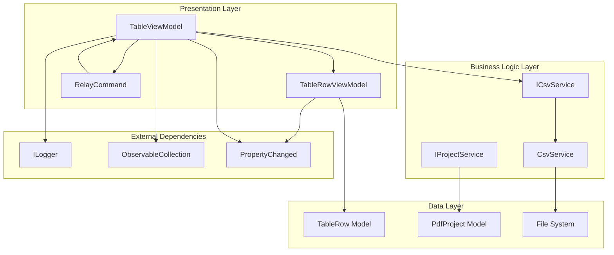
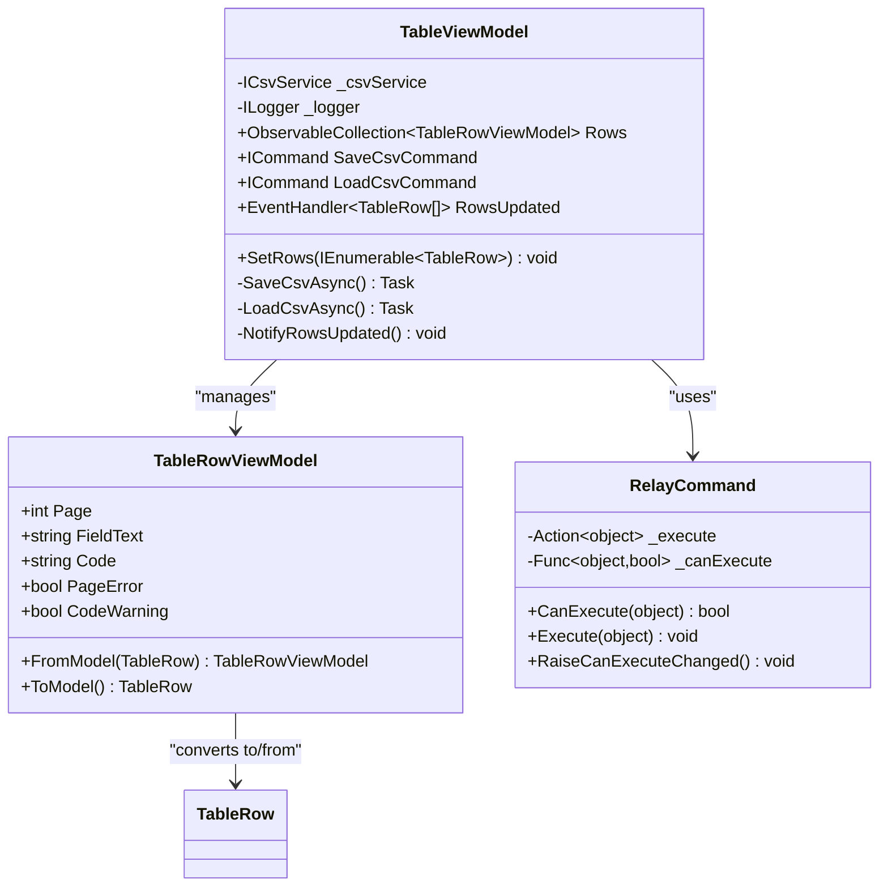
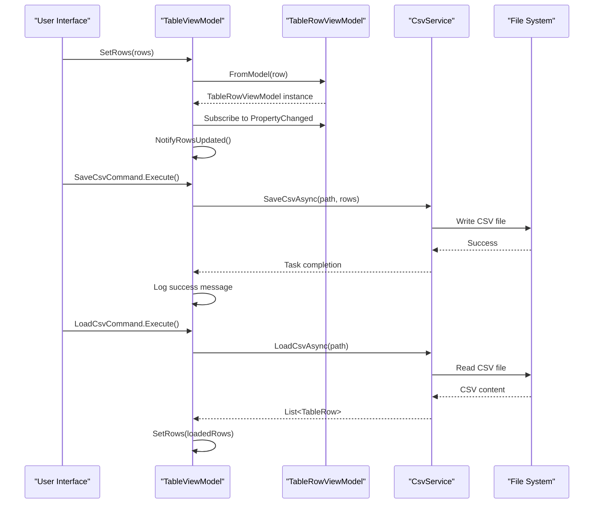
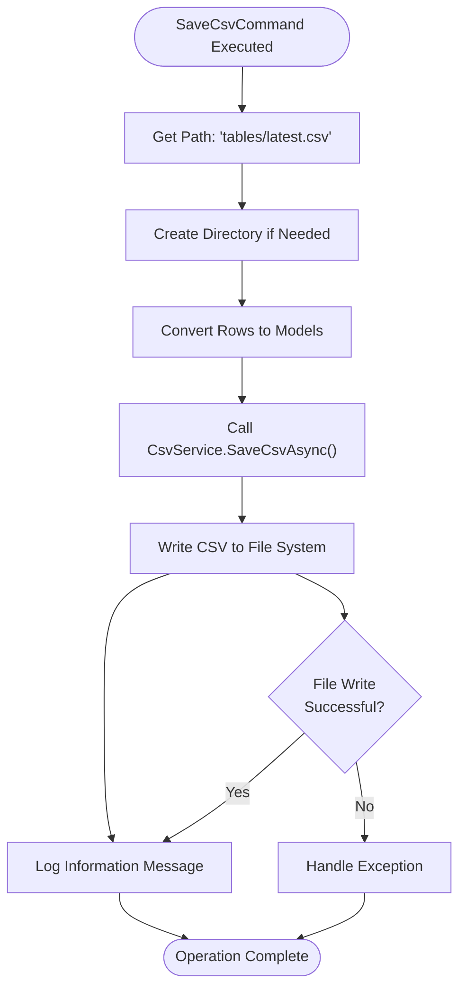
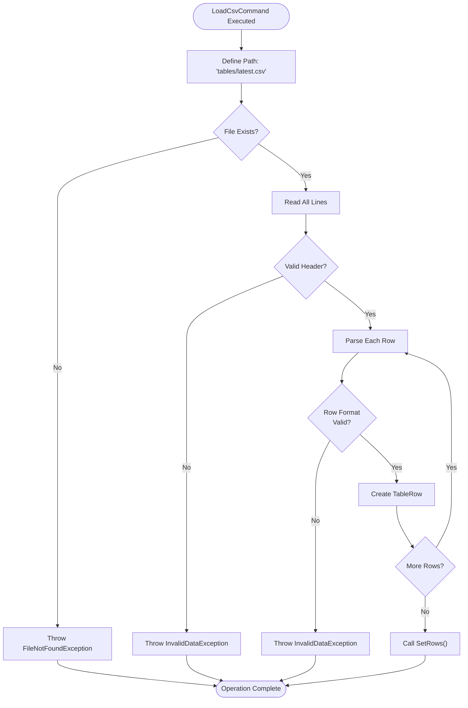
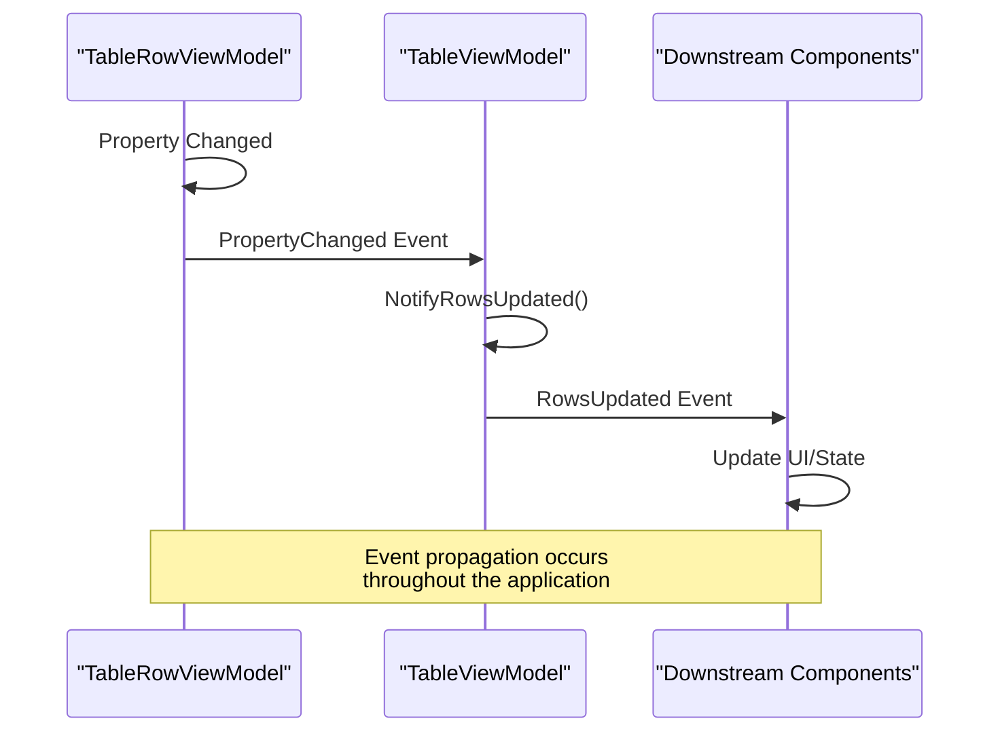
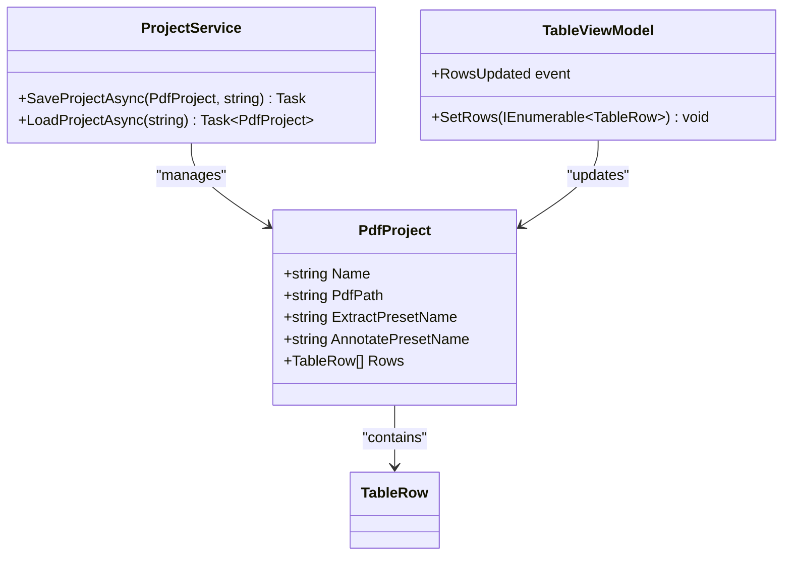

# Table Mode

<cite>
**Referenced Files in This Document**
- [TableViewModel.cs](file://src/PdfAnnotator.ViewModels/TableViewModel.cs)
- [TableRowViewModel.cs](file://src/PdfAnnotator.ViewModels/TableRowViewModel.cs)
- [CsvService.cs](file://src/PdfAnnotator.Core\Services/CsvService.cs)
- [ICsvService.cs](file://src\PdfAnnotator.Core\Services/ICsvService.cs)
- [TableRow.cs](file://src\PdfAnnotator.Core\Models/TableRow.cs)
- [PdfProject.cs](file://src\PdfAnnotator.Core\Models/PdfProject.cs)
- [ProjectService.cs](file://src\PdfAnnotator.Core\Services/ProjectService.cs)
- [RelayCommand.cs](file://src\PdfAnnotator.ViewModels/RelayCommand.cs)
- [CsvServiceTests.cs](file://tests/PdfAnnotator.Tests/CsvServiceTests.cs)
</cite>

## Table of Contents
1. [Introduction](#introduction)
2. [Architecture Overview](#architecture-overview)
3. [Core Components](#core-components)
4. [Data Model and View Models](#data-model-and-view-models)
5. [CSV Import/Export Functionality](#csv-importexport-functionality)
6. [Event-Driven Updates](#eventdriven-updates)
7. [Data Binding and Editing](#data-binding-and-editing)
8. [Error Handling and Validation](#error-handling-and-validation)
9. [Integration with Project Management](#integration-with-project-management)
10. [Practical Implementation Examples](#practical-implementation-examples)
11. [Troubleshooting Guide](#troubleshooting-guide)
12. [Best Practices](#best-practices)

## Introduction

The Table Mode in PDFAnnotator provides a comprehensive tabular interface for managing extracted data from PDF documents. It serves as the central hub for displaying, editing, and persisting structured data through CSV import/export operations. The system is built around a MVVM (Model-View-ViewModel) architecture that ensures clean separation of concerns while maintaining responsive user interactions.

The Table Mode functionality encompasses several key capabilities:
- **Tabular Data Display**: Presenting extracted data in a grid format with editable fields
- **CSV Operations**: Seamless import and export of data using standardized CSV format
- **Real-time Updates**: Event-driven notifications for data changes across the application
- **Data Validation**: Built-in validation mechanisms for field integrity
- **Persistence Management**: Automatic saving and loading of data states

## Architecture Overview

The Table Mode follows a layered architecture pattern with clear separation between presentation, business logic, and data access concerns.



**Diagram sources**
- [TableViewModel.cs](file://src/PdfAnnotator.ViewModels/TableViewModel.cs#L16-L70)
- [TableRowViewModel.cs](file://src\PdfAnnotator.ViewModels/TableRowViewModel.cs#L6-L46)
- [CsvService.cs](file://src\PdfAnnotator.Core\Services/CsvService.cs#L8-L96)

## Core Components

### TableViewModel

The TableViewModel serves as the primary orchestrator for table-related operations, maintaining an ObservableCollection of TableRowViewModel objects and managing CSV import/export functionality.



**Diagram sources**
- [TableViewModel.cs](file://src/PdfAnnotator.ViewModels/TableViewModel.cs#L16-L70)
- [TableRowViewModel.cs](file://src\PdfAnnotator.ViewModels/TableRowViewModel.cs#L6-L46)
- [RelayCommand.cs](file://src\PdfAnnotator.ViewModels/RelayCommand.cs#L6-L24)

**Section sources**
- [TableViewModel.cs](file://src/PdfAnnotator.ViewModels/TableViewModel.cs#L16-L70)
- [TableRowViewModel.cs](file://src\PdfAnnotator.ViewModels/TableRowViewModel.cs#L6-L46)

### TableRowViewModel

The TableRowViewModel encapsulates individual row data with built-in validation and property change notifications. It maintains a direct mapping to the underlying TableRow model while providing additional validation state information.

Key features include:
- **Property Change Notification**: Implements INotifyPropertyChanged for real-time UI updates
- **Validation Logic**: Automatic validation of the Code field with warning indicators
- **Bidirectional Conversion**: Seamless conversion between model and view model representations
- **Error State Management**: Maintains PageError and CodeWarning state flags

**Section sources**
- [TableRowViewModel.cs](file://src\PdfAnnotator.ViewModels/TableRowViewModel.cs#L6-L46)

## Data Model and View Models

### TableRow Model

The TableRow model represents the core data structure for individual table entries, containing essential fields for PDF annotation processing.

| Property | Type | Description | Constraints |
|----------|------|-------------|-------------|
| Page | int | Page number where field was extracted | Must be positive integer |
| FieldText | string | Text content of the extracted field | Non-empty string |
| Code | string | Unique identifier/code for the field | Can be empty but validated |

**Section sources**
- [TableRow.cs](file://src\PdfAnnotator.Core\Models/TableRow.cs#L3-L8)

### Data Flow Architecture

The system implements a sophisticated data flow pattern that ensures consistency between models and view models:



**Diagram sources**
- [TableViewModel.cs](file://src\PdfAnnotator.ViewModels/TableViewModel.cs#L36-L69)
- [CsvService.cs](file://src\PdfAnnotator.Core\Services/CsvService.cs#L13-L73)

**Section sources**
- [TableViewModel.cs](file://src\PdfAnnotator.ViewModels/TableViewModel.cs#L36-L69)
- [CsvService.cs](file://src\PdfAnnotator.Core\Services/CsvService.cs#L13-L73)

## CSV Import/Export Functionality

### SaveCsvCommand Implementation

The SaveCsvCommand provides asynchronous CSV export functionality with automatic directory creation and comprehensive logging.



**Diagram sources**
- [TableViewModel.cs](file://src\PdfAnnotator.ViewModels/TableViewModel.cs#L51-L57)

Key implementation details:
- **Automatic Directory Creation**: Uses `Directory.CreateDirectory()` to ensure the target directory exists
- **UTF-8 Encoding**: Ensures proper character encoding for international text support
- **Logging Integration**: Comprehensive logging through the injected ILogger instance
- **Asynchronous Operation**: Non-blocking execution through async/await pattern

**Section sources**
- [TableViewModel.cs](file://src\PdfAnnotator.ViewModels/TableViewModel.cs#L51-L57)

### LoadCsvCommand Implementation

The LoadCsvCommand handles CSV import operations with robust error handling and validation.



**Diagram sources**
- [TableViewModel.cs](file://src\PdfAnnotator.ViewModels/TableViewModel.cs#L59-L64)
- [CsvService.cs](file://src\PdfAnnotator.Core\Services/CsvService.cs#L32-L73)

**Section sources**
- [TableViewModel.cs](file://src\PdfAnnotator.ViewModels/TableViewModel.cs#L59-L64)
- [CsvService.cs](file://src\PdfAnnotator.Core\Services/CsvService.cs#L32-L73)

### CSV Service Implementation

The CsvService provides robust CSV parsing and generation with support for quoted fields and proper escaping.

#### CSV Format Specification

The system uses a semicolon-separated format with the following structure:

```
page;field_text;code
1;"Extracted text 1";CODE1
2;"Extracted text 2";CODE2
```

#### Advanced CSV Parsing Features

- **Quoted Field Support**: Handles fields containing semicolons and quotes
- **Escape Character Handling**: Properly escapes double quotes within quoted fields
- **Flexible Whitespace**: Ignores leading/trailing whitespace in fields
- **Multi-line Field Support**: Supports fields containing newlines when properly quoted

**Section sources**
- [CsvService.cs](file://src\PdfAnnotator.Core\Services/CsvService.cs#L8-L96)

## Event-Driven Updates

### RowsUpdated Event Mechanism

The TableViewModel implements a sophisticated event-driven architecture that enables real-time synchronization across the application.



**Diagram sources**
- [TableViewModel.cs](file://src\PdfAnnotator.ViewModels/TableViewModel.cs#L42-L46)
- [TableViewModel.cs](file://src\PdfAnnotator.ViewModels/TableViewModel.cs#L66-L69)

### Event Handler Registration

During the SetRows operation, each TableRowViewModel subscribes to its own PropertyChanged event:

```csharp
// Event handler registration pattern
if (vm is INotifyPropertyChanged intf)
{
    intf.PropertyChanged += (_, _) => NotifyRowsUpdated();
    Rows.Add(vm);
}
```

This pattern ensures that any change to a row's properties triggers a comprehensive update notification to all subscribed components.

**Section sources**
- [TableViewModel.cs](file://src\PdfAnnotator.ViewModels/TableViewModel.cs#L36-L49)
- [TableViewModel.cs](file://src\PdfAnnotator.ViewModels/TableViewModel.cs#L66-L69)

## Data Binding and Editing

### Field-Level Editing Capabilities

The Table Mode provides comprehensive editing capabilities for each field in the table:

#### Code Field Editing
The Code field receives special validation treatment:
- **Real-time Validation**: Changes trigger immediate validation
- **Warning Indicators**: Visual feedback for empty or invalid codes
- **Business Logic Integration**: Code validation integrates with downstream annotation processes

#### Page Field Editing
- **Numeric Validation**: Ensures page numbers are valid integers
- **Range Checking**: Prevents invalid page number assignments
- **Cross-reference Validation**: Maintains consistency with PDF document structure

#### FieldText Editing
- **Rich Text Support**: Full text editing capabilities
- **Character Encoding**: Proper handling of international characters
- **Length Validation**: Prevents excessively long field texts

### Data Binding Architecture

The system implements two-way data binding through the MVVM pattern:

```mermaid
graph LR
subgraph "View Layer"
PG[Page Grid]
FT[Field Text Editor]
CD[Code Editor]
end
subgraph "ViewModel Layer"
TRVM[TableRowViewModel]
OBS[ObservableCollection]
end
subgraph "Model Layer"
TM[TableRow Model]
end
PG < --> TRVM
FT < --> TRVM
CD < --> TRVM
TRVM < --> TM
TRVM --> OBS
```

**Diagram sources**
- [TableRowViewModel.cs](file://src\PdfAnnotator.ViewModels/TableRowViewModel.cs#L11-L27)

**Section sources**
- [TableRowViewModel.cs](file://src\PdfAnnotator.ViewModels/TableRowViewModel.cs#L11-L27)

## Error Handling and Validation

### Graceful Error Handling During CSV Loading

The system implements comprehensive error handling for CSV operations:

#### Missing CSV File Handling
When attempting to load a CSV file that doesn't exist:
- **FileNotFoundException**: Thrown with descriptive message
- **Graceful Degradation**: Application continues functioning with empty dataset
- **User Feedback**: Clear error reporting through logging and UI feedback

#### CSV Format Validation
Multiple validation layers ensure data integrity:

| Validation Level | Checks Performed | Error Handling |
|------------------|------------------|----------------|
| File Existence | CSV file presence | FileNotFoundException |
| Header Validation | Expected column names | InvalidDataException |
| Format Validation | Semicolon separation | InvalidDataException |
| Type Validation | Page number parsing | InvalidDataException |
| Content Validation | Field completeness | InvalidDataException |

### Runtime Validation

#### Code Field Validation
The Code field implements real-time validation with visual feedback:

```csharp
public string Code
{
    get => _code;
    set
    {
        _code = value;
        CodeWarning = string.IsNullOrWhiteSpace(_code);
    }
}
```

#### Page Error Detection
Page errors are detected and managed through:
- **Range Validation**: Ensures page numbers are within document bounds
- **Consistency Checks**: Validates page number progression
- **Error State Propagation**: Error states are propagated through the event system

**Section sources**
- [CsvService.cs](file://src\PdfAnnotator.Core\Services/CsvService.cs#L34-L43)
- [TableRowViewModel.cs](file://src\PdfAnnotator.ViewModels/TableRowViewModel.cs#L15-L22)

## Integration with Project Management

### Project-Based Data Persistence

The Table Mode integrates seamlessly with the project management system through the PdfProject model:



**Diagram sources**
- [PdfProject.cs](file://src\PdfAnnotator.Core\Models/PdfProject.cs#L5-L12)
- [ProjectService.cs](file://src\PdfAnnotator.Core\Services/ProjectService.cs#L6-L42)

### Data Synchronization Patterns

The system implements several synchronization patterns:

#### On-Demand Loading
- **Lazy Initialization**: Rows are loaded only when needed
- **Memory Efficiency**: Large datasets are managed efficiently
- **Performance Optimization**: Loading occurs asynchronously

#### Automatic Persistence
- **Event-Driven Saving**: Changes trigger automatic persistence
- **Conflict Resolution**: Handles concurrent modifications gracefully
- **Backup Strategies**: Maintains data integrity during operations

**Section sources**
- [PdfProject.cs](file://src\PdfAnnotator.Core\Models/PdfProject.cs#L5-L12)
- [ProjectService.cs](file://src\PdfAnnotator.Core\Services/ProjectService.cs#L6-L42)

## Practical Implementation Examples

### Basic CSV Export Operation

Here's how the CSV export functionality works in practice:

```csharp
// Command execution triggers asynchronous save operation
await SaveCsvCommand.ExecuteAsync();

// Internally, the system performs:
// 1. Creates 'tables' directory if needed
// 2. Converts TableRowViewModel collection to TableRow models
// 3. Writes CSV with proper formatting and encoding
// 4. Logs successful completion
```

### Dynamic Row Addition

Adding new rows to the table involves multiple steps:

```csharp
// New row creation
var newRow = new TableRow { Page = 1, FieldText = "New Field", Code = "NEW1" };

// SetRows automatically handles:
// 1. ViewModel creation through FromModel()
// 2. Event subscription for change notifications
// 3. Collection synchronization
// 4. Update notifications to downstream components
```

### Error Recovery Scenarios

The system handles various error conditions gracefully:

#### Corrupted CSV File
- **Detection**: Invalid header or malformed data
- **Recovery**: Loads empty dataset with warning
- **User Guidance**: Provides clear error messages

#### Network/Permission Issues
- **Isolation**: File operations are isolated from UI thread
- **Fallback**: Graceful degradation with local data
- **Retry Logic**: Automatic retry mechanisms for transient failures

**Section sources**
- [TableViewModel.cs](file://src\PdfAnnotator.ViewModels/TableViewModel.cs#L51-L57)
- [CsvServiceTests.cs](file://tests/PdfAnnotator.Tests/CsvServiceTests.cs#L8-L26)

## Troubleshooting Guide

### Common Issues and Solutions

#### CSV File Not Found During Load
**Symptoms**: FileNotFoundException during CSV import
**Causes**: 
- Missing 'tables/latest.csv' file
- Incorrect file permissions
- Deleted or moved CSV file

**Solutions**:
1. Verify file existence in the 'tables' directory
2. Check file permissions and accessibility
3. Re-export data from previous session
4. Restore from backup if available

#### Invalid CSV Format
**Symptoms**: InvalidDataException during CSV parsing
**Causes**:
- Modified CSV header
- Malformed semicolon separation
- Invalid page number formats

**Solutions**:
1. Verify CSV format matches expected structure
2. Check for corrupted data in specific rows
3. Re-generate CSV from current data state
4. Manually fix formatting issues

#### Property Change Notifications Not Working
**Symptoms**: UI not updating when data changes
**Causes**:
- Event handler not properly registered
- PropertyChanged event not fired
- Binding issues in UI layer

**Solutions**:
1. Verify INotifyPropertyChanged implementation
2. Check event subscription in SetRows method
3. Validate data binding in XAML
4. Enable debug logging for property changes

### Performance Optimization Tips

#### Large Dataset Handling
- **Virtualization**: Enable UI virtualization for large row counts
- **Lazy Loading**: Load data on-demand rather than all-at-once
- **Background Processing**: Perform heavy operations on background threads

#### Memory Management
- **Weak References**: Use weak event handlers to prevent memory leaks
- **Collection Cleanup**: Properly dispose of large collections
- **Garbage Collection**: Monitor memory usage during operations

## Best Practices

### Development Guidelines

#### ViewModel Design Principles
- **Single Responsibility**: Each ViewModel focuses on specific functionality
- **Loose Coupling**: Minimize dependencies between ViewModels
- **Testability**: Design ViewModels for easy unit testing
- **Separation of Concerns**: Keep business logic separate from UI logic

#### Data Validation Strategies
- **Defensive Programming**: Validate all inputs at boundaries
- **Early Detection**: Catch errors as early as possible
- **User-Friendly Messages**: Provide clear, actionable error messages
- **Graceful Degradation**: Maintain functionality even with invalid data

#### Performance Considerations
- **Asynchronous Operations**: Use async/await for I/O operations
- **Event Optimization**: Minimize unnecessary event firing
- **Memory Efficiency**: Dispose of resources promptly
- **Caching Strategies**: Cache frequently accessed data appropriately

### Security Considerations

#### File System Security
- **Path Validation**: Sanitize file paths to prevent directory traversal
- **Permission Checking**: Verify write permissions before operations
- **Temporary File Handling**: Secure cleanup of temporary files
- **Access Control**: Implement appropriate access controls

#### Data Integrity
- **Input Sanitization**: Clean user inputs before processing
- **Format Validation**: Verify data formats match expectations
- **Backup Strategies**: Maintain data backups during operations
- **Audit Logging**: Log significant data changes for accountability

### Testing Strategies

#### Unit Testing Approach
- **Mock Dependencies**: Use mocks for external services
- **Isolated Testing**: Test ViewModels independently
- **State Verification**: Verify state changes after operations
- **Error Scenario Testing**: Test error handling comprehensively

#### Integration Testing
- **End-to-End Workflows**: Test complete CSV import/export cycles
- **Data Consistency**: Verify data integrity across operations
- **Performance Testing**: Measure operation performance under load
- **Compatibility Testing**: Test across different environments

**Section sources**
- [CsvServiceTests.cs](file://tests/PdfAnnotator.Tests/CsvServiceTests.cs#L8-L26)
- [TableViewModel.cs](file://src\PdfAnnotator.ViewModels/TableViewModel.cs#L16-L70)