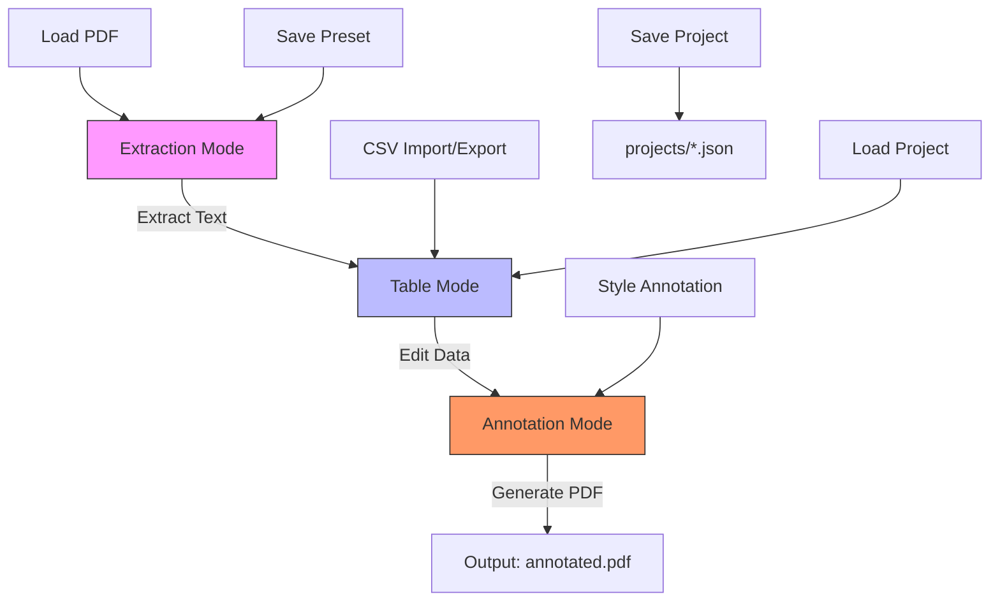

# User Guide

<cite>
**Referenced Files in This Document**   
- [MainWindowViewModel.cs](file://src/PdfAnnotator.ViewModels/MainWindowViewModel.cs)
- [ExtractionViewModel.cs](file://src/PdfAnnotator.ViewModels/ExtractionViewModel.cs)
- [TableViewModel.cs](file://src/PdfAnnotator.ViewModels/TableViewModel.cs)
- [AnnotationViewModel.cs](file://src/PdfAnnotator.ViewModels/AnnotationViewModel.cs)
- [TableRowViewModel.cs](file://src/PdfAnnotator.ViewModels/TableRowViewModel.cs)
- [ExtractionView.axaml.cs](file://src/PdfAnnotator.App/Views/ExtractionView.axaml.cs)
- [AnnotationView.axaml.cs](file://src/PdfAnnotator.App/Views/AnnotationView.axaml.cs)
- [TableView.axaml.cs](file://src/PdfAnnotator.App/Views/TableView.axaml.cs)
- [TableRow.cs](file://src/PdfAnnotator.Core/Models/TableRow.cs)
- [ExtractionPreset.cs](file://src/PdfAnnotator.Core/Models/ExtractionPreset.cs)
- [AnnotationPreset.cs](file://src/PdfAnnotator.Core/Models/AnnotationPreset.cs)
- [ICsvService.cs](file://src/PdfAnnotator.Core/Services/ICsvService.cs)
- [IProjectService.cs](file://src/PdfAnnotator.Core/Services/IProjectService.cs)
</cite>

## Table of Contents
1. [Introduction](#introduction)
2. [Extraction Mode](#extraction-mode)
3. [Table Mode](#table-mode)
4. [Annotation Mode](#annotation-mode)
5. [Project Management](#project-management)
6. [Data Flow and Synchronization](#data-flow-and-synchronization)

## Introduction
The PDF Annotator application provides a three-mode workflow for extracting text from PDFs, managing tabular data, and generating annotated PDFs. This guide explains how to use each mode based on the underlying ViewModel implementations. The application follows a clean separation of concerns with dedicated ViewModels for each mode: ExtractionViewModel, TableViewModel, and AnnotationViewModel, coordinated by the MainWindowViewModel.

**Section sources**
- [MainWindowViewModel.cs](file://src/PdfAnnotator.ViewModels/MainWindowViewModel.cs#L14-L19)

## Extraction Mode

Extraction Mode allows users to load a PDF document and extract text from specific regions. The process is managed by the ExtractionViewModel, which handles PDF rendering, region selection, text extraction, and preset management.

To begin, users load a PDF file using the Load PDF command in the UI. This triggers the LoadPdfCommand in ExtractionViewModel, which uses IPdfService to determine the page count and render the current page as a bitmap at 50 DPI. The rendered page is displayed in the view for interaction.

Users select text regions by clicking and dragging on the displayed PDF image. The ExtractionView captures pointer events and converts screen coordinates to bitmap coordinates, accounting for image scaling. As the user drags, the UpdateSelection method in ExtractionViewModel is called with the start and end coordinates, updating the selection rectangle properties (SelectLeft, SelectTop, SelectWidth, SelectHeight) for visual feedback and the underlying PDF coordinates (X0, Y0, X1, Y1) for extraction.

When the user clicks Extract Text, the ExtractTextCommand executes. This creates a temporary ExtractionPreset with the current selection coordinates and passes it to IPdfService.ExtractTextAsync. The extracted text is returned as a list of TableRow objects, each containing Page, FieldText, and Code fields. The ExtractionViewModel raises a TableUpdated event with these rows, signaling that data is ready for the next stage.

Users can save their current selection region as a preset using the Save Preset command. This creates an ExtractionPreset with the current coordinates and a name (either from the selected preset or a timestamp-based name), which is saved via IPresetService. Presets are automatically loaded at startup and can be reloaded or loaded from external JSON files.

**Section sources**
- [ExtractionViewModel.cs](file://src/PdfAnnotator.ViewModels/ExtractionViewModel.cs#L16-L196)
- [ExtractionView.axaml.cs](file://src/PdfAnnotator.App/Views/ExtractionView.axaml.cs#L1-L157)

## Table Mode

Table Mode displays and allows editing of the data extracted in Extraction Mode. The TableViewModel manages a collection of TableRowViewModel objects displayed in a grid, enabling users to modify field values, particularly the Code field.

When the TableUpdated event is raised by ExtractionViewModel, MainWindowViewModel handles it by calling Table.SetRows with the extracted data. This populates the Rows collection in TableViewModel, which uses TableRowViewModel.FromModel to convert each TableRow to a bindable view model with change notification.

Users can edit any cell in the table, but special validation is applied to the Code field. When a user modifies the Code value in a TableRowViewModel, the CodeWarning property is automatically updated to true if the code is empty or whitespace, providing visual feedback about required fields.

The TableViewModel provides CSV import and export functionality through ICsvService. The SaveCsvCommand saves the current table data to "tables/latest.csv" by converting the TableRowViewModels back to TableRow objects and calling ICsvService.SaveCsvAsync. The LoadCsvCommand reads from the same path using ICsvService.LoadCsvAsync and repopulates the table with the loaded data. After any data change (edit, load, or save), the TableViewModel raises a RowsUpdated event to notify other components of the changes.

**Section sources**
- [TableViewModel.cs](file://src/PdfAnnotator.ViewModels/TableViewModel.cs#L16-L71)
- [TableRowViewModel.cs](file://src/PdfAnnotator.ViewModels/TableRowViewModel.cs#L6-L47)

## Annotation Mode

Annotation Mode enables users to position text annotations on PDF pages using the data from Table Mode. The AnnotationViewModel manages the annotation positioning, styling, and final PDF generation.

When switching to Annotation Mode via GoToAnnotationCommand, MainWindowViewModel first calls SyncTableToAnnotation to ensure the latest table data is transferred to AnnotationViewModel via SetRows. This populates the Rows collection with the current data for annotation.

Users load a PDF document using the Load PDF command, which functions similarly to Extraction Mode but renders pages at a higher 150 DPI for better quality. The current page can be navigated using the CurrentPage property.

To position annotations, users click on the displayed PDF image. The AnnotationView captures the pointer position, converts it to bitmap coordinates, and calls AnnotationViewModel.UpdatePosition with the coordinates and image height. This updates the TextX and TextY properties (converted to PDF coordinate system) and the preview position.

Users can customize the annotation appearance using various properties: FontName (from a predefined list: Helvetica, Arial, Times New Roman), FontSize, ColorHex (in #RRGGBB format), and Angle (rotation in degrees). These styling options can be saved as presets using the Save Preset command, which creates an AnnotationPreset object saved via IPresetService. Presets can be loaded at startup or from external JSON files.

A preview of the annotation text (from the first row matching the current page) is displayed near the cursor position, helping users position the annotation accurately.

**Section sources**
- [AnnotationViewModel.cs](file://src/PdfAnnotator.ViewModels/AnnotationViewModel.cs#L14-L195)
- [AnnotationView.axaml.cs](file://src/PdfAnnotator.App/Views/AnnotationView.axaml.cs#L1-L91)

## Project Management

The application supports saving and loading complete project states through the SaveProjectCommand and LoadProjectCommand in MainWindowViewModel. A project encompasses all user data: the table rows, selected extraction preset, and selected annotation preset.

When SaveProjectCommand is executed, SaveProjectAsync in MainWindowViewModel is called. This creates a PdfProject object containing the current table data (converted from TableViewModel.Rows), the name of the selected extraction preset, and the name of the selected annotation preset. The project is saved to the "projects/" directory as a JSON file named after the project, using IProjectService.SaveProjectAsync.

When LoadProjectCommand is executed, LoadProjectAsync attempts to load a project file from "projects/" with the current project name. If found, the loaded PdfProject data is applied: table rows are set via Table.SetRows, and the extraction and annotation preset names are set to restore the appropriate presets. After loading, the mode automatically switches to Table Mode to display the loaded data.

Project saving and loading operations are asynchronous, ensuring the UI remains responsive during file operations.

**Section sources**
- [MainWindowViewModel.cs](file://src/PdfAnnotator.ViewModels/MainWindowViewModel.cs#L93-L118)

## Data Flow and Synchronization

The application maintains data consistency across modes through a well-defined event-driven architecture. The three main ViewModels (Extraction, Table, and Annotation) are properties of MainWindowViewModel, which acts as the central coordinator.

Data flows sequentially from Extraction to Table to Annotation mode. When text is extracted, ExtractionViewModel raises a TableUpdated event. MainWindowViewModel handles this event by calling Table.SetRows, which populates the table and automatically raises its own RowsUpdated event. This event is handled by MainWindowViewModel, which calls Annotation.SetRows to ensure the annotation data is synchronized.

When switching to Annotation Mode, MainWindowViewModel explicitly calls SyncTableToAnnotation to ensure any recent table changes are reflected before mode transition. This method calls Annotation.SetRows with the current table data, maintaining consistency.

All data changes in TableViewModel (edits, CSV import, etc.) trigger the RowsUpdated event, which propagates the changes to AnnotationViewModel. This ensures that the annotation preview and final output always reflect the most current data.

The use of ObservableCollection and INotifyPropertyChanged (via Fody/PropertyChanged) ensures that UI elements automatically update when data changes, providing a responsive user experience without requiring manual UI refresh operations.

**Diagram sources**
- [MainWindowViewModel.cs](file://src/PdfAnnotator.ViewModels/MainWindowViewModel.cs#L60-L61)
- [ExtractionViewModel.cs](file://src/PdfAnnotator.ViewModels/ExtractionViewModel.cs#L23-L24)
- [TableViewModel.cs](file://src/PdfAnnotator.ViewModels/TableViewModel.cs#L21-L22)
- [AnnotationViewModel.cs](file://src/PdfAnnotator.ViewModels/AnnotationViewModel.cs#L79-L87)

**Section sources**
- [MainWindowViewModel.cs](file://src/PdfAnnotator.ViewModels/MainWindowViewModel.cs#L77-L87)
- [TableViewModel.cs](file://src/PdfAnnotator.ViewModels/TableViewModel.cs#L48-L49)
- [AnnotationViewModel.cs](file://src/PdfAnnotator.ViewModels/AnnotationViewModel.cs#L89-L96)